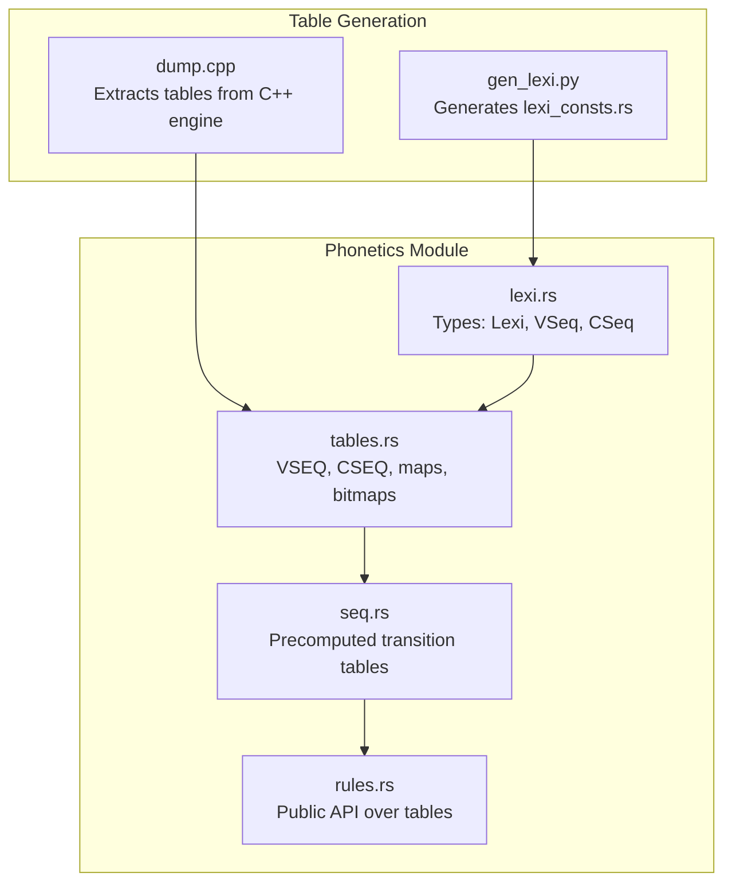
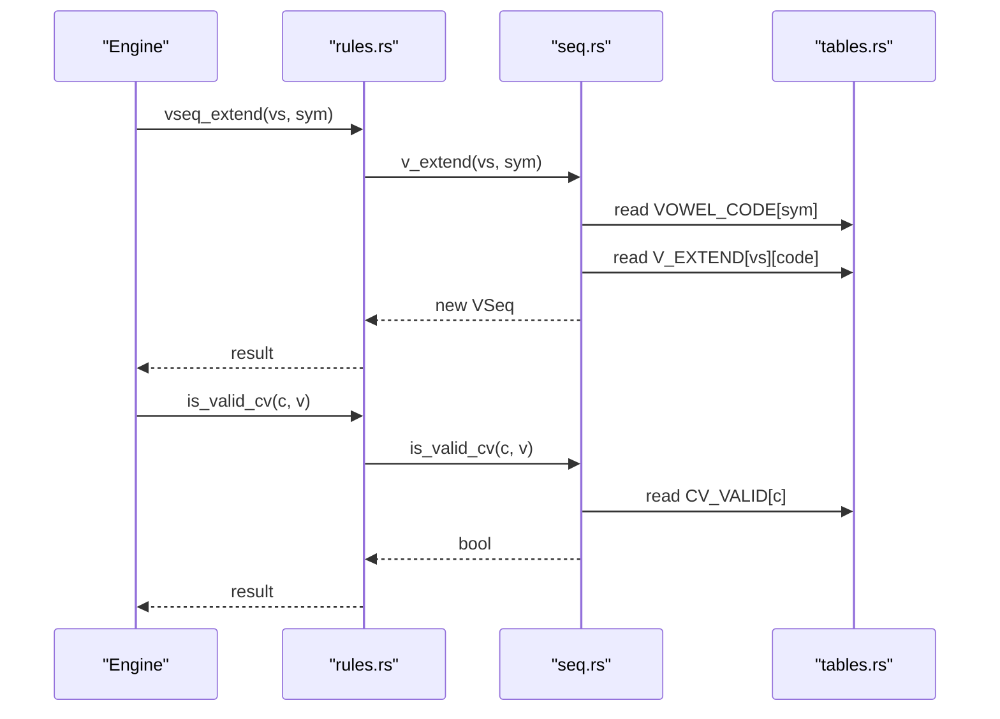
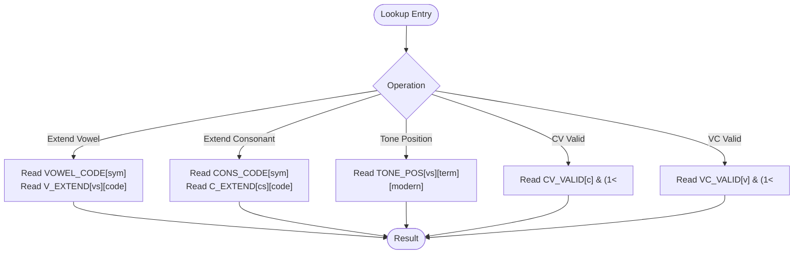
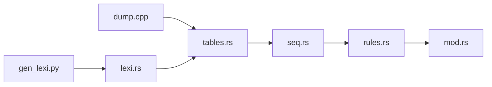

# Table Lookup System

<cite>
**Referenced Files in This Document**
- [mod.rs](file://port/skey-core/src/phonetics/mod.rs)
- [tables.rs](file://port/skey-core/src/phonetics/tables.rs)
- [seq.rs](file://port/skey-core/src/phonetics/seq.rs)
- [rules.rs](file://port/skey-core/src/phonetics/rules.rs)
- [lexi.rs](file://port/skey-core/src/phonetics/lexi.rs)
- [dump.cpp](file://port/tablegen/dump.cpp)
- [gen_lexi.py](file://port/tablegen/gen_lexi.py)
</cite>

## Table of Contents
1. [Introduction](#introduction)
2. [Project Structure](#project-structure)
3. [Core Components](#core-components)
4. [Architecture Overview](#architecture-overview)
5. [Detailed Component Analysis](#detailed-component-analysis)
6. [Dependency Analysis](#dependency-analysis)
7. [Performance Considerations](#performance-considerations)
8. [Troubleshooting Guide](#troubleshooting-guide)
9. [Conclusion](#conclusion)
10. [Appendices](#appendices)

## Introduction
This document explains the table-driven lookup system that powers high-performance Vietnamese character processing. It focuses on how phonetic mappings, tone placement rules, and character composition are stored in compact tables and accessed with O(1) or O(log n) operations to minimize CPU time and cache misses. It also covers table generation, versioning, and how changes to linguistic rules propagate through the system.

## Project Structure
The implementation is organized into a small set of focused modules:
- Core types and constants define the lexical space and sequence identifiers.
- Generated tables encode all phonotactic and encoding data.
- Sequence tables provide fast extend/single-symbol lookups and derived transformations.
- Rules layer exposes validated, high-level operations backed by tables.
- A generator extracts tables from the original C++ engine to keep Rust code in sync.

**Diagram sources**
- [mod.rs:1-15](file://port/skey-core/src/phonetics/mod.rs#L1-L15)
- [tables.rs:1-20](file://port/skey-core/src/phonetics/tables.rs#L1-L20)
- [seq.rs:1-20](file://port/skey-core/src/phonetics/seq.rs#L1-L20)
- [rules.rs:1-10](file://port/skey-core/src/phonetics/rules.rs#L1-L10)
- [dump.cpp:1-10](file://port/tablegen/dump.cpp#L1-L10)
- [gen_lexi.py:1-10](file://port/tablegen/gen_lexi.py#L1-L10)

**Section sources**
- [mod.rs:1-15](file://port/skey-core/src/phonetics/mod.rs#L1-L15)

## Core Components
- Lexical identifiers: Compact numeric codes for characters, vowel sequences, and consonant sequences. These preserve case parity and tone spacing required by the engine.
- Phonotactic tables:
  - Vowel sequence table (VSEQ): encodes length, completeness, suffix compatibility, roof/hook positions, and transitions.
  - Consonant sequence table (CSEQ): encodes allowed consonant clusters and whether they can be final.
  - Validity bitmaps: VC_VALID allows O(1) checks for valid vowel-to-consonant-suffix pairs; CV_VALID enables O(1) checks for consonant-to-vowel combinations.
- Encoding maps: ISO_LEXI, ISO_STD, UNICODE_TABLE, VIQR_TABLE, UNICODE_COMPOSITE, WIN_CP1258, WIN_CP1258_PRE, SINGLE_BYTE_TABLES, DOUBLE_BYTE_TABLES enable conversions between encodings and internal forms.
- Precomputed helpers:
  - Tone position table TONE_POS provides immediate tone placement based on sequence state and mode flags.
  - Single/extend tables for vowels and consonants replace runtime searches with direct array loads.
  - Key-index arrays (VSEQ_KEYS/VSEQ_IDX, CSEQ_KEYS/CSEQ_IDX) support binary search when needed.

**Section sources**
- [lexi.rs:1-110](file://port/skey-core/src/phonetics/lexi.rs#L1-L110)
- [tables.rs:6-214](file://port/skey-core/src/phonetics/tables.rs#L6-L214)
- [tables.rs:215-696](file://port/skey-core/src/phonetics/tables.rs#L215-L696)
- [seq.rs:22-260](file://port/skey-core/src/phonetics/seq.rs#L22-L260)
- [seq.rs:330-451](file://port/skey-core/src/phonetics/seq.rs#L330-L451)
- [rules.rs:107-246](file://port/skey-core/src/phonetics/rules.rs#L107-L246)

## Architecture Overview
The system separates data (tables) from logic (rules). Data is generated once and embedded as static arrays. Logic performs minimal branching and uses direct indexing or bitwise operations.

**Diagram sources**
- [rules.rs:151-182](file://port/skey-core/src/phonetics/rules.rs#L151-L182)
- [seq.rs:272-303](file://port/skey-core/src/phonetics/seq.rs#L272-L303)
- [seq.rs:444-451](file://port/skey-core/src/phonetics/seq.rs#L444-L451)
- [tables.rs:215-240](file://port/skey-core/src/phonetics/tables.rs#L215-L240)

## Detailed Component Analysis

### Data Structures for Phonetic Mappings
- Vowel sequences:
  - VSEQ stores per-sequence metadata: length, completeness, whether it can take a consonant suffix, the underlying symbols, sub-sequence indices, and where roof/hook marks attach.
  - VSEQ_KEYS and VSEQ_IDX form a sorted key index used by binary search in debug paths.
- Consonant sequences:
  - CSEQ stores cluster definitions and suffix capability.
  - CSEQ_KEYS and CSEQ_IDX similarly support binary search.
- Bitmaps:
  - VC_VALID packs allowed (vowel, consonant-suffix) pairs into one u32 per vowel sequence.
  - CV_VALID packs allowed (consonant, vowel) pairs into one u128 per consonant sequence.

Complexity:
- Direct access via precomputed single/extend tables: O(1).
- Binary search over keys: O(log n) with very small n (70/30), negligible cost.
- Bitmap checks: O(1) bitwise AND.

Memory locality:
- Tables are contiguous arrays optimized for sequential access patterns during typing pipelines.
- Small fixed-size arrays fit well in CPU caches.

**Section sources**
- [tables.rs:9-148](file://port/skey-core/src/phonetics/tables.rs#L9-L148)
- [tables.rs:644-674](file://port/skey-core/src/phonetics/tables.rs#L644-L674)
- [seq.rs:393-451](file://port/skey-core/src/phonetics/seq.rs#L393-L451)

### Indexing Strategies for Fast Lookups
- Single-symbol to sequence:
  - V_SINGLE and C_SINGLE map any symbol to its sequence index in O(1).
- Extend sequence by symbol:
  - V_EXTEND and C_EXTEND are two-dimensional tables indexed by current sequence and symbol code, returning next sequence in O(1).
- Tone placement:
  - TONE_POS is a flat table indexed by sequence, termination flag, and modern-style flag, giving immediate tone position without branching.
- Validation:
  - is_valid_cv uses CV_VALID bitmap; is_valid_vc uses VC_VALID bitmap; both O(1).

**Diagram sources**
- [seq.rs:212-260](file://port/skey-core/src/phonetics/seq.rs#L212-L260)
- [seq.rs:337-386](file://port/skey-core/src/phonetics/seq.rs#L337-L386)
- [seq.rs:444-451](file://port/skey-core/src/phonetics/seq.rs#L444-L451)
- [rules.rs:184-231](file://port/skey-core/src/phonetics/rules.rs#L184-L231)

**Section sources**
- [seq.rs:212-386](file://port/skey-core/src/phonetics/seq.rs#L212-L386)
- [rules.rs:184-231](file://port/skey-core/src/phonetics/rules.rs#L184-L231)

### Character Composition Rules
- Roof and hook handling:
  - VSEQ entries record roof_pos and hook_pos, enabling quick derivation of sequences with roof/hook removed or added.
  - Derived tables V_NO_ROOF, V_NO_HOOK, and special-case tables like V_U_OR, V_U_O, V_UH_OH handle common transformations in O(1).
- Consonant-vowel constraints:
  - Special cases (e.g., gi not followed by i, qu not followed by u) are encoded in CV_VALID and checked via bitmasks.
  - Additional exceptions for sequences like quyn/quynh and gieng/gie^ng are handled in higher-level validation.

**Section sources**
- [seq.rs:145-222](file://port/skey-core/src/phonetics/seq.rs#L145-L222)
- [rules.rs:107-130](file://port/skey-core/src/phonetics/rules.rs#L107-L130)
- [rules.rs:202-231](file://port/skey-core/src/phonetics/rules.rs#L202-L231)

### Common Lookup Patterns
- Vowel sequence recognition:
  - Use v_single(sym) to get initial sequence; use v_extend(vs, sym) to grow sequences. Both are O(1).
- Consonant cluster detection:
  - Use c_single(sym) and c_extend(cs, sym) to build and validate clusters.
- Tone placement determination:
  - Call tone_pos(vs, terminated, modern) to get the exact position for tone mark application.

These patterns avoid loops and branches, relying on precomputed tables for speed and predictability.

**Section sources**
- [seq.rs:263-328](file://port/skey-core/src/phonetics/seq.rs#L263-L328)
- [seq.rs:383-386](file://port/skey-core/src/phonetics/seq.rs#L383-L386)

### Encoding and Conversion Tables
- ISO_LEXI and ISO_STD map input bytes to internal lexical IDs and standard character codes.
- UNICODE_TABLE, UNICODE_COMPOSITE, VIQR_TABLE, WIN_CP1258, WIN_CP1258_PRE, SINGLE_BYTE_TABLES, DOUBLE_BYTE_TABLES provide bidirectional mapping across encodings.
- These tables ensure consistent behavior across different input formats while keeping conversion costs low.

**Section sources**
- [tables.rs:150-214](file://port/skey-core/src/phonetics/tables.rs#L150-L214)
- [tables.rs:287-642](file://port/skey-core/src/phonetics/tables.rs#L287-L642)

## Dependency Analysis
- The phonetics module re-exports core types and functions, centralizing usage.
- seq.rs depends on tables.rs for raw data and builds compile-time computed tables for fast access.
- rules.rs wraps seq.rs and tables.rs to expose stable APIs with debug assertions against reference implementations.
- dump.cpp links against the original C++ engine to extract tables, ensuring no drift between legacy and new code.
- gen_lexi.py parses the original header to generate constant definitions, preserving load-bearing ordering.

**Diagram sources**
- [dump.cpp:1-10](file://port/tablegen/dump.cpp#L1-L10)
- [gen_lexi.py:1-10](file://port/tablegen/gen_lexi.py#L1-L10)
- [mod.rs:1-15](file://port/skey-core/src/phonetics/mod.rs#L1-L15)

**Section sources**
- [mod.rs:1-15](file://port/skey-core/src/phonetics/mod.rs#L1-L15)
- [dump.cpp:1-10](file://port/tablegen/dump.cpp#L1-L10)
- [gen_lexi.py:1-10](file://port/tablegen/gen_lexi.py#L1-L10)

## Performance Considerations
- Time complexity:
  - Most hot-path operations are O(1) due to direct table indexing.
  - Binary search is only used in debug/reference paths and operates on tiny arrays.
- Memory layout:
  - Contiguous arrays improve cache locality.
  - Bitmaps reduce memory footprint compared to full matrices.
- Branch prediction:
  - Minimal branching in hot paths; decisions are encoded in tables.
- Generation overhead:
  - Table generation runs at build time; runtime has zero setup cost.

[No sources needed since this section provides general guidance]

## Troubleshooting Guide
- Symptom: Incorrect tone placement or invalid sequences.
  - Check that tables were regenerated after changes to the C++ engine or headers.
  - Verify that lexi ordering remains unchanged; compile-time assertions will fail if order drifts.
- Debugging aids:
  - In debug builds, rules.rs asserts equivalence between table-backed functions and reference implementations.
  - Use lookup_vseq3/lookup_cseq3 to compare results against binary-search-based references.
- Regeneration steps:
  - Run the table generator to rebuild tables.rs from the live C++ engine.
  - Ensure gen_lexi.py output matches the expected enum order.

**Section sources**
- [rules.rs:132-182](file://port/skey-core/src/phonetics/rules.rs#L132-L182)
- [dump.cpp:215-267](file://port/tablegen/dump.cpp#L215-L267)
- [gen_lexi.py:20-51](file://port/tablegen/gen_lexi.py#L20-L51)

## Conclusion
The table-driven design achieves near-constant-time performance for Vietnamese character processing by moving complex linguistic rules into static, compact tables. The separation of data and logic, combined with careful indexing strategies and bitmaps, ensures high throughput and low latency. The generator pipeline guarantees consistency between the legacy engine and the new implementation, making rule changes safe and traceable.

[No sources needed since this section summarizes without analyzing specific files]

## Appendices

### Table Generation Process
- dump.cpp links against the original engine to read all static tables and emits Rust source containing arrays and structs mirroring the C++ structures.
- It also produces sorted key/index arrays for efficient binary search in debug paths.
- gen_lexi.py parses the original header to produce constant definitions that preserve the load-bearing ordering of lexical items.

**Section sources**
- [dump.cpp:1-10](file://port/tablegen/dump.cpp#L1-L10)
- [dump.cpp:215-267](file://port/tablegen/dump.cpp#L215-L267)
- [gen_lexi.py:1-51](file://port/tablegen/gen_lexi.py#L1-L51)

### Versioning and Propagation of Rule Changes
- Any change to phonotactic rules must update the C++ engine first.
- Re-run dump.cpp to regenerate tables.rs; this ensures Rust code cannot drift from the authoritative source.
- If lexical constants change, regenerate lexi_consts.rs via gen_lexi.py; compile-time assertions will catch mismatches.
- After regeneration, run tests to validate behavior across all lookup patterns.

**Section sources**
- [dump.cpp:1-10](file://port/tablegen/dump.cpp#L1-L10)
- [gen_lexi.py:1-10](file://port/tablegen/gen_lexi.py#L1-L10)
- [lexi.rs:98-110](file://port/skey-core/src/phonetics/lexi.rs#L98-L110)