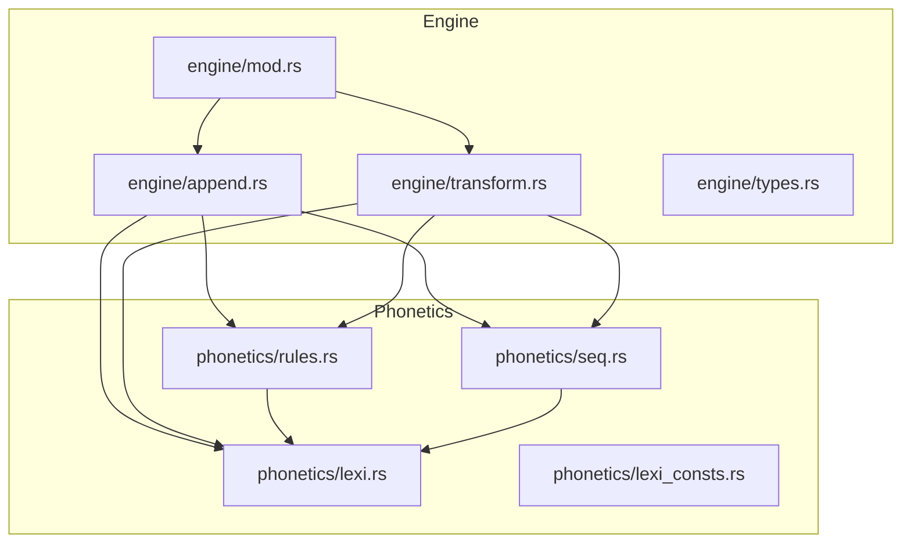
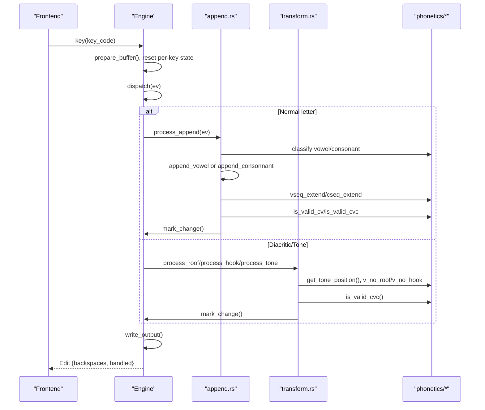
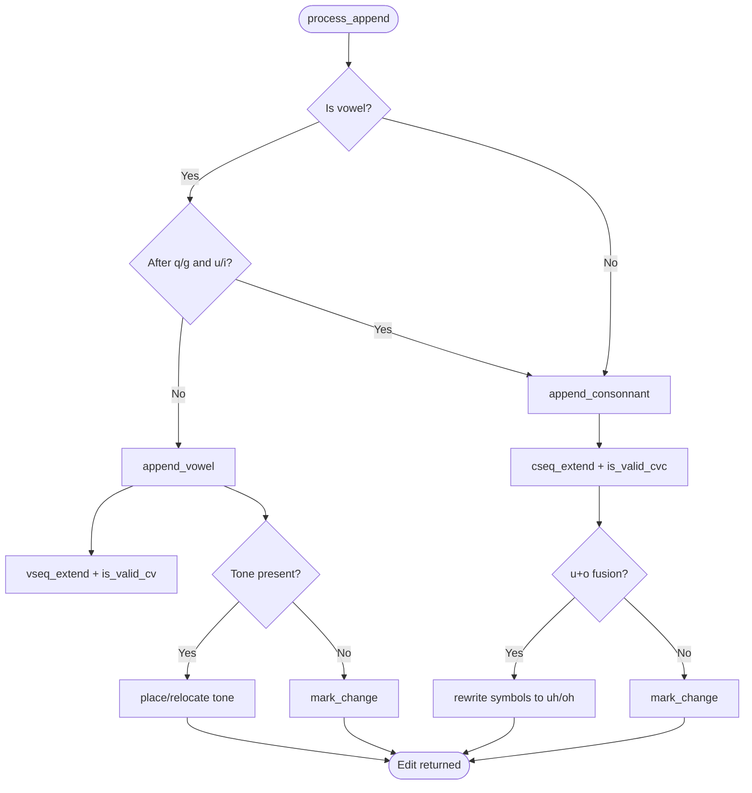
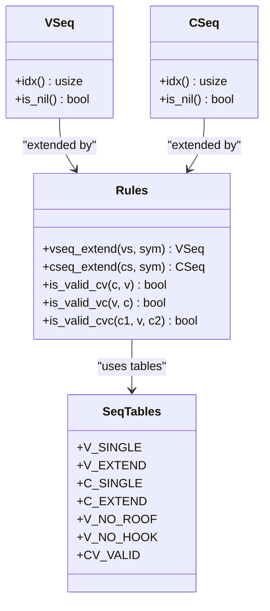
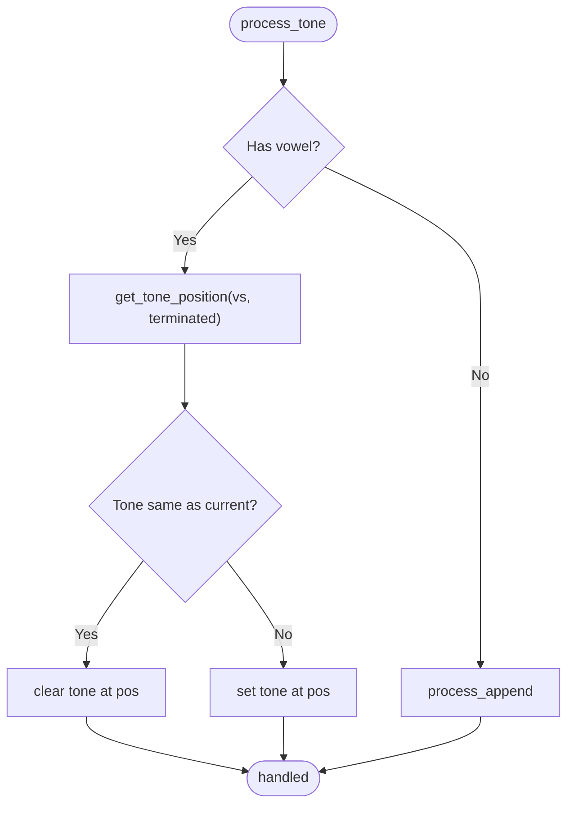
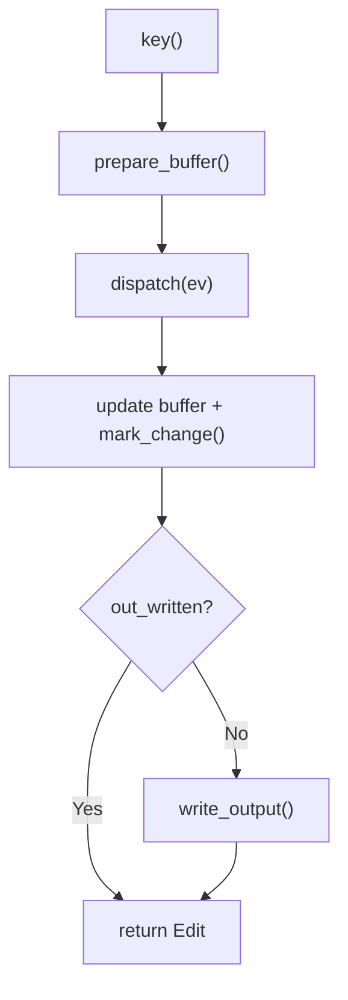
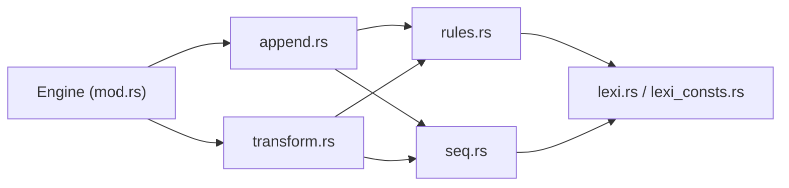

# Character Composition Engine

<cite>
**Referenced Files in This Document**
- [append.rs](file://port/skey-core/src/engine/append.rs)
- [transform.rs](file://port/skey-core/src/engine/transform.rs)
- [types.rs](file://port/skey-core/src/engine/types.rs)
- [mod.rs](file://port/skey-core/src/engine/mod.rs)
- [seq.rs](file://port/skey-core/src/phonetics/seq.rs)
- [rules.rs](file://port/skey-core/src/phonetics/rules.rs)
- [lexi.rs](file://port/skey-core/src/phonetics/lexi.rs)
- [lexi_consts.rs](file://port/skey-core/src/phonetics/lexi_consts.rs)
</cite>

## Table of Contents
1. [Introduction](#introduction)
2. [Project Structure](#project-structure)
3. [Core Components](#core-components)
4. [Architecture Overview](#architecture-overview)
5. [Detailed Component Analysis](#detailed-component-analysis)
6. [Dependency Analysis](#dependency-analysis)
7. [Performance Considerations](#performance-considerations)
8. [Troubleshooting Guide](#troubleshooting-guide)
9. [Conclusion](#conclusion)
10. [Appendices](#appendices)

## Introduction
This document explains the Vietnamese character composition engine that builds valid syllables from typed keystrokes. It focuses on how vowels and consonants are appended, how VSeq and CSeq track sequences, how phonotactic rules validate combinations, and how tone marks are placed automatically. It also covers buffer management, change tracking, edge cases, and mixed input methods.

## Project Structure
The engine lives under port/skey-core/src and is organized into:
- Engine orchestration and state machine (engine/mod.rs)
- Append logic for vowels and consonants (engine/append.rs)
- Diacritic and tone transformations (engine/transform.rs)
- Types and options (engine/types.rs)
- Phonetics tables and sequence utilities (phonetics/seq.rs)
- Phonotactic validation rules (phonetics/rules.rs)
- Lexical types and constants (phonetics/lexi.rs, phonetics/lexi_consts.rs)

**Diagram sources**
- [mod.rs:1-70](file://port/skey-core/src/engine/mod.rs#L1-L70)
- [append.rs:1-20](file://port/skey-core/src/engine/append.rs#L1-L20)
- [transform.rs:1-20](file://port/skey-core/src/engine/transform.rs#L1-L20)
- [types.rs:1-30](file://port/skey-core/src/engine/types.rs#L1-L30)
- [seq.rs:1-25](file://port/skey-core/src/phonetics/seq.rs#L1-L25)
- [rules.rs:1-15](file://port/skey-core/src/phonetics/rules.rs#L1-L15)
- [lexi.rs:1-20](file://port/skey-core/src/phonetics/lexi.rs#L1-L20)
- [lexi_consts.rs:1-15](file://port/skey-core/src/phonetics/lexi_consts.rs#L1-L15)

**Section sources**
- [mod.rs:1-70](file://port/skey-core/src/engine/mod.rs#L1-L70)

## Core Components
- Engine state machine: manages buffers, current position, key stroke history, and dispatches events to append or transform handlers.
- Append pipeline: routes each keystroke to vowel or consonant appenders based on classification and context.
- Sequence systems: VSeq and CSeq represent vowel and consonant sequences; they are extended via table lookups and validated by phonotactic rules.
- Tone system: computes the correct placement of diacritical marks within a vowel sequence using precomputed tables.
- Buffer and change tracking: tracks which positions changed to compute backspaces and output efficiently.

Key data structures:
- WordInfo: compact per-character entry storing form (empty, non-Vietnamese, C, V, CV, VC, CVC), offsets to first/second consonant and vowel, sequence indices, tone level, and capitalization.
- VSeq/CSeq: indices into compile-time generated tables that encode allowed sequences and their properties.

**Section sources**
- [types.rs:15-127](file://port/skey-core/src/engine/types.rs#L15-L127)
- [lexi.rs:16-96](file://port/skey-core/src/phonetics/lexi.rs#L16-L96)
- [lexi_consts.rs:198-301](file://port/skey-core/src/phonetics/lexi_consts.rs#L198-L301)

## Architecture Overview
At a high level:
- Each key press enters through Engine::key, which prepares state and dispatches to either append or transformation handlers.
- append_vowel and append_consonnant update the buffer, extend VSeq/CSeq, validate against rules, and mark changes.
- Transform handlers apply roofs, hooks, tones, and special shortcuts, recomputing sequences and tone positions as needed.
- Output is produced from marked changes, with backspace counts computed from charset encoding costs.

**Diagram sources**
- [mod.rs:248-319](file://port/skey-core/src/engine/mod.rs#L248-L319)
- [append.rs:141-196](file://port/skey-core/src/engine/append.rs#L141-L196)
- [transform.rs:14-24](file://port/skey-core/src/engine/transform.rs#L14-L24)
- [rules.rs:107-130](file://port/skey-core/src/phonetics/rules.rs#L107-L130)
- [seq.rs:330-386](file://port/skey-core/src/phonetics/seq.rs#L330-L386)

## Detailed Component Analysis

### Vowel and Consonant Append Pipeline
- Classification: process_append determines if a key is a Vietnamese vowel or consonant. Special handling makes u after q and i after g behave as consonants.
- append_vowel:
  - Initializes the new entry with canonical symbol, caps, and tone extracted from the symbol.
  - For first-in-word or non-Vietnamese mode, sets form to V and records VSeq.
  - Otherwise extends previous VSeq using vseq_extend and validates CV compatibility when preceded by a consonant.
  - Handles tone application or repositioning when the new symbol carries a tone or when moving an existing tone to a new position.
- append_consonnant:
  - Initializes entry with canonical symbol and zero tone.
  - For first-in-word or non-Vietnamese mode, sets form to C and records CSeq.
  - Extends previous CSeq using cseq_extend and validates CVC structure with is_valid_cvc.
  - Applies special fusions like u+o -> u+o+ (uho -> uhoh) and adjusts tone position if necessary.
  - Marks invalid combinations as NON_VN to break the current word.

**Diagram sources**
- [append.rs:141-196](file://port/skey-core/src/engine/append.rs#L141-L196)
- [append.rs:202-369](file://port/skey-core/src/engine/append.rs#L202-L369)
- [append.rs:371-575](file://port/skey-core/src/engine/append.rs#L371-L575)
- [rules.rs:184-231](file://port/skey-core/src/phonetics/rules.rs#L184-L231)

**Section sources**
- [append.rs:141-196](file://port/skey-core/src/engine/append.rs#L141-L196)
- [append.rs:202-369](file://port/skey-core/src/engine/append.rs#L202-L369)
- [append.rs:371-575](file://port/skey-core/src/engine/append.rs#L371-L575)

### VSeq and CSeq Systems
- VSeq represents vowel sequences (single, diphthong, triphthong). They are extended via vseq_extend and can be transformed by roof/hook operations.
- CSeq represents onset and coda consonant clusters. They are extended via cseq_extend and validated together with VSeq by is_valid_cvc.
- Lookup tables:
  - Single symbol to sequence: v_single, c_single.
  - Extension tables: V_EXTEND, C_EXTEND.
  - Roof/hook removal maps: V_NO_ROOF, V_NO_HOOK.
  - Special prefix mappings for u/o handling: V_U_OR, V_U_O, V_UH_OH.
- Validity:
  - is_valid_cv uses a bitmap to check allowed CV pairs (e.g., k restrictions, gi/qu constraints).
  - is_valid_vc checks suffix compatibility.
  - is_valid_cvc composes both sides and includes exceptions for patterns like quyn/quynh and gieng/gie^ng.

**Diagram sources**
- [seq.rs:264-328](file://port/skey-core/src/phonetics/seq.rs#L264-L328)
- [rules.rs:132-231](file://port/skey-core/src/phonetics/rules.rs#L132-L231)
- [seq.rs:393-450](file://port/skey-core/src/phonetics/seq.rs#L393-L450)

**Section sources**
- [seq.rs:109-222](file://port/skey-core/src/phonetics/seq.rs#L109-L222)
- [seq.rs:264-328](file://port/skey-core/src/phonetics/seq.rs#L264-L328)
- [rules.rs:107-231](file://port/skey-core/src/phonetics/rules.rs#L107-L231)

### Tone Marking System
- Tone position is determined by get_tone_position, which loads a precomputed index from seq::TONE_POS based on VSeq, termination status, and modern style option.
- When a tone key arrives, process_tone applies it at the computed position, toggling off if repeated.
- When roofs or hooks are applied/removed, tone may relocate to maintain correctness; the engine marks old and new positions accordingly.
- Special cases:
  - For certain triphthongs and modern-style sequences, tone placement differs.
  - Some coda consonants restrict certain tones.

**Diagram sources**
- [transform.rs:469-536](file://port/skey-core/src/engine/transform.rs#L469-L536)
- [transform.rs:14-24](file://port/skey-core/src/engine/transform.rs#L14-L24)
- [seq.rs:330-386](file://port/skey-core/src/phonetics/seq.rs#L330-L386)

**Section sources**
- [transform.rs:14-52](file://port/skey-core/src/engine/transform.rs#L14-L52)
- [transform.rs:469-536](file://port/skey-core/src/engine/transform.rs#L469-L536)
- [seq.rs:330-386](file://port/skey-core/src/phonetics/seq.rs#L330-L386)

### Complex Composition Examples
Below are step-by-step conceptual walkthroughs for complex syllables. These illustrate how append_vowel and append_consonnant cooperate with VSeq/CSeq and tone placement.

- “quyến”
  - q: onset CSeq cs_qu
  - u: treated as consonant after q; forms CSeq cs_qu with u acting as part of onset
  - y: starts vowel sequence vs_y
  - ê: extends to vs_yer (or equivalent depending on exact mapping); tone mark applied at computed position
  - n: coda CSeq cs_n; validated via is_valid_cvc
  - Result: valid CV-C structure with tone on appropriate vowel position

- “giỏi”
  - g: onset CSeq cs_g
  - i: onset extension to cs_gi
  - o: vowel sequence vs_o
  - i: extends to vs_oi
  - ̉ (hook): transforms vs_oi to vs_ohi (or equivalent)
  - Tone: applied at computed position for vs_ohi
  - Result: valid CV-C with hook and tone correctly placed

- “thuận”
  - t: onset CSeq cs_t
  - h: onset extension to cs_th
  - u: vowel sequence vs_u
  - â: roof operation transforms base to ar/er/or variant; here u+â yields appropriate sequence
  - ̃ (tilde): hook/bowl operation adds tilde to appropriate vowel
  - n: coda CSeq cs_n; validated via is_valid_cvc
  - Result: valid CV-C with roof and tilde combined

Note: The exact VSeq identifiers depend on internal tables; the steps above reflect the engine’s behavior of extending sequences, applying roofs/hooks, and placing tones according to precomputed positions.

[No sources needed since this section provides conceptual examples without quoting code]

### Buffer Management and Change Tracking
- Buffer: fixed-size array of WordInfo entries; maintains current position and key stroke history.
- prepare_buffer: ensures space by trimming older entries when near capacity.
- mark_change: records the latest modified position to compute backspaces accurately.
- get_seq_steps: calculates backspace count considering charset encoding (UTF-8 vs decomposed).
- write_output: encodes only changed range into output buffer.

**Diagram sources**
- [mod.rs:248-319](file://port/skey-core/src/engine/mod.rs#L248-L319)
- [append.rs:34-66](file://port/skey-core/src/engine/append.rs#L34-L66)
- [append.rs:98-139](file://port/skey-core/src/engine/append.rs#L98-L139)

**Section sources**
- [mod.rs:248-319](file://port/skey-core/src/engine/mod.rs#L248-L319)
- [append.rs:34-66](file://port/skey-core/src/engine/append.rs#L34-L66)
- [append.rs:98-139](file://port/skey-core/src/engine/append.rs#L98-L139)

### Edge Cases and Mixed Input Methods
- Non-Vietnamese characters: classified as NON_VN; break current word and pass through unless escaping VIQR.
- Spell check disabled: invalid combinations start a new word via process_no_spell_check.
- Escape handling: check_escape_viqr outputs literal escape sequences for VIQR when applicable.
- Telex w behavior: process_telex_w tries hook first; if not applicable, falls back to mapping uh; supports uppercase handling.
- Capitalization: upper_case_first_char and caps lock affect mapping and case transitions.

**Section sources**
- [append.rs:154-178](file://port/skey-core/src/engine/append.rs#L154-L178)
- [append.rs:589-617](file://port/skey-core/src/engine/append.rs#L589-L617)
- [transform.rs:603-673](file://port/skey-core/src/engine/transform.rs#L603-L673)
- [transform.rs:675-712](file://port/skey-core/src/engine/transform.rs#L675-L712)
- [transform.rs:714-766](file://port/skey-core/src/engine/transform.rs#L714-L766)

## Dependency Analysis
- Engine depends on phonetics rules and tables for all sequence decisions.
- Append logic depends on classification, VSeq/CSeq extensions, and validity checks.
- Transform logic depends on tone position tables and sequence transformations.
- All components rely on immutable, compile-time generated tables to ensure performance and correctness.

**Diagram sources**
- [mod.rs:1-70](file://port/skey-core/src/engine/mod.rs#L1-L70)
- [append.rs:1-20](file://port/skey-core/src/engine/append.rs#L1-L20)
- [transform.rs:1-20](file://port/skey-core/src/engine/transform.rs#L1-L20)
- [rules.rs:1-15](file://port/skey-core/src/phonetics/rules.rs#L1-L15)
- [seq.rs:1-25](file://port/skey-core/src/phonetics/seq.rs#L1-L25)
- [lexi.rs:1-20](file://port/skey-core/src/phonetics/lexi.rs#L1-L20)
- [lexi_consts.rs:1-15](file://port/skey-core/src/phonetics/lexi_consts.rs#L1-L15)

**Section sources**
- [mod.rs:1-70](file://port/skey-core/src/engine/mod.rs#L1-L70)
- [append.rs:1-20](file://port/skey-core/src/engine/append.rs#L1-L20)
- [transform.rs:1-20](file://port/skey-core/src/engine/transform.rs#L1-L20)
- [rules.rs:1-15](file://port/skey-core/src/phonetics/rules.rs#L1-L15)
- [seq.rs:1-25](file://port/skey-core/src/phonetics/seq.rs#L1-L25)
- [lexi.rs:1-20](file://port/skey-core/src/phonetics/lexi.rs#L1-L20)
- [lexi_consts.rs:1-15](file://port/skey-core/src/phonetics/lexi_consts.rs#L1-L15)

## Performance Considerations
- Table-driven design: VSeq/CSeq extension and tone position are single table loads, avoiding runtime searches.
- Bitmap validation: is_valid_cv uses bitmasks for fast checks instead of linear scans.
- Compact WordInfo: reduces memory footprint and improves cache locality.
- Minimal branching: dispatch uses jump tables and early returns to keep hot paths efficient.
- Charset-aware backspace counting: avoids unnecessary encoding work except when required.

[No sources needed since this section provides general guidance]

## Troubleshooting Guide
Common issues and where to inspect:
- Invalid combination breaks word: check is_valid_cv/is_valid_cvc and resulting NON_VN marking in append paths.
- Tone not appearing or misplaced: verify get_tone_position inputs (VSeq, termination, modern style) and tone application in process_tone.
- Hook/roof not applied: confirm free_marking option and target symbol matching in process_roof/process_hook.
- Mixed input method artifacts: review process_telex_w fallback and check_escape_viqr behavior.

**Section sources**
- [rules.rs:107-231](file://port/skey-core/src/phonetics/rules.rs#L107-L231)
- [transform.rs:70-189](file://port/skey-core/src/engine/transform.rs#L70-L189)
- [transform.rs:327-467](file://port/skey-core/src/engine/transform.rs#L327-L467)
- [transform.rs:469-536](file://port/skey-core/src/engine/transform.rs#L469-L536)
- [transform.rs:675-766](file://port/skey-core/src/engine/transform.rs#L675-L766)

## Conclusion
The engine combines a robust state machine with highly optimized, table-driven phonetics to build valid Vietnamese syllables in real time. VSeq and CSeq track sequences and enforce phonotactic rules, while tone marking is precisely placed using precomputed tables. Buffer management and change tracking ensure efficient output and editing. The design balances fidelity to the original behavior with performance and clarity, making it suitable for modern applications requiring accurate Vietnamese typing.

[No sources needed since this section summarizes without analyzing specific files]

## Appendices

### Key API Surfaces
- Engine::key: main entry point for processing a key code.
- Engine::backspace: handles deletion with tone relocation.
- Engine::type_str: convenient string typing for tests and demos.
- Options: feature flags controlling behavior (modern style, quick telex, etc.).

**Section sources**
- [mod.rs:248-426](file://port/skey-core/src/engine/mod.rs#L248-L426)
- [types.rs:31-105](file://port/skey-core/src/engine/types.rs#L31-L105)