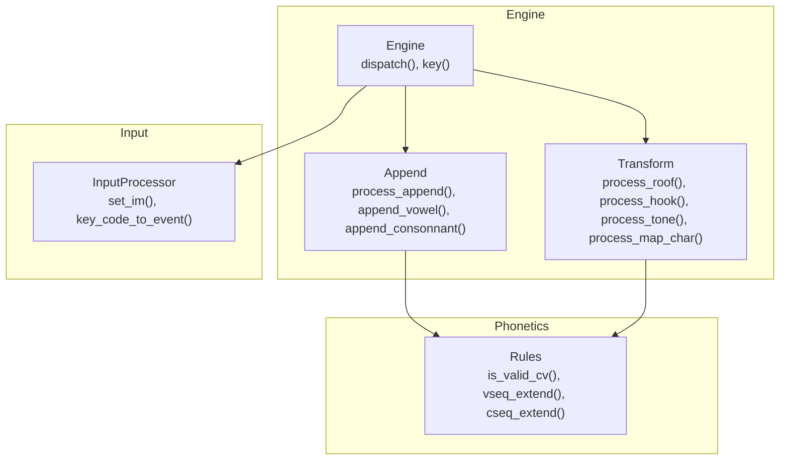
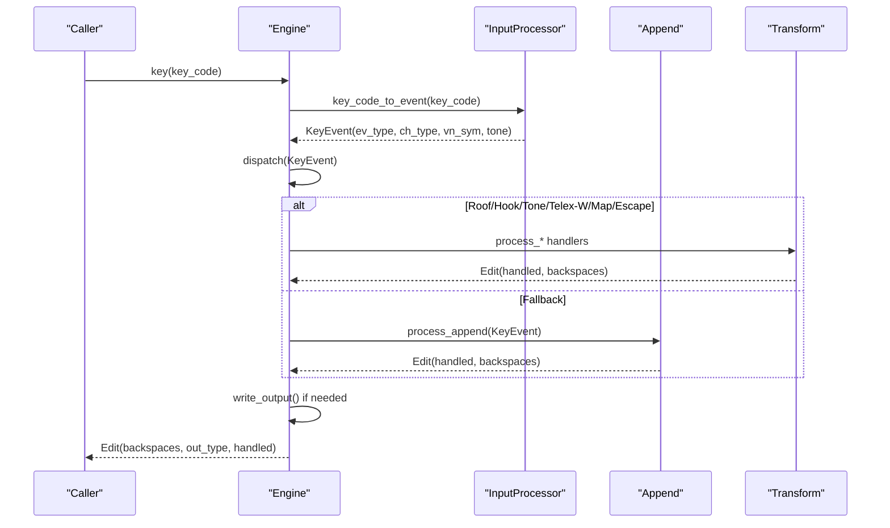
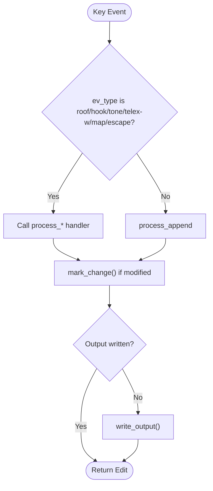
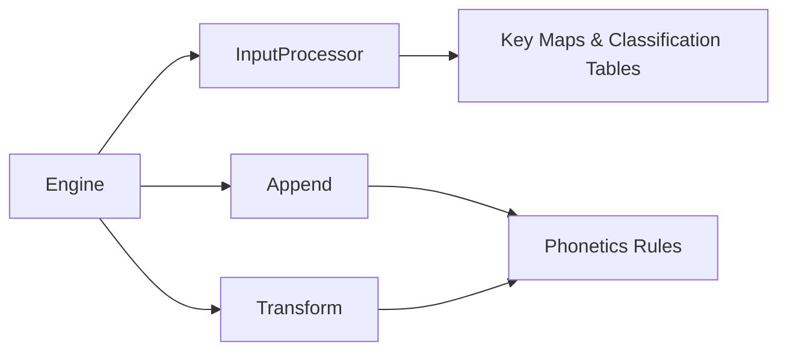

# Input Method Processing

<cite>
**Referenced Files in This Document**
- [engine/mod.rs](file://port/skey-core/src/engine/mod.rs)
- [engine/append.rs](file://port/skey-core/src/engine/append.rs)
- [engine/transform.rs](file://port/skey-core/src/engine/transform.rs)
- [engine/types.rs](file://port/skey-core/src/engine/types.rs)
- [input/mod.rs](file://port/skey-core/src/input/mod.rs)
- [phonetics/rules.rs](file://port/skey-core/src/phonetics/rules.rs)
- [simple_telex.rs](file://port/skey-core/tests/simple_telex.rs)
</cite>

## Table of Contents
1. Introduction
2. Project Structure
3. Core Components
4. Architecture Overview
5. Detailed Component Analysis
6. Dependency Analysis
7. Performance Considerations
8. Troubleshooting Guide
9. Conclusion

## Introduction
This document explains how the typing engine processes Telex, VNI, and VIQR input methods through a shared state machine. It details the append processing pipeline that composes characters, detects vowel sequences, and assigns tones; the transform operations that apply roofs, hooks, and tone marks; and the InputProcessor integration that configures and switches input methods at runtime. It also covers character type detection, edge cases such as mixed input methods and invalid combinations, and provides concrete examples showing how different input methods handle identical keystroke sequences.

## Project Structure
The core implementation resides in the skey-core crate under port/skey-core/src:
- Engine orchestration and dispatch live in engine/mod.rs.
- Append logic (word assembly, vowel/consonant handling, spell-check gating) is in engine/append.rs.
- Transform logic (roof, hook, tone, d-stroke, mapping) is in engine/transform.rs.
- Types, options, and buffer layout are defined in engine/types.rs.
- Input method key maps and event classification are in input/mod.rs.
- Phonotactic rules and sequence utilities are in phonetics/rules.rs.
- Tests demonstrate behavior differences across input methods.

**Diagram sources**
- [engine/mod.rs:209-245](file://port/skey-core/src/engine/mod.rs#L209-L245)
- [engine/append.rs:141-196](file://port/skey-core/src/engine/append.rs#L141-L196)
- [engine/transform.rs:70-189](file://port/skey-core/src/engine/transform.rs#L70-L189)
- [input/mod.rs:150-192](file://port/skey-core/src/input/mod.rs#L150-L192)
- [phonetics/rules.rs:107-196](file://port/skey-core/src/phonetics/rules.rs#L107-L196)

**Section sources**
- [engine/mod.rs:18-70](file://port/skey-core/src/engine/mod.rs#L18-L70)
- [engine/mod.rs:209-245](file://port/skey-core/src/engine/mod.rs#L209-L245)
- [input/mod.rs:72-125](file://port/skey-core/src/input/mod.rs#L72-L125)

## Core Components
- Engine: Central state machine holding buffers, current word position, options, charset, and an InputProcessor. It prepares per-key state, dispatches events, writes output, and manages backspaces and restoration.
- InputProcessor: Maps raw key codes to typed events based on the active input method map (Telex, VNI, VIQR, etc.). It classifies characters into Vietnamese, non-Vietnamese, word breaks, or resets.
- Append Pipeline: Assembles words by appending consonants and vowels, validates sequences using phonetic rules, handles special cases like u after q and i after g, and tracks tone positions within vowel sequences.
- Transform Pipeline: Applies roof marks (a/e/o with circumflex), hooks (u/o with horn, a with breve), tone marks, d-stroke shortcuts, and character mapping fallbacks. It also supports escape sequences for VIQR.
- Types and Options: Define word forms (C, V, CV, VC, CVC), compact WordInfo packing, OutputType, and feature flags like free_marking, modern_style, quick shortcuts, and z/f/w/j handling.

**Section sources**
- [engine/types.rs:15-23](file://port/skey-core/src/engine/types.rs#L15-L23)
- [engine/types.rs:31-83](file://port/skey-core/src/engine/types.rs#L31-L83)
- [engine/types.rs:114-127](file://port/skey-core/src/engine/types.rs#L114-L127)
- [engine/types.rs:148-222](file://port/skey-core/src/engine/types.rs#L148-L222)
- [engine/mod.rs:159-167](file://port/skey-core/src/engine/mod.rs#L159-L167)
- [input/mod.rs:42-49](file://port/skey-core/src/input/mod.rs#L42-L49)

## Architecture Overview
The engine’s key() method normalizes each keystroke via InputProcessor, then dispatches to specialized handlers. The dispatch prioritizes roof/hook/tone/telex-w/map-char/escape-char before falling back to append. Append decides whether to treat the input as a vowel or consonant, updates the buffer, and may mark changes for output. Transforms modify existing sequences (e.g., adding/removing roofs or hooks) and adjust tone placement when needed. Output is encoded according to the selected charset.

**Diagram sources**
- [engine/mod.rs:249-319](file://port/skey-core/src/engine/mod.rs#L249-L319)
- [engine/mod.rs:209-245](file://port/skey-core/src/engine/mod.rs#L209-L245)
- [engine/append.rs:141-196](file://port/skey-core/src/engine/append.rs#L141-L196)
- [engine/transform.rs:70-189](file://port/skey-core/src/engine/transform.rs#L70-L189)
- [input/mod.rs:162-192](file://port/skey-core/src/input/mod.rs#L162-L192)

## Detailed Component Analysis

### InputProcessor and Input Method Switching
- Input methods: Telex (IM_TELEX), VNI (IM_VNI), VIQR (IM_VIQR), MSVI (IM_MSVI), Simple Telex (IM_SIMPLE_TELEX).
- set_im selects a built-in key map and applies it to all ASCII keys (case-insensitive for action keys).
- key_code_to_event converts a key code into a KeyEvent, setting ev_type from the active map and ch_type from a static classification table. For non-ASCII keys, it uses ISO-to-Lexi mapping and determines Vietnamese vs non-Vietnamese.
- char_type returns UKC_VN, UKC_WORD_BREAK, UKC_NON_VN, or UKC_RESET depending on the key code and tables.

Runtime switching:
- Engine::set_input_method calls InputProcessor::set_im and resets the engine state so the next keystrokes use the new method.

**Section sources**
- [input/mod.rs:42-49](file://port/skey-core/src/input/mod.rs#L42-L49)
- [input/mod.rs:94-125](file://port/skey-core/src/input/mod.rs#L94-L125)
- [input/mod.rs:150-192](file://port/skey-core/src/input/mod.rs#L150-L192)
- [engine/mod.rs:159-167](file://port/skey-core/src/engine/mod.rs#L159-L167)

### Character Type Detection
- For ASCII keys, ch_type comes from a static table (UKC_MAP).
- For non-ASCII keys, iso_to_lexi maps to Lexi; if non-Vietnamese, ch_type is UKC_NON_VN; otherwise UKC_VN.
- Engine::char_type can override classification for specific keys (z, f, w, j) when allow_consonant_zfwj is enabled, allowing them to participate in Vietnamese sequences.

Implications:
- Word boundaries are detected via UKC_WORD_BREAK.
- Non-Vietnamese characters bypass Vietnamese composition unless explicitly mapped.

**Section sources**
- [input/mod.rs:63-70](file://port/skey-core/src/input/mod.rs#L63-L70)
- [input/mod.rs:150-192](file://port/skey-core/src/input/mod.rs#L150-L192)
- [engine/append.rs:16-31](file://port/skey-core/src/engine/append.rs#L16-L31)

### Append Processing Pipeline
Key responsibilities:
- Classify input as reset, word break, non-Vietnamese, or Vietnamese.
- For Vietnamese inputs:
  - If vowel: append_vowel extends or starts a vowel sequence, validates against preceding consonants, and places tones appropriately.
  - Else: append_consonnant extends or starts consonant sequences, validates CVC patterns, and adjusts tone positions when necessary.
- Special handling:
  - u after q and i after g behave as consonants.
  - Complex events like u+o transformations to u+o+ or u+o^ are managed during consonant append.
  - Escape sequences for VIQR are intercepted in process_esc_char/check_escape_viqr to emit literal characters.

Vowel sequence detection and tone marking:
- Uses vseq1/vseq_extend to build sequences and get_tone_position to determine where to place tone marks based on sequence length, presence of roof/hook, and modern style.
- Marks changes only when actual modifications occur, minimizing backspaces.

Non-Vietnamese handling:
- When viet_key is true and charset is VIQR, check_escape_viqr may emit escaped sequences instead of composing.

**Section sources**
- [engine/append.rs:141-196](file://port/skey-core/src/engine/append.rs#L141-L196)
- [engine/append.rs:201-369](file://port/skey-core/src/engine/append.rs#L201-L369)
- [engine/append.rs:371-575](file://port/skey-core/src/engine/append.rs#L371-L575)
- [engine/append.rs:577-631](file://port/skey-core/src/engine/append.rs#L577-L631)
- [engine/transform.rs:19-52](file://port/skey-core/src/engine/transform.rs#L19-L52)

### Transform Operations
Roofs:
- process_roof adds or removes circumflex on a/e/o, including complex u+o transformations. It validates resulting CVC patterns and moves tones when roof changes alter the tone position.

Hooks:
- process_hook adds or removes horns (uh, oh, ab) and bowl marks, with special handling for u+o contexts and th/h prefixes. It ensures valid CVC and repositions tones when necessary.

Tones:
- process_tone assigns or clears tone marks at the correct position determined by get_tone_position. It respects constraints (e.g., certain coda consonants disallow specific tones) and toggles single_mode when reverting.

d-stroke shortcut:
- process_dd toggles between d and dd, enabling abbreviation-friendly typing while preserving phonotactic validity.

Character mapping fallback:
- process_map_char attempts to map a key directly to a Vietnamese symbol; if not applicable, it falls back to append. It also handles case adjustments under caps lock.

Telex W handling:
- process_telex_w first tries to apply a hook (for w as horn); if not applicable, it treats w as a mapped character (uh/uh uppercase), deferring to process_map_char.

VIQR escape:
- check_escape_viqr emits literal escape sequences for certain characters when appropriate, writing directly to the output buffer and signaling completion.

**Section sources**
- [engine/transform.rs:70-189](file://port/skey-core/src/engine/transform.rs#L70-L189)
- [engine/transform.rs:191-467](file://port/skey-core/src/engine/transform.rs#L191-L467)
- [engine/transform.rs:469-536](file://port/skey-core/src/engine/transform.rs#L469-L536)
- [engine/transform.rs:538-601](file://port/skey-core/src/engine/transform.rs#L538-L601)
- [engine/transform.rs:603-712](file://port/skey-core/src/engine/transform.rs#L603-L712)
- [engine/transform.rs:714-766](file://port/skey-core/src/engine/transform.rs#L714-L766)

### State Machine and Dispatch Flow
- Engine::dispatch routes events to specialized handlers based on ev_type.
- If no special handler matches, process_append is invoked.
- After processing, write_output encodes changed segments into the output buffer according to the charset.
- Backspace handling restores previous states and repositions tones when necessary.

**Diagram sources**
- [engine/mod.rs:209-245](file://port/skey-core/src/engine/mod.rs#L209-L245)
- [engine/append.rs:141-196](file://port/skey-core/src/engine/append.rs#L141-L196)
- [engine/transform.rs:70-189](file://port/skey-core/src/engine/transform.rs#L70-L189)

### Concrete Examples Across Input Methods
- At word start, 'w' behaves differently:
  - Simple Telex (id 5): 'w' remains a plain letter.
  - Telex (id 0): 'w' becomes the horned vowel 'ư'.
- Brackets:
  - Simple Telex: '[' and ']' remain literal.
  - Telex: '[' maps to 'ơ', ']' maps to 'ư'.
- Other sequences generally match between Simple Telex and Telex except for the special 'w' behavior at word start.

These behaviors are validated by tests comparing outputs across input methods.

**Section sources**
- [simple_telex.rs:20-52](file://port/skey-core/tests/simple_telex.rs#L20-L52)

## Dependency Analysis
- Engine depends on InputProcessor for event classification and on phonetics rules for validation and sequence extension.
- Append relies on phonetics rules to validate CV/CVC patterns and extend sequences.
- Transform relies on phonetics rules and tables to compute tone positions and apply diacritics safely.
- InputProcessor uses static tables for key maps and character classification.

**Diagram sources**
- [engine/mod.rs:209-245](file://port/skey-core/src/engine/mod.rs#L209-L245)
- [engine/append.rs:141-196](file://port/skey-core/src/engine/append.rs#L141-L196)
- [engine/transform.rs:70-189](file://port/skey-core/src/engine/transform.rs#L70-L189)
- [input/mod.rs:150-192](file://port/skey-core/src/input/mod.rs#L150-L192)
- [phonetics/rules.rs:107-196](file://port/skey-core/src/phonetics/rules.rs#L107-L196)

**Section sources**
- [engine/mod.rs:209-245](file://port/skey-core/src/engine/mod.rs#L209-L245)
- [input/mod.rs:150-192](file://port/skey-core/src/input/mod.rs#L150-L192)
- [phonetics/rules.rs:107-196](file://port/skey-core/src/phonetics/rules.rs#L107-L196)

## Performance Considerations
- Fast path dispatch avoids unnecessary checks by matching ev_type directly.
- Buffer management keeps sufficient entries available and compacts when nearing capacity.
- Encoder-based counting minimizes overhead when computing backspaces for non-UTF-8 charsets.
- Table-driven lookups (VSEQ, CSEQ, UKC_MAP) reduce branching and improve predictability.
- Options like free_marking and modern_style influence tone placement and transformation behavior; tuning these can affect both correctness and performance.

[No sources needed since this section provides general guidance]

## Troubleshooting Guide
Common issues and resolutions:
- Mixed input methods mid-session:
  - Use Engine::set_input_method to switch methods; the engine resets state to ensure clean transitions.
- Invalid character combinations:
  - Append validates CV/CVC patterns; invalid sequences fall back to non-Vietnamese or terminate composition.
  - Transform operations guard against invalid CVC contexts and revert to append when necessary.
- Tone placement anomalies:
  - get_tone_position computes tone positions based on sequence structure and options; verify modern_style and free_marking settings.
- VIQR escapes not working:
  - Ensure viet_key is enabled and charset is VIQR; check_escape_viqr emits literal sequences only for specific contexts.

**Section sources**
- [engine/mod.rs:159-167](file://port/skey-core/src/engine/mod.rs#L159-L167)
- [engine/append.rs:141-196](file://port/skey-core/src/engine/append.rs#L141-L196)
- [engine/transform.rs:714-766](file://port/skey-core/src/engine/transform.rs#L714-L766)

## Conclusion
The typing engine unifies Telex, VNI, and VIQR processing through a robust state machine that separates concerns between input classification, append composition, and transform application. InputProcessor configures method-specific behavior at runtime, while append and transform modules collaborate to produce valid Vietnamese text with accurate tone and diacritic placement. Careful validation via phonetics rules ensures correctness across diverse keystroke sequences, and options provide flexibility for different styles and workflows.

[No sources needed since this section summarizes without analyzing specific files]