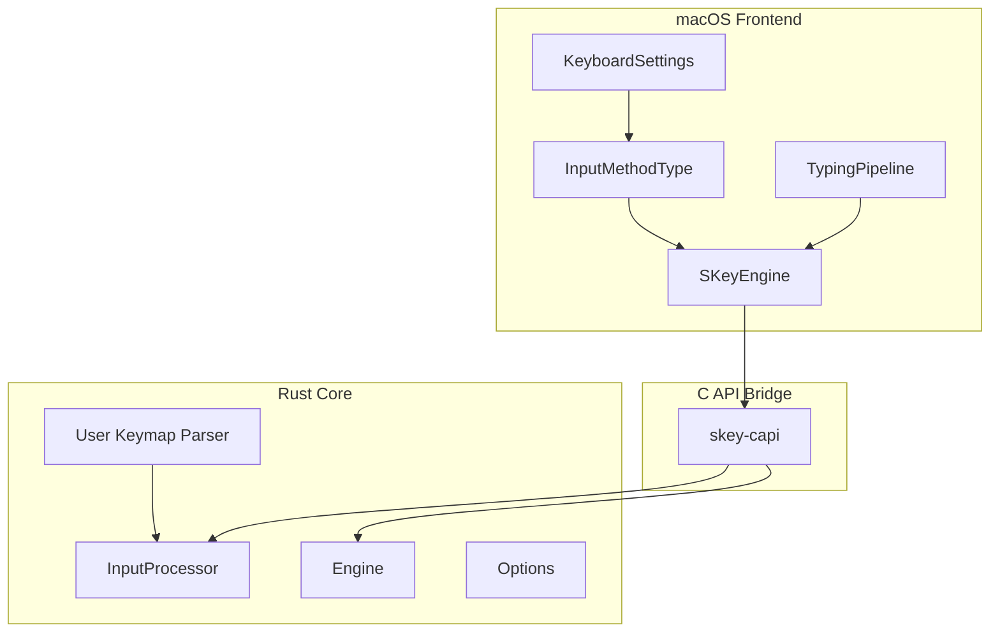
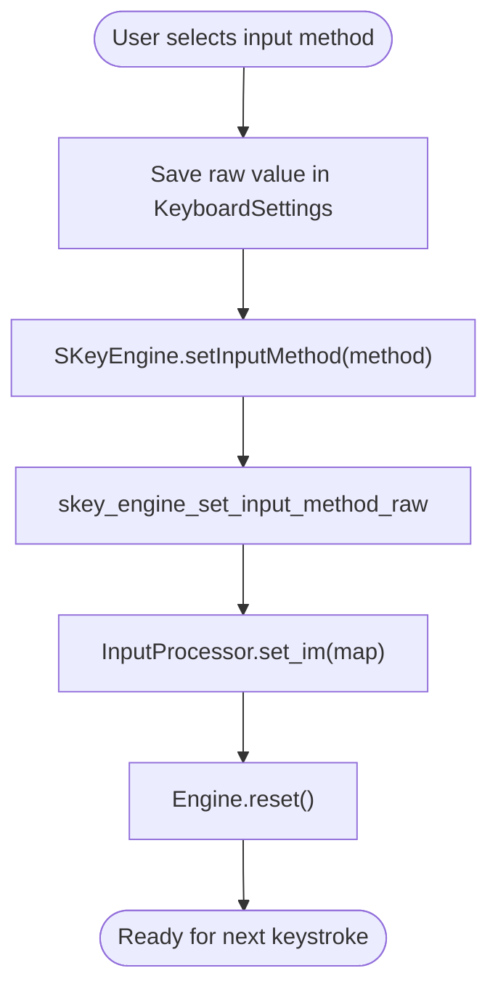
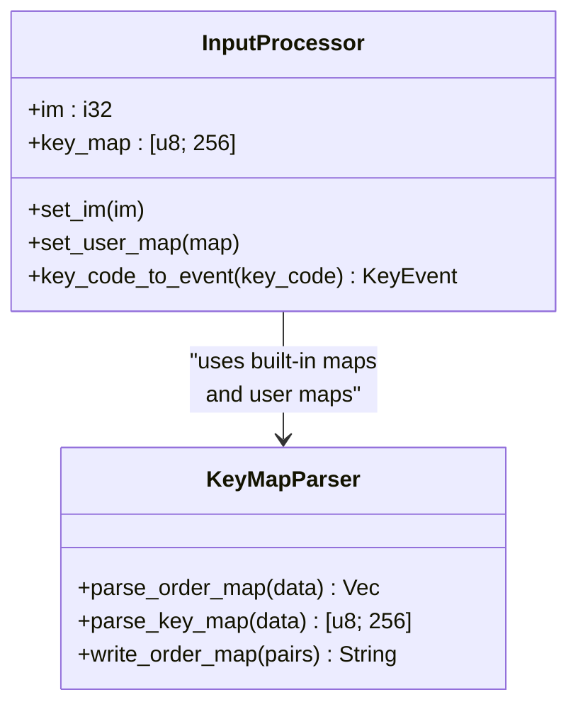
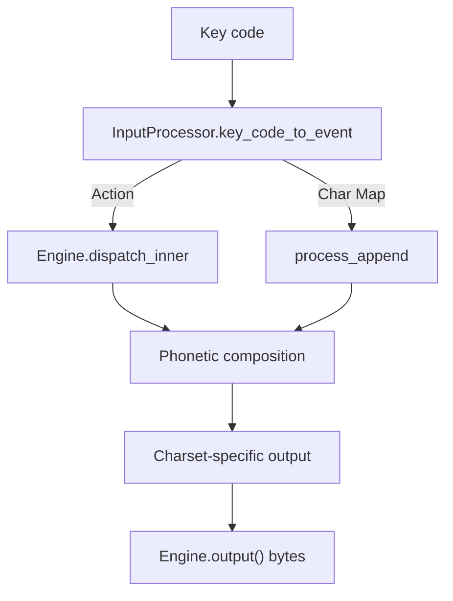
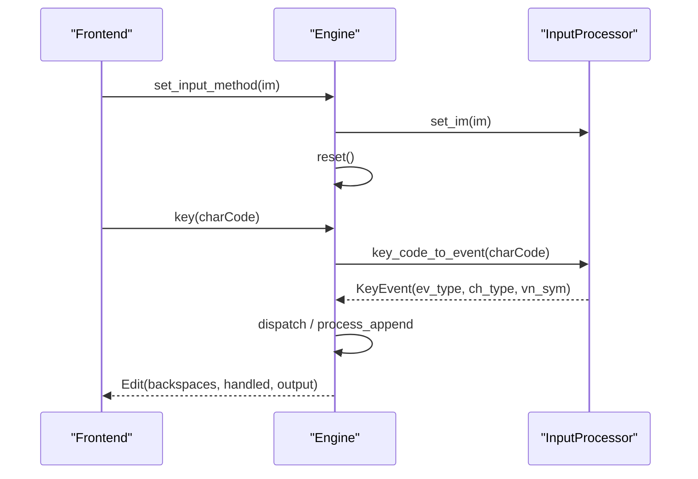
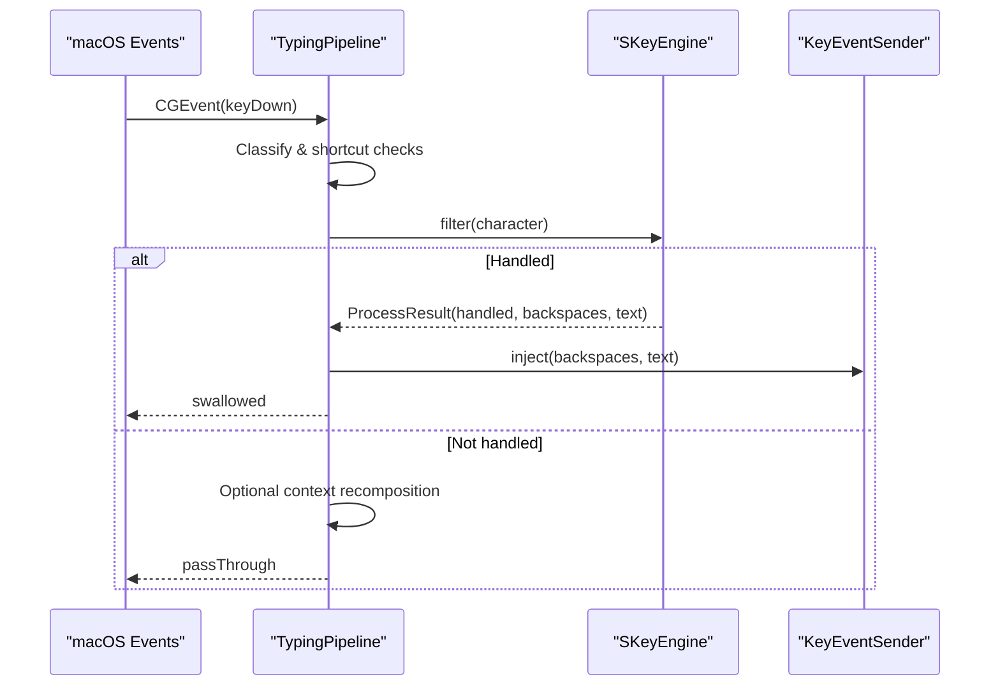
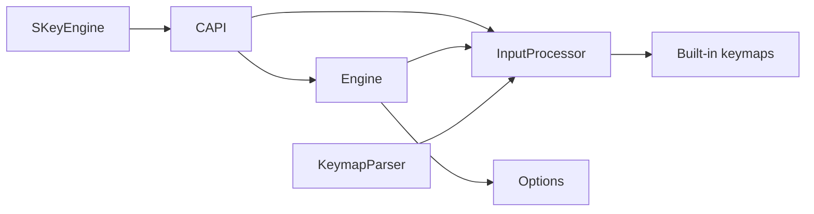

# Input Method Switching

<cite>
**Referenced Files in This Document**
- [InputMethod.swift](file://macos/skey-app/Sources/Features/Keyboard/Engine/InputMethod.swift)
- [SKeyEngine.swift](file://macos/skey-app/Sources/Features/Keyboard/Engine/SKeyEngine.swift)
- [TypingPipeline.swift](file://macos/skey-app/Sources/Features/Keyboard/EventHandling/Pipeline/TypingPipeline.swift)
- [KeyboardSettings.swift](file://macos/skey-app/Sources/Shared/Settings/Modules/KeyboardSettings.swift)
- [input/mod.rs](file://port/skey-core/src/input/mod.rs)
- [engine/mod.rs](file://port/skey-core/src/engine/mod.rs)
- [engine/types.rs](file://port/skey-core/src/engine/types.rs)
- [extensions/keymap.rs](file://port/skey-core/src/extensions/keymap.rs)
- [skey-capi/lib.rs](file://port/skey-capi/src/lib.rs)
</cite>

## Table of Contents
1. [Introduction](#introduction)
2. [Project Structure](#project-structure)
3. [Core Components](#core-components)
4. [Architecture Overview](#architecture-overview)
5. [Detailed Component Analysis](#detailed-component-analysis)
6. [Dependency Analysis](#dependency-analysis)
7. [Performance Considerations](#performance-considerations)
8. [Troubleshooting Guide](#troubleshooting-guide)
9. [Conclusion](#conclusion)
10. [Appendices](#appendices)

## Introduction
This document explains how UniKey switches between input methods (Telex, VNI, VIQR, Simple Telex, and user-defined mappings), how the keymap extension system provides pluggable keystroke-to-character rules, and how runtime switching works without restarting the application. It also details how each input method configures character recognition, special key handling, and output formatting, and how these rules are applied by the core typing engine during composition.

## Project Structure
The implementation spans a Swift front-end on macOS and a Rust-based core engine:
- Swift layer captures events, applies shortcuts, and delegates to the core engine for Vietnamese typing.
- The Rust core defines the engine state machine, input processor, and per-method keymaps.
- A C API bridges Swift to Rust and exposes runtime configuration and processing functions.



**Diagram sources**
- [TypingPipeline.swift:31-170](file://macos/skey-app/Sources/Features/Keyboard/EventHandling/Pipeline/TypingPipeline.swift#L31-L170)
- [SKeyEngine.swift:38-68](file://macos/skey-app/Sources/Features/Keyboard/Engine/SKeyEngine.swift#L38-L68)
- [input/mod.rs:72-125](file://port/skey-core/src/input/mod.rs#L72-L125)
- [engine/mod.rs:159-167](file://port/skey-core/src/engine/mod.rs#L159-L167)
- [extensions/keymap.rs:129-178](file://port/skey-core/src/extensions/keymap.rs#L129-L178)
- [skey-capi/lib.rs:306-311](file://port/skey-capi/src/lib.rs#L306-L311)

**Section sources**
- [TypingPipeline.swift:31-170](file://macos/skey-app/Sources/Features/Keyboard/EventHandling/Pipeline/TypingPipeline.swift#L31-L170)
- [SKeyEngine.swift:38-68](file://macos/skey-app/Sources/Features/Keyboard/Engine/SKeyEngine.swift#L38-L68)
- [input/mod.rs:72-125](file://port/skey-core/src/input/mod.rs#L72-L125)
- [engine/mod.rs:159-167](file://port/skey-core/src/engine/mod.rs#L159-L167)
- [extensions/keymap.rs:129-178](file://port/skey-core/src/extensions/keymap.rs#L129-L178)
- [skey-capi/lib.rs:306-311](file://port/skey-capi/src/lib.rs#L306-L311)

## Core Components
- InputMethodType: Enumerates supported input methods (Telex, VNI, VIQR, Simple Telex).
- SKeyEngine: High-level wrapper around the Rust engine; exposes runtime setters including setInputMethod.
- TypingPipeline: Event pipeline that routes keys to the engine and handles UI shortcuts and language toggles.
- KeyboardSettings: Persists current input method and other keyboard options.
- InputProcessor: Holds the active keymap and converts key codes into typed events based on the selected input method.
- Engine: Stateful typing engine that composes characters according to phonetic rules and options.
- User Keymap Parser: Parses user-defined key mapping files to extend or override behavior.

**Section sources**
- [InputMethod.swift:5-19](file://macos/skey-app/Sources/Features/Keyboard/Engine/InputMethod.swift#L5-L19)
- [SKeyEngine.swift:38-68](file://macos/skey-app/Sources/Features/Keyboard/Engine/SKeyEngine.swift#L38-L68)
- [TypingPipeline.swift:31-170](file://macos/skey-app/Sources/Features/Keyboard/EventHandling/Pipeline/TypingPipeline.swift#L31-L170)
- [KeyboardSettings.swift:78-89](file://macos/skey-app/Sources/Shared/Settings/Modules/KeyboardSettings.swift#L78-L89)
- [input/mod.rs:72-125](file://port/skey-core/src/input/mod.rs#L72-L125)
- [engine/mod.rs:159-167](file://port/skey-core/src/engine/mod.rs#L159-L167)
- [extensions/keymap.rs:129-178](file://port/skey-core/src/extensions/keymap.rs#L129-L178)

## Architecture Overview
Runtime switching is achieved by updating the active keymap in the InputProcessor and resetting the Engine state. The Swift front-end persists the chosen method and triggers the switch via the C API.

```mermaid
sequenceDiagram
participant UI as "Settings UI"
participant KS as "KeyboardSettings"
participant SE as "SKeyEngine"
participant CA as "skey-capi"
participant IP as "InputProcessor"
participant EN as "Engine"
UI->>KS : Save inputMethod (e.g., VNI)
KS-->>SE : Notify change (via app logic)
SE->>CA : skey_engine_set_input_method_raw(method)
CA->>IP : set_im(method)
IP-->>CA : keymap updated
CA->>EN : reset()
Note over SE,EN : Engine resets buffers; next keystrokes use new method
```

**Diagram sources**
- [SKeyEngine.swift:63-68](file://macos/skey-app/Sources/Features/Keyboard/Engine/SKeyEngine.swift#L63-L68)
- [skey-capi/lib.rs:306-311](file://port/skey-capi/src/lib.rs#L306-L311)
- [input/mod.rs:94-125](file://port/skey-core/src/input/mod.rs#L94-L125)
- [engine/mod.rs:159-167](file://port/skey-core/src/engine/mod.rs#L159-L167)

## Detailed Component Analysis

### InputMethodType and Runtime Selection
- InputMethodType enumerates available methods with display names for UI.
- KeyboardSettings stores the raw integer value and maps it to InputMethodType.
- SKeyEngine exposes setInputMethod which calls into the Rust engine to switch the active keymap and resets state.



**Diagram sources**
- [InputMethod.swift:5-19](file://macos/skey-app/Sources/Features/Keyboard/Engine/InputMethod.swift#L5-L19)
- [KeyboardSettings.swift:78-89](file://macos/skey-app/Sources/Shared/Settings/Modules/KeyboardSettings.swift#L78-L89)
- [SKeyEngine.swift:63-68](file://macos/skey-app/Sources/Features/Keyboard/Engine/SKeyEngine.swift#L63-L68)
- [skey-capi/lib.rs:306-311](file://port/skey-capi/src/lib.rs#L306-L311)
- [input/mod.rs:94-125](file://port/skey-core/src/input/mod.rs#L94-L125)
- [engine/mod.rs:159-167](file://port/skey-core/src/engine/mod.rs#L159-L167)

**Section sources**
- [InputMethod.swift:5-19](file://macos/skey-app/Sources/Features/Keyboard/Engine/InputMethod.swift#L5-L19)
- [KeyboardSettings.swift:78-89](file://macos/skey-app/Sources/Shared/Settings/Modules/KeyboardSettings.swift#L78-L89)
- [SKeyEngine.swift:63-68](file://macos/skey-app/Sources/Features/Keyboard/Engine/SKeyEngine.swift#L63-L68)
- [input/mod.rs:94-125](file://port/skey-core/src/input/mod.rs#L94-L125)
- [engine/mod.rs:159-167](file://port/skey-core/src/engine/mod.rs#L159-L167)

### Keymap Extension System
- Built-in keymaps: Telex, VNI, VIQR, MS-VI, Simple Telex are loaded from tables and mapped into a 256-entry action table.
- User keymaps: A parser reads name-value lines mapping single-byte keys to actions or direct character mappings. Duplicate assignments are ignored; unknown labels are skipped.
- The resulting map is used by InputProcessor to classify incoming key codes into events (tones, roofs, hooks, bowl, telex-w, escape, direct char mapping, or normal).



**Diagram sources**
- [input/mod.rs:72-125](file://port/skey-core/src/input/mod.rs#L72-L125)
- [extensions/keymap.rs:129-178](file://port/skey-core/src/extensions/keymap.rs#L129-L178)

**Section sources**
- [input/mod.rs:72-125](file://port/skey-core/src/input/mod.rs#L72-L125)
- [extensions/keymap.rs:129-178](file://port/skey-core/src/extensions/keymap.rs#L129-L178)

### Character Recognition Rules, Special Keys, and Output Formatting
- Character classification: Non-Vietnamese vs Vietnamese characters are determined per key code using tables and ISO-to-Lexi mapping.
- Special keys: Tones (0–5), roof marks (all/a/e/o), hook marks (all/uo/u/o), bowl, dd, telex-w, escape, and direct character mapping are recognized via the active keymap.
- Output formatting: The Engine writes composed text to an output buffer; charset selection determines final encoding. Options like upper_case_first_char, quick shortcuts, and swallowed-key restore influence output.



**Diagram sources**
- [input/mod.rs:150-192](file://port/skey-core/src/input/mod.rs#L150-L192)
- [engine/mod.rs:209-246](file://port/skey-core/src/engine/mod.rs#L209-L246)
- [engine/types.rs:34-83](file://port/skey-core/src/engine/types.rs#L34-L83)

**Section sources**
- [input/mod.rs:150-192](file://port/skey-core/src/input/mod.rs#L150-L192)
- [engine/mod.rs:209-246](file://port/skey-core/src/engine/mod.rs#L209-L246)
- [engine/types.rs:34-83](file://port/skey-core/src/engine/types.rs#L34-L83)

### Relationship Between Input Methods and the Core Typing Engine
- The Engine holds an InputProcessor instance; changing the input method updates the keymap used to convert key codes into events.
- After switching, the Engine resets its internal buffers so subsequent keystrokes are processed under the new rules.
- Options such as spell checking, quick shortcuts, and capitalization affect how events are composed and output.



**Diagram sources**
- [engine/mod.rs:159-167](file://port/skey-core/src/engine/mod.rs#L159-L167)
- [engine/mod.rs:249-319](file://port/skey-core/src/engine/mod.rs#L249-L319)
- [input/mod.rs:162-192](file://port/skey-core/src/input/mod.rs#L162-L192)

**Section sources**
- [engine/mod.rs:159-167](file://port/skey-core/src/engine/mod.rs#L159-L167)
- [engine/mod.rs:249-319](file://port/skey-core/src/engine/mod.rs#L249-L319)
- [input/mod.rs:162-192](file://port/skey-core/src/input/mod.rs#L162-L192)

### Event Pipeline Integration
- TypingPipeline intercepts key events, bypasses non-printable or navigation keys, and forwards printable ASCII to SKeyEngine.filter.
- When the engine handles a key, the pipeline injects backspaces and composed text; otherwise, it may attempt context recomposition or pass through.
- Language toggle shortcuts can trigger input method changes at runtime.



**Diagram sources**
- [TypingPipeline.swift:174-280](file://macos/skey-app/Sources/Features/Keyboard/EventHandling/Pipeline/TypingPipeline.swift#L174-L280)
- [SKeyEngine.swift:133-145](file://macos/skey-app/Sources/Features/Keyboard/Engine/SKeyEngine.swift#L133-L145)

**Section sources**
- [TypingPipeline.swift:174-280](file://macos/skey-app/Sources/Features/Keyboard/EventHandling/Pipeline/TypingPipeline.swift#L174-L280)
- [SKeyEngine.swift:133-145](file://macos/skey-app/Sources/Features/Keyboard/Engine/SKeyEngine.swift#L133-L145)

## Dependency Analysis
- Swift SKeyEngine depends on the C API to call into Rust functions for setting input methods and processing keys.
- Rust InputProcessor depends on built-in tables for keymaps and character classification.
- Engine depends on InputProcessor for event conversion and on Options for behavior flags.
- User keymap parsing is independent but feeds into InputProcessor when loading custom maps.



**Diagram sources**
- [SKeyEngine.swift:38-68](file://macos/skey-app/Sources/Features/Keyboard/Engine/SKeyEngine.swift#L38-L68)
- [skey-capi/lib.rs:306-311](file://port/skey-capi/src/lib.rs#L306-L311)
- [input/mod.rs:72-125](file://port/skey-core/src/input/mod.rs#L72-L125)
- [engine/mod.rs:159-167](file://port/skey-core/src/engine/mod.rs#L159-L167)
- [extensions/keymap.rs:129-178](file://port/skey-core/src/extensions/keymap.rs#L129-L178)

**Section sources**
- [SKeyEngine.swift:38-68](file://macos/skey-app/Sources/Features/Keyboard/Engine/SKeyEngine.swift#L38-L68)
- [skey-capi/lib.rs:306-311](file://port/skey-capi/src/lib.rs#L306-L311)
- [input/mod.rs:72-125](file://port/skey-core/src/input/mod.rs#L72-L125)
- [engine/mod.rs:159-167](file://port/skey-core/src/engine/mod.rs#L159-L167)
- [extensions/keymap.rs:129-178](file://port/skey-core/src/extensions/keymap.rs#L129-L178)

## Performance Considerations
- Hot path optimization: TypingPipeline avoids allocations and uses fast classifications for function/media keys, navigation, and backspace.
- Zero-heap output extraction: SKeyEngine reads engine output into a stack-allocated buffer to avoid heap allocation on the hot path.
- Compact keymap: InputProcessor uses a 256-entry byte array for O(1) key-to-action lookup.
- Engine state reset: Minimal overhead when switching input methods; only buffers and indices are cleared.

[No sources needed since this section provides general guidance]

## Troubleshooting Guide
- If switching input methods does not take effect immediately, ensure the engine is reset after setting the method.
- Verify that the selected input method corresponds to a valid keymap index; invalid values fall back to Telex.
- For user-defined keymaps, confirm that duplicate key assignments are not present and that labels are recognized by the parser.
- Check options like allow_consonant_zfwj if unexpected character classification occurs; it affects whether certain consonants are treated as Vietnamese.

**Section sources**
- [SKeyEngine.swift:63-68](file://macos/skey-app/Sources/Features/Keyboard/Engine/SKeyEngine.swift#L63-L68)
- [input/mod.rs:94-125](file://port/skey-core/src/input/mod.rs#L94-L125)
- [extensions/keymap.rs:129-178](file://port/skey-core/src/extensions/keymap.rs#L129-L178)
- [engine/types.rs:34-83](file://port/skey-core/src/engine/types.rs#L34-L83)

## Conclusion
UniKey’s input method switching relies on a clean separation between the Swift front-end, a Rust core engine, and a C API bridge. Users can switch between Telex, VNI, VIQR, Simple Telex, and custom user-defined mappings at runtime without restarting the app. Each input method defines its own keystroke-to-character rules via keymaps, while the engine applies phonetic composition and formatting rules consistently. The design supports extensibility through user keymaps and configurable options, enabling flexible and high-performance Vietnamese typing across applications.

[No sources needed since this section summarizes without analyzing specific files]

## Appendices

### Configuration Examples
- Set default input method and charset on engine initialization:
  - Configure default options and charset, then set initial input method to Telex.
  - Reference: [SKeyEngine.swift:38-60](file://macos/skey-app/Sources/Features/Keyboard/Engine/SKeyEngine.swift#L38-L60)
- Persist user choice:
  - Store raw integer value in KeyboardSettings and map to InputMethodType.
  - Reference: [KeyboardSettings.swift:78-89](file://macos/skey-app/Sources/Shared/Settings/Modules/KeyboardSettings.swift#L78-L89)
- Switch at runtime:
  - Call setInputMethod with desired InputMethodType; engine resets automatically.
  - Reference: [SKeyEngine.swift:63-68](file://macos/skey-app/Sources/Features/Keyboard/Engine/SKeyEngine.swift#L63-L68)
- Extend with user keymaps:
  - Parse user keymap file into a 256-entry map and apply via set_user_map.
  - Reference: [extensions/keymap.rs:129-178](file://port/skey-core/src/extensions/keymap.rs#L129-L178), [input/mod.rs:122-125](file://port/skey-core/src/input/mod.rs#L122-L125)

**Section sources**
- [SKeyEngine.swift:38-68](file://macos/skey-app/Sources/Features/Keyboard/Engine/SKeyEngine.swift#L38-L68)
- [KeyboardSettings.swift:78-89](file://macos/skey-app/Sources/Shared/Settings/Modules/KeyboardSettings.swift#L78-L89)
- [extensions/keymap.rs:129-178](file://port/skey-core/src/extensions/keymap.rs#L129-L178)
- [input/mod.rs:122-125](file://port/skey-core/src/input/mod.rs#L122-L125)