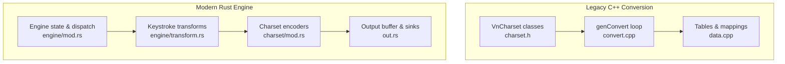
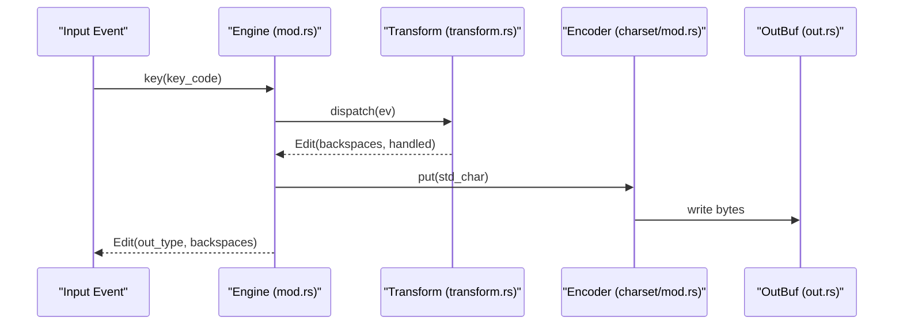
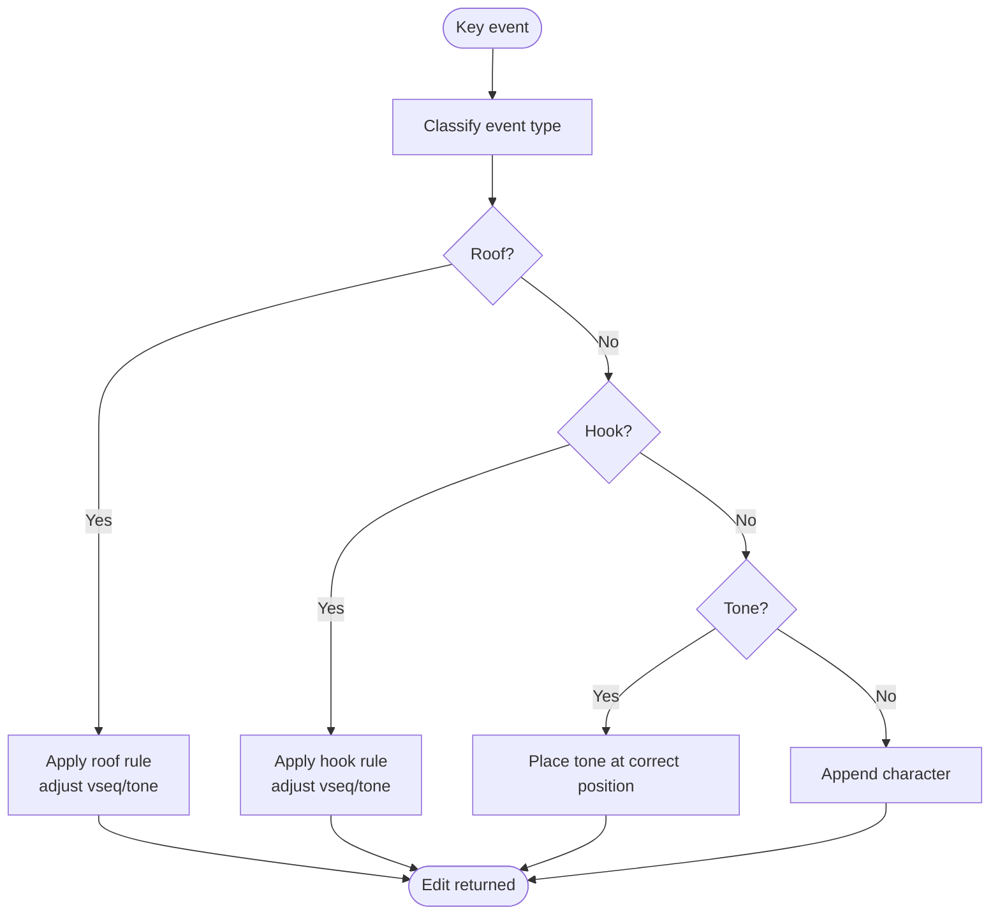
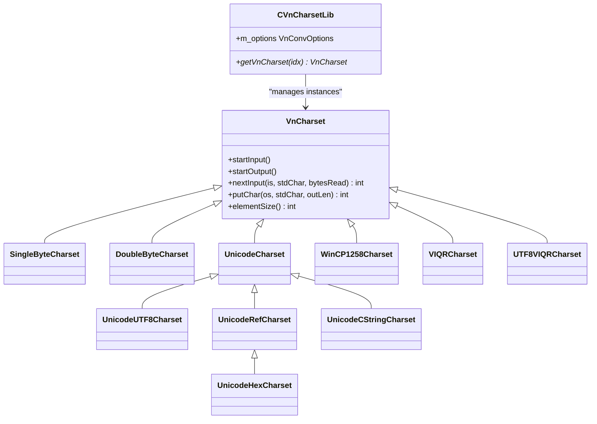
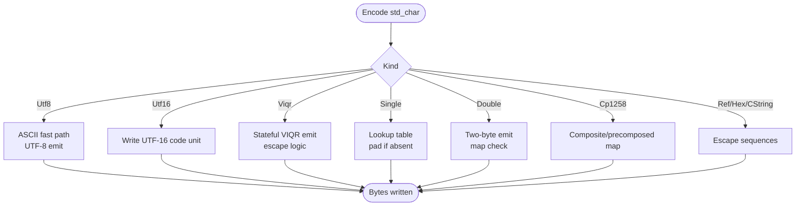
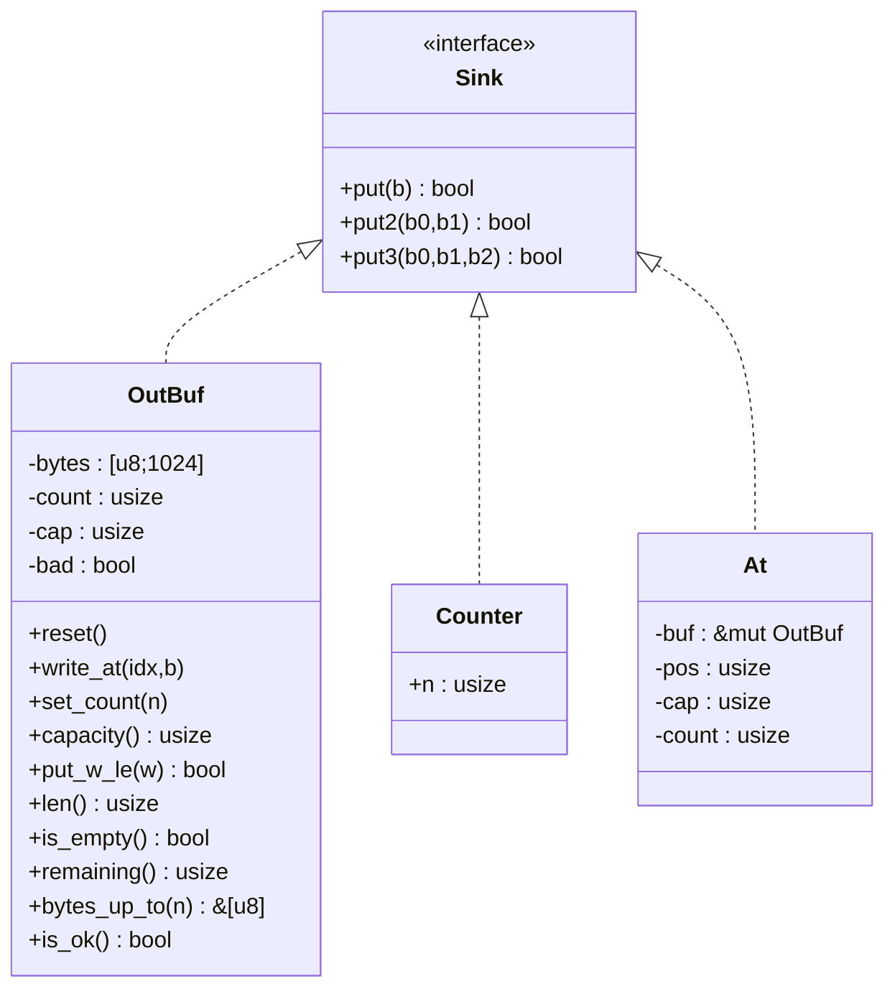
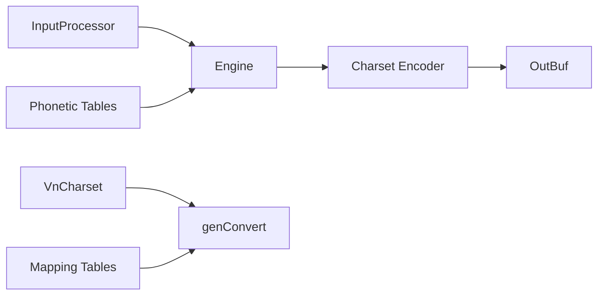

# Text Transformation Pipeline

<cite>
**Referenced Files in This Document**
- [charset.h](file://src/vnconv/charset.h)
- [convert.cpp](file://src/vnconv/convert.cpp)
- [data.cpp](file://src/vnconv/data.cpp)
- [mod.rs](file://port/skey-core/src/engine/mod.rs)
- [transform.rs](file://port/skey-core/src/engine/transform.rs)
- [charset_mod.rs](file://port/skey-core/src/charset/mod.rs)
- [out.rs](file://port/skey-core/src/out.rs)
- [README.md](file://README.md)
</cite>

## Table of Contents
1. [Introduction](#introduction)
2. [Project Structure](#project-structure)
3. [Core Components](#core-components)
4. [Architecture Overview](#architecture-overview)
5. [Detailed Component Analysis](#detailed-component-analysis)
6. [Dependency Analysis](#dependency-analysis)
7. [Performance Considerations](#performance-considerations)
8. [Troubleshooting Guide](#troubleshooting-guide)
9. [Conclusion](#conclusion)

## Introduction
This document explains the text transformation pipeline that converts composed Vietnamese characters into final output formats across multiple encodings and input methods. It covers how keystrokes are transformed into internal standard character codes, how those codes are encoded to target charsets (Unicode, VNI, VIQR, TCVN3, Windows CP1258, and others), and how formatting rules such as capitalization, spacing, tone placement, and character ordering are applied. It also documents integration points with charset encoders that produce byte streams, and provides examples for common scenarios like converting between input methods while preserving tones, handling mixed-language text, and optimizing output for different applications. Finally, it outlines performance characteristics and memory management strategies used by the pipeline.

## Project Structure
The repository contains two complementary implementations:
- A legacy C++ conversion library (VnConv) providing charset conversion utilities and a streaming converter.
- A modern Rust core engine (skey-core) implementing the typing engine, phonetic transformations, and an efficient encoder pipeline for output charsets.

**Diagram sources**
- [charset.h:87-284](file://src/vnconv/charset.h#L87-L284)
- [convert.cpp:38-63](file://src/vnconv/convert.cpp#L38-L63)
- [data.cpp:62-82](file://src/vnconv/data.cpp#L62-L82)
- [mod.rs:18-70](file://port/skey-core/src/engine/mod.rs#L18-L70)
- [transform.rs:14-769](file://port/skey-core/src/engine/transform.rs#L14-L769)
- [charset_mod.rs:17-102](file://port/skey-core/src/charset/mod.rs#L17-L102)
- [out.rs:1-231](file://port/skey-core/src/out.rs#L1-L231)

**Section sources**
- [README.md:20-31](file://README.md#L20-L31)

## Core Components
- Legacy C++ conversion pipeline:
  - Charset abstraction and concrete implementations for Unicode, UTF-8, VIQR, TCVN3, VNI, WinCP1258, etc.
  - Streaming converter that reads from an input stream, normalizes via options (case, tone removal), and writes to an output stream.
  - Tables mapping standard Vietnamese characters to various encodings.

- Modern Rust engine:
  - Engine state machine that processes keystrokes, applies phonetic rules (roof, hook, tone, d-stroke), and manages editing operations (backspaces, reverts).
  - Charset encoder that emits bytes for many target charsets efficiently, including stateful VIQR escaping and fast paths for ASCII.
  - Output sink abstraction with a fixed-capacity buffer to avoid allocations and match original behavior.

**Section sources**
- [charset.h:87-284](file://src/vnconv/charset.h#L87-L284)
- [convert.cpp:38-106](file://src/vnconv/convert.cpp#L38-L106)
- [data.cpp:97-573](file://src/vnconv/data.cpp#L97-L573)
- [mod.rs:18-70](file://port/skey-core/src/engine/mod.rs#L18-L70)
- [transform.rs:14-769](file://port/skey-core/src/engine/transform.rs#L14-L769)
- [charset_mod.rs:17-102](file://port/skey-core/src/charset/mod.rs#L17-L102)
- [out.rs:1-231](file://port/skey-core/src/out.rs#L1-L231)

## Architecture Overview
The pipeline consists of three main phases:
1. Keystroke processing and phonetic transformation:
   - The engine receives key events, classifies them, and updates an internal buffer representing the current word under composition.
   - Transform routines handle roof marks, hooks, tones, and special sequences (e.g., “dd”), adjusting vowel sequences and tone positions according to Vietnamese orthographic rules.

2. Standard character normalization:
   - Characters are represented as internal “standard” codes that encode base letters, diacritics, and tone information consistently regardless of input method.
   - Options can force case changes or remove tones before encoding.

3. Encoding to target charset:
   - An encoder maps standard characters to the requested output format (UTF-8, UTF-16, VIQR, TCVN3, VNI, WinCP1258, etc.).
   - For stateful encodings like VIQR, the encoder maintains per-output-state flags to correctly escape or suppress certain characters based on context.

**Diagram sources**
- [mod.rs:249-319](file://port/skey-core/src/engine/mod.rs#L249-L319)
- [transform.rs:209-246](file://port/skey-core/src/engine/transform.rs#L209-L246)
- [charset_mod.rs:360-501](file://port/skey-core/src/charset/mod.rs#L360-L501)
- [out.rs:80-126](file://port/skey-core/src/out.rs#L80-L126)

## Detailed Component Analysis

### Keystroke Processing and Phonetics
- Roof, hook, tone, and d-stroke handlers update the internal buffer, adjust vowel sequences, and move tones to correct positions based on the current vowel sequence and context.
- Special cases include:
  - “u+o” combinations when applying hooks or roofs.
  - Tone restrictions for certain consonant suffixes.
  - “dd” abbreviation handling and toggling between single/double forms.
- Capitalization is managed by tracking whether the next character should be capitalized at sentence boundaries; this is applied during dispatch.

**Diagram sources**
- [transform.rs:70-189](file://port/skey-core/src/engine/transform.rs#L70-L189)
- [transform.rs:191-467](file://port/skey-core/src/engine/transform.rs#L191-L467)
- [transform.rs:469-536](file://port/skey-core/src/engine/transform.rs#L469-L536)
- [transform.rs:538-601](file://port/skey-core/src/engine/transform.rs#L538-L601)

**Section sources**
- [transform.rs:70-769](file://port/skey-core/src/engine/transform.rs#L70-L769)
- [mod.rs:209-246](file://port/skey-core/src/engine/mod.rs#L209-L246)

### Charset Abstraction and Conversion Loop (Legacy C++)
- The VnCharset hierarchy defines a uniform interface for reading input and writing output across different encodings.
- Concrete classes implement:
  - Single-byte charsets (TCVN3, VISCII, BKHCM1, etc.)
  - Double-byte charsets (VNI-WIN, VNI-MAC, etc.)
  - Unicode variants (UTF-8, UTF-16, reference escapes, hex escapes, decomposed)
  - Stateful VIQR with escape handling
  - Windows CP1258 with composite and precomposed tables
- The conversion loop:
  - Initializes input/output charsets
  - Reads characters from input stream
  - Applies options (toLower/toUpper/removeTone)
  - Writes converted characters to output stream
  - Handles errors and returns status codes

**Diagram sources**
- [charset.h:87-284](file://src/vnconv/charset.h#L87-L284)

**Section sources**
- [charset.h:87-284](file://src/vnconv/charset.h#L87-L284)
- [convert.cpp:38-106](file://src/vnconv/convert.cpp#L38-L106)

### Encoding to Target Charsets (Rust)
- The Rust encoder supports:
  - UTF-8 and UTF-16
  - Vietnamese standard (internal)
  - Decomposed Unicode
  - Reference escapes (&#nnn;, &#xhhhh;)
  - CString-style escapes (\xHH)
  - VIQR with stateful escaping and URL/email detection
  - Single-byte and double-byte legacy charsets
  - Windows CP1258
- Fast paths:
  - ASCII bypasses full conversion
  - One-step-per-char optimization for certain charsets simplifies backspace arithmetic
- VIQR state:
  - Tracks escape contexts (tone, roof, bowl, hook)
  - Uses a rolling window to detect patterns like “://”, “www”, etc., to suppress unnecessary escaping

**Diagram sources**
- [charset_mod.rs:360-501](file://port/skey-core/src/charset/mod.rs#L360-L501)
- [charset_mod.rs:503-643](file://port/skey-core/src/charset/mod.rs#L503-L643)

**Section sources**
- [charset_mod.rs:17-102](file://port/skey-core/src/charset/mod.rs#L17-L102)
- [charset_mod.rs:360-643](file://port/skey-core/src/charset/mod.rs#L360-L643)

### Output Buffering and Sinks
- The output system uses a fixed-size buffer to avoid heap allocations and maintain zero-latency keystroke processing.
- Sink trait abstracts byte writing; OutBuf implements efficient multi-byte writes with bounds checking.
- Counter sink counts bytes without storing them, enabling backspace calculations without allocation.
- At sink provides a bounded window into the buffer for partial writes.

**Diagram sources**
- [out.rs:11-38](file://port/skey-core/src/out.rs#L11-L38)
- [out.rs:60-192](file://port/skey-core/src/out.rs#L60-L192)

**Section sources**
- [out.rs:1-231](file://port/skey-core/src/out.rs#L1-L231)

## Dependency Analysis
- The Rust engine depends on:
  - Input processor for key classification
  - Phonetic tables for vowel sequences and rules
  - Charset encoder for output generation
  - Output buffer for efficient byte emission
- The legacy C++ converter depends on:
  - Charset abstraction for I/O
  - Tables for character mappings
  - Stream interfaces for file/string conversion

**Diagram sources**
- [mod.rs:18-70](file://port/skey-core/src/engine/mod.rs#L18-L70)
- [charset_mod.rs:360-501](file://port/skey-core/src/charset/mod.rs#L360-L501)
- [convert.cpp:38-63](file://src/vnconv/convert.cpp#L38-L63)
- [data.cpp:62-82](file://src/vnconv/data.cpp#L62-L82)

**Section sources**
- [mod.rs:18-70](file://port/skey-core/src/engine/mod.rs#L18-L70)
- [charset_mod.rs:360-501](file://port/skey-core/src/charset/mod.rs#L360-L501)
- [convert.cpp:38-63](file://src/vnconv/convert.cpp#L38-L63)
- [data.cpp:62-82](file://src/vnconv/data.cpp#L62-L82)

## Performance Considerations
- Zero-heap design:
  - Fixed-size output buffer avoids dynamic allocation during keystroke processing.
  - Counter sink enables byte counting without storage.
- Fast paths:
  - ASCII bypass in UTF-8 encoder reduces branching.
  - One-step-per-char optimization for certain charsets simplifies backspace calculations.
- Efficient state management:
  - VIQR escape detection uses a compact rolling window instead of complex pattern matching.
  - Compile-time table construction minimizes runtime overhead.
- Memory safety:
  - Rust implementation ensures no unsafe memory access while maintaining compatibility with original behavior.

[No sources needed since this section provides general guidance]

## Troubleshooting Guide
Common issues and their causes:
- Invalid charset selection:
  - Ensure the requested charset is supported by the encoder.
  - Check charset constants and ranges for single/double-byte families.
- Out-of-memory conditions:
  - Legacy converter returns specific error codes when output buffer is insufficient.
  - Rust engine tracks buffer overflow via `bad` flag and reports through output length.
- Incorrect tone placement:
  - Verify vowel sequence validity and tone position calculation.
  - Check constraints for consonant suffixes that restrict certain tones.
- VIQR escaping anomalies:
  - Inspect escape state flags and URL/email detection window.
  - Ensure proper reset of escape context after emitting multi-byte sequences.

**Section sources**
- [convert.cpp:238-255](file://src/vnconv/convert.cpp#L238-L255)
- [charset_mod.rs:85-102](file://port/skey-core/src/charset/mod.rs#L85-L102)
- [out.rs:80-126](file://port/skey-core/src/out.rs#L80-L126)

## Conclusion
The text transformation pipeline combines robust phonetic processing with efficient charset encoding to support Vietnamese input across diverse applications. The modern Rust engine provides high-performance keystroke handling with zero-heap allocation, while the legacy C++ converter offers comprehensive charset conversion capabilities. Together, they enable seamless conversion between input methods (Telex, VNI, VIQR) and output formats (Unicode, TCVN3, VNI, Windows CP1258) while preserving tone marks, applying proper capitalization and spacing rules, and optimizing for different use cases. The architecture balances flexibility and performance, making it suitable for real-time typing environments and batch processing scenarios alike.

[No sources needed since this section summarizes without analyzing specific files]