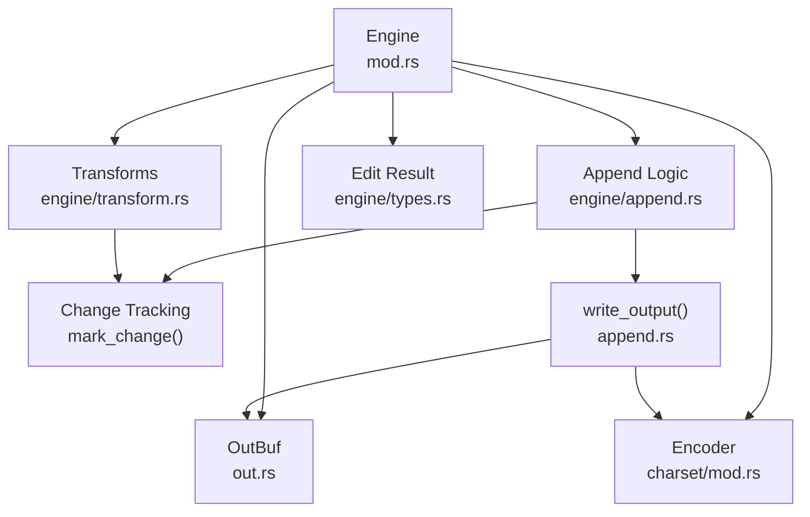
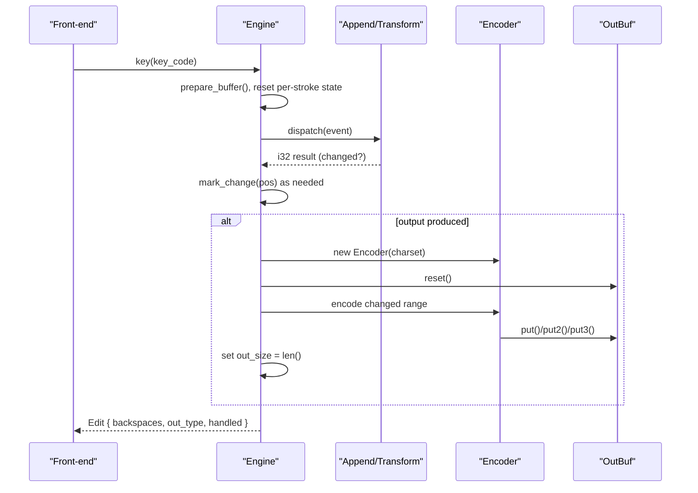
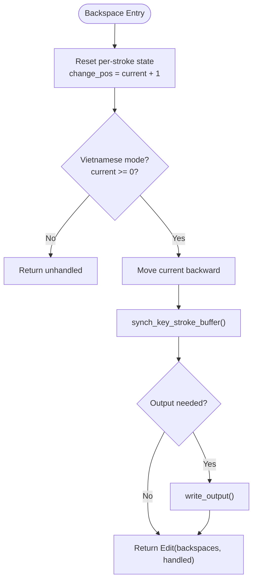
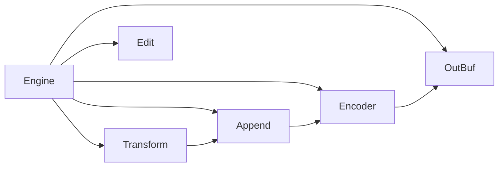

# Output Generation & Buffer Management

<cite>
**Referenced Files in This Document**
- [out.rs](file://port/skey-core/src/out.rs)
- [types.rs](file://port/skey-core/src/engine/types.rs)
- [mod.rs](file://port/skey-core/src/engine/mod.rs)
- [append.rs](file://port/skey-core/src/engine/append.rs)
- [transform.rs](file://port/skey-core/src/engine/transform.rs)
- [charset/mod.rs](file://port/skey-core/src/charset/mod.rs)
</cite>

## Table of Contents
1. [Introduction](#introduction)
2. [Project Structure](#project-structure)
3. [Core Components](#core-components)
4. [Architecture Overview](#architecture-overview)
5. [Detailed Component Analysis](#detailed-component-analysis)
6. [Dependency Analysis](#dependency-analysis)
7. [Performance Considerations](#performance-considerations)
8. [Troubleshooting Guide](#troubleshooting-guide)
9. [Conclusion](#conclusion)

## Introduction
This document explains how the typing engine generates output and manages buffers without heap allocation. It focuses on:
- The OutBuf structure and its zero-allocation design for character output
- The write_output() method that converts internal editing state to final bytes, including backspace accounting and change tracking
- The Edit struct used to communicate edits to the front-end (backspaces, output type, handled status)
- How different output formats (character vs key codes) and charset conversions are handled
- Buffer synchronization between keystroke history and current editing position
- Examples of complex operations like delete, insert, and replace
- Performance considerations such as zero-allocation encoding and efficient backspace counting

## Project Structure
The output pipeline spans several modules:
- out.rs: OutBuf buffer and Sink abstraction
- engine/mod.rs: Engine orchestration and Edit result
- engine/append.rs: Append logic, change tracking, and write_output()
- engine/transform.rs: Diacritic/tone transformations that mark changes
- charset/mod.rs: Charset encoders and counters for backstep calculation

**Diagram sources**
- [mod.rs:18-70](file://port/skey-core/src/engine/mod.rs#L18-L70)
- [out.rs:60-192](file://port/skey-core/src/out.rs#L60-L192)
- [append.rs:98-109](file://port/skey-core/src/engine/append.rs#L98-L109)
- [charset/mod.rs:361-390](file://port/skey-core/src/charset/mod.rs#L361-L390)
- [types.rs:224-234](file://port/skey-core/src/engine/types.rs#L224-L234)

**Section sources**
- [mod.rs:18-70](file://port/skey-core/src/engine/mod.rs#L18-L70)
- [out.rs:60-192](file://port/skey-core/src/out.rs#L60-L192)
- [append.rs:98-109](file://port/skey-core/src/engine/append.rs#L98-L109)
- [charset/mod.rs:361-390](file://port/skey-core/src/charset/mod.rs#L361-L390)
- [types.rs:224-234](file://port/skey-core/src/engine/types.rs#L224-L234)

## Core Components
- OutBuf: Fixed-capacity byte buffer with a Sink interface; supports single, two-byte, and three-byte writes with early bounds checks and an “overflow” flag to avoid heap usage.
- Encoder: Charset-specific encoder implementing put() and count(), reused per output pass; includes fast paths for ASCII and optimized multi-byte sequences.
- Engine: Holds buffers for word entries, keys, conversion flags, and per-stroke state; orchestrates dispatch, append, transforms, and output generation.
- Edit: Struct returned to the front-end indicating how many backspaces to send, whether output is characters or key codes, and if the key was handled.

Key responsibilities:
- OutBuf stores encoded bytes and tracks reported size separately from stored bytes.
- Encoder maps internal standard characters to target charset bytes and can count bytes without writing.
- Engine maintains change ranges and synchronizes keystroke history with editing position.
- write_output() encodes only changed entries into OutBuf and sets the final output size.

**Section sources**
- [out.rs:11-192](file://port/skey-core/src/out.rs#L11-L192)
- [charset/mod.rs:361-390](file://port/skey-core/src/charset/mod.rs#L361-L390)
- [mod.rs:18-70](file://port/skey-core/src/engine/mod.rs#L18-L70)
- [types.rs:224-234](file://port/skey-core/src/engine/types.rs#L224-L234)

## Architecture Overview
The engine processes each keystroke by:
1. Preparing buffers and resetting per-stroke state
2. Dispatching the event to appropriate handlers (append, roof, hook, tone, etc.)
3. Marking changed positions via mark_change()
4. Encoding changed range into OutBuf via write_output()
5. Returning an Edit describing backspaces, output type, and handled status

**Diagram sources**
- [mod.rs:248-319](file://port/skey-core/src/engine/mod.rs#L248-L319)
- [append.rs:98-109](file://port/skey-core/src/engine/append.rs#L98-L109)
- [charset/mod.rs:361-390](file://port/skey-core/src/charset/mod.rs#L361-L390)
- [out.rs:60-192](file://port/skey-core/src/out.rs#L60-L192)

## Detailed Component Analysis

### OutBuf: Zero-Allocation Character Output Buffer
- Fixed-size stack buffer with capacity OUT_CAPACITY
- Tracks count (reported size), cap (capacity), and bad (overflow)
- Optimized put2/put3 paths check remaining space before writing to minimize bounds checks
- Exposes write_at for absolute writes (used by VIQR escape path)
- Provides bytes_up_to(n) to safely slice up to the reported size

Complexity:
- put(): O(1) amortized; early overflow detection avoids extra work
- put2/put3: O(1) with one bounds check when fitting, fallback to multiple puts otherwise

Memory:
- No heap allocation; uses fixed array and simple counters

**Section sources**
- [out.rs:60-192](file://port/skey-core/src/out.rs#L60-L192)

### write_output(): Converting Internal State to Final Bytes
- Resets OutBuf and creates a fresh Encoder per output pass
- Iterates from change_pos to current to encode only changed entries
- Uses std_char_for_output() to map WordInfo to standard character values
- Sets out_size to the number of bytes written

Backspace handling:
- Backspaces are computed via get_seq_steps() over the changed range
- For charsets where one step equals one character, it’s a simple subtraction
- Otherwise, counts bytes using Encoder::count() without allocating

Output types:
- Default is character output; restored key strokes produce key code output

**Section sources**
- [append.rs:98-109](file://port/skey-core/src/engine/append.rs#L98-L109)
- [append.rs:41-66](file://port/skey-core/src/engine/append.rs#L41-L66)
- [mod.rs:113-123](file://port/skey-core/src/engine/mod.rs#L113-L123)

### Edit: Front-End Communication
- backspaces: Number of backspaces the front-end must send before emitting new bytes
- out_type: Whether output should be interpreted as characters or key codes
- handled: Whether the engine consumed the key; false means pass-through

Usage:
- If handled is false, front-end sends original key unchanged
- If handled is true, front-end applies backspaces then emits engine.output()

**Section sources**
- [types.rs:224-234](file://port/skey-core/src/engine/types.rs#L224-L234)
- [mod.rs:300-319](file://port/skey-core/src/engine/mod.rs#L300-L319)

### Charset Conversions and Output Formats
- Encoder selects behavior based on Charset tag (UTF-8, UTF-16, VIQR, single/double-byte tables, etc.)
- Fast path for ASCII in UTF-8 avoids overhead
- Multi-byte writes use put2/put3 to reduce bounds checks
- VIQR encoder maintains minimal state in a u64 window to detect escaping contexts efficiently
- count() reuses the same emit path with a Counter sink to compute byte lengths without storing data

Character vs key codes:
- Character output: write_output() encodes changed WordInfo entries
- Key code output: restore_key_strokes() emits raw key codes via a different path and sets out_type to Key

**Section sources**
- [charset/mod.rs:327-501](file://port/skey-core/src/charset/mod.rs#L327-L501)
- [charset/mod.rs:560-643](file://port/skey-core/src/charset/mod.rs#L560-L643)
- [mod.rs:407-423](file://port/skey-core/src/engine/mod.rs#L407-L423)

### Buffer Synchronization: Keystroke History and Editing Position
- Engine maintains:
  - buffer: WordInfo entries for current word
  - keys: key codes for each stroke
  - converted: whether each stroke caused a conversion
  - current: index of last entry in buffer
  - key_current: index of last stroke in keys
- After processing a key, if current >= 0, keys[key_current] and converted[key_current] are updated
- On backspace or other navigation, synch_key_stroke_buffer() adjusts key_current to align with word breaks
- mark_change() accumulates backspaces based on the changed range and charset step semantics

Examples:
- Insert: append_vowel/append_consonant update buffer and mark_change(current)
- Delete: backspace moves current backward and calls synch_key_stroke_buffer()
- Replace: diacritic/tone changes may move tones across positions, marking both old and new positions

**Section sources**
- [mod.rs:18-70](file://port/skey-core/src/engine/mod.rs#L18-L70)
- [mod.rs:292-298](file://port/skey-core/src/engine/mod.rs#L292-L298)
- [append.rs:618-631](file://port/skey-core/src/engine/append.rs#L618-L631)
- [append.rs:34-66](file://port/skey-core/src/engine/append.rs#L34-L66)

### Complex Editing Operations

#### Delete (Backspace)
- Resets per-stroke state and marks change at current
- Moves current backward according to Vietnamese rules (vowel sequence boundaries, tone movement)
- Updates key_current via synch_key_stroke_buffer()
- Emits output if necessary and returns Edit with accumulated backspaces

**Diagram sources**
- [mod.rs:321-405](file://port/skey-core/src/engine/mod.rs#L321-L405)
- [append.rs:618-631](file://port/skey-core/src/engine/append.rs#L618-L631)

**Section sources**
- [mod.rs:321-405](file://port/skey-core/src/engine/mod.rs#L321-L405)

#### Insert (Vowel/Consonant Append)
- Appends to buffer, updates form, offsets, sequences, and tone positions
- Marks changed positions via mark_change()
- May trigger complex events (e.g., u+o -> u+o+) that adjust previous entries

**Section sources**
- [append.rs:201-369](file://port/skey-core/src/engine/append.rs#L201-L369)
- [append.rs:371-575](file://port/skey-core/src/engine/append.rs#L371-L575)

#### Replace (Diacritics/Tones)
- Roof/hook/tone handlers locate vowel sequences and adjust symbols and tone positions
- Mark both old and new tone positions when moving tones
- Ensure validity constraints (CVC rules) before applying changes

**Section sources**
- [transform.rs:70-189](file://port/skey-core/src/engine/transform.rs#L70-L189)
- [transform.rs:327-467](file://port/skey-core/src/engine/transform.rs#L327-L467)
- [transform.rs:469-536](file://port/skey-core/src/engine/transform.rs#L469-L536)

## Dependency Analysis
- Engine depends on:
  - OutBuf for output storage
  - Encoder for charset-specific encoding
  - Append/Transform modules for state mutation and change marking
  - Types for Edit and Options
- OutBuf depends on Sink trait implementations (Counter for counting, At for windows)
- Encoder depends on Charset configuration and precomputed tables

**Diagram sources**
- [mod.rs:18-70](file://port/skey-core/src/engine/mod.rs#L18-L70)
- [append.rs:98-109](file://port/skey-core/src/engine/append.rs#L98-L109)
- [charset/mod.rs:361-390](file://port/skey-core/src/charset/mod.rs#L361-L390)
- [types.rs:224-234](file://port/skey-core/src/engine/types.rs#L224-L234)

**Section sources**
- [mod.rs:18-70](file://port/skey-core/src/engine/mod.rs#L18-L70)
- [append.rs:98-109](file://port/skey-core/src/engine/append.rs#L98-L109)
- [charset/mod.rs:361-390](file://port/skey-core/src/charset/mod.rs#L361-L390)
- [types.rs:224-234](file://port/skey-core/src/engine/types.rs#L224-L234)

## Performance Considerations
- Zero-allocation design:
  - OutBuf uses a fixed stack buffer; no Vec or String allocations during normal operation
  - Encoder::count() uses a Counter sink to compute byte lengths without storing data
- Efficient multi-byte writes:
  - put2/put3 perform a single bounds check when possible, falling back to individual puts only near capacity
- Fast paths:
  - ASCII in UTF-8 bypasses Unicode conversion
  - One-step-per-char charsets allow O(1) backstep calculation
- Minimal state in VIQR encoder:
  - EscWindow uses a u64 rolling window to detect URL-like patterns without heavy matching
- Memory efficiency:
  - WordInfo packed to reduce buffer sizes
  - Engine buffers are fixed-size arrays sized to MAX_UK_ENGINE

[No sources needed since this section provides general guidance]

## Troubleshooting Guide
Common issues and diagnostics:
- Output truncated unexpectedly:
  - Check OutBuf.is_ok() and remaining() to ensure capacity wasn’t exceeded
  - Verify out_size reflects intended length via output_len()
- Incorrect backspaces:
  - Ensure charset.one_step_per_char() matches expectations
  - Confirm mark_change() called for all modified positions
- Unexpected key passthrough:
  - Inspect Edit.handled; false indicates engine did not consume the key
- VIQR escaping anomalies:
  - Review EscWindow state transitions and escape conditions in emit_viqr()

**Section sources**
- [out.rs:167-192](file://port/skey-core/src/out.rs#L167-L192)
- [append.rs:41-66](file://port/skey-core/src/engine/append.rs#L41-L66)
- [charset/mod.rs:560-643](file://port/skey-core/src/charset/mod.rs#L560-L643)

## Conclusion
The typing engine achieves high performance and reliability through:
- A zero-allocation OutBuf with optimized multi-byte writes
- Precise change tracking and selective encoding via write_output()
- Clear front-end communication through Edit with backspaces, output type, and handled status
- Robust charset support with efficient encoders and counters
- Careful synchronization between keystroke history and editing position

These design choices enable responsive, memory-efficient text input processing suitable for real-time applications.