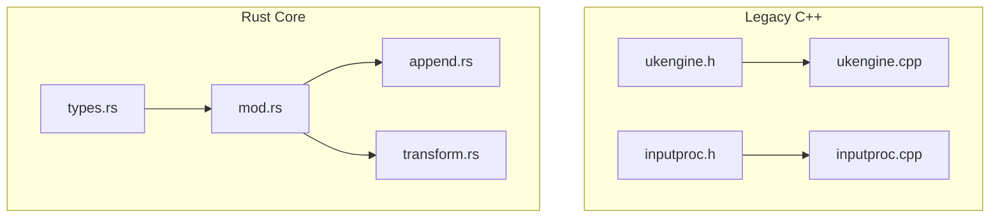
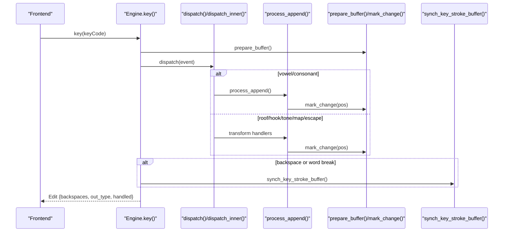
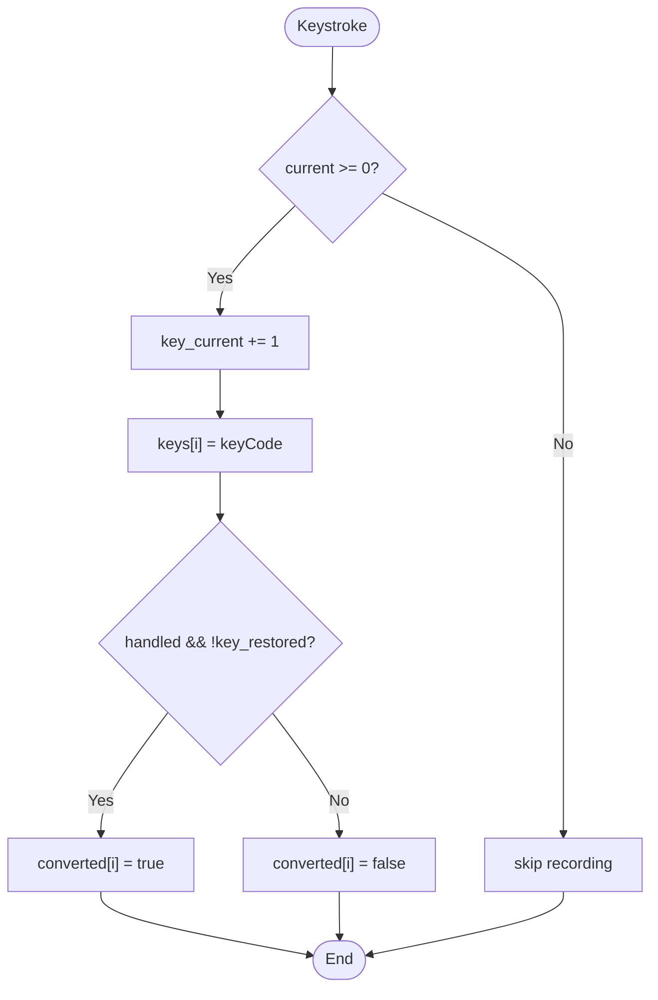
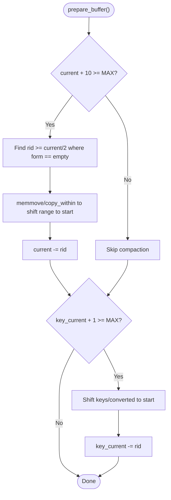
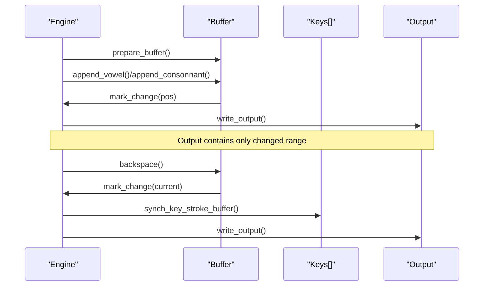
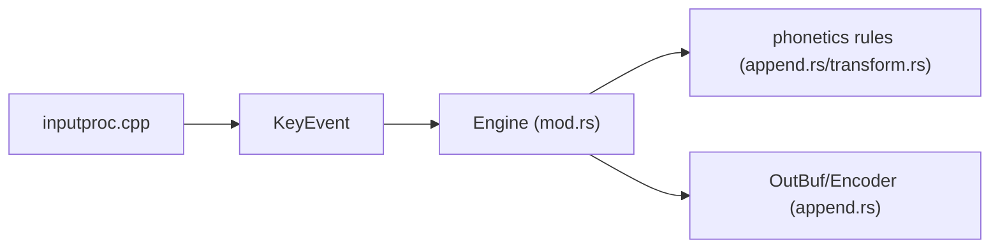

# Buffer Management & State Tracking

<cite>
**Referenced Files in This Document**
- [ukengine.h](file://src/ukengine/ukengine.h)
- [ukengine.cpp](file://src/ukengine/ukengine.cpp)
- [inputproc.h](file://src/ukengine/inputproc.h)
- [inputproc.cpp](file://src/ukengine/inputproc.cpp)
- [mod.rs](file://port/skey-core/src/engine/mod.rs)
- [types.rs](file://port/skey-core/src/engine/types.rs)
- [append.rs](file://port/skey-core/src/engine/append.rs)
- [transform.rs](file://port/skey-core/src/engine/transform.rs)
</cite>

## Table of Contents
1. [Introduction](#introduction)
2. [Project Structure](#project-structure)
3. [Core Components](#core-components)
4. [Architecture Overview](#architecture-overview)
5. [Detailed Component Analysis](#detailed-component-analysis)
6. [Dependency Analysis](#dependency-analysis)
7. [Performance Considerations](#performance-considerations)
8. [Troubleshooting Guide](#troubleshooting-guide)
9. [Conclusion](#conclusion)

## Introduction
This document explains the Engine’s buffer management and state tracking mechanisms for Vietnamese input composition. It focuses on:
- The fixed-size WordInfo array buffer with MAX_UK_ENGINE capacity that stores character composition state across keystrokes.
- The key tracking system using keys[] and converted[] arrays to maintain stroke history and conversion status.
- The current and key_current indices that track position within the buffer and key stroke sequence.
- The single_mode flag for isolated word processing and capitalise_next for automatic capitalization after sentence boundaries.
- How prepare_buffer(), mark_change(), and synch_key_stroke_buffer() work together to keep state consistent.
- Performance optimizations such as stack allocation and avoiding heap usage in the hot path.

## Project Structure
The implementation exists in two layers:
- Legacy C++ engine (UniKey): ukengine.h/cpp, inputproc.h/cpp define the core buffers and processing logic.
- Modern Rust port (SKey core): mod.rs, types.rs, append.rs, transform.rs implement equivalent behavior with explicit, compact data structures and zero-allocation paths.

**Diagram sources**
- [ukengine.h:59-162](file://src/ukengine/ukengine.h#L59-L162)
- [mod.rs:18-70](file://port/skey-core/src/engine/mod.rs#L18-L70)
- [types.rs:107-146](file://port/skey-core/src/engine/types.rs#L107-L146)

**Section sources**
- [ukengine.h:59-162](file://src/ukengine/ukengine.h#L59-L162)
- [mod.rs:18-70](file://port/skey-core/src/engine/mod.rs#L18-L70)

## Core Components
- Fixed-size WordInfo buffer:
  - C++: UkEngine::m_buffer[MAX_UK_ENGINE] holds per-character composition state including form, offsets, sequences, tone, caps, symbol, and key code.
  - Rust: Engine.buffer: [WordInfo; MAX_UK_ENGINE] with a compact 12-byte WordInfo layout storing key_code, vn_sym, seq, c1o, vo, c2o, bits.
- Key stroke history:
  - C++: m_keyStrokes[MAX_UK_ENGINE] of KeyBufEntry (event + converted flag), plus m_keyCurrent index.
  - Rust: Engine.keys: [u32; MAX_UK_ENGINE], Engine.converted: [bool; MAX_UK_ENGINE], plus key_current index.
- Position indices:
  - C++: m_current points to the last processed buffer entry; m_keyCurrent tracks the latest key stroke.
  - Rust: current and key_current serve the same roles.
- Mode flags:
  - C++: m_singleMode disables spell-checking for isolated words; m_toEscape toggles escape mode.
  - Rust: single_mode and to_escape mirror this behavior.
- Capitalization:
  - Rust: capitalise_next is armed at construction to capitalize the first letter of a session and remains set until a full stop or newline triggers it again.

**Section sources**
- [ukengine.h:53-162](file://src/ukengine/ukengine.h#L53-L162)
- [types.rs:5-23](file://port/skey-core/src/engine/types.rs#L5-L23)
- [types.rs:107-146](file://port/skey-core/src/engine/types.rs#L107-L146)
- [mod.rs:18-70](file://port/skey-core/src/engine/mod.rs#L18-L70)

## Architecture Overview
The engine processes each keystroke through a dispatch pipeline:
- Prepare buffers and reset per-keystroke state.
- Classify the key into an event type via the input processor.
- Dispatch to specialized handlers (vowel/consonant append, roof/hook/d-tone, telex W, map char, escape).
- Track changes with mark_change() to compute backspaces and output ranges.
- Synchronize the key stroke buffer when moving backward (backspace) or hitting word breaks.
- Optionally restore original key strokes if the last word was invalid or non-Vietnamese.

**Diagram sources**
- [mod.rs:249-319](file://port/skey-core/src/engine/mod.rs#L249-L319)
- [append.rs:111-139](file://port/skey-core/src/engine/append.rs#L111-L139)
- [append.rs:34-66](file://port/skey-core/src/engine/append.rs#L34-L66)
- [append.rs:618-631](file://port/skey-core/src/engine/append.rs#L618-L631)

## Detailed Component Analysis

### Fixed-size WordInfo buffer and MAX_UK_ENGINE
- Capacity:
  - C++: #define MAX_UK_ENGINE 128; m_buffer[MAX_UK_ENGINE].
  - Rust: const MAX_UK_ENGINE: usize = 128; buffer: [WordInfo; MAX_UK_ENGINE].
- WordInfo fields:
  - C++: form, c1Offset, vOffset, c2Offset, union vseq/cseq, caps, tone, vnSym, keyCode.
  - Rust: key_code, vn_sym, seq (union-like i16), c1o, vo, c2o, bits packed to store form/tone/caps compactly.
- Purpose:
  - Stores per-character composition state so the engine can update vowels, consonants, tones, and diacritics while maintaining valid CV/CVC forms.

**Section sources**
- [ukengine.h:53-162](file://src/ukengine/ukengine.h#L53-L162)
- [types.rs:5-23](file://port/skey-core/src/engine/types.rs#L5-L23)
- [types.rs:107-146](file://port/skey-core/src/engine/types.rs#L107-L146)

### Key tracking system: keys[], converted[], and key_current
- Purpose:
  - Maintain a history of raw key codes and whether they caused a conversion, enabling restoration of original keystrokes when needed.
- Behavior:
  - On each key press, if the engine has a valid current position, increment key_current and record ev.keyCode and whether the result was handled (converted).
  - restoredKeyStrokes uses these arrays to re-emit original keys when auto-restore is enabled.

**Diagram sources**
- [mod.rs:292-298](file://port/skey-core/src/engine/mod.rs#L292-L298)

**Section sources**
- [mod.rs:292-298](file://port/skey-core/src/engine/mod.rs#L292-L298)

### Indices: current and key_current
- current:
  - Points to the most recent buffer entry being composed.
  - Updated by append_vowel/append_consonnant and other handlers; reset to -1 on buffer compaction or reset.
- key_current:
  - Tracks the latest recorded key stroke index.
  - Adjusted by synch_key_stroke_buffer() during backspace or word breaks to stay aligned with buffer positions.

**Section sources**
- [mod.rs:18-70](file://port/skey-core/src/engine/mod.rs#L18-L70)
- [append.rs:618-631](file://port/skey-core/src/engine/append.rs#L618-L631)

### single_mode flag
- Purpose:
  - Disables spell checking for isolated words (e.g., after certain transformations like dd or when undoing diacritics), allowing characters to be typed without immediate validation.
- Behavior:
  - Set by specific handlers (e.g., dd, hook/roof undo) and cleared on word breaks or when reverting to normal processing.

**Section sources**
- [transform.rs:538-601](file://port/skey-core/src/engine/transform.rs#L538-L601)
- [transform.rs:182-186](file://port/skey-core/src/engine/transform.rs#L182-L186)
- [transform.rs:318-322](file://port/skey-core/src/engine/transform.rs#L318-L322)
- [transform.rs:460-464](file://port/skey-core/src/engine/transform.rs#L460-L464)

### capitalise_next flag
- Purpose:
  - Automatically capitalizes the first letter after a full stop or newline.
- Behavior:
  - Armed at engine construction so the first letter of a session counts as the start of a sentence.
  - Not re-armed by reset() to avoid capitalizing mid-sentence after focus changes or arrow keys.

**Section sources**
- [mod.rs:28-34](file://port/skey-core/src/engine/mod.rs#L28-L34)
- [mod.rs:82-111](file://port/skey-core/src/engine/mod.rs#L82-L111)

### Buffer operations: prepare_buffer(), mark_change(), synch_key_stroke_buffer()
- prepare_buffer():
  - Ensures at least 10 entries are available in both the WordInfo buffer and the key stroke buffer.
  - Compacts by dropping at least half of the entries from the front, never splitting a word.
- mark_change():
  - Records the leftmost changed position since the last output and accumulates backspaces based on charset encoding steps.
  - Used extensively by append and transform handlers to minimize output size.
- synch_key_stroke_buffer():
  - Aligns key_current with buffer movements: decrements on backspace and walks back to the nearest word break when the buffer reaches a word boundary.

**Diagram sources**
- [append.rs:111-139](file://port/skey-core/src/engine/append.rs#L111-L139)

**Section sources**
- [append.rs:111-139](file://port/skey-core/src/engine/append.rs#L111-L139)
- [append.rs:34-66](file://port/skey-core/src/engine/append.rs#L34-L66)
- [append.rs:618-631](file://port/skey-core/src/engine/append.rs#L618-L631)

### Example workflow: how prepare_buffer(), mark_change(), and synch_key_stroke_buffer() cooperate
- Keystroke flow:
  - prepare_buffer() ensures space before appending new characters.
  - Append or transform handlers update WordInfo and call mark_change() to record the affected range.
  - write_output() encodes only the changed range into the output buffer.
- Backspace flow:
  - backspace() marks the current position, moves current back, calls synch_key_stroke_buffer() to align key_current, then writes output for the updated range.

**Diagram sources**
- [append.rs:111-139](file://port/skey-core/src/engine/append.rs#L111-L139)
- [append.rs:34-66](file://port/skey-core/src/engine/append.rs#L34-L66)
- [append.rs:618-631](file://port/skey-core/src/engine/append.rs#L618-L631)
- [mod.rs:321-405](file://port/skey-core/src/engine/mod.rs#L321-L405)

## Dependency Analysis
- Input classification:
  - inputproc.h/cpp provide key-to-event mapping and character classification tables used by both legacy and Rust engines.
- Phonetics and rules:
  - Rust engine depends on phonetics tables (VSEQ) and rules (is_valid_cv/is_valid_cvc/vseq_extend/cseq_extend) to validate and extend sequences.
- Output encoding:
  - append.rs uses Encoder to count bytes and produce output, ensuring charset-aware backspace calculations.

**Diagram sources**
- [inputproc.cpp:320-371](file://src/ukengine/inputproc.cpp#L320-L371)
- [append.rs:98-109](file://port/skey-core/src/engine/append.rs#L98-L109)
- [append.rs:141-196](file://port/skey-core/src/engine/append.rs#L141-L196)

**Section sources**
- [inputproc.cpp:320-371](file://src/ukengine/inputproc.cpp#L320-L371)
- [append.rs:98-109](file://port/skey-core/src/engine/append.rs#L98-L109)

## Performance Considerations
- Stack allocation and fixed-size arrays:
  - Both C++ and Rust implementations use fixed-size arrays (MAX_UK_ENGINE) for buffers and key histories, avoiding heap allocations in the hot path.
- Compact WordInfo:
  - Rust packs form, tone, and caps into a single byte, reducing memory footprint and improving cache locality.
- Minimal output updates:
  - mark_change() limits output to changed ranges, minimizing encoder work and output size.
- Fast dispatch:
  - Rust uses a match-based dispatch table for event types, keeping branching efficient.
- Avoid redundant checks:
  - prepare_buffer() compacts buffers only when necessary, preserving word boundaries to avoid extra scans.

[No sources needed since this section provides general guidance]

## Troubleshooting Guide
- Unexpected backspaces:
  - Verify mark_change() is called whenever a buffer entry is modified; ensure change_pos is correctly advanced.
- Misaligned key_current:
  - Ensure synch_key_stroke_buffer() is invoked after backspace or when encountering a word break to keep keys[] and converted[] synchronized with the buffer.
- Auto-restore not triggering:
  - Check options.auto_non_vn_restore and lastWordIsNonVn() conditions; ensure restoreKeyStrokes() finds converted entries in keys[].
- Capitalization issues:
  - Confirm capitalise_next is set appropriately and that full stops/newlines trigger re-arming; verify upper_case_first_char option.

**Section sources**
- [append.rs:34-66](file://port/skey-core/src/engine/append.rs#L34-L66)
- [append.rs:618-631](file://port/skey-core/src/engine/append.rs#L618-L631)
- [mod.rs:407-423](file://port/skey-core/src/engine/mod.rs#L407-L423)
- [mod.rs:28-34](file://port/skey-core/src/engine/mod.rs#L28-L34)

## Conclusion
The Engine’s buffer management relies on fixed-size arrays and careful state tracking to deliver fast, predictable Vietnamese input composition. The WordInfo buffer captures per-character composition state, while keys[] and converted[] preserve keystroke history for restoration. Indices current and key_current coordinate buffer and stroke alignment, and flags like single_mode and capitalise_next control special behaviors. Operations like prepare_buffer(), mark_change(), and synch_key_stroke_buffer() ensure consistency and efficiency, leveraging stack allocation and minimal output updates to optimize performance.

[No sources needed since this section summarizes without analyzing specific files]