# Dispatch Mechanism & Event Routing

<cite>
**Referenced Files in This Document**
- [mod.rs](file://port/skey-core/src/engine/mod.rs)
- [transform.rs](file://port/skey-core/src/engine/transform.rs)
- [append.rs](file://port/skey-core/src/engine/append.rs)
- [shortcuts.rs](file://port/skey-core/src/engine/shortcuts.rs)
- [input/mod.rs](file://port/skey-core/src/input/mod.rs)
</cite>

## Table of Contents
1. [Introduction](#introduction)
2. [Project Structure](#project-structure)
3. [Core Components](#core-components)
4. [Architecture Overview](#architecture-overview)
5. [Detailed Component Analysis](#detailed-component-analysis)
6. [Dependency Analysis](#dependency-analysis)
7. [Performance Considerations](#performance-considerations)
8. [Troubleshooting Guide](#troubleshooting-guide)
9. [Conclusion](#conclusion)

## Introduction
This document explains the event dispatch mechanism that routes keystrokes to appropriate handlers in the SKey engine. It focuses on:
- The main dispatch() method, which applies capitalization and quick Telex shortcuts before delegating to dispatch_inner().
- The dispatch_inner() match statement that categorizes events into specific processors: process_roof(), process_hook(), process_tone(), process_telex_w(), and process_append() as the default handler.
- How KeyEvent types are determined by InputProcessor based on the active input method.
- How the dispatch decision tree optimizes for common cases.
- Examples of different input scenarios and their routing paths through the system.

## Project Structure
The dispatch logic is implemented in the core engine module and related transformation modules:
- Engine orchestration and dispatch methods live in the engine module.
- Transformation logic (roof, hook, tone, d-stroke, Telex w) lives in the transform module.
- Default append behavior and word assembly live in the append module.
- Shortcut features (capitalization, quick Telex) live in the shortcuts module.
- Key classification and mapping to KeyEvent live in the input module.

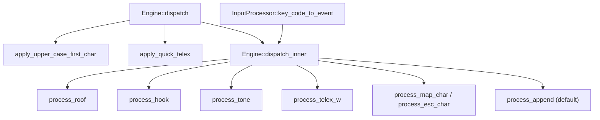

**Diagram sources**
- [mod.rs:209-246](file://port/skey-core/src/engine/mod.rs#L209-L246)
- [shortcuts.rs:182-297](file://port/skey-core/src/engine/shortcuts.rs#L182-L297)
- [transform.rs:70-712](file://port/skey-core/src/engine/transform.rs#L70-L712)
- [append.rs:141-196](file://port/skey-core/src/engine/append.rs#L141-L196)
- [input/mod.rs:162-192](file://port/skey-core/src/input/mod.rs#L162-L192)

**Section sources**
- [mod.rs:209-246](file://port/skey-core/src/engine/mod.rs#L209-L246)
- [input/mod.rs:162-192](file://port/skey-core/src/input/mod.rs#L162-L192)

## Core Components
- Engine: Holds state and orchestrates dispatch. Provides key(), dispatch(), dispatch_inner(), and helper methods.
- InputProcessor: Converts raw key codes into KeyEvent with ev_type, ch_type, vn_sym, and tone.
- Transform processors: process_roof(), process_hook(), process_tone(), process_dd(), process_telex_w(), process_map_char(), process_esc_char().
- Append processor: process_append() and supporting vowel/consonant appending logic.
- Shortcuts: apply_upper_case_first_char() and apply_quick_telex() for pre-processing before dispatch.

**Section sources**
- [mod.rs:18-70](file://port/skey-core/src/engine/mod.rs#L18-L70)
- [input/mod.rs:50-92](file://port/skey-core/src/input/mod.rs#L50-L92)
- [transform.rs:70-712](file://port/skey-core/src/engine/transform.rs#L70-L712)
- [append.rs:141-196](file://port/skey-core/src/engine/append.rs#L141-L196)
- [shortcuts.rs:182-297](file://port/skey-core/src/engine/shortcuts.rs#L182-L297)

## Architecture Overview
The dispatch pipeline processes each keystroke as follows:
1. key() prepares buffers and converts the key code to a KeyEvent via InputProcessor.
2. dispatch() applies first-character capitalization and quick Telex shortcuts.
3. dispatch_inner() matches the event type to a specialized processor or falls back to process_append().
4. Processors update the buffer and mark changes; output is written if needed.

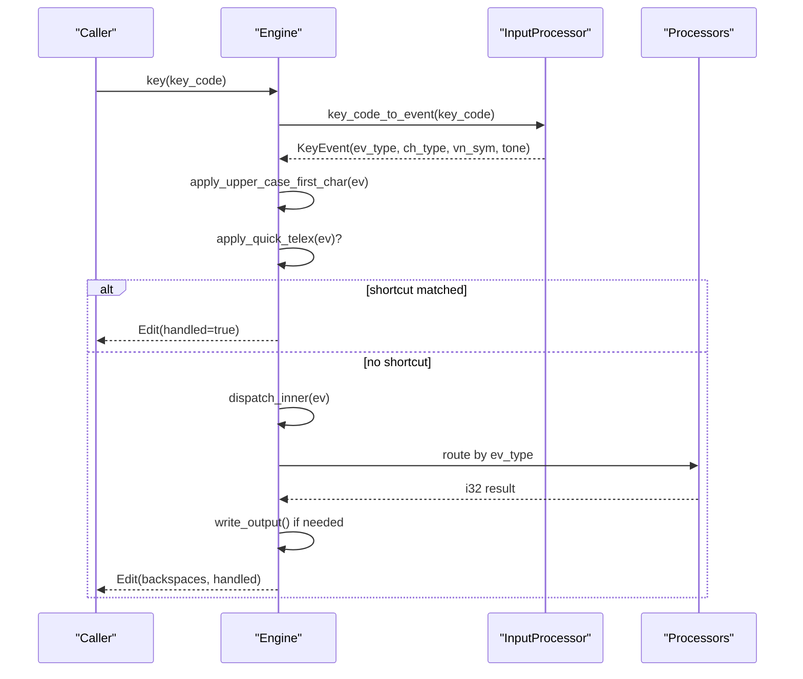

**Diagram sources**
- [mod.rs:248-319](file://port/skey-core/src/engine/mod.rs#L248-L319)
- [input/mod.rs:162-192](file://port/skey-core/src/input/mod.rs#L162-L192)
- [shortcuts.rs:182-297](file://port/skey-core/src/engine/shortcuts.rs#L182-L297)
- [transform.rs:70-712](file://port/skey-core/src/engine/transform.rs#L70-L712)
- [append.rs:98-109](file://port/skey-core/src/engine/append.rs#L98-L109)

## Detailed Component Analysis

### Main dispatch() method
- Applies first-character capitalization when enabled and conditions are met.
- Checks quick Telex shortcuts; if matched, returns immediately without further processing.
- If capitalization was applied, ensures the capital character is emitted even if dispatch_inner() reports no change.
- Delegates to dispatch_inner() for final routing.

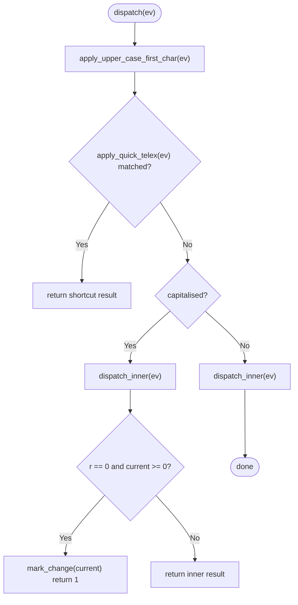

**Diagram sources**
- [mod.rs:209-225](file://port/skey-core/src/engine/mod.rs#L209-L225)
- [shortcuts.rs:182-297](file://port/skey-core/src/engine/shortcuts.rs#L182-L297)

**Section sources**
- [mod.rs:209-225](file://port/skey-core/src/engine/mod.rs#L209-L225)
- [shortcuts.rs:182-297](file://port/skey-core/src/engine/shortcuts.rs#L182-L297)

### dispatch_inner() match statement
Categorizes KeyEvent.ev_type into specific processors:
- ROOF_ALL | ROOF_A | ROOF_E | ROOF_O → process_roof()
- HOOK_ALL | HOOK_UO | HOOK_U | HOOK_O | BOWL → process_hook()
- DD → process_dd()
- TONE0..TONE5 → process_tone()
- TELEX_W → process_telex_w()
- MAP_CHAR → process_map_char()
- ESC_CHAR → process_esc_char()
- Default → process_append()

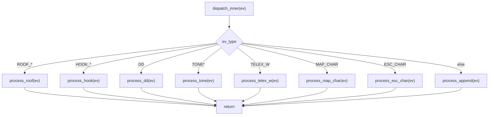

**Diagram sources**
- [mod.rs:227-246](file://port/skey-core/src/engine/mod.rs#L227-L246)

**Section sources**
- [mod.rs:227-246](file://port/skey-core/src/engine/mod.rs#L227-L246)

### KeyEvent determination by InputProcessor
- key_code_to_event() maps raw key codes to KeyEvent using per-method key maps.
- For ASCII keys, ev_type is set from the method’s key map; for non-ASCII, it becomes NORMAL.
- Tone events derive tone from ev_type range.
- Character mapping entries (>= EV_COUNT) are converted to MAP_CHAR with corresponding vn_sym.
- ch_type indicates whether the key is Vietnamese, word break, non-Vietnamese, or reset.

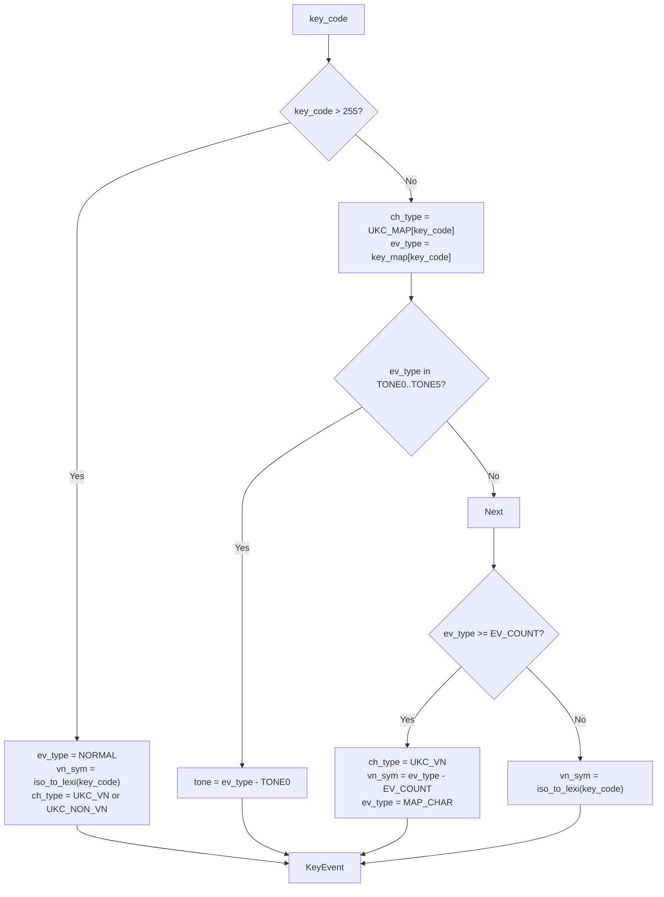

**Diagram sources**
- [input/mod.rs:162-192](file://port/skey-core/src/input/mod.rs#L162-L192)

**Section sources**
- [input/mod.rs:162-192](file://port/skey-core/src/input/mod.rs#L162-L192)

### Processor: process_roof()
Handles diacritical marks (ROOF_ALL, ROOF_A, ROOF_E, ROOF_O):
- Validates context (Vietnamese mode, current position, vowel offset).
- Determines target roof symbol based on ev_type.
- Computes vowel sequence boundaries and tone position.
- Handles special u+o sequences and toggles roof presence.
- Updates symbols and sub-sequence markers; repositions tone if necessary.
- Falls back to process_append() when rules do not allow roof application.

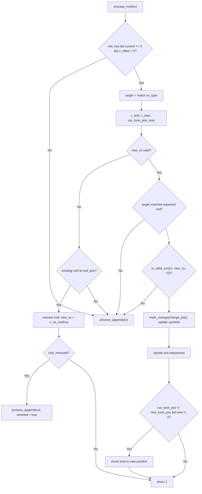

**Diagram sources**
- [transform.rs:70-189](file://port/skey-core/src/engine/transform.rs#L70-L189)

**Section sources**
- [transform.rs:70-189](file://port/skey-core/src/engine/transform.rs#L70-L189)

### Processor: process_hook()
Handles hook marks (HOOK_ALL, HOOK_UO, HOOK_U, HOOK_O, BOWL):
- Special handling for u+o sequences via process_hook_with_uo().
- Determines whether to add or remove hooks based on existing state.
- Validates context and consonant-vowel constraints.
- Updates symbols and sub-sequence markers; repositions tone if necessary.
- Falls back to process_append() when rules do not allow hook application.

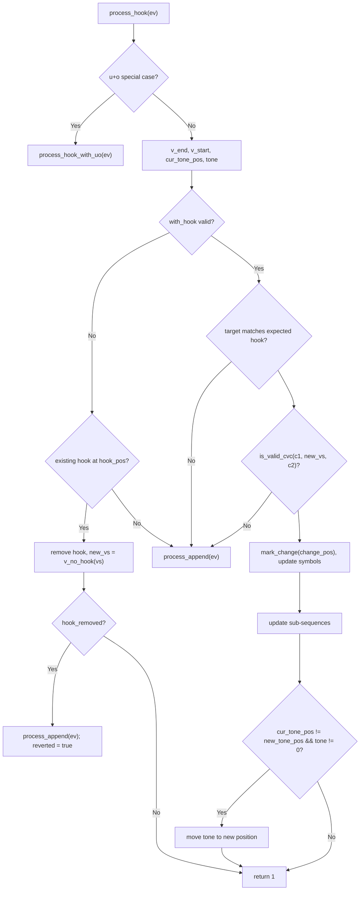

**Diagram sources**
- [transform.rs:192-467](file://port/skey-core/src/engine/transform.rs#L192-L467)

**Section sources**
- [transform.rs:192-467](file://port/skey-core/src/engine/transform.rs#L192-L467)

### Processor: process_tone()
Applies tone marks (TONE0–TONE5):
- Handles special cases for g/gi consonants.
- Validates context (Vietnamese mode, current form, spell-check options).
- Computes tone position within the vowel sequence.
- Toggles tone if same tone is reapplied; otherwise sets tone at computed position.
- Falls back to process_append() when tone cannot be applied.

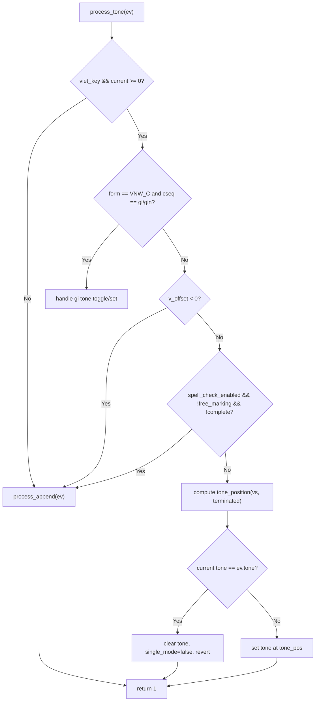

**Diagram sources**
- [transform.rs:469-536](file://port/skey-core/src/engine/transform.rs#L469-L536)

**Section sources**
- [transform.rs:469-536](file://port/skey-core/src/engine/transform.rs#L469-L536)

### Processor: process_telex_w()
Implements Telex 'w' handling:
- If used_as_map_char flag is set, treats 'w' as a mapped character (uh/Uh) and attempts mapping; if mapping fails, falls back to hook.
- Otherwise, tries hook first; if hook fails, treats 'w' as a mapped character and retries mapping.
- Ensures correct case handling and updates used_as_map_char accordingly.

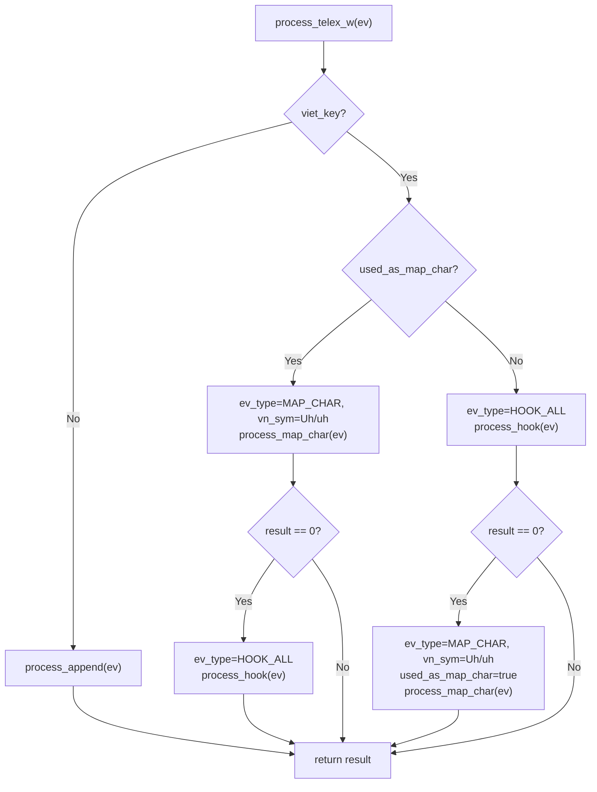

**Diagram sources**
- [transform.rs:675-712](file://port/skey-core/src/engine/transform.rs#L675-L712)

**Section sources**
- [transform.rs:675-712](file://port/skey-core/src/engine/transform.rs#L675-L712)

### Default handler: process_append()
Routes all other events and handles word assembly:
- Resets, word breaks, and non-Vietnamese characters are processed distinctly.
- Vietnamese characters are appended as vowels or consonants with validation.
- Special VIQR escape handling may produce literal output.
- Word boundary logic triggers macro matching and quick consonant shortcuts at word ends.

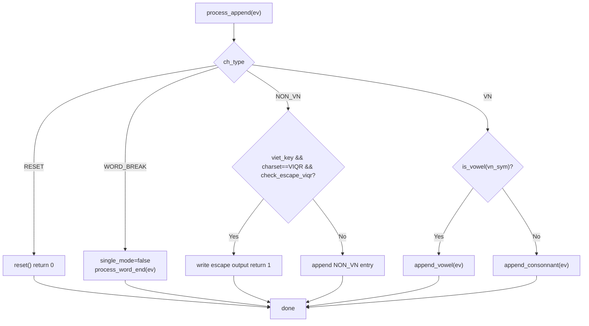

**Diagram sources**
- [append.rs:141-196](file://port/skey-core/src/engine/append.rs#L141-L196)
- [append.rs:577-586](file://port/skey-core/src/engine/append.rs#L577-L586)

**Section sources**
- [append.rs:141-196](file://port/skey-core/src/engine/append.rs#L141-L196)
- [append.rs:577-586](file://port/skey-core/src/engine/append.rs#L577-L586)

### Capitalization and quick Telex shortcuts
- apply_upper_case_first_char(): Arms capitalization after sentence-ending punctuation or control characters; lowers the next Vietnamese letter and forces uppercase key code.
- apply_quick_telex(): Expands doubled consonants (e.g., “cc” → “ch”) and handles “uu” shortcut to “ư + ơ” with horn marks; bypasses normal dispatch when matched.

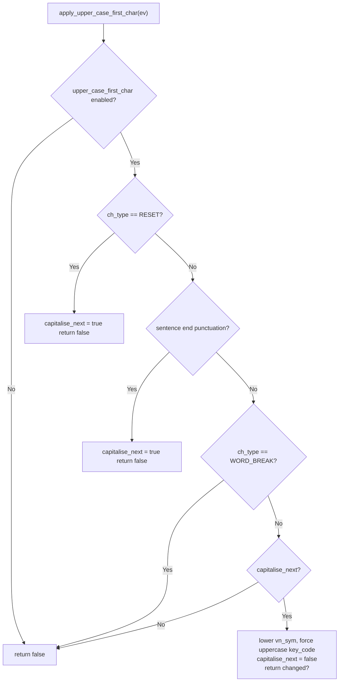

**Diagram sources**
- [shortcuts.rs:182-229](file://port/skey-core/src/engine/shortcuts.rs#L182-L229)

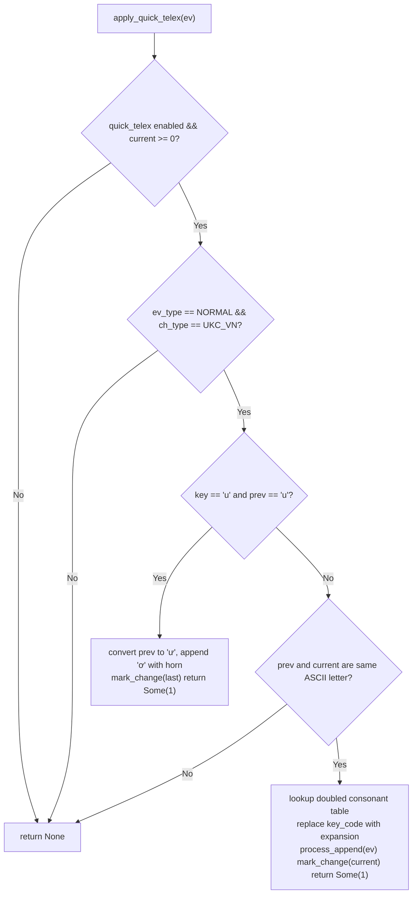

**Diagram sources**
- [shortcuts.rs:232-297](file://port/skey-core/src/engine/shortcuts.rs#L232-L297)

**Section sources**
- [shortcuts.rs:182-297](file://port/skey-core/src/engine/shortcuts.rs#L182-L297)

## Dependency Analysis
- Engine depends on InputProcessor to classify keys and build KeyEvent.
- dispatch_inner() routes to processors that depend on phonetic tables and rules for validity checks.
- process_append() integrates with word assembly and spell-checking logic.
- Shortcuts modify KeyEvent before dispatch or directly manipulate buffer state.

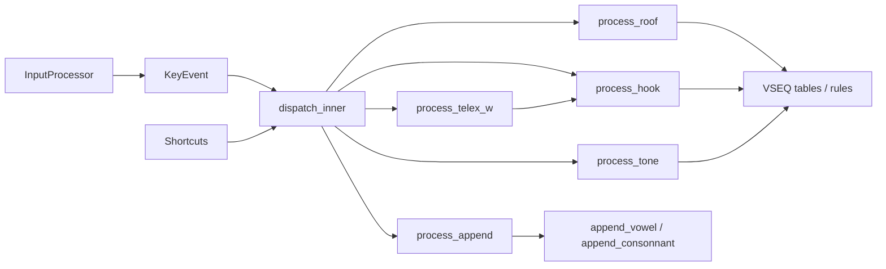

**Diagram sources**
- [mod.rs:227-246](file://port/skey-core/src/engine/mod.rs#L227-L246)
- [transform.rs:70-712](file://port/skey-core/src/engine/transform.rs#L70-L712)
- [append.rs:141-196](file://port/skey-core/src/engine/append.rs#L141-L196)
- [shortcuts.rs:182-297](file://port/skey-core/src/engine/shortcuts.rs#L182-L297)
- [input/mod.rs:162-192](file://port/skey-core/src/input/mod.rs#L162-L192)

**Section sources**
- [mod.rs:227-246](file://port/skey-core/src/engine/mod.rs#L227-L246)
- [transform.rs:70-712](file://port/skey-core/src/engine/transform.rs#L70-L712)
- [append.rs:141-196](file://port/skey-core/src/engine/append.rs#L141-L196)
- [shortcuts.rs:182-297](file://port/skey-core/src/engine/shortcuts.rs#L182-L297)
- [input/mod.rs:162-192](file://port/skey-core/src/input/mod.rs#L162-L192)

## Performance Considerations
- dispatch_inner() uses a direct match on ev_type, avoiding an extra compare path that was measured slower than the jump table generated by LLVM.
- Quick Telex shortcuts short-circuit common patterns early, reducing work in the main dispatch path.
- First-character capitalization is applied once per keystroke and avoids redundant processing when disabled.
- Processors validate context quickly and fall back to process_append() when rules do not apply, minimizing unnecessary computation.

[No sources needed since this section provides general guidance]

## Troubleshooting Guide
- If a keystroke does not produce expected output, verify the InputProcessor mapping for the active input method and ensure ev_type/ch_type are set correctly.
- For roof/hook/tone issues, check that the current buffer state satisfies the required forms and that free_marking/spell-check options allow editing at the intended position.
- When quick Telex is enabled, confirm that the previous character meets the conditions for expansion and that the replacement is valid.
- For Telex 'w', inspect used_as_map_char behavior and whether mapping succeeded or fell back to hook.

**Section sources**
- [input/mod.rs:162-192](file://port/skey-core/src/input/mod.rs#L162-L192)
- [transform.rs:70-712](file://port/skey-core/src/engine/transform.rs#L70-L712)
- [shortcuts.rs:182-297](file://port/skey-core/src/engine/shortcuts.rs#L182-L297)

## Conclusion
The dispatch mechanism efficiently routes keystrokes to specialized processors based on KeyEvent classification. Capitalization and quick Telex shortcuts optimize common typing patterns before delegation. The match-based dispatch_inner() ensures clear separation of concerns and fast routing, while process_append() serves as a robust default for word assembly and edge cases. Together, these components provide a responsive and accurate Vietnamese typing experience.

[No sources needed since this section summarizes without analyzing specific files]