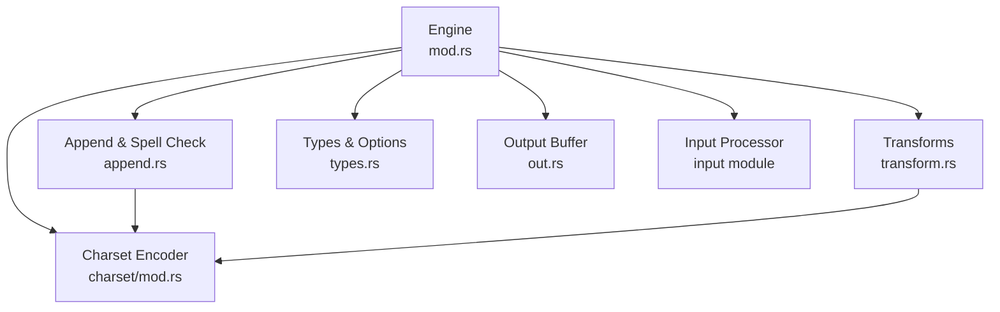
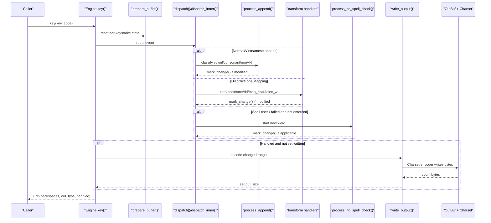
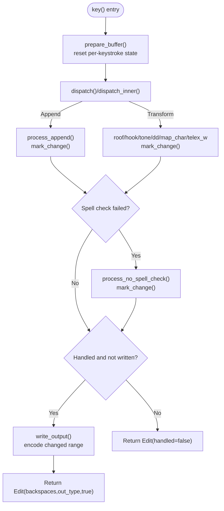
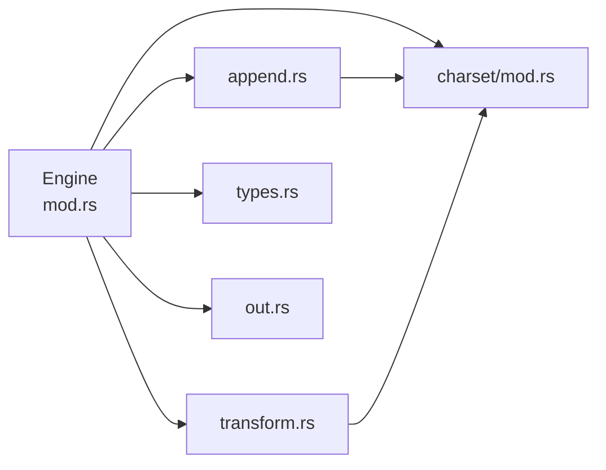

# Keystroke Lifecycle & Processing Pipeline

<cite>
**Referenced Files in This Document**
- [mod.rs](file://port/skey-core/src/engine/mod.rs)
- [types.rs](file://port/skey-core/src/engine/types.rs)
- [append.rs](file://port/skey-core/src/engine/append.rs)
- [transform.rs](file://port/skey-core/src/engine/transform.rs)
- [out.rs](file://port/skey-core/src/out.rs)
- [charset/mod.rs](file://port/skey-core/src/charset/mod.rs)
</cite>

## Table of Contents
1. Introduction
2. Project Structure
3. Core Components
4. Architecture Overview
5. Detailed Component Analysis
6. Dependency Analysis
7. Performance Considerations
8. Troubleshooting Guide
9. Conclusion

## Introduction
This document explains the complete keystroke lifecycle from input capture to output generation in the SKey engine. It focuses on the key() method as the main entry point that orchestrates the entire processing pipeline: prepare_buffer() initialization, dispatch() routing, spell check fallback via process_no_spell_check(), and write_output() finalization. It also documents per-keystroke state variables (out, out_size, backs, change_pos, out_written, reverted, key_restored, key_restoring), how Edit communicates results back to callers, and integration with OutputType and OutBuf for different output formats. Concrete examples trace a Vietnamese character input through composition to final output, showing state transitions and buffer modifications at each step.

## Project Structure
The keystroke processing is implemented in the Rust core under port/skey-core/src/engine with supporting modules for output buffering and charset encoding.

**Diagram sources**
- [mod.rs:18-70](file://port/skey-core/src/engine/mod.rs#L18-L70)
- [append.rs:141-196](file://port/skey-core/src/engine/append.rs#L141-L196)
- [transform.rs:70-189](file://port/skey-core/src/engine/transform.rs#L70-L189)
- [out.rs:61-192](file://port/skey-core/src/out.rs#L61-L192)
- [charset/mod.rs:1-46](file://port/skey-core/src/charset/mod.rs#L1-L46)

**Section sources**
- [mod.rs:18-70](file://port/skey-core/src/engine/mod.rs#L18-L70)
- [types.rs:15-29](file://port/skey-core/src/engine/types.rs#L15-L29)
- [out.rs:61-192](file://port/skey-core/src/out.rs#L61-L192)
- [charset/mod.rs:1-46](file://port/skey-core/src/charset/mod.rs#L1-L46)

## Core Components
- Engine: Central state machine and orchestrator for keystroke processing. Holds persistent buffers and per-keystroke state.
- Append path: Builds words by appending vowels/consonants, handles word breaks, non-Vietnamese characters, and escape sequences.
- Transform path: Applies diacritics (roof, hook), tones, special mappings, and Telex/W behavior.
- Output: OutBuf sink and Charset encoder produce bytes; size tracking via out_size.
- Types: WordInfo forms, OutputType enum, Edit result struct, and Options flags.

Key responsibilities:
- key(): Entry point; prepares per-keystroke state, dispatches, applies fallback, writes output, returns Edit.
- dispatch()/dispatch_inner(): Route events to specific handlers (roof, hook, tone, dd, telex_w, map_char, esc_char, or append).
- process_append(): Classify and append to current word; handle word breaks and non-Vietnamese segments.
- process_no_spell_check(): Fallback when spell check fails but we are not enforcing it; starts a new word.
- write_output(): Encode changed range into OutBuf using Charset encoder; update out_size.

**Section sources**
- [mod.rs:248-319](file://port/skey-core/src/engine/mod.rs#L248-L319)
- [append.rs:141-196](file://port/skey-core/src/engine/append.rs#L141-L196)
- [transform.rs:70-189](file://port/skey-core/src/engine/transform.rs#L70-L189)
- [out.rs:98-109](file://port/skey-core/src/out.rs#L98-L109)
- [types.rs:224-234](file://port/skey-core/src/engine/types.rs#L224-L234)

## Architecture Overview
The keystroke lifecycle flows through a clear sequence: preparation, dispatching, optional fallback, and output finalization.

**Diagram sources**
- [mod.rs:248-319](file://port/skey-core/src/engine/mod.rs#L248-L319)
- [append.rs:141-196](file://port/skey-core/src/engine/append.rs#L141-L196)
- [transform.rs:70-189](file://port/skey-core/src/engine/transform.rs#L70-L189)
- [out.rs:98-109](file://port/skey-core/src/out.rs#L98-L109)

## Detailed Component Analysis

### Engine::key() — Main Orchestrator
Responsibilities:
- Reset per-keystroke state: out, out_size, backs, change_pos, out_written, reverted, key_restored, key_restoring, out_type.
- Convert key code to KeyEvent and optionally annotate char type.
- Dispatch to appropriate handler.
- Apply spell check fallback when needed.
- Record stroke history and conversion status.
- Finalize output if not already written.
- Return Edit with backspaces, output type, and handled flag.

Per-keystroke state variables:
- out: OutBuf used to accumulate encoded bytes for this keystroke.
- out_size: Capacity/result counter mirroring original’s m_pOutSize; updated after write_output().
- backs: Accumulated backspace steps required before emitting new bytes; computed via mark_change().
- change_pos: Left boundary of the changed range within the word buffer; expanded leftward as changes occur.
- out_written: Flag indicating whether write_output() has been invoked for this keystroke.
- reverted: Set when a transform reverts to append (e.g., removing a diacritic); indicates undo-like behavior.
- key_restored/key_restoring: Flags used during restore_key_strokes() to track restoration progress.

Output communication:
- Edit.backspaces: Number of backspaces the front end must send before new bytes.
- Edit.out_type: OutputType::Char for normal text output; OutputType::Key for raw key strokes (e.g., restore).
- Edit.handled: False means the engine did not consume the key; front end should pass through the original key.

**Section sources**
- [mod.rs:54-70](file://port/skey-core/src/engine/mod.rs#L54-L70)
- [mod.rs:248-319](file://port/skey-core/src/engine/mod.rs#L248-L319)
- [types.rs:224-234](file://port/skey-core/src/engine/types.rs#L224-L234)

### Dispatch and Routing
- dispatch(): Applies uppercase-first-letter logic and quick telex shortcuts, then delegates to dispatch_inner().
- dispatch_inner(): Routes based on event type:
  - Roof/Hook/Bowl -> transform handlers
  - Tone -> tone application
  - dd -> double-d handling
  - TELEX_W -> Telex W mapping
  - MAP_CHAR -> character mapping
  - ESC_CHAR -> escape handling
  - Otherwise -> process_append()

**Section sources**
- [mod.rs:209-246](file://port/skey-core/src/engine/mod.rs#L209-L246)
- [transform.rs:70-189](file://port/skey-core/src/engine/transform.rs#L70-L189)
- [transform.rs:327-467](file://port/skey-core/src/engine/transform.rs#L327-L467)
- [transform.rs:469-536](file://port/skey-core/src/engine/transform.rs#L469-L536)
- [transform.rs:538-601](file://port/skey-core/src/engine/transform.rs#L538-L601)
- [transform.rs:603-673](file://port/skey-core/src/engine/transform.rs#L603-L673)
- [transform.rs:675-712](file://port/skey-core/src/engine/transform.rs#L675-L712)

### Append Path and Word Assembly
- process_append(): Classifies input as reset, word break, non-Vietnamese, or Vietnamese character. For Vietnamese, decides between vowel and consonant paths.
- append_vowel(): Extends vowel sequences, manages tone placement, validates CV/CVC combinations, marks changes, and may return early for non-UTF-8 modes.
- append_consonnant(): Extends onset/coda sequences, handles u/o horn transformations, validates CVC, marks changes, and updates tone positions when necessary.
- mark_change(): Expands change_pos leftwards and accumulates backs via get_seq_steps().
- get_seq_steps(): Computes backspace steps either by character count (UTF-8 mode) or by encoding length using a counting sink.

Spell check fallback:
- process_no_spell_check(): When spell check fails and is disabled or single_mode is active, resets the current entry to a minimal valid form (vowel or consonant) and marks change unless it is a plain ASCII letter in normal mode.

Escape handling:
- process_esc_char(): Sets to_escape flag for VIQR escapes and continues with append.
- check_escape_viqr(): Emits literal escape sequences directly into OutBuf and sets out_size accordingly.

**Section sources**
- [append.rs:34-66](file://port/skey-core/src/engine/append.rs#L34-L66)
- [append.rs:98-109](file://port/skey-core/src/engine/append.rs#L98-L109)
- [append.rs:141-196](file://port/skey-core/src/engine/append.rs#L141-L196)
- [append.rs:202-369](file://port/skey-core/src/engine/append.rs#L202-L369)
- [append.rs:371-575](file://port/skey-core/src/engine/append.rs#L371-L575)
- [append.rs:577-617](file://port/skey-core/src/engine/append.rs#L577-L617)
- [append.rs:618-631](file://port/skey-core/src/engine/append.rs#L618-L631)

### Output Finalization and Integration
- write_output(): Resets OutBuf, encodes the changed range (change_pos..=current) using Charset encoder, and sets out_size to the number of bytes written.
- OutBuf: Sink-based buffer with capacity management, fast put2/put3 paths, direct write_at for bypassed paths, and methods to query remaining space and bytes up to a limit.
- Charset: Provides constants for supported encodings and an Encoder that serializes standard characters into target formats.

Integration points:
- OutputType distinguishes between Char (normal text) and Key (raw key strokes).
- Edit.out_type reflects which kind of output was produced.
- Backspace calculation depends on charset semantics (one_step_per_char vs byte counts).

**Section sources**
- [append.rs:98-109](file://port/skey-core/src/engine/append.rs#L98-L109)
- [out.rs:61-192](file://port/skey-core/src/out.rs#L61-L192)
- [charset/mod.rs:1-46](file://port/skey-core/src/charset/mod.rs#L1-L46)
- [types.rs:24-29](file://port/skey-core/src/engine/types.rs#L24-L29)

### Per-Keystroke State Transitions

**Diagram sources**
- [mod.rs:248-319](file://port/skey-core/src/engine/mod.rs#L248-L319)
- [append.rs:141-196](file://port/skey-core/src/engine/append.rs#L141-L196)
- [append.rs:589-617](file://port/skey-core/src/engine/append.rs#L589-L617)
- [out.rs:98-109](file://port/skey-core/src/out.rs#L98-L109)

## Dependency Analysis
- Engine depends on:
  - InputProcessor to convert key codes to KeyEvent and classify character types.
  - Append and Transform modules for word assembly and diacritic/tone handling.
  - Charset and OutBuf for serialization and buffering.
  - Types for WordInfo forms, OutputType, and Edit.

Coupling and cohesion:
- High cohesion within each module (append, transform, out, charset).
- Engine coordinates modules without deep coupling; dependencies are narrow interfaces (Sink, Charset, InputProcessor).

Potential circular dependencies:
- None observed; Engine imports modules, modules import Engine only where necessary.

External integration points:
- Front end consumes Edit and OutBuf bytes; must apply backspaces and render output according to OutputType.

**Diagram sources**
- [mod.rs:18-70](file://port/skey-core/src/engine/mod.rs#L18-L70)
- [append.rs:141-196](file://port/skey-core/src/engine/append.rs#L141-L196)
- [transform.rs:70-189](file://port/skey-core/src/engine/transform.rs#L70-L189)
- [out.rs:61-192](file://port/skey-core/src/out.rs#L61-L192)
- [charset/mod.rs:1-46](file://port/skey-core/src/charset/mod.rs#L1-L46)

**Section sources**
- [mod.rs:18-70](file://port/skey-core/src/engine/mod.rs#L18-L70)
- [append.rs:141-196](file://port/skey-core/src/engine/append.rs#L141-L196)
- [transform.rs:70-189](file://port/skey-core/src/engine/transform.rs#L70-L189)
- [out.rs:61-192](file://port/skey-core/src/out.rs#L61-L192)
- [charset/mod.rs:1-46](file://port/skey-core/src/charset/mod.rs#L1-L46)

## Performance Considerations
- Fast paths:
  - dispatch_inner uses a match table for event types to minimize branching.
  - OutBuf.put2/put3 optimize common multi-byte writes with a single bounds check.
- Backspace computation:
  - get_seq_steps avoids full encoding when one_step_per_char is true; otherwise uses a counting sink to compute byte lengths efficiently.
- Buffer management:
  - prepare_buffer() compacts buffers when nearing capacity to avoid reallocation and maintain performance.
- Charset-specific optimizations:
  - Unicode cstring modes can short-circuit early returns for ASCII alphabetic keys to reduce overhead.

[No sources needed since this section provides general guidance]

## Troubleshooting Guide
Common issues and diagnostics:
- No output produced:
  - Check Edit.handled; false indicates the engine did not consume the key. Ensure your front end passes through the original key in this case.
- Unexpected backspaces:
  - Verify change_pos expansion via mark_change(); ensure transforms and appends call mark_change() appropriately.
- Incorrect output length:
  - Confirm out_size is set by write_output(); for VIQR escapes, check that check_escape_viqr() sets out_size directly.
- Spell check interference:
  - If spell_check_enabled is true and free_marking is off, some tone/diacritic inputs may be deferred until the word is complete. Adjust options or use single_mode for immediate feedback.
- Restore key strokes:
  - Use restore_key_strokes() to emit raw key codes; ensure OutputType::Key is handled by the front end.

**Section sources**
- [mod.rs:300-319](file://port/skey-core/src/engine/mod.rs#L300-L319)
- [append.rs:98-109](file://port/skey-core/src/engine/append.rs#L98-L109)
- [transform.rs:714-766](file://port/skey-core/src/engine/transform.rs#L714-L766)
- [types.rs:224-234](file://port/skey-core/src/engine/types.rs#L224-L234)

## Conclusion
The Engine::key() method provides a robust, modular pipeline for Vietnamese input processing. It initializes per-keystroke state, routes events through specialized handlers, applies spell check fallback when necessary, and finalizes output via a charset-aware encoder. The Edit structure cleanly communicates backspaces, output type, and consumption status to callers. By understanding the per-keystroke state variables and the interaction between append and transform paths, developers can predict and control the behavior of complex Vietnamese compositions and ensure correct output across various encodings.

[No sources needed since this section summarizes without analyzing specific files]

## Appendices

### Concrete Example: Vietnamese Character Composition Flow
Scenario: Typing “a” followed by a tone mark to produce a properly accented character.

Steps:
1. key('a'):
   - prepare_buffer() resets per-keystroke state.
   - dispatch() classifies 'a' as a Vietnamese vowel.
   - append_vowel() creates a VNW_V entry, sets vseq, and marks change.
   - Since no output has been written, write_output() encodes the changed range into OutBuf using the configured Charset.
   - Returns Edit with backspaces computed from change_pos, out_type=Char, handled=true.

2. Next keystroke: tone mark (e.g., acute):
   - dispatch() routes to process_tone().
   - get_tone_position() determines the correct position within the vowel sequence.
   - mark_change() updates backs and expands change_pos to include the tone position.
   - write_output() encodes the updated range, including the tone.
   - Returns Edit with updated backspaces and output bytes.

State transitions:
- change_pos moves left to include newly modified entries.
- backs accumulates the number of backsteps needed to replace previous content.
- out_size reflects the total bytes written for this keystroke.
- out_written prevents redundant encoding within the same keystroke.

Output integration:
- OutputType::Char indicates normal text output.
- Front end applies backspaces and renders bytes from Engine::output().

**Section sources**
- [append.rs:202-369](file://port/skey-core/src/engine/append.rs#L202-L369)
- [transform.rs:469-536](file://port/skey-core/src/engine/transform.rs#L469-L536)
- [append.rs:98-109](file://port/skey-core/src/engine/append.rs#L98-L109)
- [mod.rs:248-319](file://port/skey-core/src/engine/mod.rs#L248-L319)
- [out.rs:98-109](file://port/skey-core/src/out.rs#L98-L109)