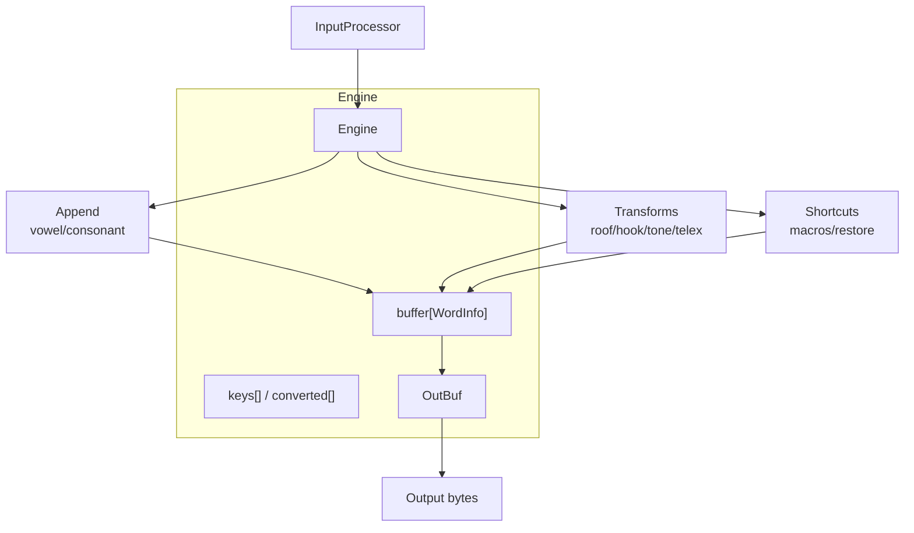
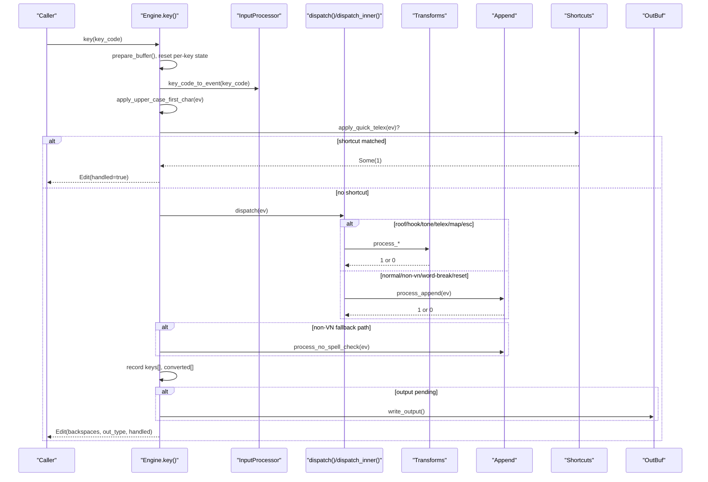
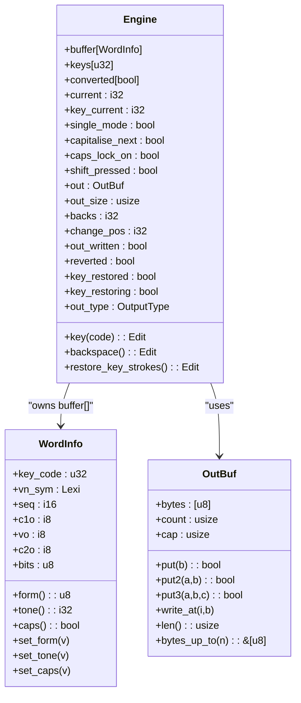
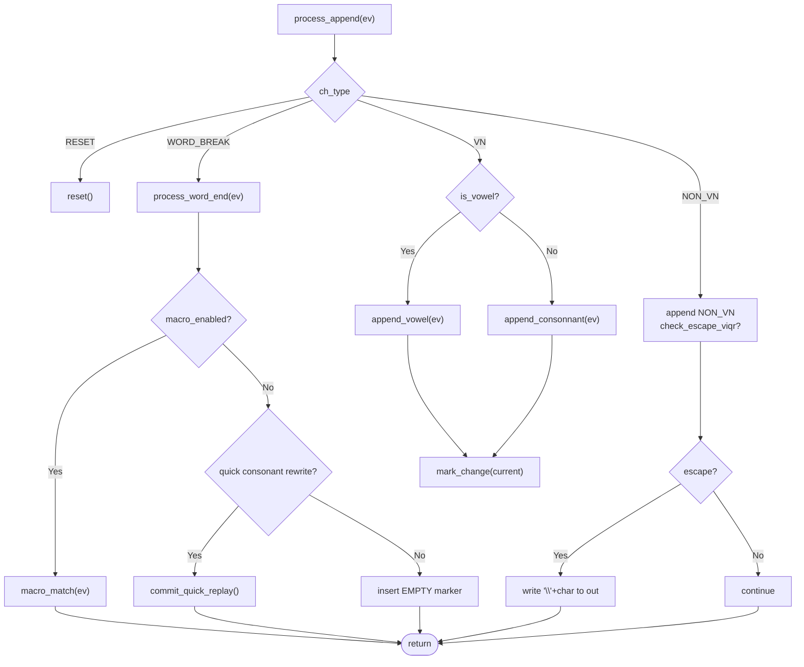
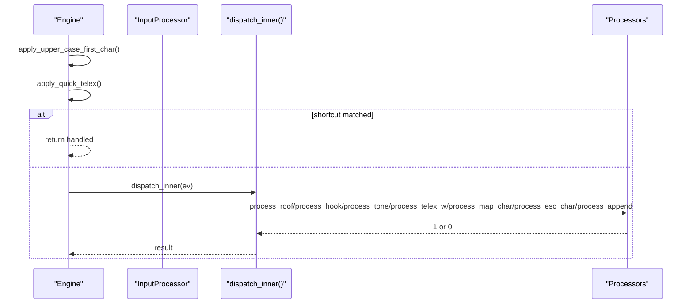
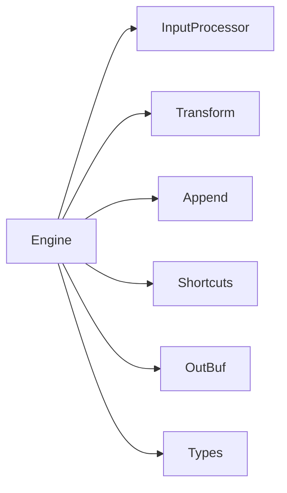

# State Machine & Dispatch Logic

<cite>
**Referenced Files in This Document**
- [engine/mod.rs](file://port/skey-core/src/engine/mod.rs)
- [engine/append.rs](file://port/skey-core/src/engine/append.rs)
- [engine/transform.rs](file://port/skey-core/src/engine/transform.rs)
- [engine/shortcuts.rs](file://port/skey-core/src/engine/shortcuts.rs)
- [engine/types.rs](file://port/skey-core/src/engine/types.rs)
- [input/mod.rs](file://port/skey-core/src/input/mod.rs)
- [out.rs](file://port/skey-core/src/out.rs)
</cite>

## Table of Contents
1. [Introduction](#introduction)
2. [Project Structure](#project-structure)
3. [Core Components](#core-components)
4. [Architecture Overview](#architecture-overview)
5. [Detailed Component Analysis](#detailed-component-analysis)
6. [Dependency Analysis](#dependency-analysis)
7. [Performance Considerations](#performance-considerations)
8. [Troubleshooting Guide](#troubleshooting-guide)
9. [Conclusion](#conclusion)

## Introduction
This document explains the Engine struct’s state machine and dispatch logic for Vietnamese typing. It covers how keystrokes are classified, routed to specialized handlers (roof, hook, tones, telex), appended into a fixed-size buffer, and finally emitted as output. It also details how the engine maintains state across keystrokes and how performance-critical paths are optimized with fixed-size buffers and fast-path shortcuts.

## Project Structure
The Engine lives in the core Rust port under skey-core. The key modules are:
- engine/mod.rs: Engine struct definition, lifecycle methods (key, backspace, restore_key_strokes), and the main dispatch() and dispatch_inner() routing.
- engine/append.rs: Word assembly via append_vowel(), append_consonnant(), process_append(), and buffer maintenance like prepare_buffer().
- engine/transform.rs: Diacritic handling (roof, hook), d-stroke, tone application, and telex-w special casing.
- engine/shortcuts.rs: Quick shortcuts, macro expansion, word-end processing, and key stroke restoration.
- engine/types.rs: Core types including Options, OutputType, Edit, and the compact WordInfo layout.
- input/mod.rs: KeyEvent classification and InputProcessor mapping from key codes to events.
- out.rs: Fixed-capacity output buffer and encoding sink used by write_output().



**Diagram sources**
- [engine/mod.rs:18-70](file://port/skey-core/src/engine/mod.rs#L18-L70)
- [engine/append.rs:141-196](file://port/skey-core/src/engine/append.rs#L141-L196)
- [engine/transform.rs:70-766](file://port/skey-core/src/engine/transform.rs#L70-L766)
- [engine/shortcuts.rs:182-590](file://port/skey-core/src/engine/shortcuts.rs#L182-L590)
- [input/mod.rs:50-192](file://port/skey-core/src/input/mod.rs#L50-L192)
- [out.rs:60-192](file://port/skey-core/src/out.rs#L60-L192)

**Section sources**
- [engine/mod.rs:18-70](file://port/skey-core/src/engine/mod.rs#L18-L70)
- [engine/types.rs:107-222](file://port/skey-core/src/engine/types.rs#L107-L222)
- [input/mod.rs:50-192](file://port/skey-core/src/input/mod.rs#L50-L192)
- [out.rs:60-192](file://port/skey-core/src/out.rs#L60-L192)

## Core Components
- Engine struct: Holds persistent state (buffer, keys, flags) and per-keystroke state (output buffer, change tracking).
- WordInfo: Compact representation of each buffer entry storing symbol, sequence info, offsets, tone, and caps.
- InputProcessor: Maps raw key codes to KeyEvent with ev_type, ch_type, and optional tone.
- OutBuf: Fixed-capacity byte sink that tracks written length and supports direct writes for edge cases.
- Options: Feature toggles controlling behavior such as quick shortcuts, macros, auto capitalization, and spell-check integration.

Key fields for state persistence across keystrokes:
- current: index of the last buffer entry for the active word.
- key_current: index of the last recorded raw key code for the active word.
- single_mode: disables spell checking for the current word when set.
- capitalise_next: arms automatic capitalization after sentence-ending punctuation.
- caps_lock_on, shift_pressed: influence case mapping during mapping and shortcuts.

Per-keystroke fields reset at the start of each key():
- out, out_size, backs, change_pos, out_written, reverted, key_restored, key_restoring, out_type.

**Section sources**
- [engine/mod.rs:18-70](file://port/skey-core/src/engine/mod.rs#L18-L70)
- [engine/types.rs:107-222](file://port/skey-core/src/engine/types.rs#L107-L222)
- [engine/shortcuts.rs:182-229](file://port/skey-core/src/engine/shortcuts.rs#L182-L229)

## Architecture Overview
The Engine processes one key at a time through a well-defined pipeline:
1. Prepare per-key state and convert key code to KeyEvent.
2. Apply first-letter capitalization if armed.
3. Try quick shortcuts (e.g., doubled consonants).
4. Dispatch to specialized handler based on event type.
5. If not handled, fall back to appending character data.
6. Optionally handle non-Vietnamese fallback or escape sequences.
7. Record the raw key and whether it was converted.
8. Write output if needed and return an Edit describing backspaces and output.



**Diagram sources**
- [engine/mod.rs:209-319](file://port/skey-core/src/engine/mod.rs#L209-L319)
- [engine/transform.rs:70-766](file://port/skey-core/src/engine/transform.rs#L70-L766)
- [engine/append.rs:141-196](file://port/skey-core/src/engine/append.rs#L141-L196)
- [engine/shortcuts.rs:182-297](file://port/skey-core/src/engine/shortcuts.rs#L182-L297)
- [input/mod.rs:162-192](file://port/skey-core/src/input/mod.rs#L162-L192)
- [out.rs:98-109](file://port/skey-core/src/out.rs#L98-L109)

## Detailed Component Analysis

### Engine Lifecycle and Dispatch
- key(): Resets per-keystroke state, prepares buffer, converts key to event, runs dispatch, handles non-VN fallback, records raw keys, and emits output.
- dispatch(): Applies first-letter capitalization, tries quick shortcuts, then delegates to dispatch_inner().
- dispatch_inner(): Fast match on ev_type to route to specific processors:
  - ROOF_* -> process_roof()
  - HOOK_* / BOWL -> process_hook()
  - DD -> process_dd()
  - TONE* -> process_tone()
  - TELEX_W -> process_telex_w()
  - MAP_CHAR -> process_map_char()
  - ESC_CHAR -> process_esc_char()
  - otherwise -> process_append()

```mermaid
flowchart TD
Start([key()]) --> Prep["prepare_buffer()<br/>reset per-key state"]
Prep --> Ev["key_code_to_event()"]
Ev --> Cap{"capitalise_next?"}
Cap --> |Yes| Upper["apply_upper_case_first_char()"]
Cap --> |No| QCheck["apply_quick_telex()"]
Upper --> QCheck
QCheck --> |Some| ReturnHandled["return handled"]
QCheck --> |None| Route["dispatch_inner()"]
Route --> |roof/hook/tone/telex/map/esc| Handler["process_*()"]
Route --> |normal| Append["process_append()"]
Handler --> Record["record keys[], converted[]"]
Append --> Fallback{"non-VN fallback?"}
Fallback --> |Yes| NoSpell["process_no_spell_check()"]
Fallback --> |No| Emit{"out_written?"}
NoSpell --> Emit
Emit --> |No| Write["write_output()"]
Emit --> |Yes| Done([Edit])
Write --> Done
```

**Diagram sources**
- [engine/mod.rs:209-319](file://port/skey-core/src/engine/mod.rs#L209-L319)
- [engine/shortcuts.rs:182-297](file://port/skey-core/src/engine/shortcuts.rs#L182-L297)
- [engine/append.rs:141-196](file://port/skey-core/src/engine/append.rs#L141-L196)
- [engine/transform.rs:70-766](file://port/skey-core/src/engine/transform.rs#L70-L766)

**Section sources**
- [engine/mod.rs:209-319](file://port/skey-core/src/engine/mod.rs#L209-L319)

### Buffer Management with WordInfo Arrays
- Fixed-size arrays:
  - buffer: [WordInfo; MAX_UK_ENGINE] stores the current word’s segments.
  - keys: [u32; MAX_UK_ENGINE] stores raw key codes for the current word.
  - converted: [bool; MAX_UK_ENGINE] marks which entries were transformed.
- WordInfo is compactly packed to reduce memory footprint while preserving original semantics.
- prepare_buffer(): Ensures room by compacting the buffer when nearing capacity, dropping older entries at word boundaries. Also compacts keys[] and converted[].
- mark_change(): Tracks the range [change_pos..current] to minimize output work.
- get_seq_steps(): Computes backspace steps accounting for charset-specific encoding sizes.



**Diagram sources**
- [engine/mod.rs:18-70](file://port/skey-core/src/engine/mod.rs#L18-L70)
- [engine/types.rs:107-222](file://port/skey-core/src/engine/types.rs#L107-L222)
- [out.rs:60-192](file://port/skey-core/src/out.rs#L60-L192)

**Section sources**
- [engine/append.rs:111-139](file://port/skey-core/src/engine/append.rs#L111-L139)
- [engine/append.rs:34-66](file://port/skey-core/src/engine/append.rs#L34-L66)
- [engine/types.rs:107-222](file://port/skey-core/src/engine/types.rs#L107-L222)

### Keystroke Lifecycle: prepare_buffer(), process_append(), write_output()
- prepare_buffer(): Compacts buffer and key history when near capacity, ensuring at least ten free slots and maintaining word boundaries.
- process_append(): Handles character insertion:
  - RESET: resets engine state.
  - WORD_BREAK: finalizes word, triggers macros and quick consonant rewrites, inserts EMPTY marker.
  - NON_VN: appends non-Vietnamese symbols; may trigger VIQR escape handling.
  - VN: routes to vowel or consonant appenders.
- write_output(): Encodes the changed range [change_pos..current] using the configured charset and sets out_size.



**Diagram sources**
- [engine/append.rs:141-196](file://port/skey-core/src/engine/append.rs#L141-L196)
- [engine/append.rs:201-369](file://port/skey-core/src/engine/append.rs#L201-L369)
- [engine/append.rs:371-575](file://port/skey-core/src/engine/append.rs#L371-L575)
- [engine/append.rs:577-617](file://port/skey-core/src/engine/append.rs#L577-L617)
- [engine/shortcuts.rs:518-590](file://port/skey-core/src/engine/shortcuts.rs#L518-L590)
- [engine/transform.rs:714-766](file://port/skey-core/src/engine/transform.rs#L714-L766)

**Section sources**
- [engine/append.rs:111-139](file://port/skey-core/src/engine/append.rs#L111-L139)
- [engine/append.rs:141-196](file://port/skey-core/src/engine/append.rs#L141-L196)
- [engine/append.rs:201-369](file://port/skey-core/src/engine/append.rs#L201-L369)
- [engine/append.rs:371-575](file://port/skey-core/src/engine/append.rs#L371-L575)
- [engine/append.rs:577-617](file://port/skey-core/src/engine/append.rs#L577-L617)
- [engine/transform.rs:714-766](file://port/skey-core/src/engine/transform.rs#L714-L766)

### State Transitions and Key Tracking
- current and key_current track the active word’s buffer and raw key positions.
- single_mode: When true, spell checking is bypassed for the current word (e.g., after certain transformations or abbreviations).
- capitalise_next: Armed after sentence-ending punctuation or control characters; forces the next VN letter to uppercase and clears itself.
- caps_lock_on and shift_pressed: Influence case mapping during map_char and shortcuts.
- reverted: Indicates a transformation was undone (e.g., removing a diacritic), allowing subsequent processing to continue normally.

Examples of transitions:
- Roof toggle: If a roof exists at the target position, remove it; otherwise add it. May revert to plain character if invalid.
- Hook toggle: Similar to roof but for hooks (uh, oh, ab). Special handling for u+o combinations.
- Tone application: Places tone at computed position; toggling removes tone if same tone is pressed again.
- Telex w: Attempts hook first; if fails, maps to uh and retries; may revert if mapping does not fit.

**Section sources**
- [engine/mod.rs:169-178](file://port/skey-core/src/engine/mod.rs#L169-L178)
- [engine/shortcuts.rs:182-229](file://port/skey-core/src/engine/shortcuts.rs#L182-L229)
- [engine/transform.rs:70-189](file://port/skey-core/src/engine/transform.rs#L70-L189)
- [engine/transform.rs:327-467](file://port/skey-core/src/engine/transform.rs#L327-L467)
- [engine/transform.rs:469-536](file://port/skey-core/src/engine/transform.rs#L469-L536)
- [engine/transform.rs:675-712](file://port/skey-core/src/engine/transform.rs#L675-L712)

### Main Dispatch Mechanism: dispatch() and dispatch_inner()
- dispatch():
  - Applies upper-case first char if enabled and armed.
  - Tries quick shortcuts (e.g., doubled consonants).
  - Delegates to dispatch_inner() for routing.
- dispatch_inner():
  - Match on ev_type to call specific processors:
    - ROOF_* -> process_roof()
    - HOOK_* / BOWL -> process_hook()
    - DD -> process_dd()
    - TONE* -> process_tone()
    - TELEX_W -> process_telex_w()
    - MAP_CHAR -> process_map_char()
    - ESC_CHAR -> process_esc_char()
    - Otherwise -> process_append()



**Diagram sources**
- [engine/mod.rs:209-246](file://port/skey-core/src/engine/mod.rs#L209-L246)
- [engine/shortcuts.rs:182-297](file://port/skey-core/src/engine/shortcuts.rs#L182-L297)
- [engine/transform.rs:70-766](file://port/skey-core/src/engine/transform.rs#L70-L766)

**Section sources**
- [engine/mod.rs:209-246](file://port/skey-core/src/engine/mod.rs#L209-L246)

### Output Generation: write_output()
- Encodes the changed range [change_pos..current] using the configured Charset encoder.
- Uses std_char_for_output() to map WordInfo to standard character codes, respecting caps and tone.
- Sets out_size to the number of encoded bytes, which the caller reads via output_len() and output().

**Section sources**
- [engine/append.rs:98-109](file://port/skey-core/src/engine/append.rs#L98-L109)
- [engine/append.rs:68-96](file://port/skey-core/src/engine/append.rs#L68-L96)
- [out.rs:98-109](file://port/skey-core/src/out.rs#L98-L109)

## Dependency Analysis
- Engine depends on:
  - InputProcessor for key classification and event creation.
  - Transform processors for diacritics and special keys.
  - Append logic for building words and managing buffer state.
  - Shortcuts for macros and quick rewrites.
  - OutBuf for encoding and emitting output.
- Types and constants:
  - Options controls feature toggles.
  - WordInfo compactly stores segment metadata.
  - KeyEvent carries event type, character type, symbol, and tone.



**Diagram sources**
- [engine/mod.rs:18-70](file://port/skey-core/src/engine/mod.rs#L18-L70)
- [engine/append.rs:141-196](file://port/skey-core/src/engine/append.rs#L141-L196)
- [engine/transform.rs:70-766](file://port/skey-core/src/engine/transform.rs#L70-L766)
- [engine/shortcuts.rs:182-590](file://port/skey-core/src/engine/shortcuts.rs#L182-L590)
- [engine/types.rs:107-222](file://port/skey-core/src/engine/types.rs#L107-L222)
- [input/mod.rs:50-192](file://port/skey-core/src/input/mod.rs#L50-L192)
- [out.rs:60-192](file://port/skey-core/src/out.rs#L60-L192)

**Section sources**
- [engine/mod.rs:18-70](file://port/skey-core/src/engine/mod.rs#L18-L70)
- [input/mod.rs:50-192](file://port/skey-core/src/input/mod.rs#L50-L192)

## Performance Considerations
- Fixed-size buffers:
  - buffer: [WordInfo; MAX_UK_ENGINE] avoids dynamic allocation and keeps hot paths fast.
  - keys[] and converted[]: Parallel arrays for raw key history and conversion status.
  - OutBuf: Fixed capacity OUT_CAPACITY minimizes allocations and enables fast append paths.
- Fast-path optimizations:
  - dispatch_inner() uses a direct match on ev_type to avoid extra comparisons.
  - Quick shortcuts (doubled consonants, onset/coda shortcuts) short-circuit common patterns.
  - mark_change() reduces output work by tracking only changed ranges.
  - get_seq_steps() computes backspace counts without full encoding passes where possible.
- Compact WordInfo layout:
  - Packs form, tone, and caps into bits to reduce memory usage and improve cache locality.
- Escape and restore paths:
  - Direct writes to OutBuf for VIQR escapes and key stroke restoration avoid overhead and preserve original behavior.

[No sources needed since this section provides general guidance]

## Troubleshooting Guide
Common issues and their locations:
- Unexpected capitalization: Check apply_upper_case_first_char() and capitalise_next flag behavior.
- Diacritic not applied: Verify process_roof() and process_hook() conditions, especially free_marking and valid CVC constraints.
- Tone placement incorrect: Inspect get_tone_position() and tone application in process_tone().
- Non-Vietnamese text inserted: Review process_append() NON_VN path and check_escape_viqr() for VIQR escapes.
- Backspace count mismatch: Ensure mark_change() and get_seq_steps() reflect charset-specific step sizes.

**Section sources**
- [engine/shortcuts.rs:182-229](file://port/skey-core/src/engine/shortcuts.rs#L182-L229)
- [engine/transform.rs:70-189](file://port/skey-core/src/engine/transform.rs#L70-L189)
- [engine/transform.rs:327-467](file://port/skey-core/src/engine/transform.rs#L327-L467)
- [engine/transform.rs:469-536](file://port/skey-core/src/engine/transform.rs#L469-L536)
- [engine/append.rs:141-196](file://port/skey-core/src/engine/append.rs#L141-L196)
- [engine/append.rs:34-66](file://port/skey-core/src/engine/append.rs#L34-L66)

## Conclusion
The Engine implements a robust, high-performance state machine for Vietnamese typing. Its design centers around fixed-size buffers, precise state tracking, and efficient dispatch to specialized handlers. By carefully managing WordInfo arrays, key histories, and output buffers, it delivers responsive typing with minimal overhead. The modular structure separates concerns cleanly: input classification, transformation, appending, shortcuts, and output encoding, enabling maintainable extensions and reliable behavior across diverse input methods and options.

[No sources needed since this section summarizes without analyzing specific files]