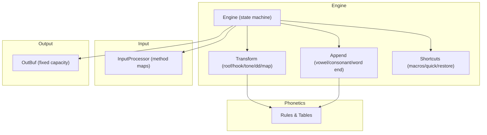
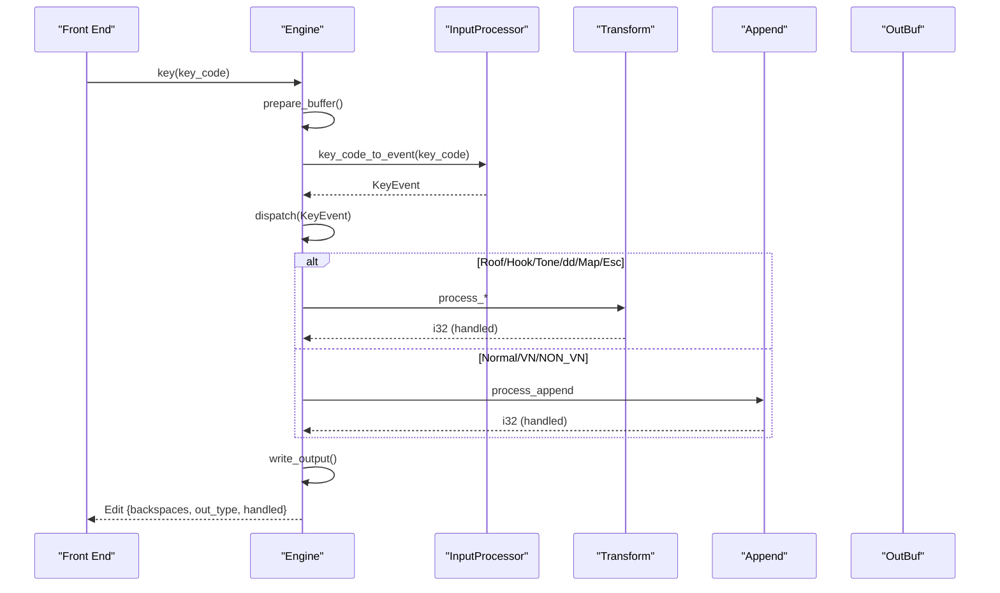
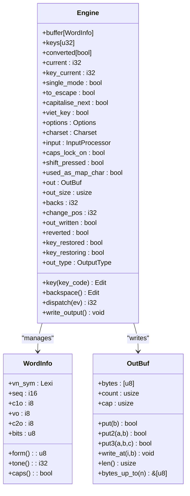
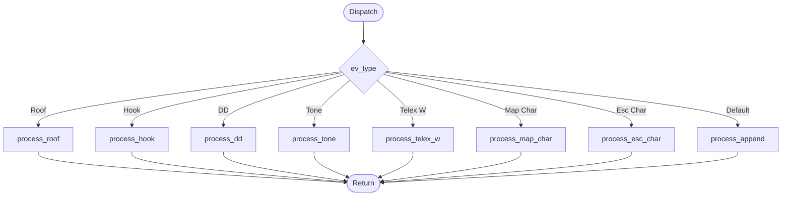
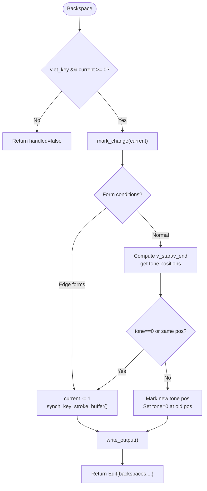
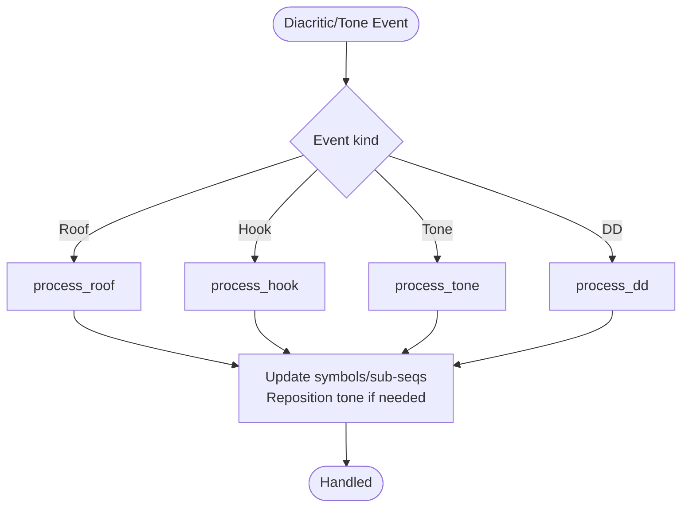
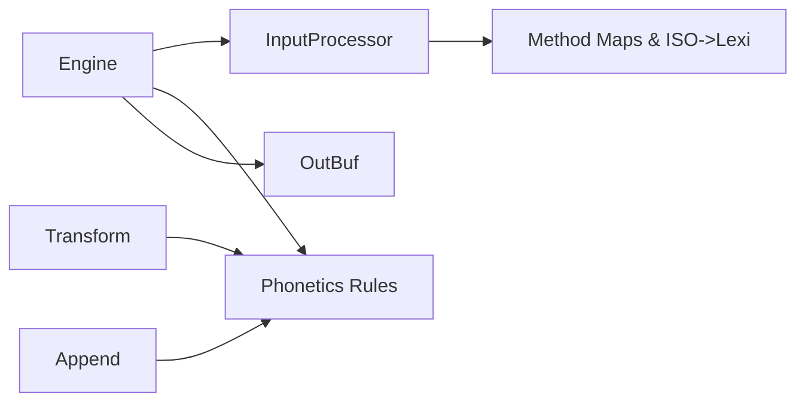

# Typing Engine Core

<cite>
**Referenced Files in This Document**
- [mod.rs](file://port/skey-core/src/engine/mod.rs)
- [types.rs](file://port/skey-core/src/engine/types.rs)
- [append.rs](file://port/skey-core/src/engine/append.rs)
- [transform.rs](file://port/skey-core/src/engine/transform.rs)
- [shortcuts.rs](file://port/skey-core/src/engine/shortcuts.rs)
- [input/mod.rs](file://port/skey-core/src/input/mod.rs)
- [out.rs](file://port/skey-core/src/out.rs)
- [lib.rs](file://port/skey-core/src/lib.rs)
- [rules.rs](file://port/skey-core/src/phonetics/rules.rs)
- [lexi.rs](file://port/skey-core/src/phonetics/lexi.rs)
</cite>

## Table of Contents
1. [Introduction](#introduction)
2. [Project Structure](#project-structure)
3. [Core Components](#core-components)
4. [Architecture Overview](#architecture-overview)
5. [Detailed Component Analysis](#detailed-component-analysis)
6. [Dependency Analysis](#dependency-analysis)
7. [Performance Considerations](#performance-considerations)
8. [Troubleshooting Guide](#troubleshooting-guide)
9. [Conclusion](#conclusion)

## Introduction
This document explains the core typing engine state machine that composes Vietnamese characters from key strokes. It focuses on the Engine struct, its buffer management, keystroke lifecycle, dispatch mechanism, and how Telex, VNI, and VIQR input methods flow through the same state machine. It also documents performance optimizations such as fixed-size buffers, zero-allocation hot paths, and fast-path shortcuts for common patterns.

## Project Structure
The engine lives under port/skey-core and is organized into focused modules:
- engine: state machine, dispatch, append/transform logic, shortcuts
- input: key classification and per-method mapping tables
- phonetics: lexical types, rules, and tables for Vietnamese orthography
- out: output sink with fixed capacity and fast paths
- lib: public re-exports and feature flags

**Diagram sources**
- [mod.rs:18-70](file://port/skey-core/src/engine/mod.rs#L18-L70)
- [input/mod.rs:72-192](file://port/skey-core/src/input/mod.rs#L72-L192)
- [rules.rs:107-200](file://port/skey-core/src/phonetics/rules.rs#L107-L200)
- [out.rs:60-192](file://port/skey-core/src/out.rs#L60-L192)

**Section sources**
- [lib.rs:1-47](file://port/skey-core/src/lib.rs#L1-L47)

## Core Components
- Engine: central state machine holding the word buffer, key stroke history, configuration, and per-stroke output state.
- InputProcessor: converts raw key codes to KeyEvent using method-specific maps (Telex, VNI, VIQR, etc.).
- Append: builds words by appending vowels/consonants, handles word boundaries, spell-check integration, and backspace behavior.
- Transform: applies diacritics (roof, hook), tones, d-stroke, and character mapping; computes tone placement.
- Shortcuts: macros, quick substitutions, capitalization at sentence start, and restoring original key strokes.
- OutBuf: fixed-capacity byte sink with fast multi-byte writes and direct indexing for special cases.

Key data structures:
- WordInfo: compact per-character metadata (form, offsets, sequence indices, tone, caps).
- Edit: result of a keystroke (backspaces, output type, handled flag).
- Options: toggles for modern style, quick shortcuts, macro support, auto restore, upper-case first char, and more.

**Section sources**
- [types.rs:5-127](file://port/skey-core/src/engine/types.rs#L5-L127)
- [types.rs:224-235](file://port/skey-core/src/engine/types.rs#L224-L235)
- [mod.rs:18-70](file://port/skey-core/src/engine/mod.rs#L18-L70)

## Architecture Overview
The keystroke lifecycle:
1. Front end calls Engine::key(key_code).
2. prepare_buffer ensures space and resets per-stroke state.
3. InputProcessor.key_code_to_event produces a KeyEvent based on the active input method.
4. Engine.dispatch routes the event to specialized handlers: roof, hook, dd, tone, telex-w, map-char, esc-char, or append.
5. Handlers update the word buffer and mark changed positions.
6. write_output encodes changed range into OutBuf according to charset.
7. Engine returns an Edit describing backspaces and whether the key was handled.

**Diagram sources**
- [mod.rs:209-246](file://port/skey-core/src/engine/mod.rs#L209-L246)
- [mod.rs:249-319](file://port/skey-core/src/engine/mod.rs#L249-L319)
- [append.rs:141-196](file://port/skey-core/src/engine/append.rs#L141-L196)
- [transform.rs:70-189](file://port/skey-core/src/engine/transform.rs#L70-L189)
- [out.rs:98-109](file://port/skey-core/src/out.rs#L98-L109)

## Detailed Component Analysis

### Engine struct and buffer management
- Fixed-size buffers:
  - buffer: array of WordInfo sized MAX_UK_ENGINE (128 entries).
  - keys: stores raw key codes for the current word to enable restoration.
  - converted: tracks which keys produced conversions for restoration decisions.
- Per-stroke state:
  - out: OutBuf with OUT_CAPACITY (1024 bytes).
  - out_size: reported size to caller; can exceed stored bytes when buffer fills.
  - backs, change_pos: track how many backspaces are needed and where changes started.
  - out_written, reverted, key_restored, key_restoring: control output emission and restoration flows.
- Long-lived state:
  - viet_key, options, charset, input processor, macro_store (feature-gated), caps_lock_on, shift_pressed, used_as_map_char.
- Buffer compaction:
  - prepare_buffer drops old entries when near capacity while preserving word boundaries.

**Diagram sources**
- [mod.rs:18-70](file://port/skey-core/src/engine/mod.rs#L18-L70)
- [types.rs:114-127](file://port/skey-core/src/engine/types.rs#L114-L127)
- [out.rs:60-192](file://port/skey-core/src/out.rs#L60-L192)

**Section sources**
- [mod.rs:18-111](file://port/skey-core/src/engine/mod.rs#L18-L111)
- [append.rs:111-139](file://port/skey-core/src/engine/append.rs#L111-L139)

### Main dispatch mechanism
- dispatch_inner uses a match on ev.ev_type to route to specific handlers:
  - ROOF_ALL/ROOF_A/ROOF_E/ROOF_O -> process_roof
  - HOOK_ALL/HOOK_UO/HOOK_U/HOOK_O/BOWL -> process_hook
  - DD -> process_dd
  - TONE0..TONE5 -> process_tone
  - TELEX_W -> process_telex_w
  - MAP_CHAR -> process_map_char
  - ESC_CHAR -> process_esc_char
  - default -> process_append
- Capitalization at sentence start is applied before dispatch if enabled.

**Diagram sources**
- [mod.rs:227-246](file://port/skey-core/src/engine/mod.rs#L227-L246)

**Section sources**
- [mod.rs:209-246](file://port/skey-core/src/engine/mod.rs#L209-L246)

### Keystroke lifecycle and backspace handling
- key():
  - Resets per-stroke state and prepares buffer.
  - Converts key code to KeyEvent via InputProcessor.
  - Dispatches to appropriate handler.
  - If not handled, clears output and returns Edit{handled=false}.
  - Otherwise emits output and returns Edit{backspaces, out_type, handled=true}.
- backspace():
  - Handles complex cases like moving tones when deleting parts of a vowel sequence.
  - Uses form checks and tone position calculations to decide whether to move tone or delete.
  - Syncs key stroke buffer to word boundaries.

**Diagram sources**
- [mod.rs:321-405](file://port/skey-core/src/engine/mod.rs#L321-L405)
- [append.rs:618-631](file://port/skey-core/src/engine/append.rs#L618-L631)

**Section sources**
- [mod.rs:249-319](file://port/skey-core/src/engine/mod.rs#L249-L319)
- [mod.rs:321-405](file://port/skey-core/src/engine/mod.rs#L321-L405)

### Word boundary detection and capitalization rules
- Word boundaries:
  - process_word_end appends a VNW_EMPTY entry and triggers optional macro expansion and quick consonant rewrites.
  - last_word_is_non_vn detects invalid Vietnamese sequences to trigger automatic restore when configured.
- Capitalization:
  - apply_upper_case_first_char arms on reset, sentence-ending punctuation, and consumes the next VN letter to capitalize it.
  - Caps lock and shift state influence mapping and case conversion.

**Section sources**
- [shortcuts.rs:182-229](file://port/skey-core/src/engine/shortcuts.rs#L182-L229)
- [shortcuts.rs:518-590](file://port/skey-core/src/engine/shortcuts.rs#L518-L590)
- [shortcuts.rs:592-672](file://port/skey-core/src/engine/shortcuts.rs#L592-L672)

### Telex, VNI, and VIQR processing through the same state machine
- InputProcessor selects a built-in key map based on the active input method:
  - IM_TELEX, IM_VNI, IM_VIQR, IM_MSVI, IM_SIMPLE_TELEX.
- Each key code is mapped to an event type (roof, hook, tone, normal, etc.) and character symbol.
- The same Engine dispatch path processes all methods uniformly; differences come from the key map.

Examples:
- Telex: 'w' may be mapped to a hook action; 's' to a tone; 'f', 'j', 'w', 'z' can be treated as consonants depending on options.
- VNI: numeric or special keys map to roofs/hooks/tone events.
- VIQR: certain symbols act as escapes to emit literal characters; check_escape_viqr handles this.

**Section sources**
- [input/mod.rs:42-49](file://port/skey-core/src/input/mod.rs#L42-L49)
- [input/mod.rs:94-120](file://port/skey-core/src/input/mod.rs#L94-L120)
- [input/mod.rs:150-192](file://port/skey-core/src/input/mod.rs#L150-L192)
- [transform.rs:714-766](file://port/skey-core/src/engine/transform.rs#L714-L766)

### Diacritic and tone application
- Roof:
  - Adds/removes circumflex on a/e/o; handles u+o combinations; moves tone if necessary.
- Hook:
  - Adds/removes hook on a/u/o; complex u+o transitions; respects free marking option.
- Tone:
  - Places tone at computed position based on vowel sequence and modern style; handles special cases for gi/gin and restricted codas.
- d-stroke:
  - Transitions between d and dd; supports abbreviation mode.

**Diagram sources**
- [transform.rs:70-189](file://port/skey-core/src/engine/transform.rs#L70-L189)
- [transform.rs:327-467](file://port/skey-core/src/engine/transform.rs#L327-L467)
- [transform.rs:469-536](file://port/skey-core/src/engine/transform.rs#L469-L536)
- [transform.rs:538-601](file://port/skey-core/src/engine/transform.rs#L538-L601)

**Section sources**
- [transform.rs:70-189](file://port/skey-core/src/engine/transform.rs#L70-L189)
- [transform.rs:327-467](file://port/skey-core/src/engine/transform.rs#L327-L467)
- [transform.rs:469-536](file://port/skey-core/src/engine/transform.rs#L469-L536)
- [transform.rs:538-601](file://port/skey-core/src/engine/transform.rs#L538-L601)

### Append logic: vowels and consonants
- Vowels:
  - Determines initial vowel sequence or extends existing one; validates CV/CVC combinations; manages tone movement and single-mode toggling.
- Consonants:
  - Starts new onset or extends coda; handles special u+o combinations; validates CVC; updates offsets and sequences.
- Non-Vietnamese:
  - Emits directly or starts a new word; integrates escape handling for VIQR.

**Section sources**
- [append.rs:201-369](file://port/skey-core/src/engine/append.rs#L201-L369)
- [append.rs:371-575](file://port/skey-core/src/engine/append.rs#L371-L575)
- [append.rs:141-196](file://port/skey-core/src/engine/append.rs#L141-L196)

### Shortcuts, macros, and restoration
- Quick Telex:
  - Doubled consonants (cc->ch, gg->gi, etc.) and uu->uh+oh shortcut.
- Quick consonants:
  - Onset/coda shortcuts (f->ph, j->gi, w->qu; g->ng, h->nh, k->ch) validated at word end.
- Macros:
  - Backward scan over current word to find matches; expands text with case transformations; outputs directly and resets state.
- Restoration:
  - Replays original key strokes to undo conversions when triggered by English-like words or phonotactic invalidity.

**Section sources**
- [shortcuts.rs:232-297](file://port/skey-core/src/engine/shortcuts.rs#L232-L297)
- [shortcuts.rs:374-515](file://port/skey-core/src/engine/shortcuts.rs#L374-L515)
- [shortcuts.rs:44-180](file://port/skey-core/src/engine/shortcuts.rs#L44-L180)
- [shortcuts.rs:300-371](file://port/skey-core/src/engine/shortcuts.rs#L300-L371)

## Dependency Analysis
- Engine depends on:
  - InputProcessor for method-specific key-to-event mapping.
  - Phonetics rules and tables for sequence validation and tone positioning.
  - OutBuf for encoding output bytes.
- InputProcessor depends on static tables for ISO-to-Lexi mapping and method key maps.
- Append and Transform depend on phonetic rules for validity checks and sequence extensions.

**Diagram sources**
- [mod.rs:18-70](file://port/skey-core/src/engine/mod.rs#L18-L70)
- [input/mod.rs:72-192](file://port/skey-core/src/input/mod.rs#L72-L192)
- [rules.rs:107-200](file://port/skey-core/src/phonetics/rules.rs#L107-L200)
- [out.rs:60-192](file://port/skey-core/src/out.rs#L60-L192)

**Section sources**
- [lib.rs:15-47](file://port/skey-core/src/lib.rs#L15-L47)

## Performance Considerations
- Zero-allocation hot path:
  - The keystroke path never allocates; macros and some features are behind the alloc feature gate.
- Fixed-size buffers:
  - WordInfo array (MAX_UK_ENGINE = 128) and OutBuf (OUT_CAPACITY = 1024) avoid dynamic allocation.
- Fast-path optimizations:
  - Match table in dispatch avoids extra comparisons.
  - OutBuf.put2/put3 batch writes when room permits.
  - Quick shortcuts (telex doubled consonants, onset/coda) reduce keystrokes.
  - Tone position computed via precomputed tables and modern-style shortcuts.
- Buffer compaction:
  - prepare_buffer shifts and drops old entries to keep recent context without reallocation.

**Section sources**
- [lib.rs:9-13](file://port/skey-core/src/lib.rs#L9-L13)
- [types.rs:5](file://port/skey-core/src/engine/types.rs#L5)
- [out.rs:9-10](file://port/skey-core/src/out.rs#L9-L10)
- [out.rs:97-125](file://port/skey-core/src/out.rs#L97-L125)
- [append.rs:111-139](file://port/skey-core/src/engine/append.rs#L111-L139)
- [shortcuts.rs:232-297](file://port/skey-core/src/engine/shortcuts.rs#L232-L297)

## Troubleshooting Guide
- Unexpected capitalization:
  - Ensure upper_case_first_char is configured correctly; sentence-ending punctuation arms capitalization only for NORMAL events.
- VIQR escapes not working:
  - check_escape_viqr requires specific preceding forms and key codes; verify current form and tone state.
- Backspace tone misplacement:
  - Tone movement depends on vowel sequence length and modern style; ensure get_tone_position and v_offset are correct.
- Macro not expanding:
  - Macros require alloc feature; ensure macro_enabled and macro_store populated; case-insensitive matching may affect tie-breaking.

**Section sources**
- [shortcuts.rs:182-229](file://port/skey-core/src/engine/shortcuts.rs#L182-L229)
- [transform.rs:714-766](file://port/skey-core/src/engine/transform.rs#L714-L766)
- [mod.rs:321-405](file://port/skey-core/src/engine/mod.rs#L321-L405)
- [shortcuts.rs:44-180](file://port/skey-core/src/engine/shortcuts.rs#L44-L180)

## Conclusion
The Engine implements a robust, high-performance state machine for Vietnamese composition. Its design centers on fixed-size buffers, precise buffer management, and a clear dispatch mechanism that unifies Telex, VNI, and VIQR inputs. Append and Transform modules handle linguistic rules efficiently, while Shortcuts provide user-friendly accelerators and recovery mechanisms. The architecture balances fidelity to the original engine with modern Rust optimizations, ensuring predictable behavior and excellent performance.