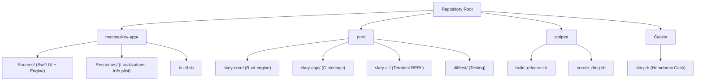
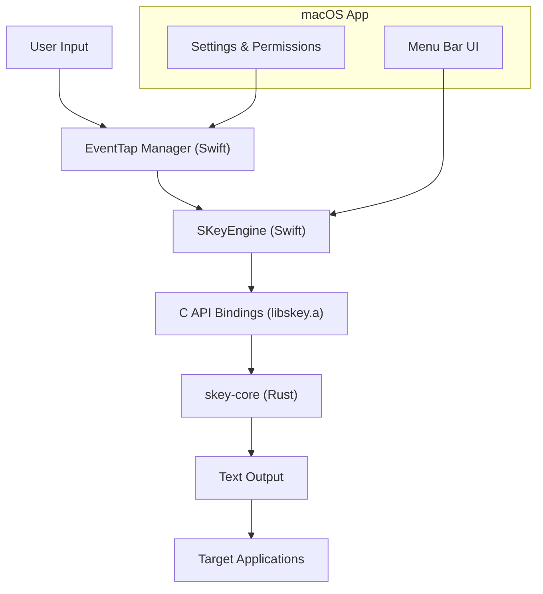
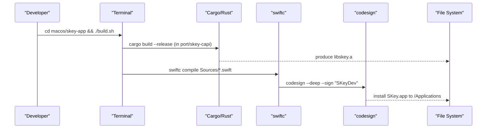
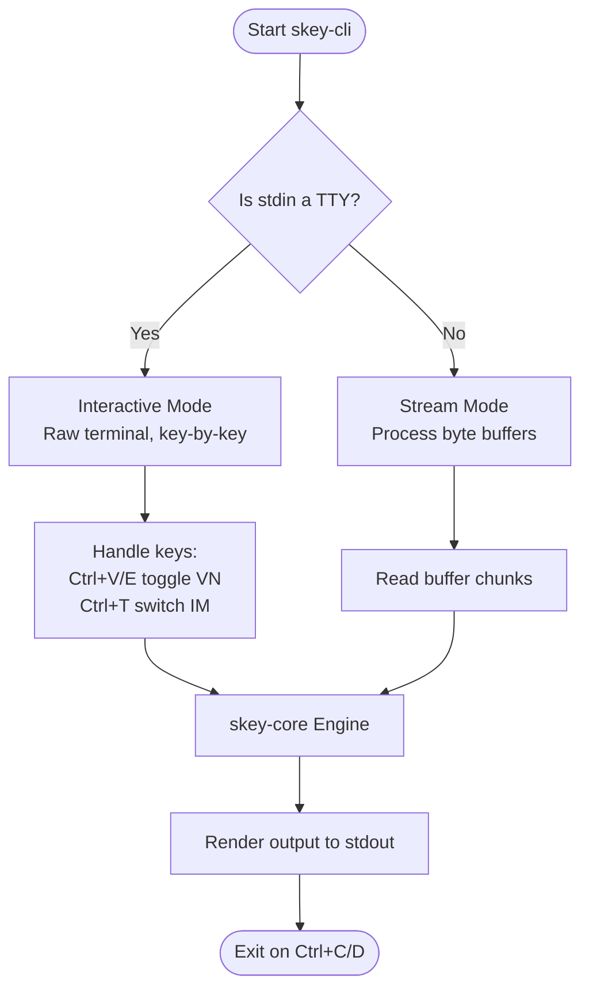
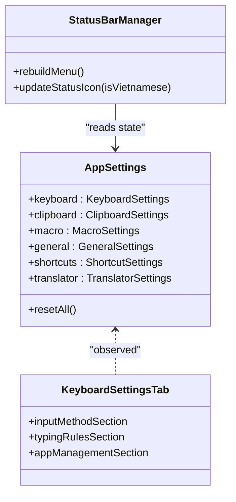
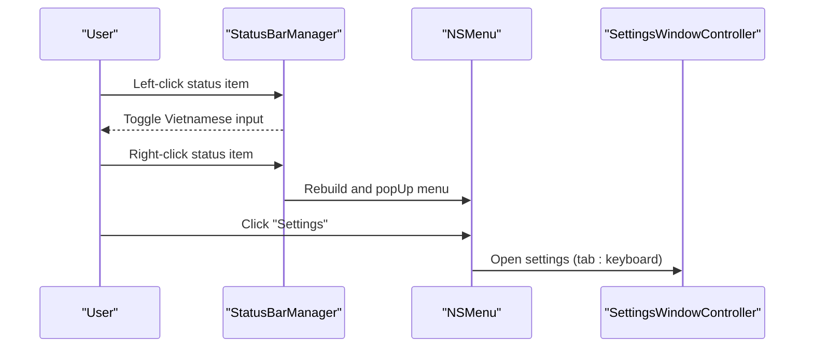
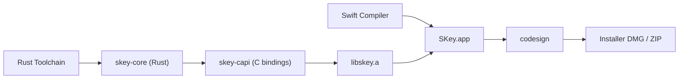

# Getting Started

<cite>
**Referenced Files in This Document**
- [README.md](file://README.md)
- [build.sh](file://macos/skey-app/build.sh)
- [build_release.sh](file://scripts/build_release.sh)
- [create_dmg.sh](file://scripts/create_dmg.sh)
- [Cargo.toml (port workspace)](file://port/Cargo.toml)
- [skey-cli Cargo.toml](file://port/skey-cli/Cargo.toml)
- [skey-core Cargo.toml](file://port/skey-core/Cargo.toml)
- [Package.swift](file://macos/skey-app/Package.swift)
- [main.rs (skey-cli)](file://port/skey-cli/src/main.rs)
- [PermissionsService.swift](file://macos/skey-app/Sources/Shared/Services/PermissionsService.swift)
- [StatusBarManager.swift](file://macos/skey-app/Sources/Shared/UI/StatusBarManager.swift)
- [KeyboardSettingsTab.swift](file://macos/skey-app/Sources/Features/Settings/UI/Tabs/KeyboardSettingsTab.swift)
- [AppSettings.swift](file://macos/skey-app/Sources/Shared/Settings/AppSettings.swift)
- [skey.rb (Homebrew Cask)](file://Casks/skey.rb)
</cite>

## Table of Contents
1. Introduction
2. Project Structure
3. Core Components
4. Architecture Overview
5. Detailed Component Analysis
6. Dependency Analysis
7. Performance Considerations
8. Troubleshooting Guide
9. Conclusion
10. Appendices

## Introduction
SKey is a modern, high-performance Vietnamese input method engine for macOS that combines a safe Rust core with a native Swift menu bar application. It provides sub-millisecond keystroke processing, rich typing schemes (Telex, VNI, VIQR), smart app switching, and a terminal REPL for quick testing and automation.

This guide helps you:
- Install SKey on macOS 13+ using the official installer or Homebrew
- Set up the developer environment (Xcode Command Line Tools and Rust toolchain)
- Build the Rust core library and the macOS application from source
- Run the terminal REPL and configure basic typing settings
- Understand the menu bar interface and permissions
- Troubleshoot common setup issues

## Project Structure
At a high level, SKey consists of:
- A Rust core engine and CLI tools under port/
- A native macOS app bundle under macos/skey-app/
- Build and release scripts at the repository root and within the app directory
- Optional Homebrew Cask definition for easy installation

**Diagram sources**
- [README.md:20-31](file://README.md#L20-L31)
- [build.sh:1-93](file://macos/skey-app/build.sh#L1-L93)
- [build_release.sh:1-121](file://scripts/build_release.sh#L1-L121)
- [create_dmg.sh:1-89](file://scripts/create_dmg.sh#L1-L89)
- [skey.rb:1-34](file://Casks/skey.rb#L1-L34)

**Section sources**
- [README.md:20-31](file://README.md#L20-L31)

## Core Components
- skey-core: The zero-heap, no_std Rust engine that processes keystrokes with minimal latency.
- skey-capi: C ABI bindings that expose the Rust engine to Swift via a static library.
- skey-cli: Interactive terminal REPL for testing and automation.
- SKey.app: Native macOS menu bar application built with Swift, integrating EventTap and Accessibility APIs.

Key build artifacts:
- libskey.a (static library produced by skey-capi)
- SKey.app (signed macOS application)
- Installer DMG and ZIP archives (release builds)

**Section sources**
- [README.md:35-63](file://README.md#L35-L63)
- [Cargo.toml (port workspace):1-8](file://port/Cargo.toml#L1-L8)
- [skey-core Cargo.toml:1-26](file://port/skey-core/Cargo.toml#L1-L26)
- [skey-cli Cargo.toml:1-10](file://port/skey-cli/Cargo.toml#L1-L10)
- [Package.swift:1-52](file://macos/skey-app/Package.swift#L1-L52)

## Architecture Overview
The system architecture links Swift UI components with the Rust core through C bindings. The macOS app uses EventTap to capture keystrokes and Accessibility APIs to integrate with Spotlight and other apps.

**Diagram sources**
- [Package.swift:13-49](file://macos/skey-app/Package.swift#L13-L49)
- [build.sh:63-83](file://macos/skey-app/build.sh#L63-L83)
- [PermissionsService.swift:12-41](file://macos/skey-app/Sources/Shared/Services/PermissionsService.swift#L12-L41)

## Detailed Component Analysis

### Developer Setup and Build Process
To build SKey from source on macOS 13+:
- Ensure Xcode Command Line Tools are installed (provides swiftc and codesign)
- Install the Rust toolchain (cargo)
- Use the provided build scripts to compile the Rust core and sign the app

Steps:
1. Build the Rust core library (libskey.a)
   - From the port directory, build the workspace in release mode
   - Or run the app-specific build script which handles this automatically
2. Build the macOS application bundle
   - Run the app build script to compile Swift files, link libskey.a, and sign the app
   - The script installs SKey.app into /Applications
3. Create a universal release package (optional)
   - Use the release script to build for both arm64 and x86_64, create a DMG and ZIP

**Diagram sources**
- [build.sh:9-93](file://macos/skey-app/build.sh#L9-L93)
- [build_release.sh:13-105](file://scripts/build_release.sh#L13-L105)

**Section sources**
- [README.md:35-63](file://README.md#L35-L63)
- [build.sh:1-93](file://macos/skey-app/build.sh#L1-L93)
- [build_release.sh:1-121](file://scripts/build_release.sh#L1-L121)

### Terminal REPL Quick Start
You can test SKey’s typing engine directly in your terminal using the interactive REPL.

How to run:
- From the port directory, run the CLI in release mode
- In interactive mode, use keyboard shortcuts to toggle Vietnamese input and switch input methods
- In stream mode (piped input), the engine processes bytes and outputs transformed text

Common interactions:
- Toggle Vietnamese input on/off
- Switch between Telex, VNI, and VIQR input methods
- Backspace and Enter behave as expected with live preview

**Diagram sources**
- [main.rs:66-174](file://port/skey-cli/src/main.rs#L66-L174)
- [main.rs:183-235](file://port/skey-cli/src/main.rs#L183-L235)
- [skey-cli Cargo.toml:1-10](file://port/skey-cli/Cargo.toml#L1-L10)

**Section sources**
- [README.md:59-63](file://README.md#L59-L63)
- [main.rs:1-244](file://port/skey-cli/src/main.rs#L1-L244)

### Basic Typing Configuration
Use the Settings window or menu bar to configure typing behavior:
- Primary input method (Telex, VNI, VIQR)
- Charset selection
- Enable/disable Vietnamese input globally
- Toggle shortcuts for toggling input
- Smart app switching and excluded apps list
- Modern tone placement and free marking options

These settings are persisted and applied in real time to the typing pipeline.

**Diagram sources**
- [AppSettings.swift:10-45](file://macos/skey-app/Sources/Shared/Settings/AppSettings.swift#L10-L45)
- [KeyboardSettingsTab.swift:1-300](file://macos/skey-app/Sources/Features/Settings/UI/Tabs/KeyboardSettingsTab.swift#L1-L300)
- [StatusBarManager.swift:47-160](file://macos/skey-app/Sources/Shared/UI/StatusBarManager.swift#L47-L160)

**Section sources**
- [KeyboardSettingsTab.swift:149-175](file://macos/skey-app/Sources/Features/Settings/UI/Tabs/KeyboardSettingsTab.swift#L149-L175)
- [AppSettings.swift:10-45](file://macos/skey-app/Sources/Shared/Settings/AppSettings.swift#L10-L45)

### Menu Bar Interface
The menu bar shows the current input state and provides quick access to features:
- Left-click toggles Vietnamese input
- Right-click opens the menu with options like snippets, settings, tools, and quit
- Status icon displays “V” for Vietnamese or “E” for English
- Tools submenu includes language selection, permission shortcuts, and cleaner tools

**Diagram sources**
- [StatusBarManager.swift:15-160](file://macos/skey-app/Sources/Shared/UI/StatusBarManager.swift#L15-L160)

**Section sources**
- [StatusBarManager.swift:15-160](file://macos/skey-app/Sources/Shared/UI/StatusBarManager.swift#L15-L160)

## Dependency Analysis
SKey’s build depends on:
- Rust toolchain for building skey-core and skey-capi
- Swift compiler and frameworks for the macOS app
- Code signing for macOS security requirements
- Optional Homebrew Cask for distribution

**Diagram sources**
- [Cargo.toml (port workspace):1-8](file://port/Cargo.toml#L1-L8)
- [Package.swift:13-49](file://macos/skey-app/Package.swift#L13-L49)
- [build_release.sh:13-105](file://scripts/build_release.sh#L13-L105)
- [create_dmg.sh:1-89](file://scripts/create_dmg.sh#L1-L89)

**Section sources**
- [README.md:35-63](file://README.md#L35-L63)
- [build_release.sh:13-105](file://scripts/build_release.sh#L13-L105)

## Performance Considerations
- The Rust core engine is designed for zero-latency keystroke processing with minimal memory allocation
- Release builds enable optimizations such as LTO and single codegen unit for smaller binaries
- The macOS app compiles with Whole Module Optimization for performance
- EventTap runs on a dedicated thread to avoid UI blocking

[No sources needed since this section provides general guidance]

## Troubleshooting Guide
Common issues and resolutions:

- Missing dependencies
  - Ensure Xcode Command Line Tools are installed (swiftc, codesign)
  - Ensure Rust toolchain is installed (cargo)
  - Verify target architectures are available if building universal binaries

- Permission problems
  - SKey requires Accessibility and Input Monitoring permissions to capture keystrokes
  - Use the menu bar Tools submenu to open system preferences for permissions
  - If prompted, grant permissions when requested by the app

- Accessibility requirements
  - On first launch, SKey may prompt for Accessibility access; approve it in System Settings
  - If EventTap fails, check Input Monitoring permissions and restart the app

- Code signing errors
  - Development builds use a local certificate; ensure your environment has a trusted signing identity
  - For distribution, use ad-hoc or proper developer signing as configured by release scripts

- DMG creation failures
  - Ensure hdiutil and required tools are available
  - Verify SKey.app exists in dist/ or macos/skey-app/ before creating the installer

**Section sources**
- [PermissionsService.swift:12-41](file://macos/skey-app/Sources/Shared/Services/PermissionsService.swift#L12-L41)
- [StatusBarManager.swift:101-116](file://macos/skey-app/Sources/Shared/UI/StatusBarManager.swift#L101-L116)
- [build.sh:85-93](file://macos/skey-app/build.sh#L85-L93)
- [create_dmg.sh:21-29](file://scripts/create_dmg.sh#L21-L29)

## Conclusion
You now have the essentials to install, build, and use SKey on macOS. Start with the official installer or Homebrew for daily usage, or set up the developer environment to build and contribute. Use the terminal REPL to experiment with typing rules and verify behavior before configuring the macOS app.

[No sources needed since this section summarizes without analyzing specific files]

## Appendices

### Installation Options
- Official installer: Download the DMG from releases and drag SKey.app to /Applications
- Homebrew: Install via the Cask definition
- Manual build: Follow the developer build steps above

**Section sources**
- [skey.rb:1-34](file://Casks/skey.rb#L1-L34)
- [README.md:35-63](file://README.md#L35-L63)