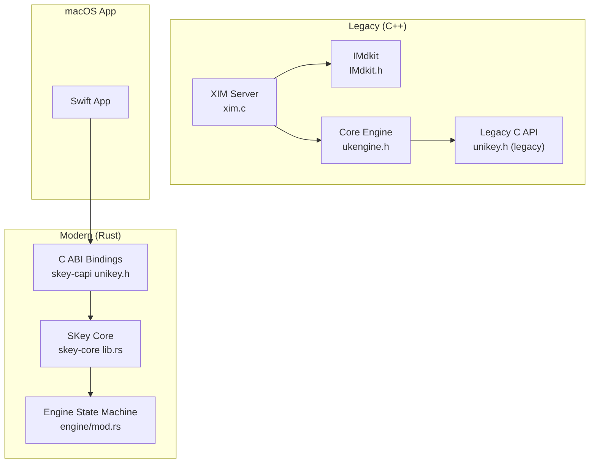
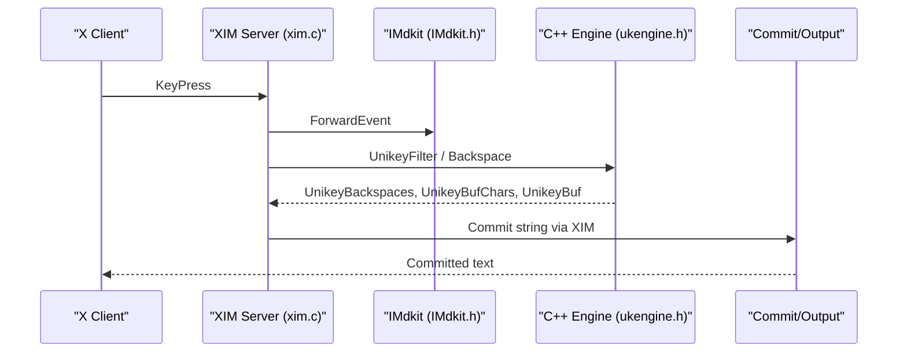
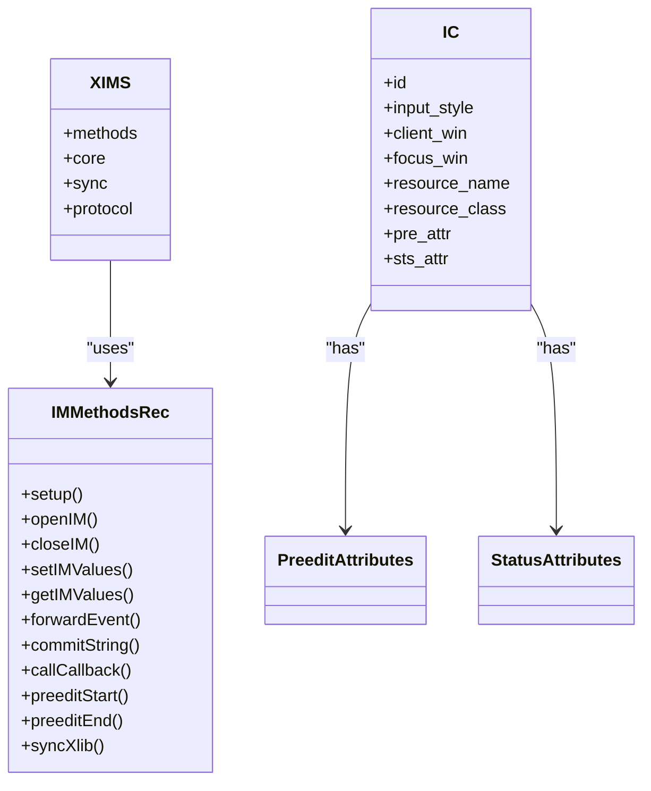
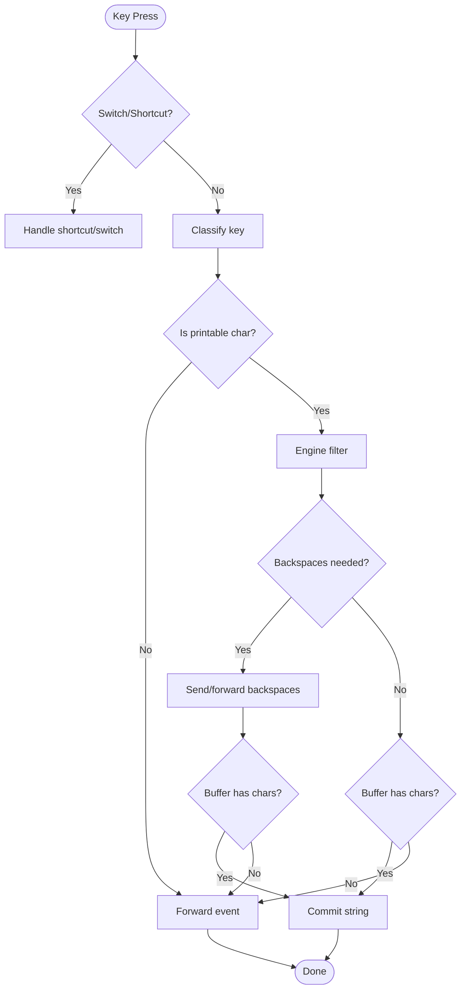
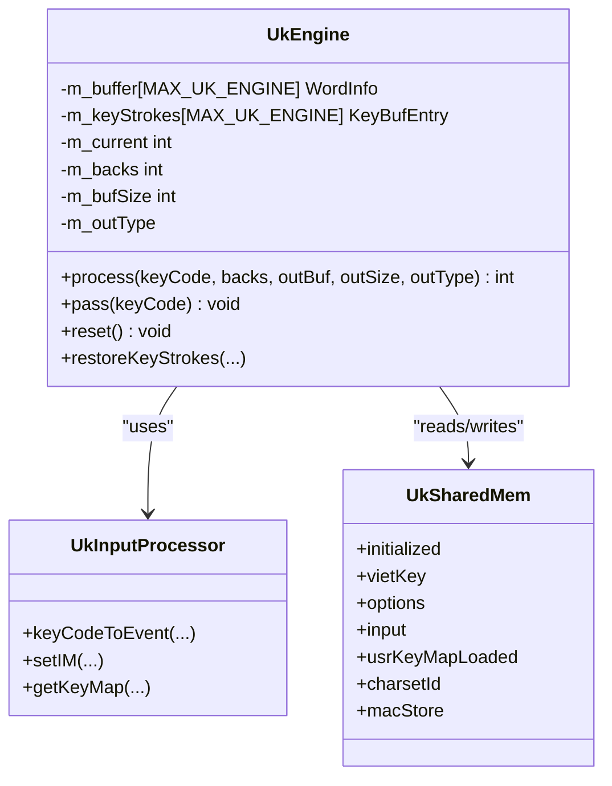
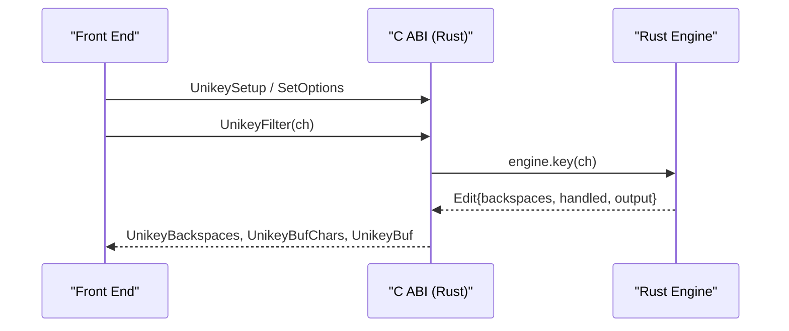
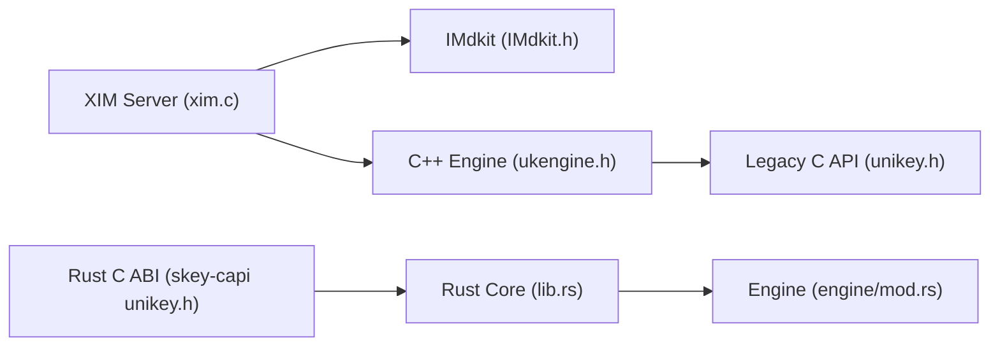

# Legacy Reference Implementation

<cite>
**Referenced Files in This Document**
- [README.md](file://README.md)
- [REPORT.md](file://REPORT.md)
- [IMdkit.h](file://src/IMdkit/IMdkit.h)
- [XimProto.h](file://src/IMdkit/XimProto.h)
- [xim.c](file://src/xim/xim.c)
- [IC.h](file://src/xim/IC.h)
- [ukengine.h](file://src/ukengine/ukengine.h)
- [inputproc.h](file://src/ukengine/inputproc.h)
- [unikey.h (legacy C API)](file://src/ukinterface/unikey.h)
- [lib.rs](file://port/skey-core/src/lib.rs)
- [mod.rs (engine core)](file://port/skey-core/src/engine/mod.rs)
- [unikey.h (Rust C ABI)](file://port/skey-capi/include/unikey.h)
</cite>

## Table of Contents
1. Introduction
2. Project Structure
3. Core Components
4. Architecture Overview
5. Detailed Component Analysis
6. Dependency Analysis
7. Performance Considerations
8. Troubleshooting Guide
9. Conclusion
10. Appendices

## Introduction
This document explains the legacy C++ UniKey reference implementation and how it served as the foundation for the modern Rust-based SKey engine. It covers the historical architecture, the IMdkit and XIM integration on X11, the core typing engine design, and the migration path to a safe, zero-allocation Rust core with a stable C ABI. It also provides guidance for maintaining or understanding the original codebase while transitioning to SKey.

## Project Structure
The repository contains:
- Legacy reference implementation under src/, including IMdkit (X Input Method toolkit), an XIM server for UniKey, and the C++ engine and interfaces.
- Modern Rust core under port/skey-core, exposing a stable C ABI via port/skey-capi that mirrors the legacy interface for compatibility.
- A native macOS application under macos/skey-app that uses the Rust core through a Swift UI and low-latency event pipeline.

**Diagram sources**
- [IMdkit.h:32-136](file://src/IMdkit/IMdkit.h#L32-L136)
- [xim.c:59-75](file://src/xim/xim.c#L59-L75)
- [ukengine.h:64-162](file://src/ukengine/ukengine.h#L64-L162)
- [unikey.h (legacy C API):29-111](file://src/ukinterface/unikey.h#L29-L111)
- [lib.rs:1-47](file://port/skey-core/src/lib.rs#L1-L47)
- [mod.rs:18-70](file://port/skey-core/src/engine/mod.rs#L18-L70)
- [unikey.h (Rust C ABI):1-77](file://port/skey-capi/include/unikey.h#L1-L77)

**Section sources**
- [README.md:20-31](file://README.md#L20-L31)

## Core Components
- IMdkit: The X Input Method Toolkit abstraction used by the legacy XIM server to implement input methods.
- XIM Server (UniKey): Implements the XIM protocol, handles key events, and bridges to the C++ engine.
- C++ Engine: Processes keystrokes according to Telex/VNI/VIQR rules, manages buffers and backspaces, and exposes a C API.
- Rust Core (SKey): A safe, no_std-capable engine with identical behavior to the legacy one, exposed via a compatible C ABI.

Key responsibilities:
- Event capture and filtering at the XIM layer.
- Keystroke classification and phonetic rule application in the engine.
- Output buffering and backspace accounting.
- Charset conversion and commit to the client.

**Section sources**
- [IMdkit.h:32-136](file://src/IMdkit/IMdkit.h#L32-L136)
- [xim.c:59-75](file://src/xim/xim.c#L59-L75)
- [ukengine.h:64-162](file://src/ukengine/ukengine.h#L64-L162)
- [unikey.h (legacy C API):29-111](file://src/ukinterface/unikey.h#L29-L111)
- [lib.rs:1-47](file://port/skey-core/src/lib.rs#L1-L47)
- [mod.rs:18-70](file://port/skey-core/src/engine/mod.rs#L18-L70)
- [unikey.h (Rust C ABI):1-77](file://port/skey-capi/include/unikey.h#L1-L77)

## Architecture Overview
The legacy stack integrates with X11 via IMdkit and the XIM protocol. The XIM server receives key events, classifies them, invokes the C++ engine, and commits output using XIM mechanisms. The modern stack replaces the C++ engine with a Rust implementation while preserving the same C ABI so existing front ends can link without changes.

**Diagram sources**
- [xim.c:610-753](file://src/xim/xim.c#L610-L753)
- [IMdkit.h:125-134](file://src/IMdkit/IMdkit.h#L125-L134)
- [ukengine.h:64-162](file://src/ukengine/ukengine.h#L64-L162)

## Detailed Component Analysis

### IMdkit and XIM Protocol Integration
- IMdkit defines the input method framework structures, attributes, and callbacks used by XIM servers.
- XIM protocol constants define message types for connection, IC lifecycle, encoding negotiation, preedit/status, and commit operations.
- The UniKey XIM server implements handlers for creating/destroying input contexts, setting values, forwarding events, and committing strings.

**Diagram sources**
- [IMdkit.h:64-120](file://src/IMdkit/IMdkit.h#L64-L120)
- [IC.h:38-73](file://src/xim/IC.h#L38-L73)

**Section sources**
- [IMdkit.h:32-136](file://src/IMdkit/IMdkit.h#L32-L136)
- [XimProto.h:35-103](file://src/IMdkit/XimProto.h#L35-L103)
- [IC.h:38-73](file://src/xim/IC.h#L38-L73)

### XIM Server Event Flow
The XIM server filters keys, applies shortcuts and switch keys, processes characters through the engine, and commits results. It supports both forward-commit and send-backspace modes, and coordinates pending commits and synchronization.

**Diagram sources**
- [xim.c:610-753](file://src/xim/xim.c#L610-L753)
- [xim.c:756-784](file://src/xim/xim.c#L756-L784)

**Section sources**
- [xim.c:59-75](file://src/xim/xim.c#L59-L75)
- [xim.c:610-753](file://src/xim/xim.c#L610-L753)
- [xim.c:756-784](file://src/xim/xim.c#L756-L784)

### Legacy C++ Engine Architecture
The C++ engine maintains per-session state, a word buffer, and key stroke history. It exposes a C API for initialization, filtering, backspace handling, and options. Shared memory structures are used for cross-process scenarios.

**Diagram sources**
- [ukengine.h:32-162](file://src/ukengine/ukengine.h#L32-L162)
- [inputproc.h:76-107](file://src/ukengine/inputproc.h#L76-L107)

**Section sources**
- [ukengine.h:32-162](file://src/ukengine/ukengine.h#L32-L162)
- [inputproc.h:43-116](file://src/ukengine/inputproc.h#L43-L116)

### Legacy C API Surface
The legacy C API provides process-wide globals and functions for setup, filtering, backspace, reset, and configuration. Front ends call these to integrate with the engine.

Key elements:
- Global buffers and counters for output and backspaces.
- Functions to set caps state, filter characters, handle backspace, reset state, and load macros/keymaps.
- Options structure for toggling features like free marking, modern style, macros, spell check, etc.

**Section sources**
- [unikey.h (legacy C API):29-111](file://src/ukinterface/unikey.h#L29-L111)

### Modern Rust Core and Migration Path
The Rust core replicates the legacy behavior with safety guarantees and optional zero-allocation paths. It exposes a C ABI identical to the legacy interface, enabling drop-in replacement for existing front ends. An additional context API allows multiple independent engines and thread safety.

Highlights:
- Byte-for-byte parity goal verified by differential testing.
- no_std capability; keystroke path avoids allocation.
- Stable C ABI mirroring legacy headers.
- Context API for multi-session/threaded usage.

**Diagram sources**
- [unikey.h (Rust C ABI):1-77](file://port/skey-capi/include/unikey.h#L1-L77)
- [mod.rs:248-319](file://port/skey-core/src/engine/mod.rs#L248-L319)

**Section sources**
- [lib.rs:1-47](file://port/skey-core/src/lib.rs#L1-L47)
- [unikey.h (Rust C ABI):1-77](file://port/skey-capi/include/unikey.h#L1-L77)
- [mod.rs:18-70](file://port/skey-core/src/engine/mod.rs#L18-L70)
- [mod.rs:248-319](file://port/skey-core/src/engine/mod.rs#L248-L319)

### Conceptual Overview
Conceptually, the system transforms raw keystrokes into Vietnamese text using phonetic rules, managing intermediate buffers and backspaces to produce correct output across platforms. The modern implementation preserves this transformation model while improving safety, performance, and maintainability.

[No sources needed since this section doesn't analyze specific files]

## Dependency Analysis
The legacy stack couples XIM protocol handling with the C++ engine and IMdkit abstractions. The modern stack decouples the engine from platform specifics and exposes a stable C ABI.

**Diagram sources**
- [xim.c:59-75](file://src/xim/xim.c#L59-L75)
- [IMdkit.h:32-136](file://src/IMdkit/IMdkit.h#L32-L136)
- [ukengine.h:64-162](file://src/ukengine/ukengine.h#L64-L162)
- [unikey.h (legacy C API):29-111](file://src/ukinterface/unikey.h#L29-L111)
- [lib.rs:1-47](file://port/skey-core/src/lib.rs#L1-L47)
- [mod.rs:18-70](file://port/skey-core/src/engine/mod.rs#L18-L70)
- [unikey.h (Rust C ABI):1-77](file://port/skey-capi/include/unikey.h#L1-L77)

**Section sources**
- [xim.c:59-75](file://src/xim/xim.c#L59-L75)
- [IMdkit.h:32-136](file://src/IMdkit/IMdkit.h#L32-L136)
- [ukengine.h:64-162](file://src/ukengine/ukengine.h#L64-L162)
- [unikey.h (legacy C API):29-111](file://src/ukinterface/unikey.h#L29-L111)
- [lib.rs:1-47](file://port/skey-core/src/lib.rs#L1-L47)
- [mod.rs:18-70](file://port/skey-core/src/engine/mod.rs#L18-L70)
- [unikey.h (Rust C ABI):1-77](file://port/skey-capi/include/unikey.h#L1-L77)

## Performance Considerations
- Legacy XIM path: Uses synchronous X calls and explicit synchronization points; careful ordering is required to avoid event coalescing issues.
- Rust core: Designed for zero-allocation keystroke processing and no_std operation; suitable for high-throughput, low-latency environments.
- macOS app: Employs dedicated threads and low-level event taps to minimize latency and ensure responsiveness.

[No sources needed since this section provides general guidance]

## Troubleshooting Guide
Common issues and mitigations observed in the project:
- Spotlight and Omnibox interactions: Use direct text replacement APIs where available to bypass event loop debouncing and coalescing.
- Cross-app buffer leakage: Reset engine state on focus change, mouse down, navigation keys, and app switch notifications.
- Chromium Accessibility dormant state: Wake accessibility when relevant apps become active to ensure reliable selection/context reads.

These strategies are implemented in the macOS app’s event pipeline and accessibility helpers.

**Section sources**
- [REPORT.md:19-33](file://REPORT.md#L19-L33)
- [REPORT.md:67-90](file://REPORT.md#L67-L90)

## Conclusion
The legacy C++ UniKey reference implementation established a robust, protocol-compliant input method on X11 using IMdkit and the XIM protocol, backed by a C++ engine with a well-defined C API. The modern Rust core preserves behavioral parity while offering safety, performance, and a stable C ABI for seamless migration. Applications can transition by linking against the Rust-provided C ABI and adopting the context API for multi-session or threaded use cases.

[No sources needed since this section summarizes without analyzing specific files]

## Appendices

### Migration Checklist
- Replace links to legacy objects with the Rust C ABI library.
- Initialize via the same setup sequence; options map directly.
- For multi-session or threaded environments, prefer the context API over global state.
- Validate behavior with differential tests against the legacy engine.

**Section sources**
- [unikey.h (Rust C ABI):1-77](file://port/skey-capi/include/unikey.h#L1-L77)
- [lib.rs:1-47](file://port/skey-core/src/lib.rs#L1-L47)