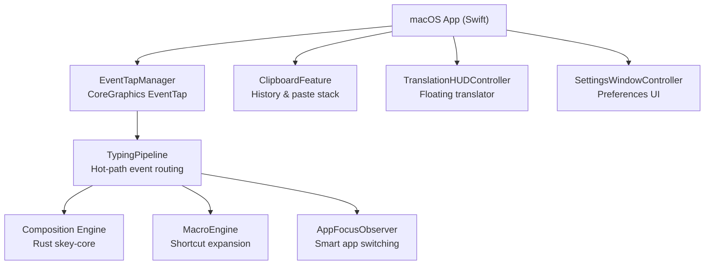
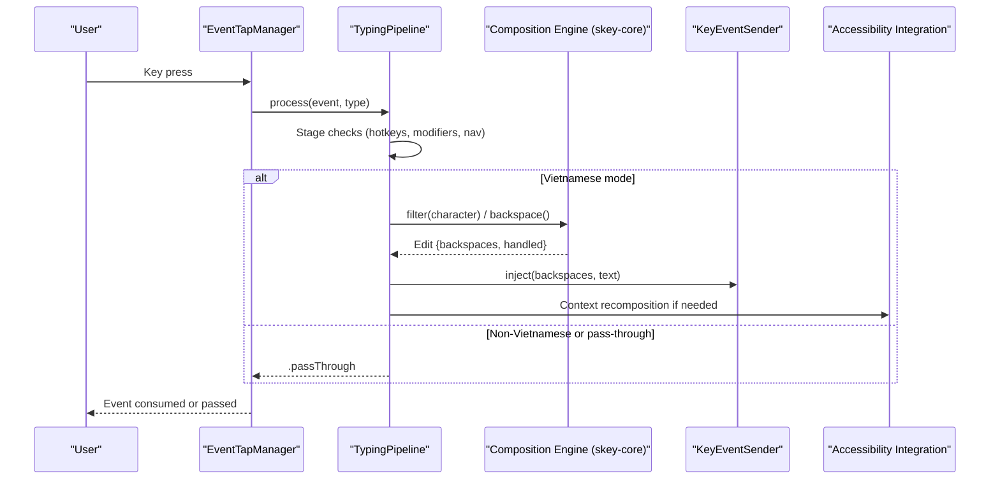
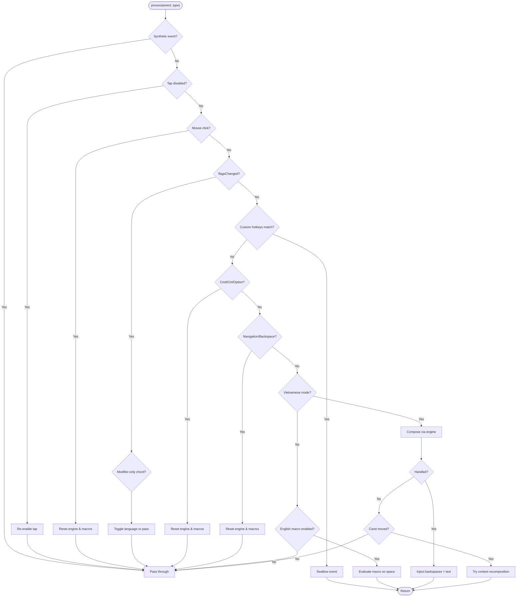
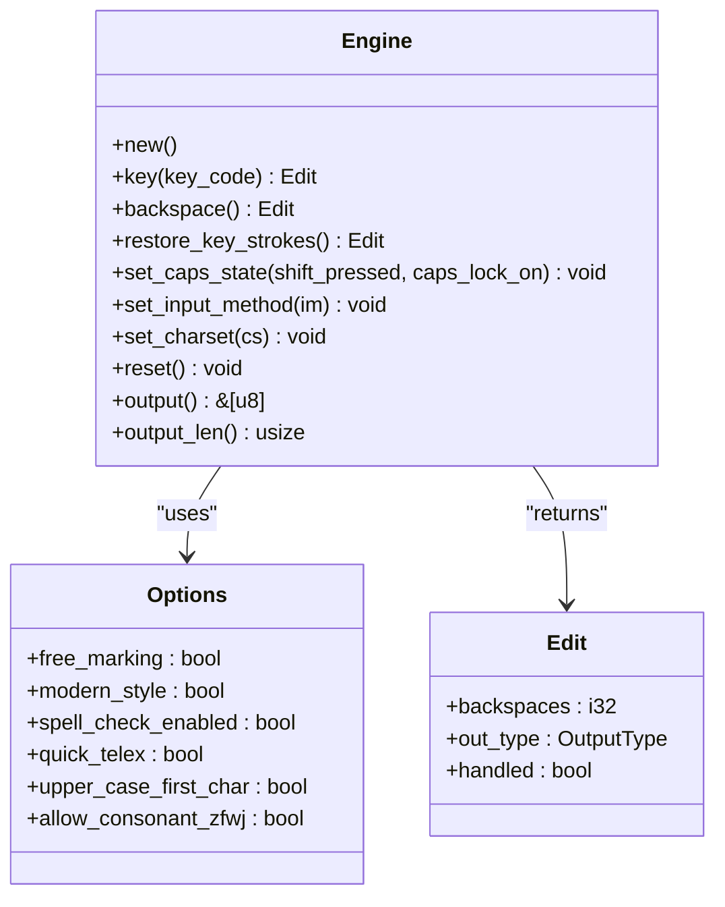
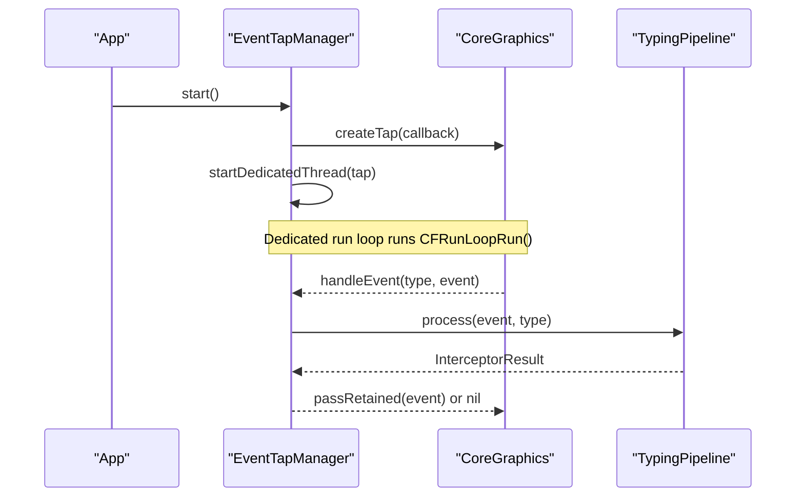
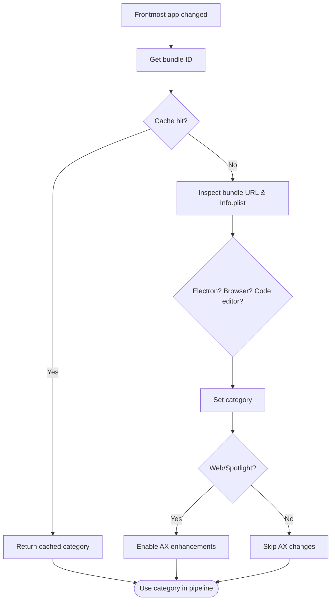
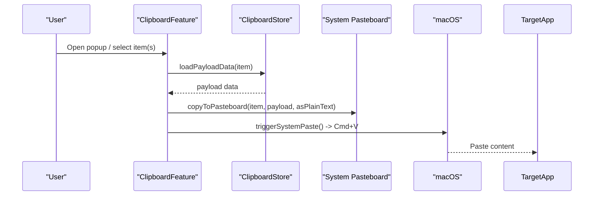
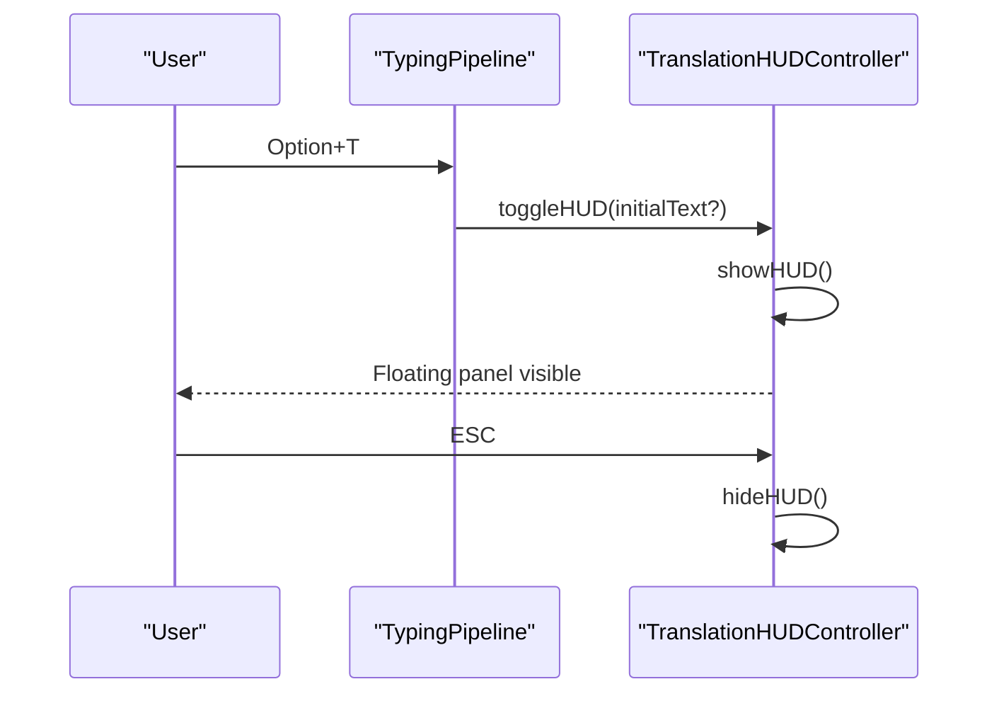
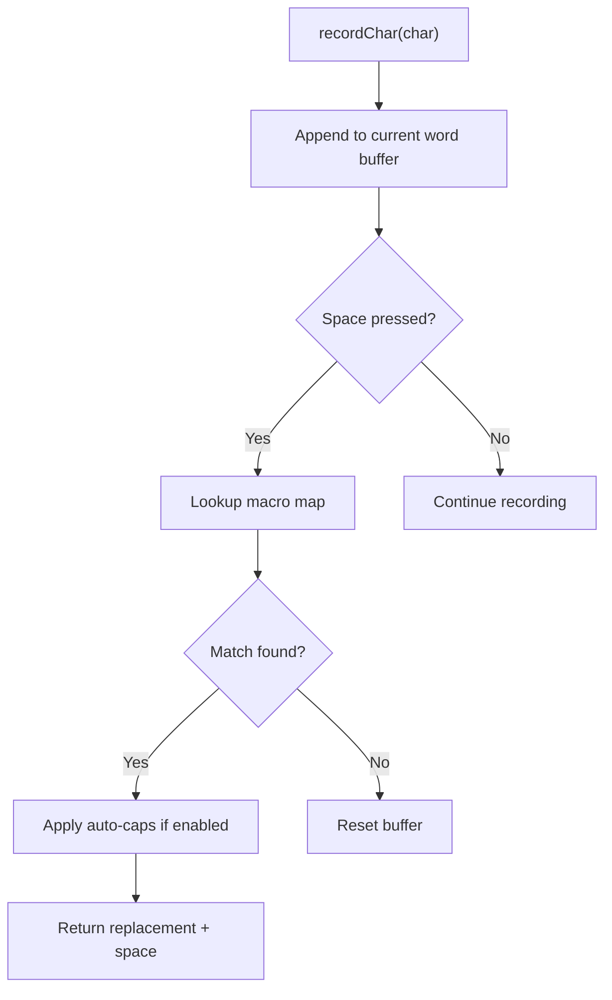
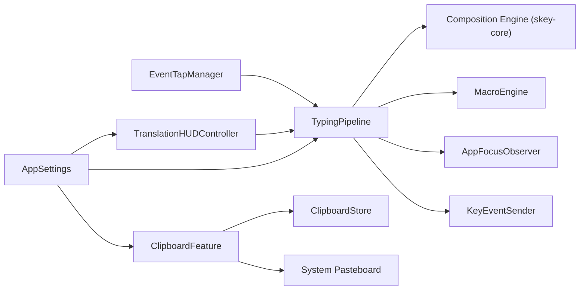

# Project Overview

<cite>
**Referenced Files in This Document**
- [README.md](file://README.md)
- [AppDelegate.swift](file://macos/skey-app/Sources/App/AppDelegate.swift)
- [TypingPipeline.swift](file://macos/skey-app/Sources/Features/Keyboard/EventHandling/Pipeline/TypingPipeline.swift)
- [EventTapManager.swift](file://macos/skey-app/Sources/Features/Keyboard/EventHandling/EventTapManager.swift)
- [InputMethod.swift](file://macos/skey-app/Sources/Features/Keyboard/Engine/InputMethod.swift)
- [ClipboardFeature.swift](file://macos/skey-app/Sources/Features/Clipboard/ClipboardFeature.swift)
- [TranslationHUDController.swift](file://macos/skey-app/Sources/Features/Translator/UI/TranslationHUDController.swift)
- [MacroEngine.swift](file://macos/skey-app/Sources/Features/Keyboard/Engine/MacroEngine.swift)
- [AppFocusObserver.swift](file://macos/skey-app/Sources/Shared/Services/AppFocusObserver.swift)
- [SettingsWindowController.swift](file://macos/skey-app/Sources/Features/Settings/SettingsWindowController.swift)
- [lib.rs](file://port/skey-core/src/lib.rs)
- [engine/mod.rs](file://port/skey-core/src/engine/mod.rs)
- [types.rs](file://port/skey-core/src/engine/types.rs)
</cite>

## Table of Contents
1. [Introduction](#introduction)
2. [Project Structure](#project-structure)
3. [Core Components](#core-components)
4. [Architecture Overview](#architecture-overview)
5. [Detailed Component Analysis](#detailed-component-analysis)
6. [Dependency Analysis](#dependency-analysis)
7. [Performance Considerations](#performance-considerations)
8. [Troubleshooting Guide](#troubleshooting-guide)
9. [Conclusion](#conclusion)

## Introduction
SKey is a modern Vietnamese input method engine and macOS application designed for ultra-fast, zero-latency typing. It combines a safe Rust core with a native Swift UI to deliver sub-microsecond keystroke processing, deep integration with macOS accessibility features, and smart application switching that adapts behavior per app context. The project supports multiple Vietnamese input schemes (Telex, Simple Telex, VNI, VIQR), includes a built-in clipboard manager, translation HUD, macros, and a terminal REPL. It is open-source under the GNU General Public License v2.0 (GPL-2.0).

This overview introduces both beginners new to Vietnamese input methods and experienced developers interested in the high-performance implementation. It explains key architectural decisions such as the no_std Rust engine, CoreGraphics EventTap integration, and smart application switching capabilities, using terminology consistent with the codebase: typing pipeline, composition engine, and accessibility integration.

## Project Structure
The repository is organized into three primary areas:
- macos/skey-app: Native macOS menu bar application written in Swift, providing UI, settings, clipboard management, translation HUD, keyboard event handling, and feature orchestration.
- port: Cross-platform Rust core and tooling, including the no_std typing engine (skey-core), C ABI bindings (skey-capi), CLI REPL (skey-cli), and differential testing harnesses.
- src: Original reference sources from the legacy UniKey engine used for parity and historical context.

**Diagram sources**
- [EventTapManager.swift:15-103](file://macos/skey-app/Sources/Features/Keyboard/EventHandling/EventTapManager.swift#L15-L103)
- [TypingPipeline.swift:6-170](file://macos/skey-app/Sources/Features/Keyboard/EventHandling/Pipeline/TypingPipeline.swift#L6-L170)
- [lib.rs:1-47](file://port/skey-core/src/lib.rs#L1-L47)
- [engine/mod.rs:18-111](file://port/skey-core/src/engine/mod.rs#L18-L111)
- [ClipboardFeature.swift:6-48](file://macos/skey-app/Sources/Features/Clipboard/ClipboardFeature.swift#L6-L48)
- [TranslationHUDController.swift:58-105](file://macos/skey-app/Sources/Features/Translator/UI/TranslationHUDController.swift#L58-L105)
- [SettingsWindowController.swift:6-59](file://macos/skey-app/Sources/Features/Settings/SettingsWindowController.swift#L6-L59)

**Section sources**
- [README.md:20-31](file://README.md#L20-L31)
- [lib.rs:1-47](file://port/skey-core/src/lib.rs#L1-L47)

## Core Components
- Typing Pipeline: A multi-stage hot path that classifies events, handles shortcuts, resets state on navigation or focus changes, and delegates composing to the Rust engine. It ensures minimal latency by fast-pathing function/media keys, navigation keys, backspace, and printable ASCII characters.
- Composition Engine: The Rust-based skey-core implements the Vietnamese phonetics and spelling rules, maintaining buffer state and producing edits (backspaces and output text) without heap allocation on the keystroke path.
- EventTap Manager: Manages CoreGraphics EventTap lifecycle on a dedicated interactive thread, re-enabling taps when disabled, and delegating event evaluation to the pipeline.
- Smart Application Switching: Observes frontmost app and classifies it (developer tools, web browsers, Electron/chat apps, Spotlight, native apps) to adapt behavior like English mode in developer apps and enhanced accessibility for browsers and Spotlight.
- Clipboard Feature: Monitors system pasteboard, stores history, provides a floating popup, and supports single/multi-item paste stacks with system paste triggering.
- Translation HUD: A floating panel triggered via shortcut, centered near the mouse, supporting editing shortcuts and ESC to hide.
- Macro Engine: In-memory macro expander that records typed characters and expands predefined shortcuts on space, with optional auto-capitalization.
- Settings: Centralized settings hub with reactive modules and persistent storage; settings window uses SwiftUI with a visual effect view.

**Section sources**
- [TypingPipeline.swift:6-170](file://macos/skey-app/Sources/Features/Keyboard/EventHandling/Pipeline/TypingPipeline.swift#L6-L170)
- [engine/mod.rs:18-111](file://port/skey-core/src/engine/mod.rs#L18-L111)
- [EventTapManager.swift:15-103](file://macos/skey-app/Sources/Features/Keyboard/EventHandling/EventTapManager.swift#L15-L103)
- [AppFocusObserver.swift:14-91](file://macos/skey-app/Sources/Shared/Services/AppFocusObserver.swift#L14-L91)
- [ClipboardFeature.swift:6-48](file://macos/skey-app/Sources/Features/Clipboard/ClipboardFeature.swift#L6-L48)
- [TranslationHUDController.swift:58-105](file://macos/skey-app/Sources/Features/Translator/UI/TranslationHUDController.swift#L58-L105)
- [MacroEngine.swift:14-111](file://macos/skey-app/Sources/Features/Keyboard/Engine/MacroEngine.swift#L14-L111)
- [SettingsWindowController.swift:6-59](file://macos/skey-app/Sources/Features/Settings/SettingsWindowController.swift#L6-L59)

## Architecture Overview
SKey’s architecture separates low-level event capture from high-level composing logic:
- CoreGraphics EventTap captures keyDown/keyUp/flagsChanged and mouse clicks on a dedicated thread.
- The TypingPipeline routes events through stages: synthetic event pass-through, tap-disabled recovery, mouse click reset, modifier-only shortcut detection, customizable hotkeys, quick translate shortcut, command/control/option pass-through, excluded apps bypass, language mode check, and composing engine invocation.
- The Rust composition engine processes character input according to Vietnamese phonetics and options, returning edits (backspaces and output bytes).
- Accessibility integration enables seamless operation with Spotlight, omnibox autocomplete, and Chromium/Safari URL fields by adjusting AX attributes and caret movement handling.
- Smart app switching uses AppFocusObserver to classify the active app and adjust behavior (e.g., English mode in developer tools).

**Diagram sources**
- [EventTapManager.swift:81-103](file://macos/skey-app/Sources/Features/Keyboard/EventHandling/EventTapManager.swift#L81-L103)
- [TypingPipeline.swift:31-170](file://macos/skey-app/Sources/Features/Keyboard/EventHandling/Pipeline/TypingPipeline.swift#L31-L170)
- [engine/mod.rs:248-319](file://port/skey-core/src/engine/mod.rs#L248-L319)

## Detailed Component Analysis

### Typing Pipeline
The TypingPipeline is the central hot path for keystroke processing. It performs:
- Synthetic event pass-through to avoid loops.
- Tap-disabled recovery and mouse click resets.
- Modifier-only shortcut chord detection (e.g., Control+Shift toggle).
- Customizable hotkeys for language toggle, clipboard popup, cleaner, AI settings, and quick translate.
- Command/control/option pass-through to avoid interfering with system/app shortcuts.
- Excluded applications bypass based on AppFocusObserver classification.
- Language mode gating and composing engine invocation.
- Fast paths for function/media keys, navigation keys, backspace, and printable ASCII.
- Smart context recomposition when caret moves due to navigation.

**Diagram sources**
- [TypingPipeline.swift:31-170](file://macos/skey-app/Sources/Features/Keyboard/EventHandling/Pipeline/TypingPipeline.swift#L31-L170)
- [TypingPipeline.swift:174-280](file://macos/skey-app/Sources/Features/Keyboard/EventHandling/Pipeline/TypingPipeline.swift#L174-L280)

**Section sources**
- [TypingPipeline.swift:6-345](file://macos/skey-app/Sources/Features/Keyboard/EventHandling/Pipeline/TypingPipeline.swift#L6-L345)

### Composition Engine (skey-core)
The Rust engine maintains a compact buffer of WordInfo entries and processes keystrokes through dispatch functions specialized for roof marks, hooks, tones, Telex mappings, escape sequences, and general append. It returns Edit structs indicating whether the key was handled, how many backspaces to send, and the output bytes. Options control behaviors like free tone marking, modern style, spell checking, quick shortcuts, capitalization, and swallowed key restoration.

**Diagram sources**
- [engine/mod.rs:18-111](file://port/skey-core/src/engine/mod.rs#L18-L111)
- [engine/mod.rs:248-426](file://port/skey-core/src/engine/mod.rs#L248-L426)
- [types.rs:31-83](file://port/skey-core/src/engine/types.rs#L31-L83)
- [types.rs:224-235](file://port/skey-core/src/engine/types.rs#L224-L235)

**Section sources**
- [lib.rs:1-47](file://port/skey-core/src/lib.rs#L1-L47)
- [engine/mod.rs:18-426](file://port/skey-core/src/engine/mod.rs#L18-L426)
- [types.rs:1-235](file://port/skey-core/src/engine/types.rs#L1-L235)

### EventTap Manager
Manages CoreGraphics EventTap lifecycle on a dedicated interactive thread, creating taps with fallback strategies, enabling/disabling taps, and delegating event evaluation to the TypingPipeline. It uses an os_unfair_lock for thread-safe language state access and updates UserDefaults and UI callbacks on the main thread.

**Diagram sources**
- [EventTapManager.swift:81-103](file://macos/skey-app/Sources/Features/Keyboard/EventHandling/EventTapManager.swift#L81-L103)
- [EventTapManager.swift:140-168](file://macos/skey-app/Sources/Features/Keyboard/EventHandling/EventTapManager.swift#L140-L168)
- [EventTapManager.swift:172-188](file://macos/skey-app/Sources/Features/Keyboard/EventHandling/EventTapManager.swift#L172-L188)

**Section sources**
- [EventTapManager.swift:15-196](file://macos/skey-app/Sources/Features/Keyboard/EventHandling/EventTapManager.swift#L15-L196)

### Smart Application Switching
AppFocusObserver tracks the frontmost app, classifies it into categories (developer tool, web browser, electron/chat, spotlight, native app), and caches results. For web browsers and Spotlight, it sets AXManualAccessibility and AXEnhancedUserInterface to improve compatibility with autocomplete and floating palettes.

**Diagram sources**
- [AppFocusObserver.swift:29-91](file://macos/skey-app/Sources/Shared/Services/AppFocusObserver.swift#L29-L91)
- [AppFocusObserver.swift:133-151](file://macos/skey-app/Sources/Shared/Services/AppFocusObserver.swift#L133-L151)

**Section sources**
- [AppFocusObserver.swift:14-153](file://macos/skey-app/Sources/Shared/Services/AppFocusObserver.swift#L14-L153)

### Clipboard Feature
Provides clipboard history monitoring, storage, and a floating popup. It triggers system paste via synthesized Cmd+V events after copying selected items to the pasteboard. Supports multi-item paste stacks by concatenating text.

**Diagram sources**
- [ClipboardFeature.swift:26-48](file://macos/skey-app/Sources/Features/Clipboard/ClipboardFeature.swift#L26-L48)
- [ClipboardFeature.swift:82-122](file://macos/skey-app/Sources/Features/Clipboard/ClipboardFeature.swift#L82-L122)

**Section sources**
- [ClipboardFeature.swift:6-146](file://macos/skey-app/Sources/Features/Clipboard/ClipboardFeature.swift#L6-L146)

### Translation HUD
A floating panel triggered by Option+T, centered near the mouse, supporting standard editing shortcuts and ESC to hide. It hosts a SwiftUI view for translation interactions.

**Diagram sources**
- [TypingPipeline.swift:127-135](file://macos/skey-app/Sources/Features/Keyboard/EventHandling/Pipeline/TypingPipeline.swift#L127-L135)
- [TranslationHUDController.swift:74-105](file://macos/skey-app/Sources/Features/Translator/UI/TranslationHUDController.swift#L74-L105)

**Section sources**
- [TranslationHUDController.swift:6-130](file://macos/skey-app/Sources/Features/Translator/UI/TranslationHUDController.swift#L6-L130)

### Macro Engine
An in-memory macro expander that records typed characters and expands predefined shortcuts on space. It supports auto-capitalization and resets on whitespace or backspace.

**Diagram sources**
- [MacroEngine.swift:48-111](file://macos/skey-app/Sources/Features/Keyboard/Engine/MacroEngine.swift#L48-L111)

**Section sources**
- [MacroEngine.swift:14-111](file://macos/skey-app/Sources/Features/Keyboard/Engine/MacroEngine.swift#L14-L111)

### Input Methods
SKey supports multiple Vietnamese input methods represented by an enum with display names for user selection.

**Section sources**
- [InputMethod.swift:5-19](file://macos/skey-app/Sources/Features/Keyboard/Engine/InputMethod.swift#L5-L19)

## Dependency Analysis
SKey’s components exhibit clear separation of concerns:
- EventTapManager depends on CoreGraphics and delegates to TypingPipeline.
- TypingPipeline depends on SKeyEngine (Rust composition engine), MacroEngine, AppFocusObserver, and KeyEventSender.
- ClipboardFeature depends on ClipboardMonitor, ClipboardStore, and system pasteboard APIs.
- TranslationHUDController is independent but invoked by TypingPipeline.
- AppFocusObserver observes NSWorkspace notifications and classifies apps.
- Settings are centralized in AppSettings and accessed across features.

**Diagram sources**
- [EventTapManager.swift:27-31](file://macos/skey-app/Sources/Features/Keyboard/EventHandling/EventTapManager.swift#L27-L31)
- [TypingPipeline.swift:9-24](file://macos/skey-app/Sources/Features/Keyboard/EventHandling/Pipeline/TypingPipeline.swift#L9-L24)
- [lib.rs:15-42](file://port/skey-core/src/lib.rs#L15-L42)
- [ClipboardFeature.swift:15-48](file://macos/skey-app/Sources/Features/Clipboard/ClipboardFeature.swift#L15-L48)
- [AppSettings.swift:17-35](file://macos/skey-app/Sources/Shared/Settings/AppSettings.swift#L17-L35)

**Section sources**
- [EventTapManager.swift:15-196](file://macos/skey-app/Sources/Features/Keyboard/EventHandling/EventTapManager.swift#L15-L196)
- [TypingPipeline.swift:6-345](file://macos/skey-app/Sources/Features/Keyboard/EventHandling/Pipeline/TypingPipeline.swift#L6-L345)
- [lib.rs:1-47](file://port/skey-core/src/lib.rs#L1-L47)
- [ClipboardFeature.swift:6-146](file://macos/skey-app/Sources/Features/Clipboard/ClipboardFeature.swift#L6-L146)
- [AppSettings.swift:6-45](file://macos/skey-app/Sources/Shared/Settings/AppSettings.swift#L6-L45)

## Performance Considerations
- Zero-heap keystroke path: The Rust engine operates without allocation on the hot path, ensuring sub-microsecond latency.
- Dedicated thread for EventTap: Runs at userInteractive quality to minimize jitter and maintain responsiveness.
- Fast paths: Function/media keys, navigation keys, backspace, and printable ASCII are handled with minimal branching.
- Thread-safe state: os_unfair_lock used for language state and macro engine to avoid contention and allocations.
- RAM-cached app classification: Avoids repeated filesystem inspections for app categorization.

[No sources needed since this section provides general guidance]

## Troubleshooting Guide
- EventTap disabled: The manager automatically re-enables taps when tapDisabledByTimeout or tapDisabledByUserInput occurs.
- Accessibility permissions: Ensure the app has required permissions for EventTap and Accessibility API usage; logs indicate status during startup.
- App exclusion list: If typing does not work in certain apps, verify the exclusion list and app classification.
- Clipboard paste issues: Check that target app accepts pasted content and that synthesized Cmd+V events are permitted.
- Translation HUD visibility: Use Option+T to toggle; ESC hides the panel. Ensure no global shortcuts conflict.

**Section sources**
- [EventTapManager.swift:172-188](file://macos/skey-app/Sources/Features/Keyboard/EventHandling/EventTapManager.swift#L172-L188)
- [EventTapManager.swift:81-103](file://macos/skey-app/Sources/Features/Keyboard/EventHandling/EventTapManager.swift#L81-L103)
- [TypingPipeline.swift:153-156](file://macos/skey-app/Sources/Features/Keyboard/EventHandling/Pipeline/TypingPipeline.swift#L153-L156)
- [ClipboardFeature.swift:104-122](file://macos/skey-app/Sources/Features/Clipboard/ClipboardFeature.swift#L104-L122)
- [TranslationHUDController.swift:116-128](file://macos/skey-app/Sources/Features/Translator/UI/TranslationHUDController.swift#L116-L128)

## Conclusion
SKey delivers a modern, high-performance Vietnamese input method experience on macOS by combining a safe, no_std Rust core with a native Swift UI. Its typing pipeline, composition engine, and accessibility integration provide zero-latency typing, smart app switching, and robust support for common workflows like Telex typing, clipboard management, and translation. The project is open-source under GPL-2.0 and welcomes community contributions.

[No sources needed since this section summarizes without analyzing specific files]