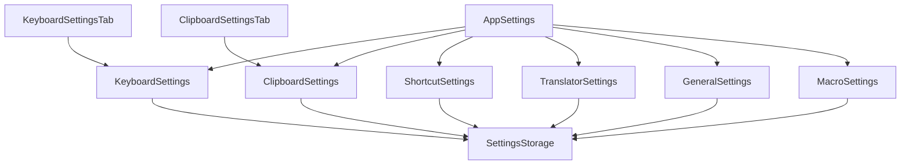
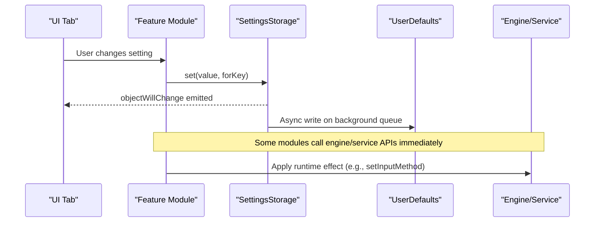
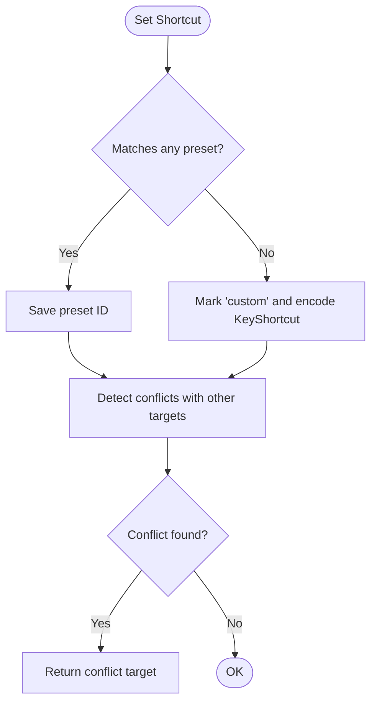
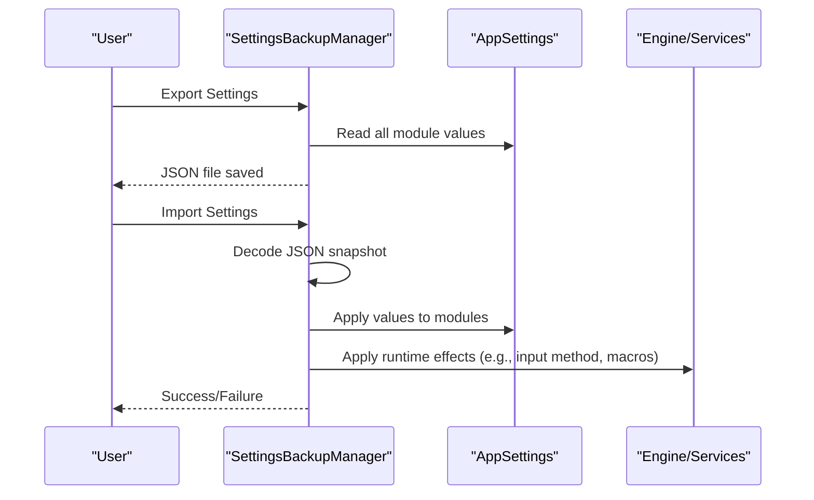
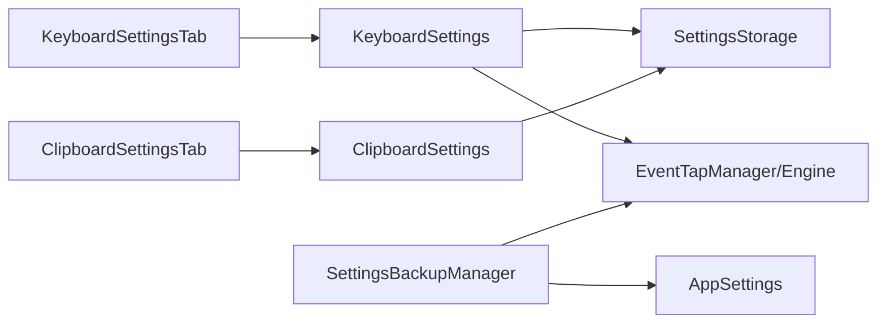

# Settings & Configuration

<cite>
**Referenced Files in This Document**
- [AppSettings.swift](file://macos/skey-app/Sources/Shared/Settings/AppSettings.swift)
- [SettingsModule.swift](file://macos/skey-app/Sources/Shared/Settings/SettingsModule.swift)
- [SettingsStorage.swift](file://macos/skey-app/Sources/Shared/Settings/SettingsStorage.swift)
- [KeyboardSettings.swift](file://macos/skey-app/Sources/Shared/Settings/Modules/KeyboardSettings.swift)
- [ClipboardSettings.swift](file://macos/skey-app/Sources/Shared/Settings/Modules/ClipboardSettings.swift)
- [ShortcutSettings.swift](file://macos/skey-app/Sources/Shared/Settings/Modules/ShortcutSettings.swift)
- [TranslatorSettings.swift](file://macos/skey-app/Sources/Shared/Settings/Modules/TranslatorSettings.swift)
- [GeneralSettings.swift](file://macos/skey-app/Sources/Shared/Settings/Modules/GeneralSettings.swift)
- [MacroSettings.swift](file://macos/skey-app/Sources/Shared/Settings/Modules/MacroSettings.swift)
- [SettingsBackupManager.swift](file://macos/skey-app/Sources/Shared/Settings/Backup/SettingsBackupManager.swift)
- [KeyShortcut.swift](file://macos/skey-app/Sources/Shared/Shortcuts/KeyShortcut.swift)
- [KeyboardSettingsTab.swift](file://macos/skey-app/Sources/Features/Settings/UI/Tabs/KeyboardSettingsTab.swift)
- [ClipboardSettingsTab.swift](file://macos/skey-app/Sources/Features/Settings/UI/Tabs/ClipboardSettingsTab.swift)
</cite>

## Table of Contents
1. [Introduction](#introduction)
2. [Project Structure](#project-structure)
3. [Core Components](#core-components)
4. [Architecture Overview](#architecture-overview)
5. [Detailed Component Analysis](#detailed-component-analysis)
6. [Dependency Analysis](#dependency-analysis)
7. [Performance Considerations](#performance-considerations)
8. [Troubleshooting Guide](#troubleshooting-guide)
9. [Conclusion](#conclusion)

## Introduction
This document explains the settings and configuration system that powers real-time, modular preference management across keyboard, clipboard, shortcuts, translation, macros, and general application behavior. It covers:
- Modular organization with dedicated modules for each feature area
- Default value registration, validation, and persistence
- Import/export and backup workflows
- Real-time updates applied without restarts
- Best practices for complex setting hierarchies and user experience
- How settings influence runtime behavior across features

## Project Structure
The settings subsystem is organized around a central hub that composes multiple feature-specific modules. Each module encapsulates its own keys, defaults, and behaviors while sharing a high-performance storage layer. UI tabs bind to these modules to provide live editing experiences.

**Diagram sources**
- [AppSettings.swift:10-36](file://macos/skey-app/Sources/Shared/Settings/AppSettings.swift#L10-L36)
- [KeyboardSettings.swift:6-55](file://macos/skey-app/Sources/Shared/Settings/Modules/KeyboardSettings.swift#L6-L55)
- [ClipboardSettings.swift:31-85](file://macos/skey-app/Sources/Shared/Settings/Modules/ClipboardSettings.swift#L31-L85)
- [ShortcutSettings.swift:20-85](file://macos/skey-app/Sources/Shared/Settings/Modules/ShortcutSettings.swift#L20-L85)
- [TranslatorSettings.swift:6-27](file://macos/skey-app/Sources/Shared/Settings/Modules/TranslatorSettings.swift#L6-L27)
- [GeneralSettings.swift:7-31](file://macos/skey-app/Sources/Shared/Settings/Modules/GeneralSettings.swift#L7-L31)
- [MacroSettings.swift:6-45](file://macos/skey-app/Sources/Shared/Settings/Modules/MacroSettings.swift#L6-L45)
- [SettingsStorage.swift:11-21](file://macos/skey-app/Sources/Shared/Settings/SettingsStorage.swift#L11-L21)
- [KeyboardSettingsTab.swift:6-12](file://macos/skey-app/Sources/Features/Settings/UI/Tabs/KeyboardSettingsTab.swift#L6-L12)
- [ClipboardSettingsTab.swift:6-11](file://macos/skey-app/Sources/Features/Settings/UI/Tabs/ClipboardSettingsTab.swift#L6-L11)

**Section sources**
- [AppSettings.swift:10-36](file://macos/skey-app/Sources/Shared/Settings/AppSettings.swift#L10-L36)
- [SettingsStorage.swift:11-21](file://macos/skey-app/Sources/Shared/Settings/SettingsStorage.swift#L11-L21)
- [KeyboardSettingsTab.swift:6-12](file://macos/skey-app/Sources/Features/Settings/UI/Tabs/KeyboardSettingsTab.swift#L6-L12)
- [ClipboardSettingsTab.swift:6-11](file://macos/skey-app/Sources/Features/Settings/UI/Tabs/ClipboardSettingsTab.swift#L6-L11)

## Core Components
- Central hub: Aggregates all feature modules and exposes a unified API for reset operations.
- Module protocol: Defines common capabilities like default registration and reset-to-defaults.
- Storage layer: Thread-safe in-memory cache with asynchronous background persistence to UserDefaults.
- Feature modules: Keyboard, Clipboard, Shortcuts, Translator, General, Macro.
- Backup manager: Snapshot, import, export, and apply settings across modules.

Key responsibilities:
- Defaults: Each module registers its defaults once at initialization.
- Persistence: All writes update RAM immediately and persist asynchronously.
- Reactivity: Modules emit changes via Combine’s ObservableObject so UI updates instantly.
- Validation: Enumerated types and getters enforce safe values; some setters include guards or fallbacks.

**Section sources**
- [SettingsModule.swift:6-16](file://macos/skey-app/Sources/Shared/Settings/SettingsModule.swift#L6-L16)
- [SettingsStorage.swift:7-119](file://macos/skey-app/Sources/Shared/Settings/SettingsStorage.swift#L7-L119)
- [AppSettings.swift:10-43](file://macos/skey-app/Sources/Shared/Settings/AppSettings.swift#L10-L43)

## Architecture Overview
The architecture separates concerns into layers:
- UI Layer: SwiftUI tabs bind directly to observed settings modules.
- Settings Layer: Feature modules expose typed properties with defaults and persistence.
- Storage Layer: A single shared storage provides fast reads and async writes.
- Runtime Integration: Some settings trigger immediate engine or service updates (e.g., input method, spell check).

**Diagram sources**
- [KeyboardSettingsTab.swift:63-127](file://macos/skey-app/Sources/Features/Settings/UI/Tabs/KeyboardSettingsTab.swift#L63-L127)
- [KeyboardSettings.swift:70-177](file://macos/skey-app/Sources/Shared/Settings/Modules/KeyboardSettings.swift#L70-L177)
- [SettingsStorage.swift:100-114](file://macos/skey-app/Sources/Shared/Settings/SettingsStorage.swift#L100-L114)

## Detailed Component Analysis

### AppSettings Hub
- Composes all modules and provides a global reset function.
- Ensures consistent lifecycle by initializing each module with the shared storage.

Best practices demonstrated:
- Centralized access point for cross-module operations.
- Encapsulation of module list for future extensibility.

**Section sources**
- [AppSettings.swift:10-43](file://macos/skey-app/Sources/Shared/Settings/AppSettings.swift#L10-L43)

### SettingsModule Protocol
- Standardizes prefix-based namespacing, default registration, and reset behavior.
- Enables uniform handling across modules.

**Section sources**
- [SettingsModule.swift:6-16](file://macos/skey-app/Sources/Shared/Settings/SettingsModule.swift#L6-L16)

### SettingsStorage
- In-memory cache protected by a lock for thread safety.
- Reads are O(1) from RAM; writes update RAM and schedule background persistence.
- Supports registering defaults and lazy loading into cache.

Complexity:
- Read: O(1) time, O(1) space per key.
- Write: O(1) time for RAM update; disk I/O deferred off hot path.

**Section sources**
- [SettingsStorage.swift:11-119](file://macos/skey-app/Sources/Shared/Settings/SettingsStorage.swift#L11-L119)

### KeyboardSettings
- Manages input method, charset, spelling, quick typing rules, app exclusions.
- Maintains an in-memory cache of excluded apps for zero-latency checks in the typing pipeline.
- Exposed properties emit changes and persist asynchronously.

Validation and defaults:
- Defaults registered at init ensure safe fallbacks.
- Getter methods return safe defaults when missing.

Runtime effects:
- Changes can immediately update engine behavior (e.g., input method, spell check).

**Section sources**
- [KeyboardSettings.swift:6-263](file://macos/skey-app/Sources/Shared/Settings/Modules/KeyboardSettings.swift#L6-L263)
- [KeyboardSettingsTab.swift:63-255](file://macos/skey-app/Sources/Features/Settings/UI/Tabs/KeyboardSettingsTab.swift#L63-L255)

### ClipboardSettings
- Controls history limits, search mode, auto-paste, save policies, appearance, and privacy-related toggles.
- Uses enums for sort order, pin location, highlight style, and popup position.

Validation and defaults:
- Enum-backed properties parse raw strings safely with fallbacks.
- Numeric constraints enforced in getters (e.g., preview delay must be positive).

**Section sources**
- [ClipboardSettings.swift:6-268](file://macos/skey-app/Sources/Shared/Settings/Modules/ClipboardSettings.swift#L6-L268)
- [ClipboardSettingsTab.swift:50-183](file://macos/skey-app/Sources/Features/Settings/UI/Tabs/ClipboardSettingsTab.swift#L50-L183)

### ShortcutSettings
- Preset-based shortcuts with optional custom overrides.
- Conflict detection across targets (language toggle, clipboard, cleaner, AI).
- Stores presets as string IDs and encodes custom shortcuts as JSON data.

Validation and defaults:
- Defaults register preset IDs.
- Custom shortcut resolution falls back to known presets if decoding fails.

Conflict detection flow:

**Diagram sources**
- [ShortcutSettings.swift:109-132](file://macos/skey-app/Sources/Shared/Settings/Modules/ShortcutSettings.swift#L109-L132)
- [ShortcutSettings.swift:144-167](file://macos/skey-app/Sources/Shared/Settings/Modules/ShortcutSettings.swift#L144-L167)
- [ShortcutSettings.swift:187-210](file://macos/skey-app/Sources/Shared/Settings/Modules/ShortcutSettings.swift#L187-L210)
- [ShortcutSettings.swift:222-245](file://macos/skey-app/Sources/Shared/Settings/Modules/ShortcutSettings.swift#L222-L245)
- [ShortcutSettings.swift:276-286](file://macos/skey-app/Sources/Shared/Settings/Modules/ShortcutSettings.swift#L276-L286)

**Section sources**
- [ShortcutSettings.swift:20-330](file://macos/skey-app/Sources/Shared/Settings/Modules/ShortcutSettings.swift#L20-L330)
- [KeyShortcut.swift:68-159](file://macos/skey-app/Sources/Shared/Shortcuts/KeyShortcut.swift#L68-L159)

### TranslatorSettings
- Manages translation engines list, target language, and auto-detection.
- Engines stored as JSON; reordering and toggling supported.

Validation and defaults:
- Defaults set target language and auto-detect flag.
- Engines list falls back to a default list if none stored.

**Section sources**
- [TranslatorSettings.swift:6-112](file://macos/skey-app/Sources/Shared/Settings/Modules/TranslatorSettings.swift#L6-L112)

### GeneralSettings
- Launch-at-login, app language, update checks, debug mode.
- Integrates with system services to enable/disable launch at login.

Validation and defaults:
- Defaults ensure sane initial state.
- Debug mode restricted to debug builds.

**Section sources**
- [GeneralSettings.swift:7-92](file://macos/skey-app/Sources/Shared/Settings/Modules/GeneralSettings.swift#L7-L92)

### MacroSettings
- Toggles macro functionality and manages macro items.
- Items persisted separately and reloaded into the macro engine upon changes.

Validation and defaults:
- Defaults define feature flags.
- Items load from storage or initialize with built-in defaults.

**Section sources**
- [MacroSettings.swift:6-125](file://macos/skey-app/Sources/Shared/Settings/Modules/MacroSettings.swift#L6-L125)

### Backup Manager (Import/Export)
- Creates snapshots of all modules, exports to JSON, imports from JSON, and applies changes.
- Applies settings to both in-memory modules and runtime engine/services.

Workflow:

**Diagram sources**
- [SettingsBackupManager.swift:90-166](file://macos/skey-app/Sources/Shared/Settings/Backup/SettingsBackupManager.swift#L90-L166)
- [SettingsBackupManager.swift:168-224](file://macos/skey-app/Sources/Shared/Settings/Backup/SettingsBackupManager.swift#L168-L224)
- [SettingsBackupManager.swift:227-313](file://macos/skey-app/Sources/Shared/Settings/Backup/SettingsBackupManager.swift#L227-L313)

**Section sources**
- [SettingsBackupManager.swift:90-313](file://macos/skey-app/Sources/Shared/Settings/Backup/SettingsBackupManager.swift#L90-L313)

## Dependency Analysis
- AppSettings depends on all feature modules.
- Each module depends on SettingsStorage for persistence.
- UI tabs depend on specific modules for reactive bindings.
- Backup manager depends on AppSettings and external services/engine to apply runtime changes.

**Diagram sources**
- [KeyboardSettingsTab.swift:6-12](file://macos/skey-app/Sources/Features/Settings/UI/Tabs/KeyboardSettingsTab.swift#L6-L12)
- [ClipboardSettingsTab.swift:6-11](file://macos/skey-app/Sources/Features/Settings/UI/Tabs/ClipboardSettingsTab.swift#L6-L11)
- [KeyboardSettings.swift:70-177](file://macos/skey-app/Sources/Shared/Settings/Modules/KeyboardSettings.swift#L70-L177)
- [SettingsBackupManager.swift:227-313](file://macos/skey-app/Sources/Shared/Settings/Backup/SettingsBackupManager.swift#L227-L313)

**Section sources**
- [AppSettings.swift:10-36](file://macos/skey-app/Sources/Shared/Settings/AppSettings.swift#L10-L36)
- [SettingsStorage.swift:11-21](file://macos/skey-app/Sources/Shared/Settings/SettingsStorage.swift#L11-L21)
- [SettingsBackupManager.swift:227-313](file://macos/skey-app/Sources/Shared/Settings/Backup/SettingsBackupManager.swift#L227-L313)

## Performance Considerations
- Hot-path reads bypass disk I/O using an in-memory cache.
- Writes are non-blocking; persistence occurs asynchronously on a background queue.
- Excluded apps cache enables O(1) lookup during typing events.
- Avoid heavy work in setters; delegate to background tasks where necessary.

[No sources needed since this section provides general guidance]

## Troubleshooting Guide
Common issues and resolutions:
- Settings not persisting: Ensure setter calls are used; direct storage writes should go through the module’s property to trigger persistence and UI updates.
- UI not updating: Confirm the module emits changes via ObservableObject; verify bindings in UI tabs.
- Conflicting shortcuts: Use conflict detection helpers to identify overlaps before applying new shortcuts.
- Import failures: Validate JSON structure and date formats; check logs for decode errors.

Operational tips:
- Reset individual modules to defaults to isolate misconfigurations.
- Use export/import to compare configurations across environments.
- For keyboard-related changes, verify engine callbacks are invoked after setting values.

**Section sources**
- [ShortcutSettings.swift:276-286](file://macos/skey-app/Sources/Shared/Settings/Modules/ShortcutSettings.swift#L276-L286)
- [SettingsBackupManager.swift:199-224](file://macos/skey-app/Sources/Shared/Settings/Backup/SettingsBackupManager.swift#L199-L224)
- [KeyboardSettings.swift:57-68](file://macos/skey-app/Sources/Shared/Settings/Modules/KeyboardSettings.swift#L57-L68)

## Conclusion
The settings system provides a robust, modular, and performant foundation for managing preferences across the application. Its design emphasizes:
- Clear separation of concerns via feature modules
- High-performance storage with minimal latency
- Reactive UI updates without restarts
- Comprehensive backup and migration support
- Safe defaults and validation to maintain consistency

Adhering to the established patterns ensures scalability and reliability as new features and settings are added.

[No sources needed since this section summarizes without analyzing specific files]