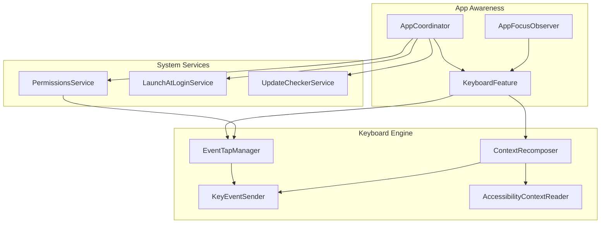
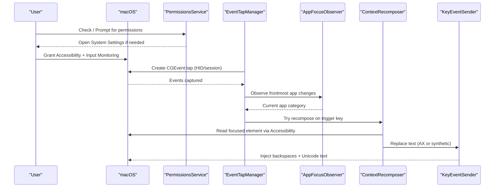
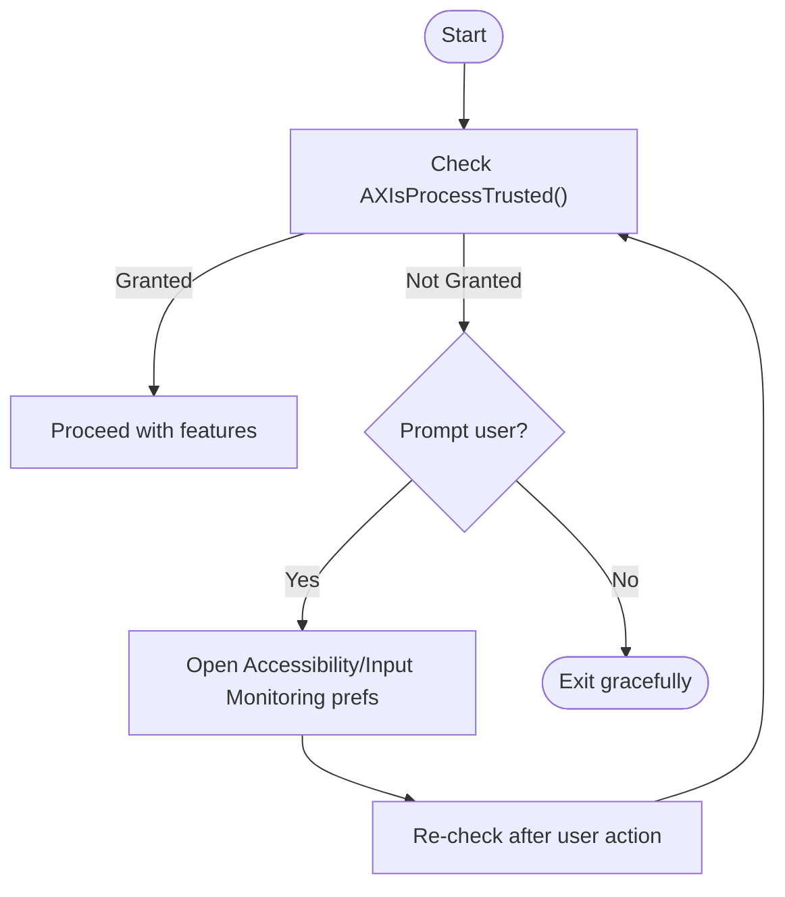
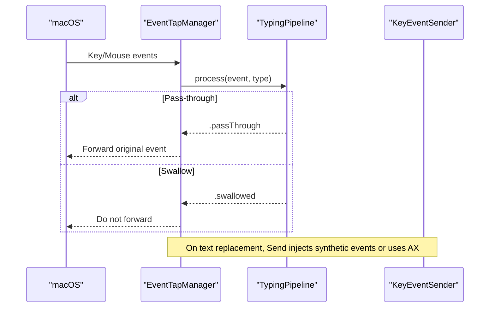
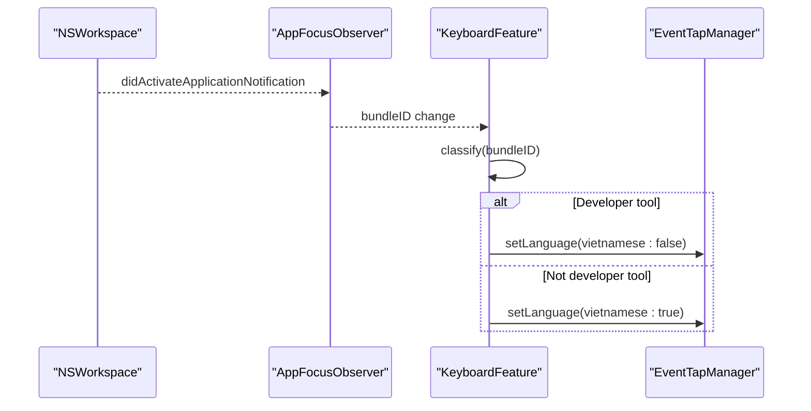
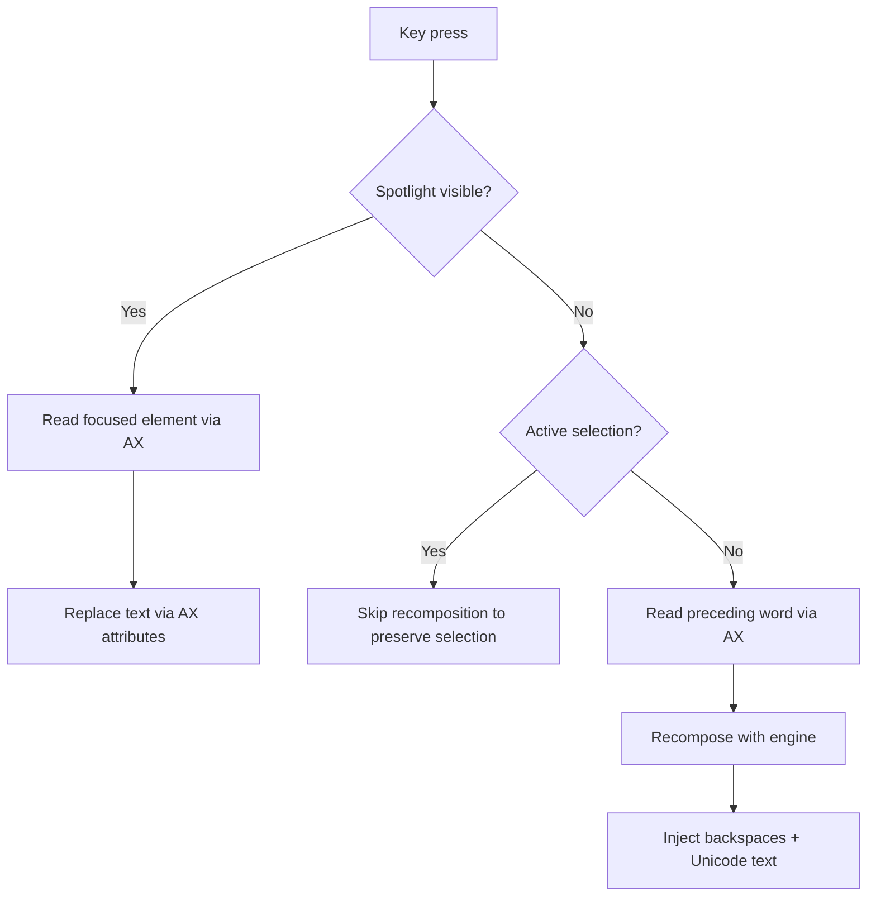
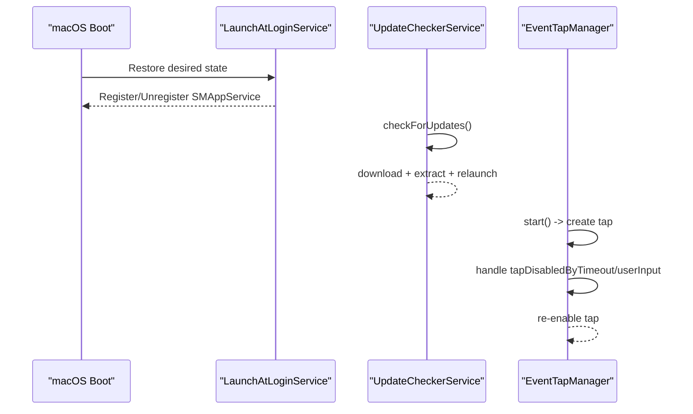
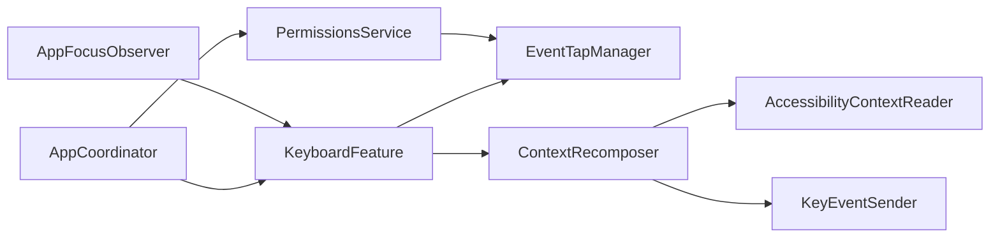

# System Integration

<cite>
**Referenced Files in This Document**
- [PermissionsService.swift](file://macos/skey-app/Sources/Shared/Services/PermissionsService.swift)
- [EventTapManager.swift](file://macos/skey-app/Sources/Features/Keyboard/EventHandling/EventTapManager.swift)
- [AccessibilityContextReader.swift](file://macos/skey-app/Sources/Features/Keyboard/Context/AccessibilityContextReader.swift)
- [AppFocusObserver.swift](file://macos/skey-app/Sources/Shared/Services/AppFocusObserver.swift)
- [ContextRecomposer.swift](file://macos/skey-app/Sources/Features/Keyboard/Context/ContextRecomposer.swift)
- [KeyEventSender.swift](file://macos/skey-app/Sources/Features/Keyboard/EventHandling/KeyEventSender.swift)
- [LaunchAtLoginService.swift](file://macos/skey-app/Sources/Shared/Services/LaunchAtLoginService.swift)
- [UpdateCheckerService.swift](file://macos/skey-app/Sources/Shared/Services/UpdateCheckerService.swift)
- [KeyboardFeature.swift](file://macos/skey-app/Sources/Features/Keyboard/KeyboardFeature.swift)
- [AppCoordinator.swift](file://macos/skey-app/Sources/App/AppCoordinator.swift)
- [GeneralSettingsTab.swift](file://macos/skey-app/Sources/Features/Settings/UI/Tabs/GeneralSettingsTab.swift)
</cite>

## Table of Contents
1. Introduction
2. Project Structure
3. Core Components
4. Architecture Overview
5. Detailed Component Analysis
6. Dependency Analysis
7. Performance Considerations
8. Troubleshooting Guide
9. Conclusion

## Introduction
This document explains how the application integrates deeply with macOS to provide system-level keyboard monitoring, accessibility-driven text manipulation, and smart application-aware typing behavior. It covers:
- The macOS accessibility permissions model and how the app requests and manages user consent for keyboard monitoring and application context detection.
- The smart application switching mechanism that adjusts typing behavior based on the active application type.
- Background services such as launch at login, update checking, and health monitoring.
- Spotlight search integration, omnibox compatibility, and universal app support.
- Security implications, privacy considerations, and graceful degradation when permissions are not granted.

## Project Structure
The system integration is implemented across several focused modules:
- Permissions and system settings access
- Low-level event capture and processing
- Accessibility-based text reading and replacement
- Application focus observation and classification
- Smart switching and context recomposition
- Background services (launch at login, updates)
- UI hooks to guide users through permission flows

**Diagram sources**
- [PermissionsService.swift:12-40](file://macos/skey-app/Sources/Shared/Services/PermissionsService.swift#L12-L40)
- [EventTapManager.swift:17-103](file://macos/skey-app/Sources/Features/Keyboard/EventHandling/EventTapManager.swift#L17-L103)
- [AccessibilityContextReader.swift:16-77](file://macos/skey-app/Sources/Features/Keyboard/Context/AccessibilityContextReader.swift#L16-L77)
- [AppFocusObserver.swift:14-150](file://macos/skey-app/Sources/Shared/Services/AppFocusObserver.swift#L14-L150)
- [ContextRecomposer.swift:19-97](file://macos/skey-app/Sources/Features/Keyboard/Context/ContextRecomposer.swift#L19-L97)
- [KeyEventSender.swift:30-51](file://macos/skey-app/Sources/Features/Keyboard/EventHandling/KeyEventSender.swift#L30-L51)
- [LaunchAtLoginService.swift:6-49](file://macos/skey-app/Sources/Shared/Services/LaunchAtLoginService.swift#L6-L49)
- [UpdateCheckerService.swift:19-144](file://macos/skey-app/Sources/Shared/Services/UpdateCheckerService.swift#L19-L144)
- [KeyboardFeature.swift:35-75](file://macos/skey-app/Sources/Features/Keyboard/KeyboardFeature.swift#L35-L75)
- [AppCoordinator.swift:22-43](file://macos/skey-app/Sources/App/AppCoordinator.swift#L22-L43)

**Section sources**
- [PermissionsService.swift:12-40](file://macos/skey-app/Sources/Shared/Services/PermissionsService.swift#L12-L40)
- [EventTapManager.swift:17-103](file://macos/skey-app/Sources/Features/Keyboard/EventHandling/EventTapManager.swift#L17-L103)
- [AccessibilityContextReader.swift:16-77](file://macos/skey-app/Sources/Features/Keyboard/Context/AccessibilityContextReader.swift#L16-L77)
- [AppFocusObserver.swift:14-150](file://macos/skey-app/Sources/Shared/Services/AppFocusObserver.swift#L14-L150)
- [ContextRecomposer.swift:19-97](file://macos/skey-app/Sources/Features/Keyboard/Context/ContextRecomposer.swift#L19-L97)
- [KeyEventSender.swift:30-51](file://macos/skey-app/Sources/Features/Keyboard/EventHandling/KeyEventSender.swift#L30-L51)
- [LaunchAtLoginService.swift:6-49](file://macos/skey-app/Sources/Shared/Services/LaunchAtLoginService.swift#L6-L49)
- [UpdateCheckerService.swift:19-144](file://macos/skey-app/Sources/Shared/Services/UpdateCheckerService.swift#L19-L144)
- [KeyboardFeature.swift:35-75](file://macos/skey-app/Sources/Features/Keyboard/KeyboardFeature.swift#L35-L75)
- [AppCoordinator.swift:22-43](file://macos/skey-app/Sources/App/AppCoordinator.swift#L22-L43)

## Core Components
- PermissionsService: Centralizes checks and prompts for macOS Accessibility and Input Monitoring permissions. Provides direct links to System Settings for quick remediation.
- EventTapManager: Creates and manages a low-level CGEvent tap to intercept keyboard events, runs them on a dedicated thread, and delegates processing to the typing pipeline.
- AccessibilityContextReader: Uses the macOS Accessibility API to read the focused element, detect selections, and replace text directly—especially important for Spotlight overlays and omnibox autocomplete.
- AppFocusObserver: Observes frontmost app changes and classifies apps into categories (web browser, developer tool, Electron/chat, Spotlight, native app) to drive smart switching and feature toggles.
- ContextRecomposer: Coordinates full-word recomposition by reading the preceding word via Accessibility, recomposing it using the engine, and atomically replacing it in the target field.
- KeyEventSender: Injects synthetic backspaces and Unicode text into the active application, with special handling for Spotlight overlay via direct AX replacement.
- LaunchAtLoginService: Registers/unregisters the app as a login item using ServiceManagement on modern macOS versions.
- UpdateCheckerService: Checks GitHub releases for updates, downloads assets, extracts, and performs an atomic app replacement with relaunch.

**Section sources**
- [PermissionsService.swift:12-40](file://macos/skey-app/Sources/Shared/Services/PermissionsService.swift#L12-L40)
- [EventTapManager.swift:17-103](file://macos/skey-app/Sources/Features/Keyboard/EventHandling/EventTapManager.swift#L17-L103)
- [AccessibilityContextReader.swift:16-77](file://macos/skey-app/Sources/Features/Keyboard/Context/AccessibilityContextReader.swift#L16-L77)
- [AppFocusObserver.swift:14-150](file://macos/skey-app/Sources/Shared/Services/AppFocusObserver.swift#L14-L150)
- [ContextRecomposer.swift:19-97](file://macos/skey-app/Sources/Features/Keyboard/Context/ContextRecomposer.swift#L19-L97)
- [KeyEventSender.swift:30-51](file://macos/skey-app/Sources/Features/Keyboard/EventHandling/KeyEventSender.swift#L30-L51)
- [LaunchAtLoginService.swift:6-49](file://macos/skey-app/Sources/Shared/Services/LaunchAtLoginService.swift#L6-L49)
- [UpdateCheckerService.swift:19-144](file://macos/skey-app/Sources/Shared/Services/UpdateCheckerService.swift#L19-L144)

## Architecture Overview
The system integrates at multiple layers:
- Permission layer: Validates and guides users to enable Accessibility and Input Monitoring.
- Capture layer: A dedicated event tap captures keystrokes and mouse events on a high-priority thread.
- Intelligence layer: AppFocusObserver classifies the active app; ContextRecomposer reads and rewrites text via Accessibility APIs.
- Output layer: KeyEventSender injects synthesized events or uses direct AX replacement for overlays like Spotlight.
- Background services: Launch at login and update checker run independently to maintain availability and currency.

**Diagram sources**
- [PermissionsService.swift:12-40](file://macos/skey-app/Sources/Shared/Services/PermissionsService.swift#L12-L40)
- [EventTapManager.swift:81-103](file://macos/skey-app/Sources/Features/Keyboard/EventHandling/EventTapManager.swift#L81-L103)
- [AppFocusObserver.swift:114-150](file://macos/skey-app/Sources/Shared/Services/AppFocusObserver.swift#L114-L150)
- [ContextRecomposer.swift:40-97](file://macos/skey-app/Sources/Features/Keyboard/Context/ContextRecomposer.swift#L40-L97)
- [KeyEventSender.swift:30-51](file://macos/skey-app/Sources/Features/Keyboard/EventHandling/KeyEventSender.swift#L30-L51)

## Detailed Component Analysis

### Accessibility Permissions Model and Consent Flow
- The app checks whether it has global EventTap and Accessibility privileges using system APIs. If not, it can prompt the user or open the appropriate System Settings pages for Accessibility and Input Monitoring.
- The UI exposes buttons to quickly navigate to the correct privacy panes, improving user experience and reducing friction.

**Diagram sources**
- [PermissionsService.swift:12-40](file://macos/skey-app/Sources/Shared/Services/PermissionsService.swift#L12-L40)
- [GeneralSettingsTab.swift:91-115](file://macos/skey-app/Sources/Features/Settings/UI/Tabs/GeneralSettingsTab.swift#L91-L115)

**Section sources**
- [PermissionsService.swift:12-40](file://macos/skey-app/Sources/Shared/Services/PermissionsService.swift#L12-L40)
- [GeneralSettingsTab.swift:91-115](file://macos/skey-app/Sources/Features/Settings/UI/Tabs/GeneralSettingsTab.swift#L91-L115)

### Keyboard Monitoring and Event Processing
- EventTapManager creates a CGEvent tap, preferring HID-level capture and falling back to session-level capture if necessary. It runs a dedicated thread hosting the tap’s run loop for reliable, low-latency event delivery.
- Events are delegated to the typing pipeline, which decides whether to pass through or swallow events. The manager also handles recovery from tap timeouts or user-disabled states.

**Diagram sources**
- [EventTapManager.swift:81-103](file://macos/skey-app/Sources/Features/Keyboard/EventHandling/EventTapManager.swift#L81-L103)
- [EventTapManager.swift:172-188](file://macos/skey-app/Sources/Features/Keyboard/EventHandling/EventTapManager.swift#L172-L188)
- [KeyEventSender.swift:30-51](file://macos/skey-app/Sources/Features/Keyboard/EventHandling/KeyEventSender.swift#L30-L51)

**Section sources**
- [EventTapManager.swift:81-103](file://macos/skey-app/Sources/Features/Keyboard/EventHandling/EventTapManager.swift#L81-L103)
- [EventTapManager.swift:172-188](file://macos/skey-app/Sources/Features/Keyboard/EventHandling/EventTapManager.swift#L172-L188)

### Smart Application Switching
- AppFocusObserver tracks the frontmost app and classifies it into categories (web browser, developer tool, Electron/chat, Spotlight, native).
- KeyboardFeature listens to focus changes and toggles Vietnamese input mode automatically when entering developer tools, restoring it when leaving.

**Diagram sources**
- [AppFocusObserver.swift:114-150](file://macos/skey-app/Sources/Shared/Services/AppFocusObserver.swift#L114-L150)
- [KeyboardFeature.swift:57-75](file://macos/skey-app/Sources/Features/Keyboard/KeyboardFeature.swift#L57-L75)

**Section sources**
- [AppFocusObserver.swift:14-150](file://macos/skey-app/Sources/Shared/Services/AppFocusObserver.swift#L14-L150)
- [KeyboardFeature.swift:57-75](file://macos/skey-app/Sources/Features/Keyboard/KeyboardFeature.swift#L57-L75)

### Spotlight Search, Omnibox Compatibility, and Universal App Support
- Spotlight: The reader detects when Spotlight is visible and targets its search field specifically. It replaces text directly via Accessibility attributes to avoid latency and ensure accuracy.
- Omnibox: For browsers and similar fields, the reader detects active selections (e.g., autocomplete suggestions) and avoids interfering with selection state.
- Universal support: The app dynamically inspects applications’ bundles and frameworks to infer their type (browser, developer tool, Electron/chat), enabling consistent behavior across diverse apps.

**Diagram sources**
- [AccessibilityContextReader.swift:16-77](file://macos/skey-app/Sources/Features/Keyboard/Context/AccessibilityContextReader.swift#L16-L77)
- [AccessibilityContextReader.swift:79-140](file://macos/skey-app/Sources/Features/Keyboard/Context/AccessibilityContextReader.swift#L79-L140)
- [ContextRecomposer.swift:40-97](file://macos/skey-app/Sources/Features/Keyboard/Context/ContextRecomposer.swift#L40-L97)
- [KeyEventSender.swift:30-51](file://macos/skey-app/Sources/Features/Keyboard/EventHandling/KeyEventSender.swift#L30-L51)

**Section sources**
- [AccessibilityContextReader.swift:16-77](file://macos/skey-app/Sources/Features/Keyboard/Context/AccessibilityContextReader.swift#L16-L77)
- [AccessibilityContextReader.swift:79-140](file://macos/skey-app/Sources/Features/Keyboard/Context/AccessibilityContextReader.swift#L79-L140)
- [ContextRecomposer.swift:40-97](file://macos/skey-app/Sources/Features/Keyboard/Context/ContextRecomposer.swift#L40-L97)
- [KeyEventSender.swift:30-51](file://macos/skey-app/Sources/Features/Keyboard/EventHandling/KeyEventSender.swift#L30-L51)

### Background Services: Launch at Login, Updates, Health Monitoring
- Launch at Login: Registers/unregisters the app as a login item using ServiceManagement on macOS 13+. Syncs stored preferences with system state on launch.
- Update Checker: Periodically queries GitHub releases, compares semantic versions, downloads assets, extracts, and performs an atomic replacement with relaunch.
- Health Monitoring: The app continuously monitors event tap status and foreground app changes; it also re-enables taps if disabled by timeout or user input, ensuring resilience.

**Diagram sources**
- [LaunchAtLoginService.swift:6-49](file://macos/skey-app/Sources/Shared/Services/LaunchAtLoginService.swift#L6-L49)
- [UpdateCheckerService.swift:53-144](file://macos/skey-app/Sources/Shared/Services/UpdateCheckerService.swift#L53-L144)
- [EventTapManager.swift:172-188](file://macos/skey-app/Sources/Features/Keyboard/EventHandling/EventTapManager.swift#L172-L188)

**Section sources**
- [LaunchAtLoginService.swift:6-49](file://macos/skey-app/Sources/Shared/Services/LaunchAtLoginService.swift#L6-L49)
- [UpdateCheckerService.swift:53-144](file://macos/skey-app/Sources/Shared/Services/UpdateCheckerService.swift#L53-L144)
- [EventTapManager.swift:172-188](file://macos/skey-app/Sources/Features/Keyboard/EventHandling/EventTapManager.swift#L172-L188)

## Dependency Analysis
- EventTapManager depends on PermissionsService to ensure system privileges before starting.
- AppFocusObserver drives KeyboardFeature’s smart switching logic and influences ContextRecomposer behavior.
- ContextRecomposer relies on AccessibilityContextReader for reading and writing text, and KeyEventSender for output.
- AppCoordinator orchestrates feature startup and connects status callbacks.

**Diagram sources**
- [PermissionsService.swift:12-40](file://macos/skey-app/Sources/Shared/Services/PermissionsService.swift#L12-L40)
- [EventTapManager.swift:17-103](file://macos/skey-app/Sources/Features/Keyboard/EventHandling/EventTapManager.swift#L17-L103)
- [AppFocusObserver.swift:114-150](file://macos/skey-app/Sources/Shared/Services/AppFocusObserver.swift#L114-L150)
- [KeyboardFeature.swift:35-75](file://macos/skey-app/Sources/Features/Keyboard/KeyboardFeature.swift#L35-L75)
- [ContextRecomposer.swift:40-97](file://macos/skey-app/Sources/Features/Keyboard/Context/ContextRecomposer.swift#L40-L97)
- [AccessibilityContextReader.swift:16-77](file://macos/skey-app/Sources/Features/Keyboard/Context/AccessibilityContextReader.swift#L16-L77)
- [KeyEventSender.swift:30-51](file://macos/skey-app/Sources/Features/Keyboard/EventHandling/KeyEventSender.swift#L30-L51)
- [AppCoordinator.swift:22-43](file://macos/skey-app/Sources/App/AppCoordinator.swift#L22-L43)

**Section sources**
- [AppCoordinator.swift:22-43](file://macos/skey-app/Sources/App/AppCoordinator.swift#L22-L43)
- [KeyboardFeature.swift:35-75](file://macos/skey-app/Sources/Features/Keyboard/KeyboardFeature.swift#L35-L75)

## Performance Considerations
- Dedicated thread for event tap ensures low-latency, non-blocking event processing.
- Unfair locks minimize contention for shared state (language toggle, focus observer cache).
- Zero-allocation paths for text injection reduce GC pressure and improve throughput.
- RAM cache for app classification avoids repeated filesystem scans.
- Direct AX replacement for Spotlight bypasses event loop delays and debounce quirks.

[No sources needed since this section provides general guidance]

## Troubleshooting Guide
- Missing Accessibility or Input Monitoring permissions: Use the settings UI to open the correct System Preferences pane and grant permissions. The app will re-check privileges and proceed accordingly.
- Event tap disabled by timeout or user input: The manager automatically re-enables the tap and continues capturing events.
- Spotlight text not updating: Ensure Spotlight is visible and focused; the reader uses direct AX replacement for reliability.
- Smart switching not working: Verify the app category detection and that smart switch is enabled in settings.

**Section sources**
- [PermissionsService.swift:12-40](file://macos/skey-app/Sources/Shared/Services/PermissionsService.swift#L12-L40)
- [EventTapManager.swift:172-188](file://macos/skey-app/Sources/Features/Keyboard/EventHandling/EventTapManager.swift#L172-L188)
- [AccessibilityContextReader.swift:16-77](file://macos/skey-app/Sources/Features/Keyboard/Context/AccessibilityContextReader.swift#L16-L77)
- [KeyboardFeature.swift:57-75](file://macos/skey-app/Sources/Features/Keyboard/KeyboardFeature.swift#L57-L75)

## Conclusion
The application integrates deeply with macOS through carefully managed permissions, robust event capture, and precise accessibility-driven text manipulation. Smart application switching enhances usability by adapting behavior to the active app type. Background services keep the app available and up-to-date. The design emphasizes performance, reliability, and user control while respecting security and privacy constraints. When permissions are not granted, the app gracefully degrades by guiding users to enable required capabilities and avoiding intrusive behavior.