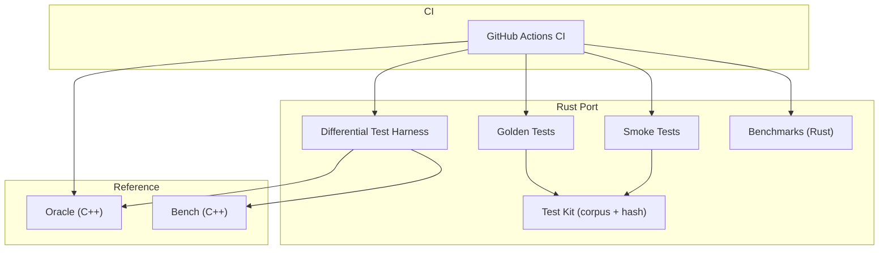
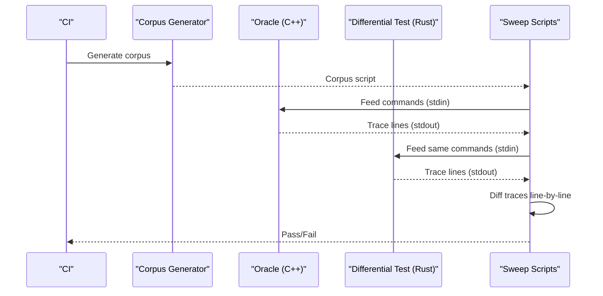
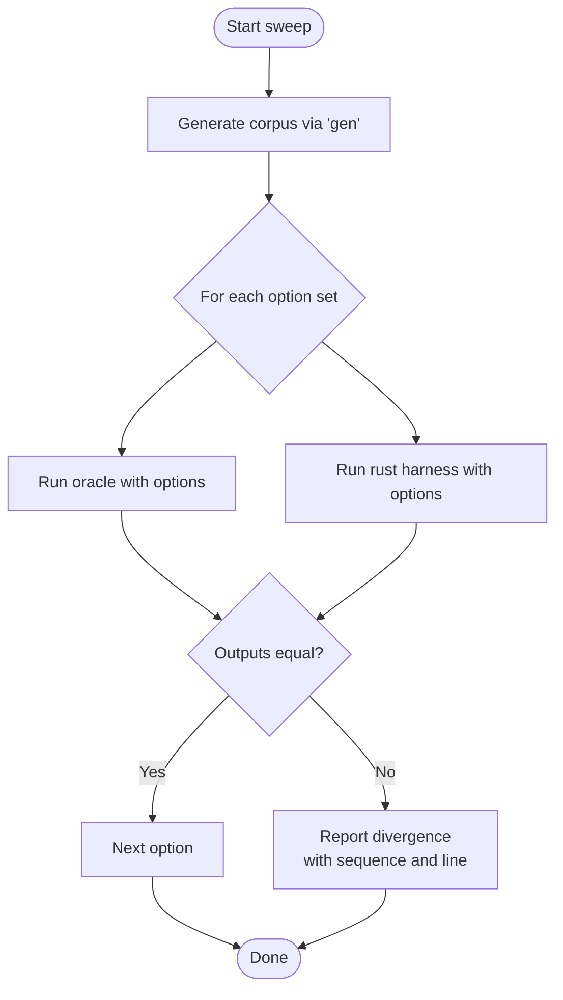
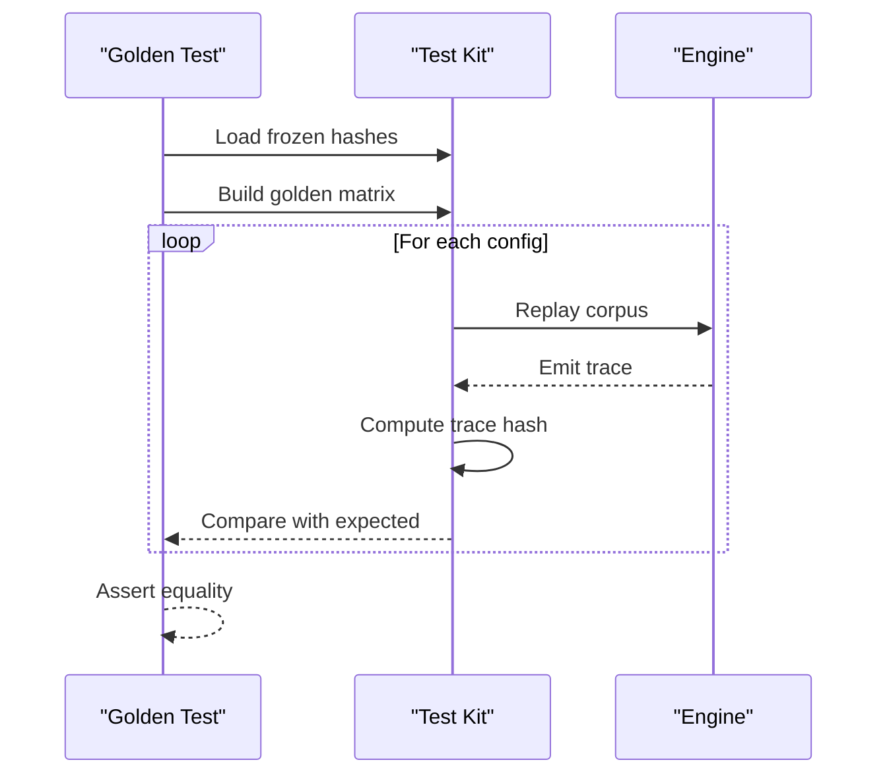
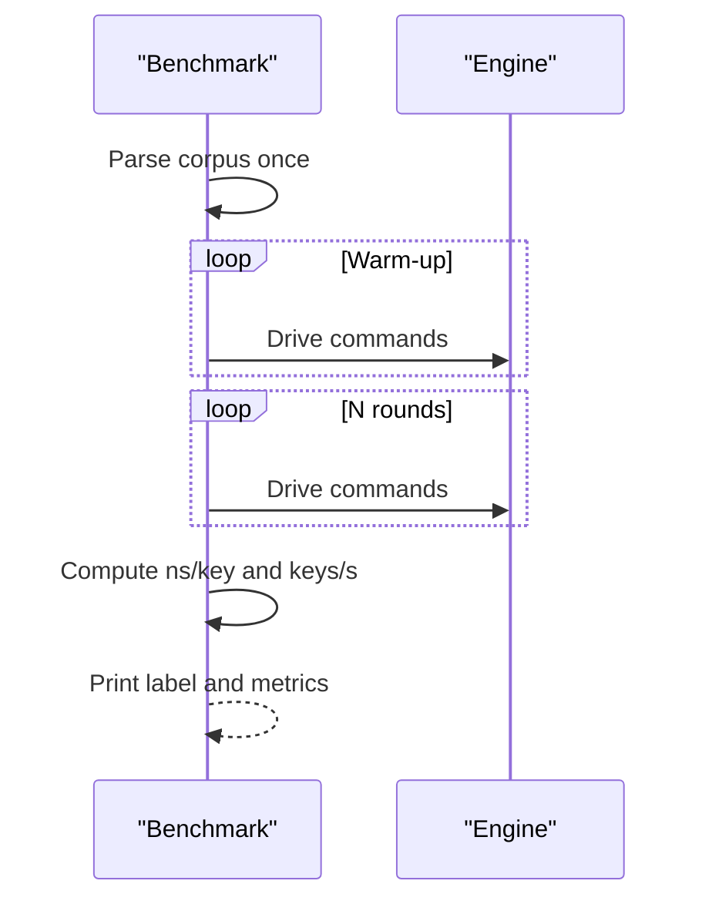
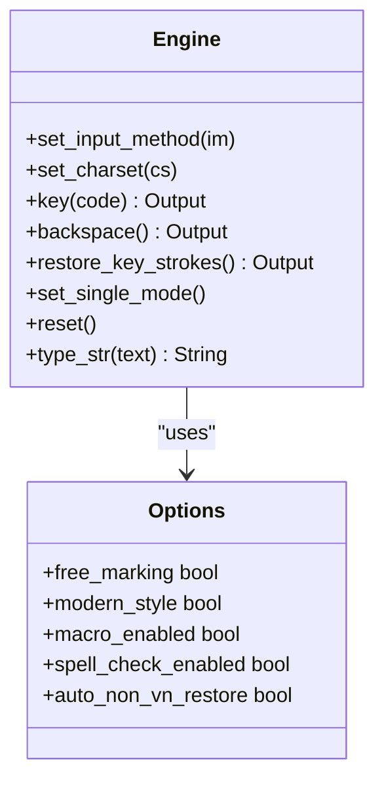
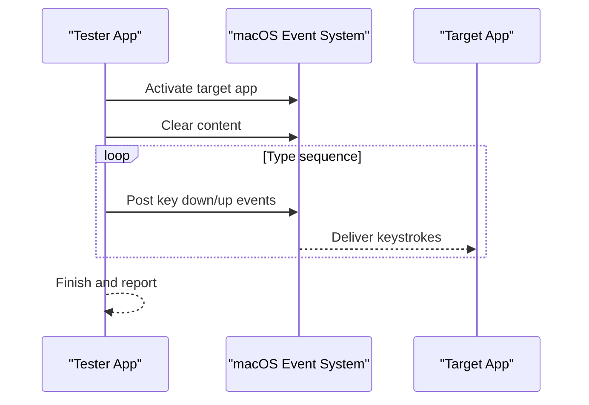
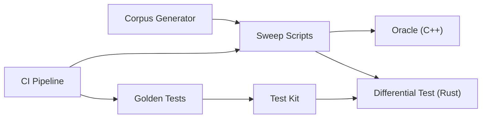

# Testing & Quality Assurance

<cite>
**Referenced Files in This Document**
- [ci.yml](file://.github/workflows/ci.yml)
- [oracle.cpp](file://port/oracle/oracle.cpp)
- [bench.cpp](file://port/bench/bench.cpp)
- [main.rs](file://port/difftest/src/main.rs)
- [sweep.py](file://port/difftest/sweep.py)
- [ctxsweep.py](file://port/difftest/ctxsweep.py)
- [soak.py](file://port/difftest/soak.py)
- [golden.rs](file://port/skey-core/tests/golden.rs)
- [testkit.rs](file://port/skey-core/src/testkit.rs)
- [bench.rs](file://port/skey-core/tests/bench.rs)
- [smoke.rs](file://port/skey-core/tests/smoke.rs)
- [simple_telex.rs](file://port/skey-core/tests/simple_telex.rs)
- [Cargo.toml](file://port/skey-core/Cargo.toml)
- [yandex_typing_tester.swift](file://macos/skey-app/Tests/yandex_typing_tester.swift)
</cite>

## Table of Contents
1. Introduction
2. Project Structure
3. Core Components
4. Architecture Overview
5. Detailed Component Analysis
6. Dependency Analysis
7. Performance Considerations
8. Troubleshooting Guide
9. Conclusion

## Introduction
This document explains the testing and quality assurance framework for the Vietnamese typing engine. It focuses on:
- Differential testing against the original C++ UniKey reference implementation to maintain compatibility.
- A benchmark suite measuring keystroke latency, throughput, and configuration coverage.
- Golden file testing to prevent regressions across input methods and charsets.
- Unit tests for individual components and end-to-end automation for macOS.
- Continuous integration triggers and quality gates for code submissions.
- Performance profiling, memory leak detection, and stress testing strategies that validate zero-allocation behavior of the Rust core engine.

## Project Structure
The testing and QA assets are organized around three layers:
- Reference oracle and benchmarks (C++): provide the behavioral contract and baseline performance.
- Rust harnesses and tests: implement differential testing, golden checks, unit tests, and benchmarks.
- CI pipeline: orchestrates builds, sweeps, and checks on push, pull requests, and nightly schedules.

**Diagram sources**
- [ci.yml:1-98](file://.github/workflows/ci.yml#L1-L98)
- [oracle.cpp:1-161](file://port/oracle/oracle.cpp#L1-L161)
- [bench.cpp:1-83](file://port/bench/bench.cpp#L1-L83)
- [main.rs:1-259](file://port/difftest/src/main.rs#L1-L259)
- [testkit.rs:1-180](file://port/skey-core/src/testkit.rs#L1-L180)
- [golden.rs:1-29](file://port/skey-core/tests/golden.rs#L1-L29)
- [smoke.rs:1-210](file://port/skey-core/tests/smoke.rs#L1-L210)
- [bench.rs:1-66](file://port/skey-core/tests/bench.rs#L1-L66)

**Section sources**
- [ci.yml:1-98](file://.github/workflows/ci.yml#L1-L98)

## Core Components
- Oracle harness (C++): drives the original UniKey engine and emits a deterministic per-keystroke trace used as the behavioral contract.
- Differential test harness (Rust): mirrors the same stdin protocol and trace format to compare outputs line-by-line with the oracle.
- Sweep scripts (Python): drive exhaustive, random, and soak corpora across option matrices; also cover context-based C ABI parity.
- Golden tests: freeze expected trace hashes for many configurations to detect unintended behavior changes.
- Smoke and simple telex tests: verify basic functionality without allocator dependencies and cover Simple Telex specifics not present in the 3.6 reference.
- Benchmarks: measure keystroke latency and throughput using identical corpus and warm-up strategy as the C++ bench.
- CI pipeline: runs fast checks on every push/PR and heavier differential sweeps on schedule or PRs; enforces warnings-as-errors and multi-target builds.

**Section sources**
- [oracle.cpp:1-161](file://port/oracle/oracle.cpp#L1-L161)
- [main.rs:1-259](file://port/difftest/src/main.rs#L1-L259)
- [sweep.py:1-118](file://port/difftest/sweep.py#L1-L118)
- [ctxsweep.py:1-57](file://port/difftest/ctxsweep.py#L1-L57)
- [soak.py:1-52](file://port/difftest/soak.py#L1-L52)
- [golden.rs:1-29](file://port/skey-core/tests/golden.rs#L1-L29)
- [smoke.rs:1-210](file://port/skey-core/tests/smoke.rs#L1-L210)
- [simple_telex.rs:1-53](file://port/skey-core/tests/simple_telex.rs#L1-L53)
- [bench.rs:1-66](file://port/skey-core/tests/bench.rs#L1-L66)
- [bench.cpp:1-83](file://port/bench/bench.cpp#L1-L83)
- [ci.yml:1-98](file://.github/workflows/ci.yml#L1-L98)

## Architecture Overview
The testing architecture centers on a shared protocol between the C++ oracle and the Rust harness. Both accept the same command stream and emit the same trace format, enabling precise diffing. The CI pipeline coordinates building both sides and running sweeps.

**Diagram sources**
- [ci.yml:68-98](file://.github/workflows/ci.yml#L68-L98)
- [sweep.py:1-118](file://port/difftest/sweep.py#L1-L118)
- [oracle.cpp:45-161](file://port/oracle/oracle.cpp#L45-L161)
- [main.rs:20-259](file://port/difftest/src/main.rs#L20-L259)

## Detailed Component Analysis

### Differential Testing Against C++ Reference
- Protocol: Both oracle and Rust harness read one command per line (key press, backspace, restore, reset, single mode, caps state). They emit a deterministic trace including backspaces, output type, and bytes.
- Harness: The Rust binary supports modes like gen, type, bench, and hashes, mirroring the oracle’s capabilities and enabling reproducible comparisons.
- Sweeps: Python scripts generate corpora and run both engines across option matrices, reporting divergences with sequence and line context.

**Diagram sources**
- [main.rs:20-259](file://port/difftest/src/main.rs#L20-L259)
- [oracle.cpp:45-161](file://port/oracle/oracle.cpp#L45-L161)
- [sweep.py:40-113](file://port/difftest/sweep.py#L40-L113)

**Section sources**
- [main.rs:1-259](file://port/difftest/src/main.rs#L1-L259)
- [oracle.cpp:1-161](file://port/oracle/oracle.cpp#L1-L161)
- [sweep.py:1-118](file://port/difftest/sweep.py#L1-L118)
- [ctxsweep.py:1-57](file://port/difftest/ctxsweep.py#L1-L57)

### Golden File Testing
- Frozen expectations: A golden matrix enumerates input method and charset combinations crossed with key options. For each, a trace hash is computed over a fixed corpus and compared against stored values.
- Regeneration: Only after deliberate, reviewed behavior changes should the golden hashes be regenerated.

**Diagram sources**
- [golden.rs:1-29](file://port/skey-core/tests/golden.rs#L1-L29)
- [testkit.rs:48-180](file://port/skey-core/src/testkit.rs#L48-L180)

**Section sources**
- [golden.rs:1-29](file://port/skey-core/tests/golden.rs#L1-L29)
- [testkit.rs:1-180](file://port/skey-core/src/testkit.rs#L1-L180)

### Benchmark Suite
- Keystroke latency and throughput: Rust and C++ benches use the same corpus, warm-up, round count, and measurement approach to ensure fair comparison.
- Coverage: Multiple input methods and charsets are measured to capture real-world usage patterns.

**Diagram sources**
- [bench.rs:1-66](file://port/skey-core/tests/bench.rs#L1-L66)
- [bench.cpp:1-83](file://port/bench/bench.cpp#L1-L83)

**Section sources**
- [bench.rs:1-66](file://port/skey-core/tests/bench.rs#L1-L66)
- [bench.cpp:1-83](file://port/bench/bench.cpp#L1-L83)

### Unit Tests and Regression Prevention
- Smoke tests: Verify basic behavior without allocator dependencies and across all charsets/input methods.
- Simple Telex: Validates behavior specific to input method id 5, which is not present in the 3.6 reference but exists in newer binaries.
- Swallowed key behavior: Ensures English words are preserved when enabled and validates internal tables.

**Diagram sources**
- [smoke.rs:1-210](file://port/skey-core/tests/smoke.rs#L1-L210)
- [simple_telex.rs:1-53](file://port/skey-core/tests/simple_telex.rs#L1-L53)

**Section sources**
- [smoke.rs:1-210](file://port/skey-core/tests/smoke.rs#L1-L210)
- [simple_telex.rs:1-53](file://port/skey-core/tests/simple_telex.rs#L1-L53)

### End-to-End Automation (macOS)
- Automated typing tester: Drives real keyboard events into an application to validate the full stack under realistic conditions.

**Diagram sources**
- [yandex_typing_tester.swift:1-126](file://macos/skey-app/Tests/yandex_typing_tester.swift#L1-L126)

**Section sources**
- [yandex_typing_tester.swift:1-126](file://macos/skey-app/Tests/yandex_typing_tester.swift#L1-L126)

## Dependency Analysis
- Oracle and harness share a strict protocol, ensuring byte-level comparability.
- Test kit centralizes corpus generation and hashing so golden tests and differential tests remain synchronized.
- CI depends on building both C++ and Rust artifacts and running multiple sweeps.

**Diagram sources**
- [testkit.rs:48-180](file://port/skey-core/src/testkit.rs#L48-L180)
- [sweep.py:1-118](file://port/difftest/sweep.py#L1-L118)
- [ci.yml:1-98](file://.github/workflows/ci.yml#L1-L98)

**Section sources**
- [testkit.rs:1-180](file://port/skey-core/src/testkit.rs#L1-L180)
- [sweep.py:1-118](file://port/difftest/sweep.py#L1-L118)
- [ci.yml:1-98](file://.github/workflows/ci.yml#L1-L98)

## Performance Considerations
- Keystroke latency: Measured in nanoseconds per key and millions of keys per second by both Rust and C++ benches using identical corpora and warm-up.
- Throughput: Multiple input methods and charsets are benchmarked to reflect diverse usage scenarios.
- Zero-allocation validation:
  - The core can build without default features (no allocator), enabling firmware-like targets.
  - Smoke tests run under no-default-features to assert essential behavior without allocation.
  - Feature flags allow optional alloc and testkit support where needed.

Practical guidance:
- Use the provided benches to track regressions in latency and throughput.
- Validate zero-allocation builds regularly to ensure constraints hold.
- Profile hot paths with system profilers and sanitizer tools in addition to the built-in benches.

[No sources needed since this section provides general guidance]

## Troubleshooting Guide
Common issues and how to diagnose them:
- Divergence in differential tests:
  - Check the reported sequence number and line index to locate the first mismatch.
  - Ensure both oracle and harness are built with the same options and charsets.
- Golden test failures:
  - Indicates a deliberate behavior change; regenerate golden hashes only after review.
- C ABI divergence:
  - Use the context sweep to identify mismatches in the C ABI layer and shared state.
- No allocator builds:
  - If smoke tests fail under no-default-features, verify that tests do not depend on alloc features.

Relevant scripts and tests:
- Differential sweeps and context sweeps for detailed divergence reports.
- Golden tests for frozen expectation enforcement.
- Smoke tests for minimal environment validation.

**Section sources**
- [sweep.py:40-113](file://port/difftest/sweep.py#L40-L113)
- [ctxsweep.py:1-57](file://port/difftest/ctxsweep.py#L1-L57)
- [golden.rs:1-29](file://port/skey-core/tests/golden.rs#L1-L29)
- [smoke.rs:1-210](file://port/skey-core/tests/smoke.rs#L1-L210)

## Conclusion
The testing and QA framework ensures reliability and performance through:
- Strict differential testing against the C++ reference to preserve compatibility.
- Frozen golden hashes to prevent unintended behavior changes.
- Comprehensive unit and smoke tests covering edge cases and minimal environments.
- Benchmarks aligned with the reference implementation for fair performance comparisons.
- CI pipelines that enforce quality gates and run extensive sweeps on schedules and PRs.
Together, these practices validate correctness, maintain parity with the original engine, and uphold the zero-allocation guarantees of the Rust core.

[No sources needed since this section summarizes without analyzing specific files]