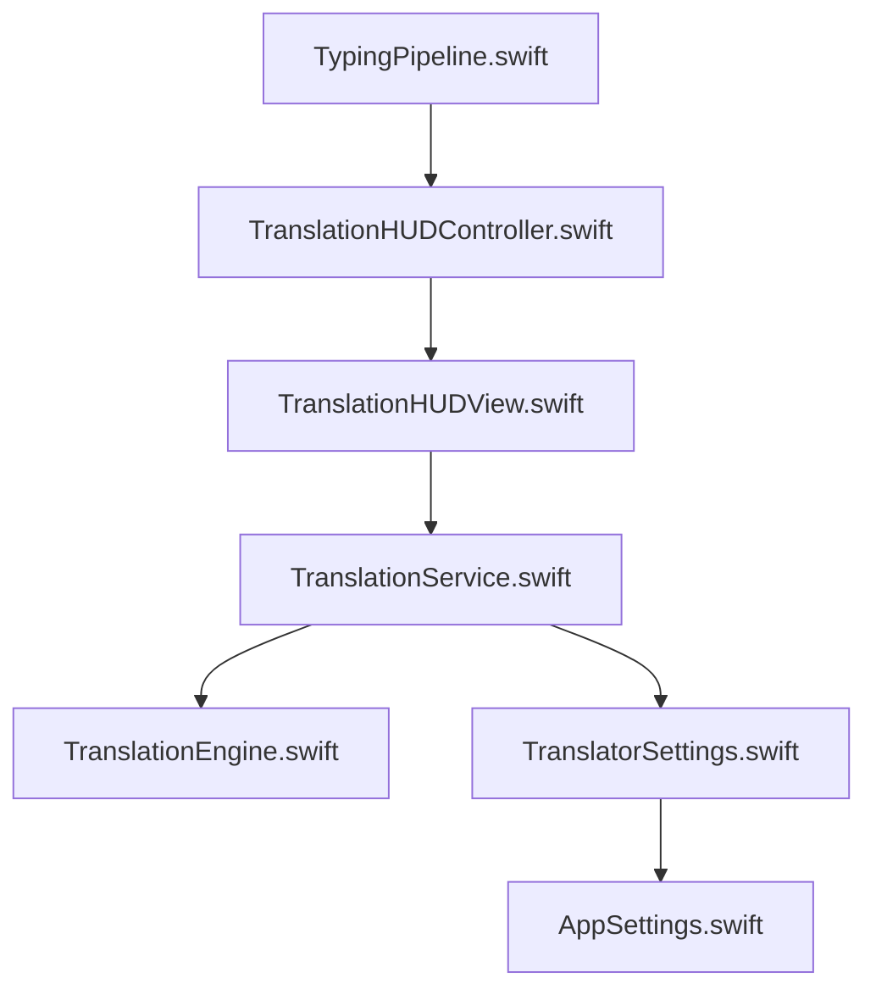
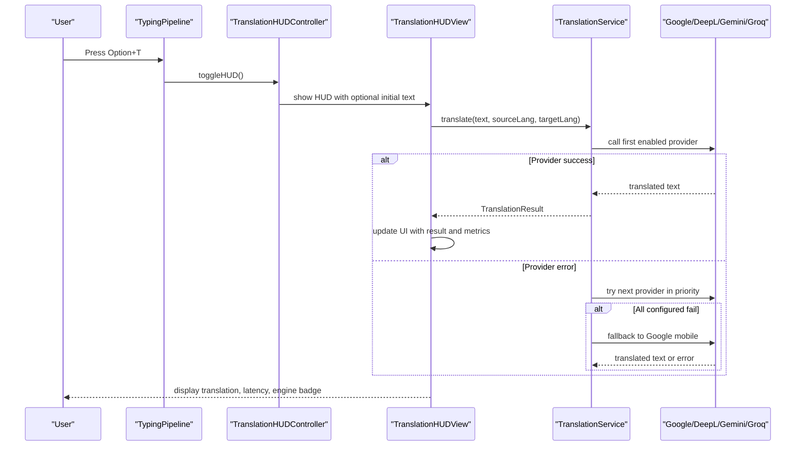
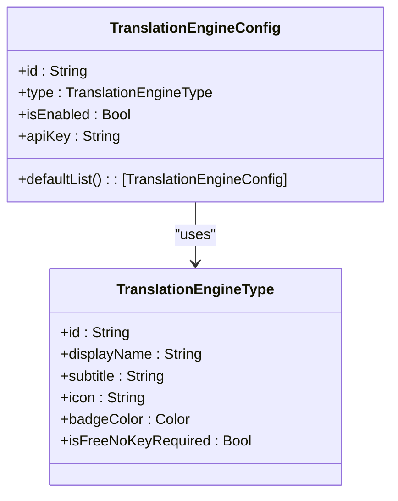
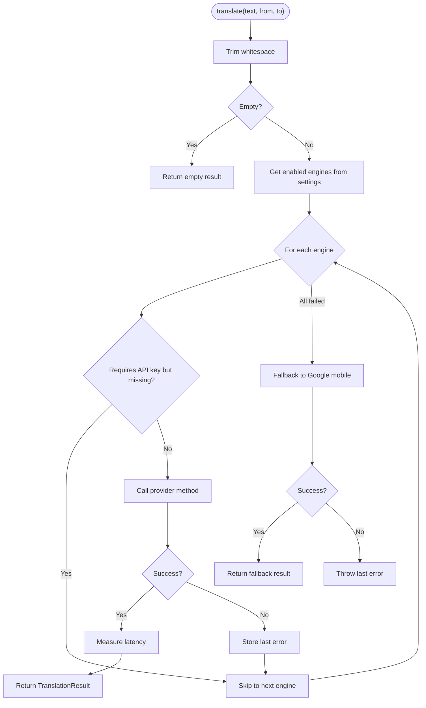
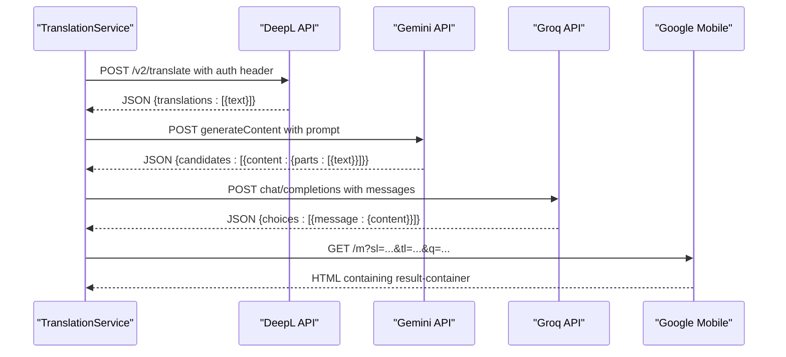
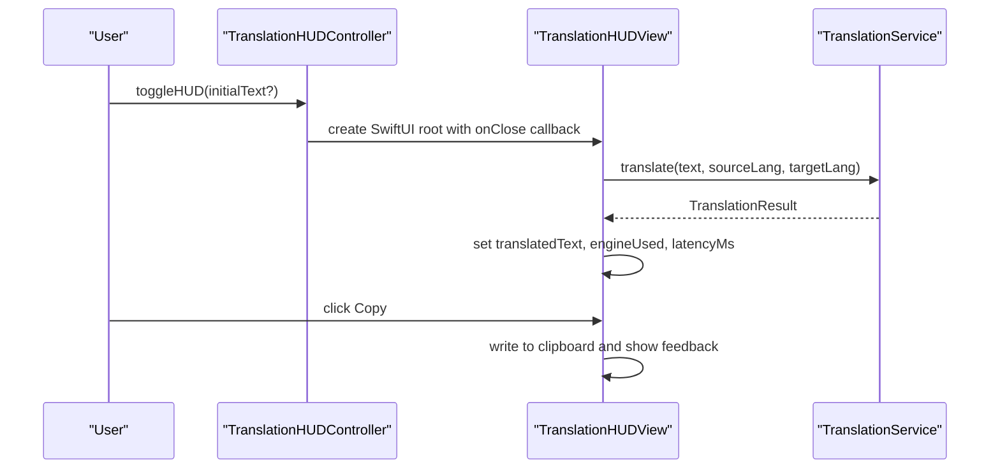
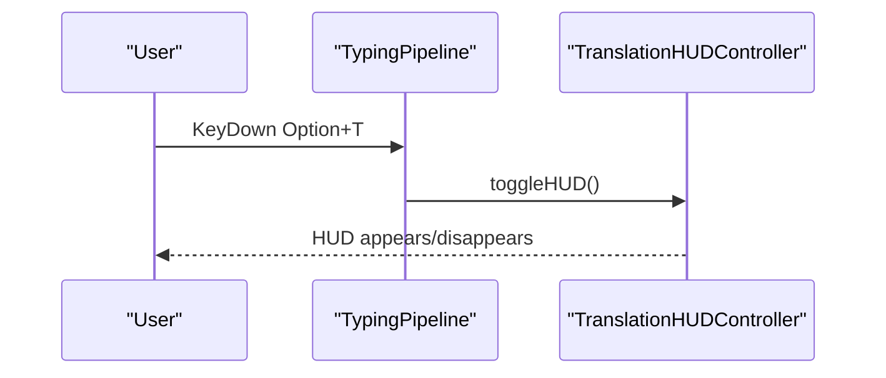
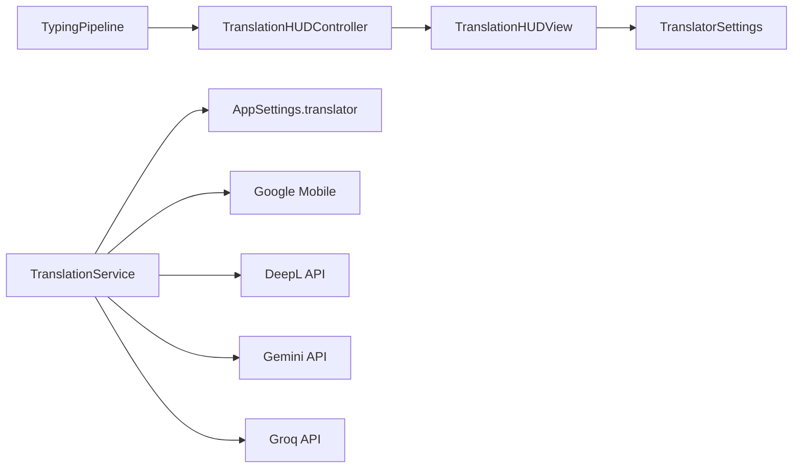

# Translation Service

<cite>
**Referenced Files in This Document**
- [TranslationEngine.swift](file://macos/skey-app/Sources/Features/Translator/Models/TranslationEngine.swift)
- [TranslationService.swift](file://macos/skey-app/Sources/Features/Translator/Services/TranslationService.swift)
- [TranslationHUDController.swift](file://macos/skey-app/Sources/Features/Translator/UI/TranslationHUDController.swift)
- [TranslationHUDView.swift](file://macos/skey-app/Sources/Features/Translator/UI/TranslationHUDView.swift)
- [TranslatorSettings.swift](file://macos/skey-app/Sources/Shared/Settings/Modules/TranslatorSettings.swift)
- [AppSettings.swift](file://macos/skey-app/Sources/Shared/Settings/AppSettings.swift)
- [TypingPipeline.swift](file://macos/skey-app/Sources/Features/Keyboard/EventHandling/Pipeline/TypingPipeline.swift)
</cite>

## Table of Contents
1. [Introduction](#introduction)
2. [Project Structure](#project-structure)
3. [Core Components](#core-components)
4. [Architecture Overview](#architecture-overview)
5. [Detailed Component Analysis](#detailed-component-analysis)
6. [Dependency Analysis](#dependency-analysis)
7. [Performance Considerations](#performance-considerations)
8. [Troubleshooting Guide](#troubleshooting-guide)
9. [Conclusion](#conclusion)
10. [Appendices](#appendices)

## Introduction
This document explains the translation service feature that integrates multiple AI and web-based translation providers into a single, pluggable system. It covers how Google Translate (mobile endpoint), DeepL API, Gemini 2.0 Flash, and Groq LLMs are orchestrated with fallbacks, how API keys are managed, how errors are handled, and how the HUD interface displays results. It also details integration with the keyboard engine for triggering translations via shortcuts and shows how to add new providers and configure existing ones.

## Project Structure
The translation feature is organized into three layers:
- Models and configuration: provider definitions and settings
- Services: provider implementations and orchestration
- UI: floating HUD panel and SwiftUI view for user interaction
- Integration: keyboard pipeline triggers the HUD; settings persist configuration

**Diagram sources**
- [TypingPipeline.swift:127-135](file://macos/skey-app/Sources/Features/Keyboard/EventHandling/Pipeline/TypingPipeline.swift#L127-L135)
- [TranslationHUDController.swift:74-105](file://macos/skey-app/Sources/Features/Translator/UI/TranslationHUDController.swift#L74-L105)
- [TranslationHUDView.swift:355-382](file://macos/skey-app/Sources/Features/Translator/UI/TranslationHUDView.swift#L355-L382)
- [TranslationService.swift:49-146](file://macos/skey-app/Sources/Features/Translator/Services/TranslationService.swift#L49-L146)
- [TranslationEngine.swift:6-86](file://macos/skey-app/Sources/Features/Translator/Models/TranslationEngine.swift#L6-L86)
- [TranslatorSettings.swift:36-50](file://macos/skey-app/Sources/Shared/Settings/Modules/TranslatorSettings.swift#L36-L50)
- [AppSettings.swift:17-22](file://macos/skey-app/Sources/Shared/Settings/AppSettings.swift#L17-L22)

**Section sources**
- [TypingPipeline.swift:127-135](file://macos/skey-app/Sources/Features/Keyboard/EventHandling/Pipeline/TypingPipeline.swift#L127-L135)
- [TranslationHUDController.swift:74-105](file://macos/skey-app/Sources/Features/Translator/UI/TranslationHUDController.swift#L74-L105)
- [TranslationHUDView.swift:355-382](file://macos/skey-app/Sources/Features/Translator/UI/TranslationHUDView.swift#L355-L382)
- [TranslationService.swift:49-146](file://macos/skey-app/Sources/Features/Translator/Services/TranslationService.swift#L49-L146)
- [TranslationEngine.swift:6-86](file://macos/skey-app/Sources/Features/Translator/Models/TranslationEngine.swift#L6-L86)
- [TranslatorSettings.swift:36-50](file://macos/skey-app/Sources/Shared/Settings/Modules/TranslatorSettings.swift#L36-L50)
- [AppSettings.swift:17-22](file://macos/skey-app/Sources/Shared/Settings/AppSettings.swift#L17-L22)

## Core Components
- Provider model and configuration: defines supported engines, display metadata, and default list
- Translation service: orchestrates provider calls with cascade/fallback logic and measures latency
- HUD controller and view: manages the floating panel lifecycle and user interactions
- Settings module: persists enabled engines, API keys, target language, and auto-detect preference

Key responsibilities:
- TranslationService handles network requests per provider, parses responses, and returns structured results
- TranslatorSettings stores and updates engine configurations including API keys
- TranslationHUDController creates and positions the HUD window and monitors ESC to close
- TranslationHUDView collects input, triggers translation, and displays results with copy support

**Section sources**
- [TranslationEngine.swift:6-86](file://macos/skey-app/Sources/Features/Translator/Models/TranslationEngine.swift#L6-L86)
- [TranslationService.swift:6-146](file://macos/skey-app/Sources/Features/Translator/Services/TranslationService.swift#L6-L146)
- [TranslationHUDController.swift:6-129](file://macos/skey-app/Sources/Features/Translator/UI/TranslationHUDController.swift#L6-L129)
- [TranslationHUDView.swift:6-382](file://macos/skey-app/Sources/Features/Translator/UI/TranslationHUDView.swift#L6-L382)
- [TranslatorSettings.swift:6-112](file://macos/skey-app/Sources/Shared/Settings/Modules/TranslatorSettings.swift#L6-L112)
- [AppSettings.swift:10-36](file://macos/skey-app/Sources/Shared/Settings/AppSettings.swift#L10-L36)

## Architecture Overview
The translation workflow is event-driven from the keyboard pipeline to the HUD and back to the UI state.

**Diagram sources**
- [TypingPipeline.swift:127-135](file://macos/skey-app/Sources/Features/Keyboard/EventHandling/Pipeline/TypingPipeline.swift#L127-L135)
- [TranslationHUDController.swift:74-105](file://macos/skey-app/Sources/Features/Translator/UI/TranslationHUDController.swift#L74-L105)
- [TranslationHUDView.swift:355-382](file://macos/skey-app/Sources/Features/Translator/UI/TranslationHUDView.swift#L355-L382)
- [TranslationService.swift:49-146](file://macos/skey-app/Sources/Features/Translator/Services/TranslationService.swift#L49-L146)

## Detailed Component Analysis

### Provider Model and Configuration
- Engine types include Google, Apple, Gemini, DeepL, and Groq with display names, icons, and free/no-key flags
- Default list includes all engines enabled by default
- Configuration holds type, enabled flag, and API key

**Diagram sources**
- [TranslationEngine.swift:6-86](file://macos/skey-app/Sources/Features/Translator/Models/TranslationEngine.swift#L6-L86)

**Section sources**
- [TranslationEngine.swift:6-86](file://macos/skey-app/Sources/Features/Translator/Models/TranslationEngine.swift#L6-L86)

### Translation Service Orchestration
- Cascade through enabled engines in order; skip those without required API keys
- Measure latency per attempt; return first successful result
- Fallback to Google mobile if all configured engines fail
- Each provider method constructs HTTP requests, validates status codes, and parses JSON or HTML

**Diagram sources**
- [TranslationService.swift:49-146](file://macos/skey-app/Sources/Features/Translator/Services/TranslationService.swift#L49-L146)

**Section sources**
- [TranslationService.swift:49-146](file://macos/skey-app/Sources/Features/Translator/Services/TranslationService.swift#L49-L146)

### Provider Implementations
- Google Mobile NMT: builds URL query parameters, sets a mobile User-Agent, parses HTML result container
- DeepL API: selects host based on key suffix, posts form-encoded body, parses JSON translations array
- Gemini 2.0 Flash: constructs generateContent request with prompt instructing pure translation output
- Groq LLM: uses OpenAI-compatible chat completions endpoint with system prompt and temperature control

**Diagram sources**
- [TranslationService.swift:150-301](file://macos/skey-app/Sources/Features/Translator/Services/TranslationService.swift#L150-L301)

**Section sources**
- [TranslationService.swift:150-301](file://macos/skey-app/Sources/Features/Translator/Services/TranslationService.swift#L150-L301)

### HUD Controller and View
- Controller manages a borderless, floating NSPanel positioned near the mouse cursor; supports ESC to close
- View binds to settings, provides language pickers, paste/clear actions, and translates on demand
- On translation completion, updates UI with translated text, engine badge, and latency; supports copying to clipboard

**Diagram sources**
- [TranslationHUDController.swift:74-129](file://macos/skey-app/Sources/Features/Translator/UI/TranslationHUDController.swift#L74-L129)
- [TranslationHUDView.swift:355-382](file://macos/skey-app/Sources/Features/Translator/UI/TranslationHUDView.swift#L355-L382)

**Section sources**
- [TranslationHUDController.swift:74-129](file://macos/skey-app/Sources/Features/Translator/UI/TranslationHUDController.swift#L74-L129)
- [TranslationHUDView.swift:355-382](file://macos/skey-app/Sources/Features/Translator/UI/TranslationHUDView.swift#L355-L382)

### Keyboard Integration
- The typing pipeline intercepts Option+T and toggles the translation HUD
- This allows quick access to translation without leaving the current app context

**Diagram sources**
- [TypingPipeline.swift:127-135](file://macos/skey-app/Sources/Features/Keyboard/EventHandling/Pipeline/TypingPipeline.swift#L127-L135)
- [TranslationHUDController.swift:74-105](file://macos/skey-app/Sources/Features/Translator/UI/TranslationHUDController.swift#L74-L105)

**Section sources**
- [TypingPipeline.swift:127-135](file://macos/skey-app/Sources/Features/Keyboard/EventHandling/Pipeline/TypingPipeline.swift#L127-L135)

## Dependency Analysis
- TranslationService depends on AppSettings to read enabled engines and their API keys
- TranslationHUDView observes TranslatorSettings for reactive UI updates
- TypingPipeline triggers TranslationHUDController, decoupling keyboard events from translation logic
- Provider methods depend on URLSession and standard libraries for networking and parsing

**Diagram sources**
- [TranslationService.swift:66-146](file://macos/skey-app/Sources/Features/Translator/Services/TranslationService.swift#L66-L146)
- [TranslationHUDView.swift:7-17](file://macos/skey-app/Sources/Features/Translator/UI/TranslationHUDView.swift#L7-L17)
- [TypingPipeline.swift:127-135](file://macos/skey-app/Sources/Features/Keyboard/EventHandling/Pipeline/TypingPipeline.swift#L127-L135)

**Section sources**
- [TranslationService.swift:66-146](file://macos/skey-app/Sources/Features/Translator/Services/TranslationService.swift#L66-L146)
- [TranslationHUDView.swift:7-17](file://macos/skey-app/Sources/Features/Translator/UI/TranslationHUDView.swift#L7-L17)
- [TypingPipeline.swift:127-135](file://macos/skey-app/Sources/Features/Keyboard/EventHandling/Pipeline/TypingPipeline.swift#L127-L135)

## Performance Considerations
- Network timeouts are set at the session level to avoid long hangs
- Latency is measured per provider attempt and surfaced in the HUD for transparency
- Cascade strategy reduces perceived latency by trying faster or more reliable providers first
- HTML parsing for Google mobile is lightweight; JSON parsing for APIs is direct and minimal
- No explicit rate limiting is implemented; consider adding exponential backoff and retry caps for production use

[No sources needed since this section provides general guidance]

## Troubleshooting Guide
Common issues and strategies:
- Missing API key for Gemini/DeepL/Groq: these providers are skipped automatically; ensure keys are set in settings
- Network errors: service throws URLError variants; HUD displays localized error message
- Parsing failures: invalid response structure leads to cannotParseResponse; check provider endpoints and payloads
- Fallback behavior: if all configured engines fail, Google mobile is attempted; if it also fails, the last error is thrown

Operational tips:
- Verify internet connectivity and firewall rules for api.deepl.com, generativelanguage.googleapis.com, and api.groq.com
- Use the HUD’s copy button to validate outputs quickly
- Check TranslatorSettings to confirm engines are enabled and ordered by preference

**Section sources**
- [TranslationService.swift:77-146](file://macos/skey-app/Sources/Features/Translator/Services/TranslationService.swift#L77-L146)
- [TranslationHUDView.swift:375-382](file://macos/skey-app/Sources/Features/Translator/UI/TranslationHUDView.swift#L375-L382)

## Conclusion
The translation service provides a robust, multi-provider architecture with clear separation of concerns. It offers fast, reliable translations through cascading provider selection and a universal fallback. The HUD delivers an intuitive interface for real-time translation triggered from the keyboard pipeline. With persistent settings and straightforward provider interfaces, adding new translation services is streamlined.

[No sources needed since this section summarizes without analyzing specific files]

## Appendices

### Adding a New Translation Provider
Steps:
1. Define a new case in TranslationEngineType with display name, icon, and whether it requires an API key
2. Add a corresponding provider method in TranslationService following the pattern of existing methods
3. Update TranslationEngineConfig.defaultList to include the new engine
4. Ensure TranslatorSettings can store and retrieve the new engine’s API key
5. Test via the HUD or scripts to verify request construction and response parsing

**Section sources**
- [TranslationEngine.swift:6-86](file://macos/skey-app/Sources/Features/Translator/Models/TranslationEngine.swift#L6-L86)
- [TranslationService.swift:150-301](file://macos/skey-app/Sources/Features/Translator/Services/TranslationService.swift#L150-L301)
- [TranslatorSettings.swift:94-110](file://macos/skey-app/Sources/Shared/Settings/Modules/TranslatorSettings.swift#L94-L110)

### Configuring Existing Providers
- Enable/disable engines and reorder priority via TranslatorSettings
- Set API keys for Gemini, DeepL, and Groq using the settings module
- Target language defaults to Vietnamese; auto-detect source is enabled by default

**Section sources**
- [TranslatorSettings.swift:22-67](file://macos/skey-app/Sources/Shared/Settings/Modules/TranslatorSettings.swift#L22-L67)
- [TranslationEngine.swift:77-86](file://macos/skey-app/Sources/Features/Translator/Models/TranslationEngine.swift#L77-L86)

### Security Considerations
- API keys are stored in settings; ensure secure storage practices and limit exposure in logs
- Avoid logging full payloads or keys; sanitize any debug output
- Validate and encode inputs before sending to providers to prevent injection
- Prefer HTTPS endpoints and validate server responses

[No sources needed since this section provides general guidance]

### Offline Fallback Mechanisms
- If all configured providers fail, Google mobile is used as a universal safety net
- For fully offline scenarios, consider caching recent translations locally and serving cached results when network is unavailable

[No sources needed since this section provides general guidance]

### Batch Translation Operations
- Current implementation focuses on single-text translation via the HUD
- To support batch operations, extend TranslationService to accept arrays and process concurrently while respecting rate limits and timeouts

[No sources needed since this section provides general guidance]