# Application Lifecycle

<cite>
**Referenced Files in This Document**
- [main.swift](file://macos/skey-app/Sources/App/main.swift)
- [AppDelegate.swift](file://macos/skey-app/Sources/App/AppDelegate.swift)
- [AppCoordinator.swift](file://macos/skey-app/Sources/App/AppCoordinator.swift)
- [Feature.swift](file://macos/skey-app/Sources/Shared/Core/Feature.swift)
- [StatusBarManager.swift](file://macos/skey-app/Sources/Shared/UI/StatusBarManager.swift)
- [PermissionsService.swift](file://macos/skey-app/Sources/Shared/Services/PermissionsService.swift)
- [LaunchAtLoginService.swift](file://macos/skey-app/Sources/Shared/Services/LaunchAtLoginService.swift)
- [AppFocusObserver.swift](file://macos/skey-app/Sources/Shared/Services/AppFocusObserver.swift)
- [SettingsWindowController.swift](file://macos/skey-app/Sources/Features/Settings/SettingsWindowController.swift)
- [KeyboardFeature.swift](file://macos/skey-app/Sources/Features/Keyboard/KeyboardFeature.swift)
- [ClipboardFeature.swift](file://macos/skey-app/Sources/Features/Clipboard/ClipboardFeature.swift)
- [Info.plist](file://macos/skey-app/Resources/Info.plist)
</cite>

## Table of Contents
1. [Introduction](#introduction)
2. [Project Structure](#project-structure)
3. [Core Components](#core-components)
4. [Architecture Overview](#architecture-overview)
5. [Detailed Component Analysis](#detailed-component-analysis)
6. [Dependency Analysis](#dependency-analysis)
7. [Performance Considerations](#performance-considerations)
8. [Troubleshooting Guide](#troubleshooting-guide)
9. [Conclusion](#conclusion)
10. [Appendices](#appendices)

## Introduction
This document explains the macOS application lifecycle for SKey, focusing on the main entry point, AppDelegate responsibilities, and the AppCoordinator pattern used to initialize core services, manage window lifecycle, coordinate features, handle background execution, and perform graceful shutdown. It also covers menu bar integration, system notifications handling, app state persistence, and macOS-specific considerations such as sandboxing requirements, entitlements configuration, and App Store distribution compliance.

## Project Structure
The macOS app is organized around a minimal entry point that bootstraps the AppKit application and delegates lifecycle management to an AppDelegate. The AppCoordinator centralizes feature registration and startup sequencing. Shared services provide status bar UI, permissions, launch-at-login behavior, and focus observation. Features implement a common protocol to plug into the coordinator and contribute menu items and runtime behaviors.

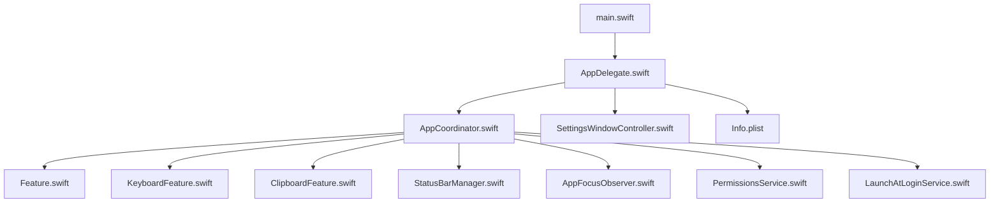

**Diagram sources**
- [main.swift:1-7](file://macos/skey-app/Sources/App/main.swift#L1-L7)
- [AppDelegate.swift:1-75](file://macos/skey-app/Sources/App/AppDelegate.swift#L1-L75)
- [AppCoordinator.swift:1-77](file://macos/skey-app/Sources/App/AppCoordinator.swift#L1-L77)
- [Feature.swift:1-43](file://macos/skey-app/Sources/Shared/Core/Feature.swift#L1-L43)
- [KeyboardFeature.swift:1-328](file://macos/skey-app/Sources/Features/Keyboard/KeyboardFeature.swift#L1-L328)
- [ClipboardFeature.swift:1-146](file://macos/skey-app/Sources/Features/Clipboard/ClipboardFeature.swift#L1-L146)
- [StatusBarManager.swift:1-271](file://macos/skey-app/Sources/Shared/UI/StatusBarManager.swift#L1-L271)
- [AppFocusObserver.swift:1-153](file://macos/skey-app/Sources/Shared/Services/AppFocusObserver.swift#L1-L153)
- [PermissionsService.swift:1-42](file://macos/skey-app/Sources/Shared/Services/PermissionsService.swift#L1-L42)
- [LaunchAtLoginService.swift:1-51](file://macos/skey-app/Sources/Shared/Services/LaunchAtLoginService.swift#L1-L51)
- [SettingsWindowController.swift:1-60](file://macos/skey-app/Sources/Features/Settings/SettingsWindowController.swift#L1-L60)
- [Info.plist:1-42](file://macos/skey-app/Resources/Info.plist#L1-L42)

**Section sources**
- [main.swift:1-7](file://macos/skey-app/Sources/App/main.swift#L1-L7)
- [AppDelegate.swift:1-75](file://macos/skey-app/Sources/App/AppDelegate.swift#L1-L75)
- [AppCoordinator.swift:1-77](file://macos/skey-app/Sources/App/AppCoordinator.swift#L1-L77)

## Core Components
- Entry Point: Creates NSApplication, assigns AppDelegate, and runs the event loop.
- AppDelegate: Sets up standard menus, starts AppCoordinator, handles settings opening via arguments and distributed notifications, triggers update checks, and coordinates termination.
- AppCoordinator: Registers features, configures status bar, wires callbacks, starts focus monitoring, syncs launch-at-login, and manages permissions polling.
- Feature Protocol: Defines lifecycle methods (start/stop), enable/disable semantics, and menu item generation for pluggable capabilities.
- StatusBarManager: Builds and updates the menu bar menu, renders dynamic icons, and exposes actions for tools and settings.
- PermissionsService: Checks and requests Accessibility and Input Monitoring permissions; opens System Settings pages.
- LaunchAtLoginService: Manages SMAppService registration for macOS 13+ and syncs preferences with system state.
- AppFocusObserver: Observes frontmost app changes and classifies apps to support smart language switching.
- SettingsWindowController: Hosts SwiftUI-based settings UI and manages window lifecycle.
- KeyboardFeature: Implements keyboard input engine integration, menu building, and smart app switch behavior.
- ClipboardFeature: Monitors pasteboard, maintains history, and provides popup UI and paste actions.

**Section sources**
- [main.swift:1-7](file://macos/skey-app/Sources/App/main.swift#L1-L7)
- [AppDelegate.swift:1-75](file://macos/skey-app/Sources/App/AppDelegate.swift#L1-L75)
- [AppCoordinator.swift:1-77](file://macos/skey-app/Sources/App/AppCoordinator.swift#L1-L77)
- [Feature.swift:1-43](file://macos/skey-app/Sources/Shared/Core/Feature.swift#L1-L43)
- [StatusBarManager.swift:1-271](file://macos/skey-app/Sources/Shared/UI/StatusBarManager.swift#L1-L271)
- [PermissionsService.swift:1-42](file://macos/skey-app/Sources/Shared/Services/PermissionsService.swift#L1-L42)
- [LaunchAtLoginService.swift:1-51](file://macos/skey-app/Sources/Shared/Services/LaunchAtLoginService.swift#L1-L51)
- [AppFocusObserver.swift:1-153](file://macos/skey-app/Sources/Shared/Services/AppFocusObserver.swift#L1-L153)
- [SettingsWindowController.swift:1-60](file://macos/skey-app/Sources/Features/Settings/SettingsWindowController.swift#L1-L60)
- [KeyboardFeature.swift:1-328](file://macos/skey-app/Sources/Features/Keyboard/KeyboardFeature.swift#L1-L328)
- [ClipboardFeature.swift:1-146](file://macos/skey-app/Sources/Features/Clipboard/ClipboardFeature.swift#L1-L146)

## Architecture Overview
The lifecycle follows a clear sequence:
- main.swift initializes NSApplication and sets AppDelegate.
- AppDelegate.applicationDidFinishLaunching sets up menus, starts AppCoordinator, registers for settings open notifications, optionally opens settings based on command-line flags, and schedules a silent update check.
- AppCoordinator.start configures StatusBarManager with all features, wires left-click toggle to language switching, connects keyboard feature icon updates, starts all features, begins app focus observation, syncs launch-at-login, and checks/requests permissions.
- Features implement start/stop and buildMenuItems to integrate with the status bar and runtime behavior.
- On termination, AppDelegate calls AppCoordinator.stop to gracefully shut down observers and features.

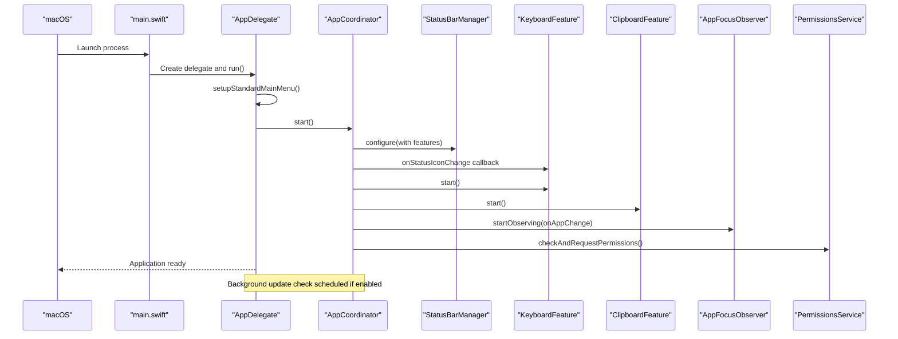

**Diagram sources**
- [main.swift:1-7](file://macos/skey-app/Sources/App/main.swift#L1-L7)
- [AppDelegate.swift:1-75](file://macos/skey-app/Sources/App/AppDelegate.swift#L1-L75)
- [AppCoordinator.swift:1-77](file://macos/skey-app/Sources/App/AppCoordinator.swift#L1-L77)
- [StatusBarManager.swift:1-271](file://macos/skey-app/Sources/Shared/UI/StatusBarManager.swift#L1-L271)
- [KeyboardFeature.swift:1-328](file://macos/skey-app/Sources/Features/Keyboard/KeyboardFeature.swift#L1-L328)
- [ClipboardFeature.swift:1-146](file://macos/skey-app/Sources/Features/Clipboard/ClipboardFeature.swift#L1-L146)
- [AppFocusObserver.swift:1-153](file://macos/skey-app/Sources/Shared/Services/AppFocusObserver.swift#L1-L153)
- [PermissionsService.swift:1-42](file://macos/skey-app/Sources/Shared/Services/PermissionsService.swift#L1-L42)

## Detailed Component Analysis

### AppDelegate
Responsibilities:
- Initializes standard menus for app and edit operations using localized strings.
- Starts AppCoordinator to bootstrap features and services.
- Listens for distributed notifications to open settings from other processes.
- Supports command-line flags to open settings immediately.
- Schedules a non-intrusive update check after launch when enabled.
- Handles reopen events to show settings.
- Performs graceful shutdown by stopping AppCoordinator.

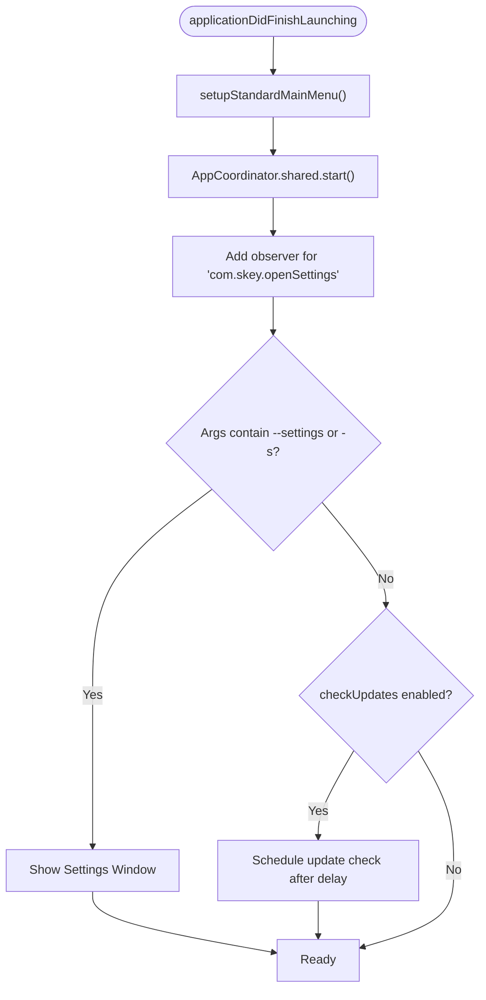

**Diagram sources**
- [AppDelegate.swift:1-75](file://macos/skey-app/Sources/App/AppDelegate.swift#L1-L75)

**Section sources**
- [AppDelegate.swift:1-75](file://macos/skey-app/Sources/App/AppDelegate.swift#L1-L75)

### AppCoordinator
Responsibilities:
- Registers features (keyboard and clipboard).
- Configures StatusBarManager with features and wires left-click toggle to language switching.
- Connects keyboard feature status icon change to status bar icon updates.
- Starts all registered features.
- Starts AppFocusObserver to reset composing buffer and trigger Smart App Switch.
- Syncs Launch At Login preference with system state.
- Checks and requests required permissions; polls until granted then starts keyboard feature.

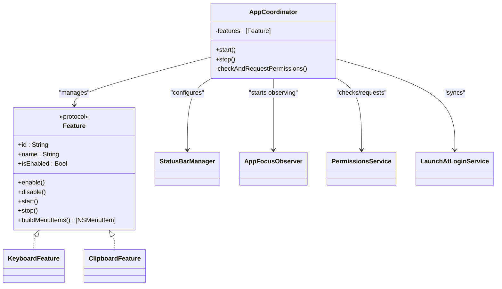

**Diagram sources**
- [AppCoordinator.swift:1-77](file://macos/skey-app/Sources/App/AppCoordinator.swift#L1-L77)
- [Feature.swift:1-43](file://macos/skey-app/Sources/Shared/Core/Feature.swift#L1-L43)
- [KeyboardFeature.swift:1-328](file://macos/skey-app/Sources/Features/Keyboard/KeyboardFeature.swift#L1-L328)
- [ClipboardFeature.swift:1-146](file://macos/skey-app/Sources/Features/Clipboard/ClipboardFeature.swift#L1-L146)
- [StatusBarManager.swift:1-271](file://macos/skey-app/Sources/Shared/UI/StatusBarManager.swift#L1-L271)
- [AppFocusObserver.swift:1-153](file://macos/skey-app/Sources/Shared/Services/AppFocusObserver.swift#L1-L153)
- [PermissionsService.swift:1-42](file://macos/skey-app/Sources/Shared/Services/PermissionsService.swift#L1-L42)
- [LaunchAtLoginService.swift:1-51](file://macos/skey-app/Sources/Shared/Services/LaunchAtLoginService.swift#L1-L51)

**Section sources**
- [AppCoordinator.swift:1-77](file://macos/skey-app/Sources/App/AppCoordinator.swift#L1-L77)

### StatusBarManager
Responsibilities:
- Creates and owns the NSStatusItem and its menu.
- Rebuilds menu dynamically based on features’ buildMenuItems outputs.
- Provides left/right click handling; left click toggles language via callback; right click shows menu.
- Updates status bar icon to reflect current language mode.
- Exposes actions for tools, settings, language selection, logs (debug), and quit.

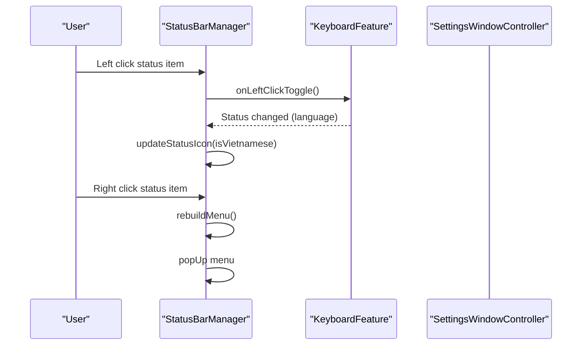

**Diagram sources**
- [StatusBarManager.swift:1-271](file://macos/skey-app/Sources/Shared/UI/StatusBarManager.swift#L1-L271)
- [KeyboardFeature.swift:1-328](file://macos/skey-app/Sources/Features/Keyboard/KeyboardFeature.swift#L1-L328)
- [SettingsWindowController.swift:1-60](file://macos/skey-app/Sources/Features/Settings/SettingsWindowController.swift#L1-L60)

**Section sources**
- [StatusBarManager.swift:1-271](file://macos/skey-app/Sources/Shared/UI/StatusBarManager.swift#L1-L271)

### PermissionsService
Responsibilities:
- Checks Accessibility trust via AXIsProcessTrusted.
- Optionally prompts user for permission via AXIsProcessTrustedWithOptions.
- Opens Input Monitoring and Accessibility System Settings pages.

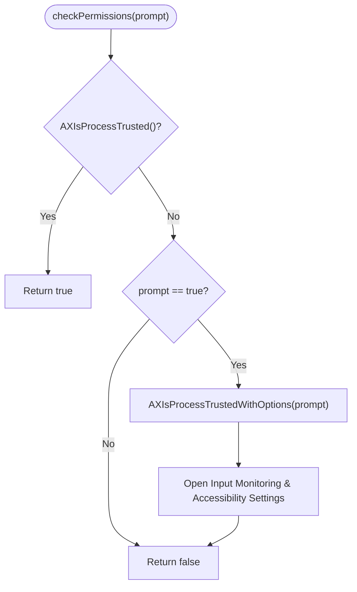

**Diagram sources**
- [PermissionsService.swift:1-42](file://macos/skey-app/Sources/Shared/Services/PermissionsService.swift#L1-L42)

**Section sources**
- [PermissionsService.swift:1-42](file://macos/skey-app/Sources/Shared/Services/PermissionsService.swift#L1-L42)

### LaunchAtLoginService
Responsibilities:
- Reads current registration status via SMAppService.mainApp.status.
- Registers/unregisters the app as a login item on macOS 13+.
- Syncs stored preference with system state on launch.

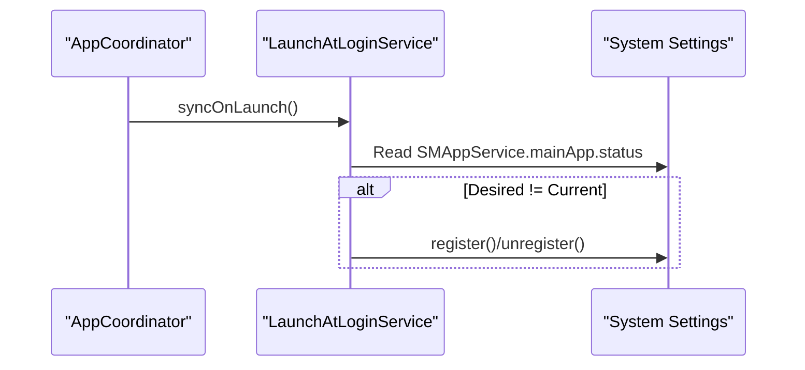

**Diagram sources**
- [LaunchAtLoginService.swift:1-51](file://macos/skey-app/Sources/Shared/Services/LaunchAtLoginService.swift#L1-L51)
- [AppCoordinator.swift:1-77](file://macos/skey-app/Sources/App/AppCoordinator.swift#L1-L77)

**Section sources**
- [LaunchAtLoginService.swift:1-51](file://macos/skey-app/Sources/Shared/Services/LaunchAtLoginService.swift#L1-L51)

### AppFocusObserver
Responsibilities:
- Observes NSWorkspace didActivateApplicationNotification.
- Tracks current PID, bundle ID, and category (developer tool, web browser, chat/electron, spotlight, native app).
- Uses fast RAM cache and heuristics to classify apps.
- Adjusts accessibility attributes for certain categories.

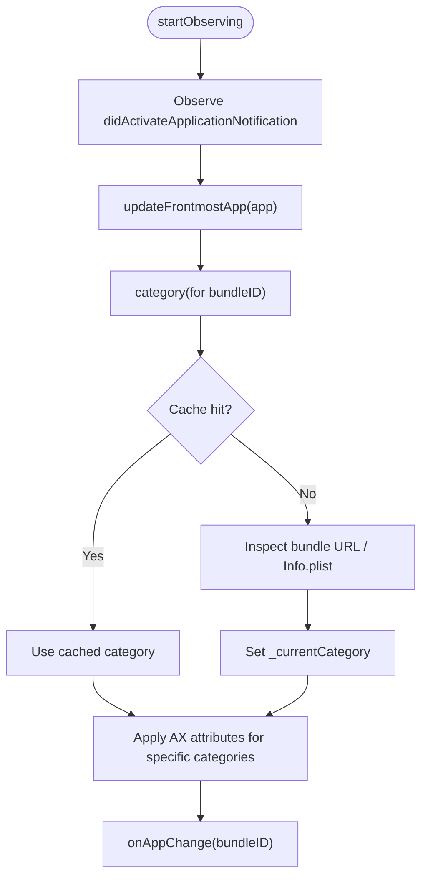

**Diagram sources**
- [AppFocusObserver.swift:1-153](file://macos/skey-app/Sources/Shared/Services/AppFocusObserver.swift#L1-L153)

**Section sources**
- [AppFocusObserver.swift:1-153](file://macos/skey-app/Sources/Shared/Services/AppFocusObserver.swift#L1-L153)

### KeyboardFeature
Responsibilities:
- Starts EventTapManager and applies preferences.
- Builds grouped menu items for language toggle, input methods, charset, typing options, and advanced features.
- Implements Smart App Switch to auto-toggle language when focusing developer tools.
- Syncs menu state reactively with shortcuts and preferences.

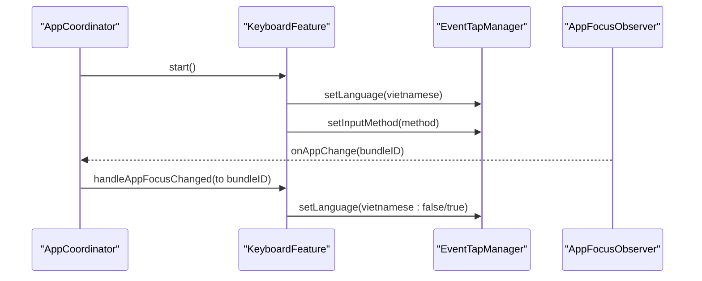

**Diagram sources**
- [KeyboardFeature.swift:1-328](file://macos/skey-app/Sources/Features/Keyboard/KeyboardFeature.swift#L1-L328)
- [AppCoordinator.swift:1-77](file://macos/skey-app/Sources/App/AppCoordinator.swift#L1-L77)
- [AppFocusObserver.swift:1-153](file://macos/skey-app/Sources/Shared/Services/AppFocusObserver.swift#L1-L153)

**Section sources**
- [KeyboardFeature.swift:1-328](file://macos/skey-app/Sources/Features/Keyboard/KeyboardFeature.swift#L1-L328)

### ClipboardFeature
Responsibilities:
- Starts ClipboardMonitor to capture pasteboard changes.
- Maintains ClipboardStore and provides a floating popup UI.
- Handles single/multi-item paste stacks and triggers system paste via synthetic events.
- Builds menu item to open clipboard popup with shortcut display.

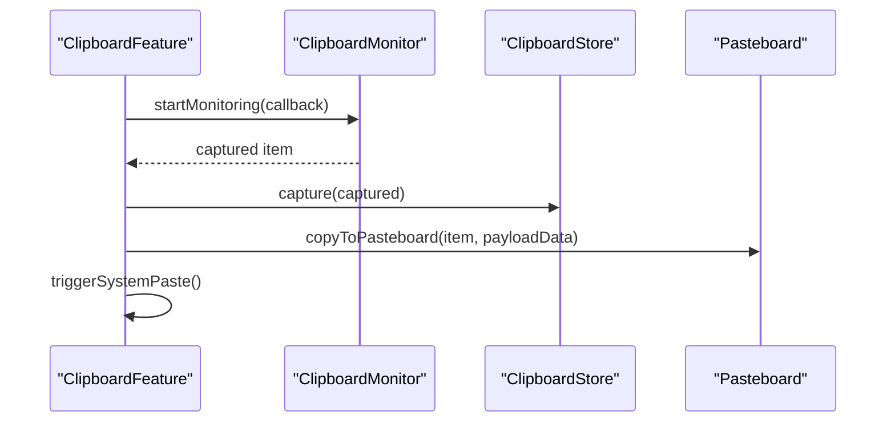

**Diagram sources**
- [ClipboardFeature.swift:1-146](file://macos/skey-app/Sources/Features/Clipboard/ClipboardFeature.swift#L1-L146)

**Section sources**
- [ClipboardFeature.swift:1-146](file://macos/skey-app/Sources/Features/Clipboard/ClipboardFeature.swift#L1-L146)

### SettingsWindowController
Responsibilities:
- Creates an NSWindow hosting SwiftUI content with visual effect view.
- Centers and autosaves window frame.
- Brings window to front and activates app when showing settings.

**Section sources**
- [SettingsWindowController.swift:1-60](file://macos/skey-app/Sources/Features/Settings/SettingsWindowController.swift#L1-L60)

## Dependency Analysis
High-level dependencies:
- main.swift depends on AppKit and creates NSApplication and AppDelegate.
- AppDelegate depends on AppCoordinator, SettingsWindowController, and Info.plist for localization and metadata.
- AppCoordinator depends on Feature implementations, StatusBarManager, AppFocusObserver, PermissionsService, and LaunchAtLoginService.
- StatusBarManager depends on Feature protocol to build menu items and uses LocalizationService and AppSettings indirectly through shared modules.
- PermissionsService depends on ApplicationServices and NSWorkspace to open System Settings.
- LaunchAtLoginService depends on ServiceManagement for SMAppService.
- KeyboardFeature and ClipboardFeature depend on their respective managers and stores.

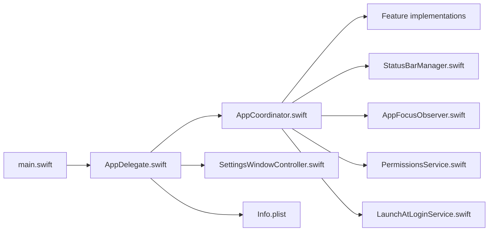

**Diagram sources**
- [main.swift:1-7](file://macos/skey-app/Sources/App/main.swift#L1-L7)
- [AppDelegate.swift:1-75](file://macos/skey-app/Sources/App/AppDelegate.swift#L1-L75)
- [AppCoordinator.swift:1-77](file://macos/skey-app/Sources/App/AppCoordinator.swift#L1-L77)
- [StatusBarManager.swift:1-271](file://macos/skey-app/Sources/Shared/UI/StatusBarManager.swift#L1-L271)
- [AppFocusObserver.swift:1-153](file://macos/skey-app/Sources/Shared/Services/AppFocusObserver.swift#L1-L153)
- [PermissionsService.swift:1-42](file://macos/skey-app/Sources/Shared/Services/PermissionsService.swift#L1-L42)
- [LaunchAtLoginService.swift:1-51](file://macos/skey-app/Sources/Shared/Services/LaunchAtLoginService.swift#L1-L51)
- [SettingsWindowController.swift:1-60](file://macos/skey-app/Sources/Features/Settings/SettingsWindowController.swift#L1-L60)
- [Info.plist:1-42](file://macos/skey-app/Resources/Info.plist#L1-L42)

**Section sources**
- [AppCoordinator.swift:1-77](file://macos/skey-app/Sources/App/AppCoordinator.swift#L1-L77)
- [StatusBarManager.swift:1-271](file://macos/skey-app/Sources/Shared/UI/StatusBarManager.swift#L1-L271)
- [PermissionsService.swift:1-42](file://macos/skey-app/Sources/Shared/Services/PermissionsService.swift#L1-L42)
- [LaunchAtLoginService.swift:1-51](file://macos/skey-app/Sources/Shared/Services/LaunchAtLoginService.swift#L1-L51)
- [AppFocusObserver.swift:1-153](file://macos/skey-app/Sources/Shared/Services/AppFocusObserver.swift#L1-L153)

## Performance Considerations
- Hot path optimization: KeyboardFeature and related components avoid blocking the main thread during preference reads/writes by leveraging asynchronous persistence and in-memory caches where applicable.
- Permission polling: AppCoordinator uses a timer to poll permission status without blocking UI; ensure intervals are reasonable to balance responsiveness and resource usage.
- Menu rebuilding: StatusBarManager rebuilds menus only when necessary (e.g., language change or right-click); avoid frequent rebuilds to reduce overhead.
- Focus classification: AppFocusObserver uses a RAM cache and efficient heuristics to minimize disk access and property list parsing.

[No sources needed since this section provides general guidance]

## Troubleshooting Guide
Common issues and resolutions:
- Missing Accessibility/Input Monitoring permissions:
  - Symptoms: Keyboard events not captured; features do not start.
  - Resolution: Use PermissionsService to prompt and open System Settings pages; verify AXIsProcessTrusted returns true.
- Settings window not opening:
  - Symptoms: Clicking menu items or receiving notifications does not show settings.
  - Resolution: Ensure AppDelegate registers for distributed notifications and supports command-line flags; confirm SettingsWindowController.showSettings is invoked.
- Status bar icon not updating:
  - Symptoms: Icon remains static despite language changes.
  - Resolution: Verify KeyboardFeature.onStatusIconChange callback is wired and StatusBarManager.updateStatusIcon is called with correct values.
- Launch at login not syncing:
  - Symptoms: Preference differs from system state.
  - Resolution: Confirm LaunchAtLoginService.syncOnLaunch runs on startup and SMAppService APIs succeed.

**Section sources**
- [PermissionsService.swift:1-42](file://macos/skey-app/Sources/Shared/Services/PermissionsService.swift#L1-L42)
- [AppDelegate.swift:1-75](file://macos/skey-app/Sources/App/AppDelegate.swift#L1-L75)
- [StatusBarManager.swift:1-271](file://macos/skey-app/Sources/Shared/UI/StatusBarManager.swift#L1-L271)
- [LaunchAtLoginService.swift:1-51](file://macos/skey-app/Sources/Shared/Services/LaunchAtLoginService.swift#L1-L51)

## Conclusion
SKey’s macOS application lifecycle is structured around a clean separation of concerns: main.swift bootstraps the app, AppDelegate orchestrates high-level tasks, and AppCoordinator manages feature lifecycles and cross-cutting services. The Feature protocol enables modular capabilities that integrate seamlessly with the status bar and runtime environment. Robust permission handling, focus observation, and launch-at-login synchronization ensure reliable operation across macOS versions. For App Store distribution, ensure entitlements and privacy descriptions align with platform requirements and validate behavior under sandbox constraints.

[No sources needed since this section summarizes without analyzing specific files]

## Appendices

### Startup Sequence Summary
- main.swift: Initialize NSApplication and AppDelegate, run event loop.
- AppDelegate: Setup menus, start AppCoordinator, register notifications, optional settings open, schedule update check.
- AppCoordinator: Configure status bar, wire callbacks, start features, observe focus, sync launch-at-login, check/request permissions.
- Features: Start engines, monitors, and UI components; build menu items.

**Section sources**
- [main.swift:1-7](file://macos/skey-app/Sources/App/main.swift#L1-L7)
- [AppDelegate.swift:1-75](file://macos/skey-app/Sources/App/AppDelegate.swift#L1-L75)
- [AppCoordinator.swift:1-77](file://macos/skey-app/Sources/App/AppCoordinator.swift#L1-L77)

### Menu Bar Integration Examples
- Language toggle via left-click on status bar icon.
- Tools submenu includes language selection, permissions shortcuts, cleaner tool, and debug log actions.
- Quit action terminates the application.

**Section sources**
- [StatusBarManager.swift:1-271](file://macos/skey-app/Sources/Shared/UI/StatusBarManager.swift#L1-L271)

### System Notifications Handling
- DistributedNotificationCenter listener for "com.skey.openSettings" to open settings from external processes.
- Command-line flags "--settings" or "-s" to open settings on launch.

**Section sources**
- [AppDelegate.swift:1-75](file://macos/skey-app/Sources/App/AppDelegate.swift#L1-L75)

### App State Persistence
- Preferences are managed via centralized settings modules backed by a high-performance storage layer with async persistence.
- Launch-at-login preference syncs with system state on startup.

**Section sources**
- [LaunchAtLoginService.swift:1-51](file://macos/skey-app/Sources/Shared/Services/LaunchAtLoginService.swift#L1-L51)

### macOS-Specific Considerations
- Info.plist keys:
  - LSUIElement: true indicates a menu-bar-only app without a Dock presence.
  - NSAccessibilityUsageDescription and NSInputMonitoringUsageDescription provide required privacy descriptions for permissions.
- Entitlements and sandboxing:
  - Ensure appropriate entitlements for Accessibility and Input Monitoring if distributing via App Store; validate behavior under sandbox constraints.
  - Use SMAppService for modern login item management on macOS 13+.

**Section sources**
- [Info.plist:1-42](file://macos/skey-app/Resources/Info.plist#L1-L42)
- [LaunchAtLoginService.swift:1-51](file://macos/skey-app/Sources/Shared/Services/LaunchAtLoginService.swift#L1-L51)