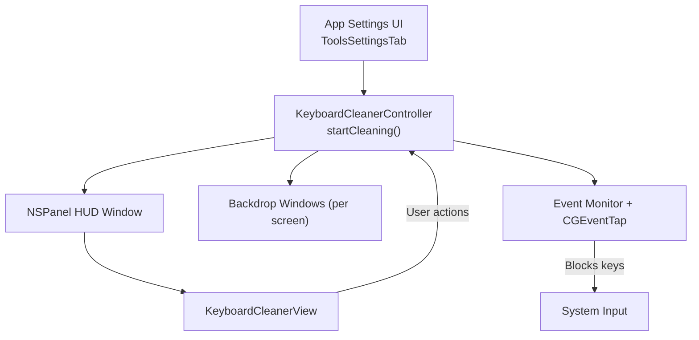
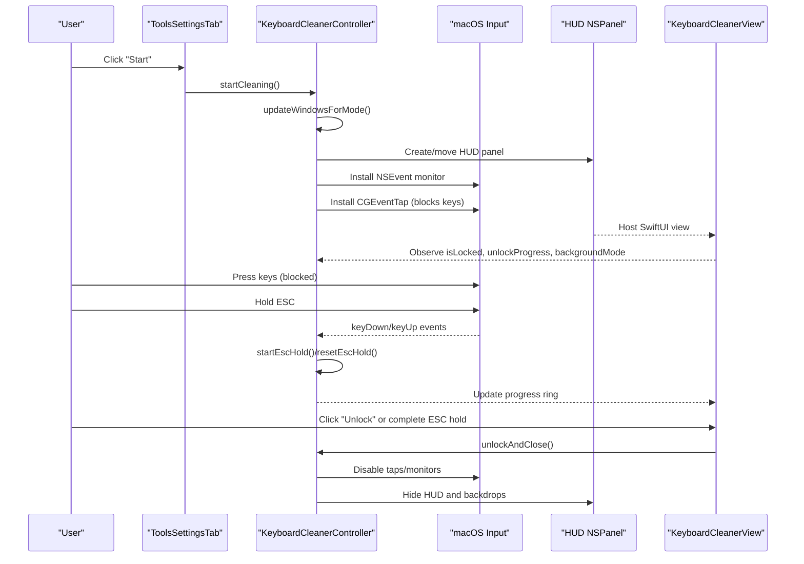
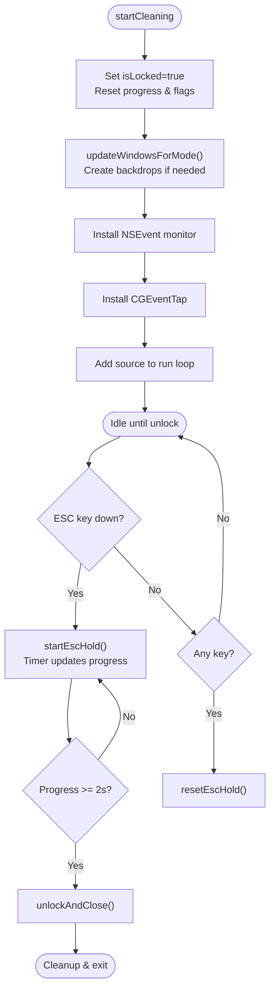
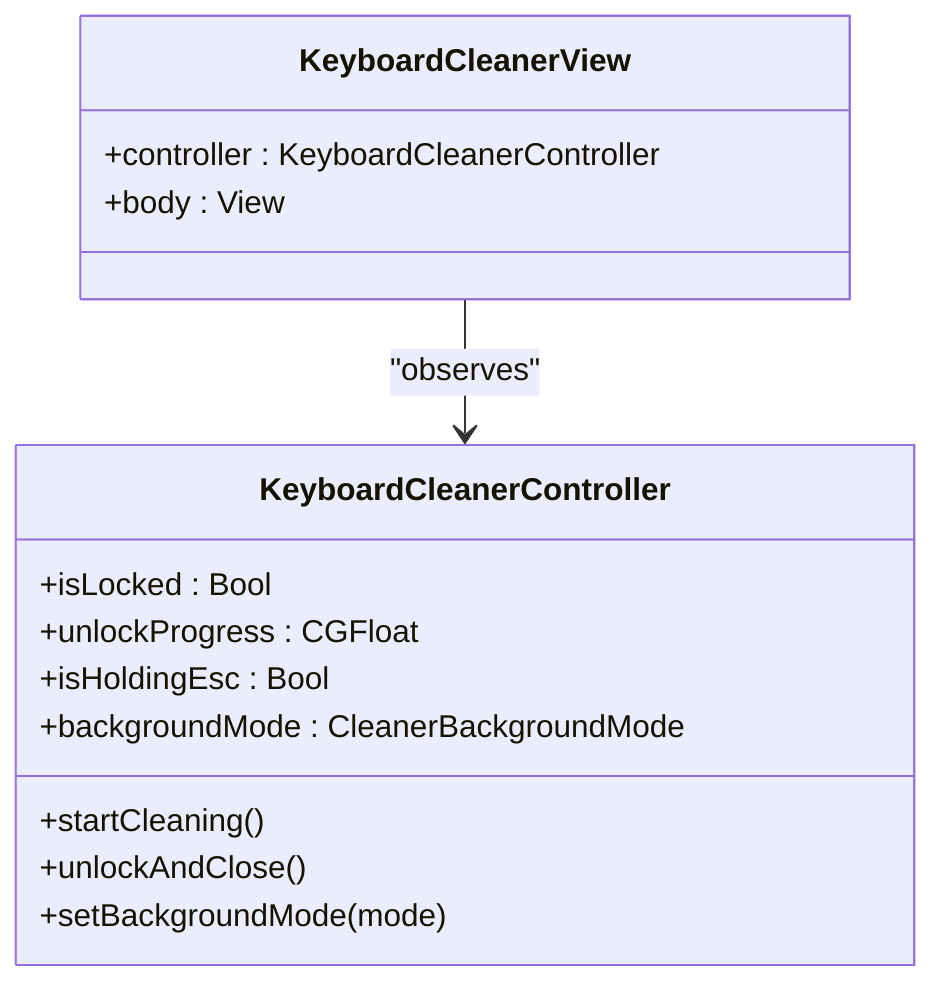
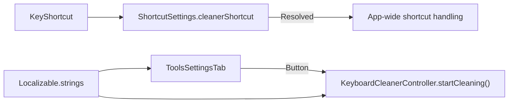

# Cleaner Tool

<cite>
**Referenced Files in This Document**
- [KeyboardCleanerController.swift](file://macos/skey-app/Sources/Features/Cleaner/KeyboardCleanerController.swift)
- [KeyboardCleanerView.swift](file://macos/skey-app/Sources/Features/Cleaner/KeyboardCleanerView.swift)
- [ToolsSettingsTab.swift](file://macos/skey-app/Sources/Features/Settings/UI/Tabs/ToolsSettingsTab.swift)
- [ShortcutSettings.swift](file://macos/skey-app/Sources/Shared/Settings/Modules/ShortcutSettings.swift)
- [KeyShortcut.swift](file://macos/skey-app/Sources/Shared/Shortcuts/KeyShortcut.swift)
- [Localizable.strings](file://macos/skey-app/Resources/en.lproj/Localizable.strings)
</cite>

## Table of Contents
1. [Introduction](#introduction)
2. [Project Structure](#project-structure)
3. [Core Components](#core-components)
4. [Architecture Overview](#architecture-overview)
5. [Detailed Component Analysis](#detailed-component-analysis)
6. [Dependency Analysis](#dependency-analysis)
7. [Performance Considerations](#performance-considerations)
8. [Troubleshooting Guide](#troubleshooting-guide)
9. [Conclusion](#conclusion)
10. [Appendices](#appendices)

## Introduction
This document explains the Keyboard Cleaner utility, focusing on KeyboardCleanerController for tool management and KeyboardCleanerView for the interactive interface. It describes how the cleaner temporarily locks the keyboard and overlays the screen to prevent accidental key presses while cleaning, provides visual feedback via a floating HUD, supports multiple background modes, and integrates with the app’s settings and shortcuts system. The document also clarifies current capabilities and outlines extension points for future learning-oriented features such as highlighting key positions and supporting different keyboard layouts.

## Project Structure
The cleaner is implemented as a feature within the macOS application:
- Controller manages lifecycle, event interception, window overlay, and unlock flow.
- View renders a compact, draggable HUD capsule with lock status, ESC hold progress, background mode selection, and unlock action.
- Settings UI exposes a “Start” button to launch the cleaner and stores activation shortcut preferences.
- Shortcut configuration allows users to assign or customize a global shortcut to activate the cleaner.

**Diagram sources**
- [ToolsSettingsTab.swift:441-458](file://macos/skey-app/Sources/Features/Settings/UI/Tabs/ToolsSettingsTab.swift#L441-L458)
- [KeyboardCleanerController.swift:57-74](file://macos/skey-app/Sources/Features/Cleaner/KeyboardCleanerController.swift#L57-L74)
- [KeyboardCleanerController.swift:81-154](file://macos/skey-app/Sources/Features/Cleaner/KeyboardCleanerController.swift#L81-L154)
- [KeyboardCleanerView.swift:15-155](file://macos/skey-app/Sources/Features/Cleaner/KeyboardCleanerView.swift#L15-L155)

**Section sources**
- [ToolsSettingsTab.swift:441-458](file://macos/skey-app/Sources/Features/Settings/UI/Tabs/ToolsSettingsTab.swift#L441-L458)
- [KeyboardCleanerController.swift:57-154](file://macos/skey-app/Sources/Features/Cleaner/KeyboardCleanerController.swift#L57-L154)
- [KeyboardCleanerView.swift:15-155](file://macos/skey-app/Sources/Features/Cleaner/KeyboardCleanerView.swift#L15-L155)

## Core Components
- KeyboardCleanerController: Singleton controller that starts/stops cleaning, installs event monitors/taps, creates backdrop windows per screen, hosts the HUD panel, and implements ESC hold-to-unlock logic.
- KeyboardCleanerView: SwiftUI view rendered inside the HUD panel showing lock badge, ESC hold progress ring, background mode menu, unlock button, and expand/collapse toggle.
- ToolsSettingsTab: Provides the “Start” button to launch the cleaner from the app’s settings UI.
- ShortcutSettings and KeyShortcut: Store and resolve the cleaner activation shortcut (preset or custom), enabling global activation flows.

Key responsibilities:
- Event interception: Blocks all keyboard input during cleaning using both local NSEvent monitoring and a hardware-level CGEventTap.
- Visual feedback: Displays a floating HUD with lock state, ESC hold progress, and background mode controls.
- Unlock mechanism: Requires holding ESC for a fixed duration; user can also click “Unlock”.
- Background modes: Transparent, Glass Blur, Black Screen, White Screen.

**Section sources**
- [KeyboardCleanerController.swift:37-74](file://macos/skey-app/Sources/Features/Cleaner/KeyboardCleanerController.swift#L37-L74)
- [KeyboardCleanerController.swift:81-154](file://macos/skey-app/Sources/Features/Cleaner/KeyboardCleanerController.swift#L81-L154)
- [KeyboardCleanerController.swift:156-202](file://macos/skey-app/Sources/Features/Cleaner/KeyboardCleanerController.swift#L156-L202)
- [KeyboardCleanerController.swift:204-277](file://macos/skey-app/Sources/Features/Cleaner/KeyboardCleanerController.swift#L204-L277)
- [KeyboardCleanerView.swift:15-155](file://macos/skey-app/Sources/Features/Cleaner/KeyboardCleanerView.swift#L15-L155)
- [ToolsSettingsTab.swift:441-458](file://macos/skey-app/Sources/Features/Settings/UI/Tabs/ToolsSettingsTab.swift#L441-L458)
- [ShortcutSettings.swift:179-210](file://macos/skey-app/Sources/Shared/Settings/Modules/ShortcutSettings.swift#L179-L210)
- [KeyShortcut.swift:68-159](file://macos/skey-app/Sources/Shared/Shortcuts/KeyShortcut.swift#L68-L159)

## Architecture Overview
The cleaner operates as an isolated overlay with full keyboard blocking. The controller orchestrates window creation, event interception, and unlock flow. The view binds to published state to reflect live changes (lock status, ESC hold progress, background mode).

**Diagram sources**
- [ToolsSettingsTab.swift:441-458](file://macos/skey-app/Sources/Features/Settings/UI/Tabs/ToolsSettingsTab.swift#L441-L458)
- [KeyboardCleanerController.swift:57-74](file://macos/skey-app/Sources/Features/Cleaner/KeyboardCleanerController.swift#L57-L74)
- [KeyboardCleanerController.swift:81-154](file://macos/skey-app/Sources/Features/Cleaner/KeyboardCleanerController.swift#L81-L154)
- [KeyboardCleanerController.swift:156-202](file://macos/skey-app/Sources/Features/Cleaner/KeyboardCleanerController.swift#L156-L202)
- [KeyboardCleanerController.swift:204-277](file://macos/skey-app/Sources/Features/Cleaner/KeyboardCleanerController.swift#L204-L277)
- [KeyboardCleanerView.swift:15-155](file://macos/skey-app/Sources/Features/Cleaner/KeyboardCleanerView.swift#L15-L155)

## Detailed Component Analysis

### KeyboardCleanerController
Responsibilities:
- Lifecycle: startCleaning(), unlockAndClose().
- Event interception: NSEvent local monitor and CGEventTap to block all keys, including media/brightness/volume keys.
- Overlay management: Creates backdrop windows per screen for non-transparent modes; hosts HUD panel with SwiftUI content.
- Unlock flow: Tracks ESC hold duration and updates progress; supports immediate unlock via UI.

Key behaviors:
- ESC hold detection uses a timer-driven progress loop updating a published property bound by the view.
- Backdrop windows are created per NSScreen and configured to float above other content.
- Cleanup removes event taps, run loop sources, and hides panels/backdrops.

**Diagram sources**
- [KeyboardCleanerController.swift:57-74](file://macos/skey-app/Sources/Features/Cleaner/KeyboardCleanerController.swift#L57-L74)
- [KeyboardCleanerController.swift:81-154](file://macos/skey-app/Sources/Features/Cleaner/KeyboardCleanerController.swift#L81-L154)
- [KeyboardCleanerController.swift:156-202](file://macos/skey-app/Sources/Features/Cleaner/KeyboardCleanerController.swift#L156-L202)
- [KeyboardCleanerController.swift:204-277](file://macos/skey-app/Sources/Features/Cleaner/KeyboardCleanerController.swift#L204-L277)

**Section sources**
- [KeyboardCleanerController.swift:37-74](file://macos/skey-app/Sources/Features/Cleaner/KeyboardCleanerController.swift#L37-L74)
- [KeyboardCleanerController.swift:81-154](file://macos/skey-app/Sources/Features/Cleaner/KeyboardCleanerController.swift#L81-L154)
- [KeyboardCleanerController.swift:156-202](file://macos/skey-app/Sources/Features/Cleaner/KeyboardCleanerController.swift#L156-L202)
- [KeyboardCleanerController.swift:204-277](file://macos/skey-app/Sources/Features/Cleaner/KeyboardCleanerController.swift#L204-L277)

### KeyboardCleanerView
Responsibilities:
- Display lock badge and localized text.
- Show ESC hold progress ring and hint text.
- Provide background mode picker and unlock button.
- Allow compact/expand toggle for the HUD capsule.

Data binding:
- Observes KeyboardCleanerController’s published properties to reflect real-time state.
- Uses a helper NSViewRepresentable to render blur effects for glass mode.

**Diagram sources**
- [KeyboardCleanerView.swift:15-155](file://macos/skey-app/Sources/Features/Cleaner/KeyboardCleanerView.swift#L15-L155)
- [KeyboardCleanerController.swift:37-74](file://macos/skey-app/Sources/Features/Cleaner/KeyboardCleanerController.swift#L37-L74)

**Section sources**
- [KeyboardCleanerView.swift:15-155](file://macos/skey-app/Sources/Features/Cleaner/KeyboardCleanerView.swift#L15-L155)
- [KeyboardCleanerView.swift:158-179](file://macos/skey-app/Sources/Features/Cleaner/KeyboardCleanerView.swift#L158-L179)

### Integration Points
- Activation from Settings: The Tools tab includes a “Start” button that calls the controller’s start method.
- Global shortcut: ShortcutSettings stores preset/custom shortcuts for the cleaner; KeyShortcut defines standard presets and matching logic.
- Localization: Localizable.strings provide labels for cleaner UI elements.

**Diagram sources**
- [ToolsSettingsTab.swift:441-458](file://macos/skey-app/Sources/Features/Settings/UI/Tabs/ToolsSettingsTab.swift#L441-L458)
- [ShortcutSettings.swift:179-210](file://macos/skey-app/Sources/Shared/Settings/Modules/ShortcutSettings.swift#L179-L210)
- [KeyShortcut.swift:68-159](file://macos/skey-app/Sources/Shared/Shortcuts/KeyShortcut.swift#L68-L159)
- [Localizable.strings:86-102](file://macos/skey-app/Resources/en.lproj/Localizable.strings#L86-L102)

**Section sources**
- [ToolsSettingsTab.swift:441-458](file://macos/skey-app/Sources/Features/Settings/UI/Tabs/ToolsSettingsTab.swift#L441-L458)
- [ShortcutSettings.swift:179-210](file://macos/skey-app/Sources/Shared/Settings/Modules/ShortcutSettings.swift#L179-L210)
- [KeyShortcut.swift:68-159](file://macos/skey-app/Sources/Shared/Shortcuts/KeyShortcut.swift#L68-L159)
- [Localizable.strings:86-102](file://macos/skey-app/Resources/en.lproj/Localizable.strings#L86-L102)

## Dependency Analysis
- KeyboardCleanerController depends on:
  - AppKit for NSPanel and NSWindow management.
  - CoreGraphics for CGEventTap installation and event masking.
  - SwiftUI for hosting KeyboardCleanerView.
  - Combine for @Published state observation.
- KeyboardCleanerView depends on:
  - SwiftUI for layout and bindings.
  - AppKit via NSViewRepresentable for blur effect.
- Settings integration:
  - ToolsSettingsTab triggers controller methods.
  - ShortcutSettings and KeyShortcut manage activation shortcuts.
- Localization:
  - Localizable.strings supplies UI strings used by both controller and view.

Potential coupling considerations:
- Tight coupling between controller and view through published state; this is appropriate for reactive UI updates.
- Global event tap requires careful cleanup to avoid lingering hooks after unlocking.

**Section sources**
- [KeyboardCleanerController.swift:1-74](file://macos/skey-app/Sources/Features/Cleaner/KeyboardCleanerController.swift#L1-L74)
- [KeyboardCleanerView.swift:1-155](file://macos/skey-app/Sources/Features/Cleaner/KeyboardCleanerView.swift#L1-L155)
- [ToolsSettingsTab.swift:441-458](file://macos/skey-app/Sources/Features/Settings/UI/Tabs/ToolsSettingsTab.swift#L441-L458)
- [ShortcutSettings.swift:179-210](file://macos/skey-app/Sources/Shared/Settings/Modules/ShortcutSettings.swift#L179-L210)
- [KeyShortcut.swift:68-159](file://macos/skey-app/Sources/Shared/Shortcuts/KeyShortcut.swift#L68-L159)
- [Localizable.strings:86-102](file://macos/skey-app/Resources/en.lproj/Localizable.strings#L86-L102)

## Performance Considerations
- Event tap overhead: Installing a CGEventTap at head insertion blocks all keys globally; ensure it is enabled only during cleaning and disabled promptly on unlock to minimize system impact.
- Timer frequency: ESC hold progress updates use a short interval; keep intervals reasonable to balance responsiveness and CPU usage.
- Multi-screen backdrops: Creating one backdrop per screen adds rendering cost; reuse or defer creation when possible.
- Main thread operations: All UI updates occur on the main actor; avoid heavy work on the main thread.

[No sources needed since this section provides general guidance]

## Troubleshooting Guide
Common issues and resolutions:
- Keys still pass through: Verify that both NSEvent monitor and CGEventTap are installed and not removed prematurely. Ensure unlockAndClose disables the tap and removes the run loop source.
- ESC hold does not unlock: Confirm that ESC keyDown/keyUp events are captured and that resetEscHold clears timers and progress. Check that required hold duration is met before unlocking.
- HUD not visible: Ensure the NSPanel is created with correct style mask and level, and makeKeyAndOrderFront is called. Verify backdrop windows are ordered correctly.
- Background mode not applied: Re-check updateWindowsForMode to recreate backdrops when mode changes and confirm SwiftUI ZStack conditions match the selected mode.

Operational tips:
- Use the “Unlock” button if ESC hold fails due to unexpected key events.
- Prefer Glass Blur mode for visibility of underlying content; Black/White modes fully obscure the screen.

**Section sources**
- [KeyboardCleanerController.swift:156-202](file://macos/skey-app/Sources/Features/Cleaner/KeyboardCleanerController.swift#L156-L202)
- [KeyboardCleanerController.swift:204-277](file://macos/skey-app/Sources/Features/Cleaner/KeyboardCleanerController.swift#L204-L277)
- [KeyboardCleanerView.swift:15-155](file://macos/skey-app/Sources/Features/Cleaner/KeyboardCleanerView.swift#L15-L155)

## Conclusion
The Keyboard Cleaner provides a robust, system-level keyboard lock with a minimal, informative HUD. It blocks all input during cleaning, offers flexible background modes, and integrates cleanly with the app’s settings and shortcuts. While it currently focuses on protection rather than learning exercises, its architecture supports future enhancements such as layout-aware key highlighting and practice modes.

[No sources needed since this section summarizes without analyzing specific files]

## Appendices

### Extending Support for Additional Keyboard Layouts
Current implementation:
- No explicit ANSI/ISO/laptop layout detection or key position mapping is present in the cleaner components.
- The HUD displays generic lock and unlock states without layout-specific visuals.

Recommended extension approach:
- Add a layout model describing key positions and modifiers for ANSI, ISO, and laptop variants.
- Integrate a layout detector (e.g., via system APIs or user selection) to choose the active layout.
- Extend KeyboardCleanerController to compute highlighted key regions based on the detected layout.
- Update KeyboardCleanerView to render a dynamic keyboard graphic with highlighted keys and exercise prompts.
- Persist user preferences for layout and exercise modes in settings.

[No sources needed since this section proposes conceptual extensions]

### Example: Integrating the Cleaner into the Main Application Workflow
- From Settings: Users can click “Start” in the Tools tab to initiate cleaning.
- Via Shortcut: Configure a global shortcut using ShortcutSettings and KeyShortcut presets or custom combinations. When triggered elsewhere in the app, call KeyboardCleanerController.shared.startCleaning().
- Cleanup: Always ensure unlockAndClose is invoked to release event taps and hide overlays.

**Section sources**
- [ToolsSettingsTab.swift:441-458](file://macos/skey-app/Sources/Features/Settings/UI/Tabs/ToolsSettingsTab.swift#L441-L458)
- [ShortcutSettings.swift:179-210](file://macos/skey-app/Sources/Shared/Settings/Modules/ShortcutSettings.swift#L179-L210)
- [KeyShortcut.swift:68-159](file://macos/skey-app/Sources/Shared/Shortcuts/KeyShortcut.swift#L68-L159)
- [KeyboardCleanerController.swift:57-74](file://macos/skey-app/Sources/Features/Cleaner/KeyboardCleanerController.swift#L57-L74)