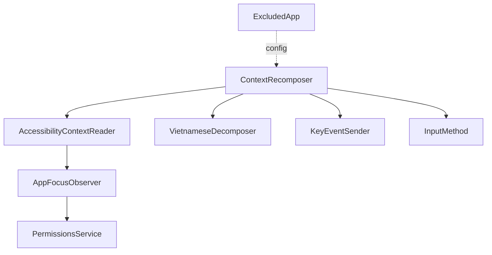
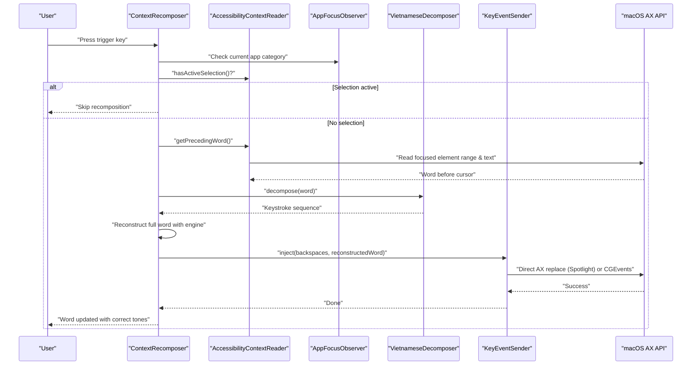
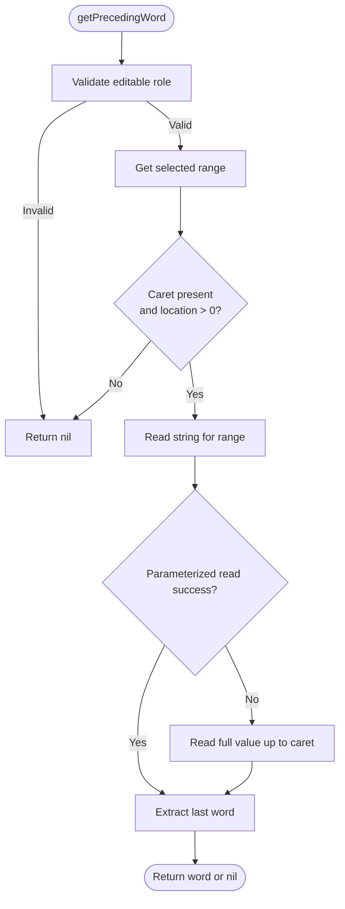
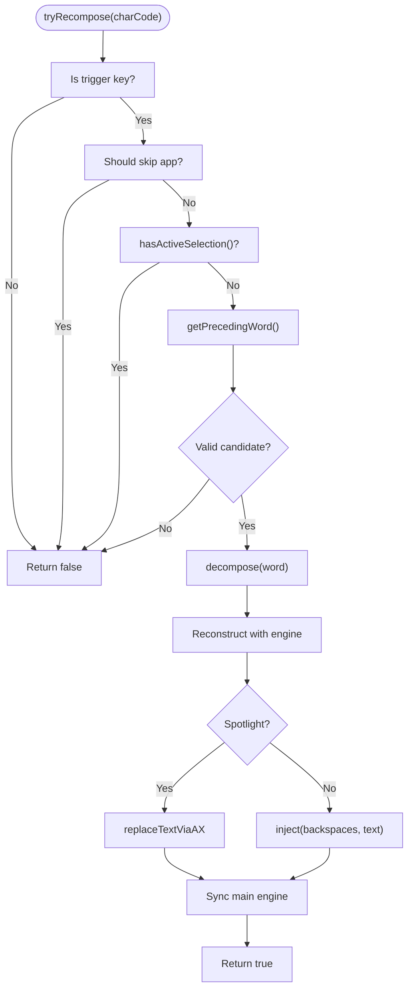
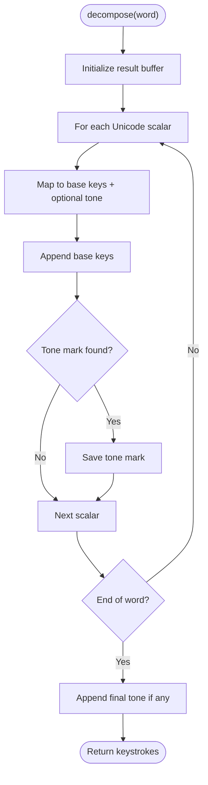
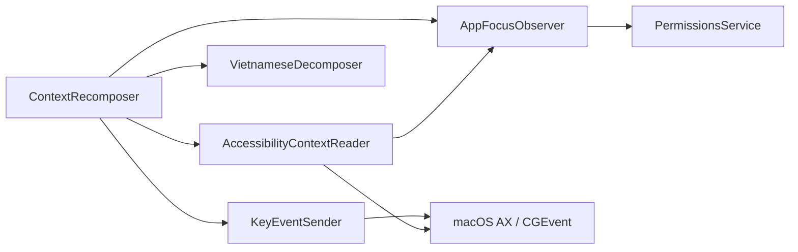

# Context Management

<cite>
**Referenced Files in This Document**
- [AccessibilityContextReader.swift](file://macos/skey-app/Sources/Features/Keyboard/Context/AccessibilityContextReader.swift)
- [ContextRecomposer.swift](file://macos/skey-app/Sources/Features/Keyboard/Context/ContextRecomposer.swift)
- [VietnameseDecomposer.swift](file://macos/skey-app/Sources/Features/Keyboard/Context/VietnameseDecomposer.swift)
- [ExcludedApp.swift](file://macos/skey-app/Sources/Features/Keyboard/Models/ExcludedApp.swift)
- [AppFocusObserver.swift](file://macos/skey-app/Sources/Shared/Services/AppFocusObserver.swift)
- [KeyEventSender.swift](file://macos/skey-app/Sources/Features/Keyboard/EventHandling/KeyEventSender.swift)
- [InputMethod.swift](file://macos/skey-app/Sources/Features/Keyboard/Engine/InputMethod.swift)
- [PermissionsService.swift](file://macos/skey-app/Sources/Shared/Services/PermissionsService.swift)
- [context_recomposer_tester.swift](file://macos/skey-app/scripts/context_recomposer_tester.swift)
</cite>

## Table of Contents
1. Introduction
2. Project Structure
3. Core Components
4. Architecture Overview
5. Detailed Component Analysis
6. Dependency Analysis
7. Performance Considerations
8. Troubleshooting Guide
9. Conclusion

## Introduction
This document explains the application context management system that integrates with macOS Accessibility APIs to detect active applications and their input contexts, automatically switches typing modes based on context, and maintains a consistent user experience across apps. It focuses on:
- Detecting the focused UI element and text selection using Accessibility APIs
- Recomposing previously typed Vietnamese words when editing anywhere in any app
- Decomposing pre-composed Vietnamese characters into raw keystrokes for accurate tone handling
- Bypassing or skipping specific applications via configuration

The system ensures that users can edit words consistently across browsers, chat apps, native editors, and Spotlight overlays without losing tones or corrupting buffers.

## Project Structure
The context management system is implemented under the Keyboard feature and shared services:
- Context detection and manipulation: AccessibilityContextReader
- Context-aware recomposition: ContextRecomposer
- Vietnamese character decomposition: VietnameseDecomposer
- Application focus tracking and classification: AppFocusObserver
- Event injection for backspaces and text: KeyEventSender
- Input method definitions: InputMethod
- Permissions and accessibility prompts: PermissionsService
- Exclusion model for bypassing apps: ExcludedApp

**Diagram sources**
- [AccessibilityContextReader.swift:144-185](file://macos/skey-app/Sources/Features/Keyboard/Context/AccessibilityContextReader.swift#L144-L185)
- [ContextRecomposer.swift:9-99](file://macos/skey-app/Sources/Features/Keyboard/Context/ContextRecomposer.swift#L9-L99)
- [VietnameseDecomposer.swift:10-32](file://macos/skey-app/Sources/Features/Keyboard/Context/VietnameseDecomposer.swift#L10-L32)
- [AppFocusObserver.swift:14-152](file://macos/skey-app/Sources/Shared/Services/AppFocusObserver.swift#L14-L152)
- [KeyEventSender.swift:30-51](file://macos/skey-app/Sources/Features/Keyboard/EventHandling/KeyEventSender.swift#L30-L51)
- [InputMethod.swift:5-19](file://macos/skey-app/Sources/Features/Keyboard/Engine/InputMethod.swift#L5-L19)
- [PermissionsService.swift:14-40](file://macos/skey-app/Sources/Shared/Services/PermissionsService.swift#L14-L40)
- [ExcludedApp.swift:5-16](file://macos/skey-app/Sources/Features/Keyboard/Models/ExcludedApp.swift#L5-L16)

**Section sources**
- [AccessibilityContextReader.swift:1-238](file://macos/skey-app/Sources/Features/Keyboard/Context/AccessibilityContextReader.swift#L1-L238)
- [ContextRecomposer.swift:1-99](file://macos/skey-app/Sources/Features/Keyboard/Context/ContextRecomposer.swift#L1-L99)
- [VietnameseDecomposer.swift:1-139](file://macos/skey-app/Sources/Features/Keyboard/Context/VietnameseDecomposer.swift#L1-L139)
- [AppFocusObserver.swift:1-153](file://macos/skey-app/Sources/Shared/Services/AppFocusObserver.swift#L1-L153)
- [KeyEventSender.swift:1-127](file://macos/skey-app/Sources/Features/Keyboard/EventHandling/KeyEventSender.swift#L1-L127)
- [InputMethod.swift:1-20](file://macos/skey-app/Sources/Features/Keyboard/Engine/InputMethod.swift#L1-L20)
- [PermissionsService.swift:1-42](file://macos/skey-app/Sources/Shared/Services/PermissionsService.swift#L1-L42)
- [ExcludedApp.swift:1-17](file://macos/skey-app/Sources/Features/Keyboard/Models/ExcludedApp.swift#L1-L17)

## Core Components
- AccessibilityContextReader: Reads and manipulates text in the currently focused UI element using Accessibility APIs. Provides methods to check Spotlight activity, detect active selections, extract preceding words, and perform direct AX replacement for overlay targets like Spotlight.
- ContextRecomposer: Coordinates context-aware word recomposition. It detects trigger keys, validates candidates, decomposes Vietnamese words into keystrokes, reconstructs the full word with the current input method, and atomically replaces the preceding word in the target app.
- VietnameseDecomposer: Ultra-high performance zero-allocation decomposer that translates pre-composed Vietnamese Unicode characters into raw keystroke sequences (base keys + tone marks).
- AppFocusObserver: Tracks the frontmost application PID, bundle ID, and classifies apps into categories (web browser, developer tool, electron/chat, spotlight, native app). Enables dynamic behavior such as enhanced accessibility attributes for certain categories.
- KeyEventSender: Injects synthetic keyboard events (backspaces + Unicode text) into the session event stream, with special handling for Spotlight overlays.
- InputMethod: Enumerates supported input methods (Telex, VNI, VIQR, Simple Telex) used by the engine during recomposition.
- PermissionsService: Checks and requests Accessibility and Input Monitoring permissions required for event taps and AX attribute access.
- ExcludedApp: Configuration model representing an excluded application by bundle ID and name, with an enabled flag.

**Section sources**
- [AccessibilityContextReader.swift:16-139](file://macos/skey-app/Sources/Features/Keyboard/Context/AccessibilityContextReader.swift#L16-L139)
- [ContextRecomposer.swift:19-99](file://macos/skey-app/Sources/Features/Keyboard/Context/ContextRecomposer.swift#L19-L99)
- [VietnameseDecomposer.swift:10-32](file://macos/skey-app/Sources/Features/Keyboard/Context/VietnameseDecomposer.swift#L10-L32)
- [AppFocusObserver.swift:29-152](file://macos/skey-app/Sources/Shared/Services/AppFocusObserver.swift#L29-L152)
- [KeyEventSender.swift:30-51](file://macos/skey-app/Sources/Features/Keyboard/EventHandling/KeyEventSender.swift#L30-L51)
- [InputMethod.swift:5-19](file://macos/skey-app/Sources/Features/Keyboard/Engine/InputMethod.swift#L5-L19)
- [PermissionsService.swift:14-40](file://macos/skey-app/Sources/Shared/Services/PermissionsService.swift#L14-L40)
- [ExcludedApp.swift:5-16](file://macos/skey-app/Sources/Features/Keyboard/Models/ExcludedApp.swift#L5-L16)

## Architecture Overview
The system detects the active application and its input context, then decides whether to recompose a previously typed Vietnamese word when a trigger key is pressed. If conditions are met, it decomposes the existing word, simulates typing through a scratch engine, and atomically replaces the original word in the target app.

**Diagram sources**
- [ContextRecomposer.swift:40-99](file://macos/skey-app/Sources/Features/Keyboard/Context/ContextRecomposer.swift#L40-L99)
- [AccessibilityContextReader.swift:31-139](file://macos/skey-app/Sources/Features/Keyboard/Context/AccessibilityContextReader.swift#L31-L139)
- [AppFocusObserver.swift:29-152](file://macos/skey-app/Sources/Shared/Services/AppFocusObserver.swift#L29-L152)
- [VietnameseDecomposer.swift:10-32](file://macos/skey-app/Sources/Features/Keyboard/Context/VietnameseDecomposer.swift#L10-L32)
- [KeyEventSender.swift:30-51](file://macos/skey-app/Sources/Features/Keyboard/EventHandling/KeyEventSender.swift#L30-L51)

## Detailed Component Analysis

### AccessibilityContextReader
Responsibilities:
- Detect if Spotlight search overlay is active and visible
- Check for active text selection in the focused element
- Extract the contiguous non-whitespace word immediately preceding the cursor
- Resolve the focused UI element for the current app or Spotlight
- Perform direct AX replacement for Spotlight overlays

Key behaviors:
- Role validation restricts operations to recognized editable roles (text fields, areas, search fields, combo boxes)
- Uses parameterized attributes and fallback strategies to robustly read text near the caret
- Word extraction uses efficient boundary checks and limits scan length for performance

**Diagram sources**
- [AccessibilityContextReader.swift:79-139](file://macos/skey-app/Sources/Features/Keyboard/Context/AccessibilityContextReader.swift#L79-L139)

**Section sources**
- [AccessibilityContextReader.swift:16-139](file://macos/skey-app/Sources/Features/Keyboard/Context/AccessibilityContextReader.swift#L16-L139)
- [AccessibilityContextReader.swift:144-199](file://macos/skey-app/Sources/Features/Keyboard/Context/AccessibilityContextReader.swift#L144-L199)

### ContextRecomposer
Responsibilities:
- Determine if a trigger key should initiate recomposition based on input method
- Skip recomposition for specific app categories (developer tools, electron/chat)
- Validate candidate words and ensure no active selection
- Decompose the preceding word into keystrokes, reconstruct with the current input method, and apply atomic replacement

Mode switching logic:
- Trigger sets differ per input method (Telex vs VNI)
- The engine is reset and fed keystrokes from the decomposed word plus the new trigger key
- Atomic replacement occurs either via AX direct replacement (Spotlight) or synthetic events

**Diagram sources**
- [ContextRecomposer.swift:19-99](file://macos/skey-app/Sources/Features/Keyboard/Context/ContextRecomposer.swift#L19-L99)
- [AccessibilityContextReader.swift:42-77](file://macos/skey-app/Sources/Features/Keyboard/Context/AccessibilityContextReader.swift#L42-L77)
- [KeyEventSender.swift:30-51](file://macos/skey-app/Sources/Features/Keyboard/EventHandling/KeyEventSender.swift#L30-L51)

**Section sources**
- [ContextRecomposer.swift:19-99](file://macos/skey-app/Sources/Features/Keyboard/Context/ContextRecomposer.swift#L19-L99)

### VietnameseDecomposer
Responsibilities:
- Convert pre-composed Vietnamese Unicode characters into raw keystroke sequences (base keys + tone mark)
- Provide O(1) scalar switch mapping for high performance and minimal allocations

Complexity:
- Time complexity: O(n) over the number of Unicode scalars in the input word
- Space complexity: O(k) where k is the number of resulting keystrokes; optimized with capacity reservation

Usage:
- Called by ContextRecomposer to obtain keystroke sequences for reconstruction

**Diagram sources**
- [VietnameseDecomposer.swift:10-32](file://macos/skey-app/Sources/Features/Keyboard/Context/VietnameseDecomposer.swift#L10-L32)
- [VietnameseDecomposer.swift:36-137](file://macos/skey-app/Sources/Features/Keyboard/Context/VietnameseDecomposer.swift#L36-L137)

**Section sources**
- [VietnameseDecomposer.swift:10-32](file://macos/skey-app/Sources/Features/Keyboard/Context/VietnameseDecomposer.swift#L10-L32)
- [VietnameseDecomposer.swift:36-137](file://macos/skey-app/Sources/Features/Keyboard/Context/VietnameseDecomposer.swift#L36-L137)

### AppFocusObserver
Responsibilities:
- Track the current frontmost application PID, bundle ID, and category
- Dynamically classify apps into categories (web browser, developer tool, electron/chat, spotlight, native app)
- Enable enhanced accessibility attributes for web browsers and Spotlight to improve AX interactions

Integration points:
- Used by ContextRecomposer to decide whether to skip recomposition
- Used by AccessibilityContextReader to resolve the focused element PID

**Section sources**
- [AppFocusObserver.swift:29-152](file://macos/skey-app/Sources/Shared/Services/AppFocusObserver.swift#L29-L152)

### KeyEventSender
Responsibilities:
- Inject synthetic backspace and Unicode text events into the active app
- Use direct AX replacement for Spotlight overlays to avoid backspace loss
- Ensure events are non-coalesced and stamped for recognition by event taps

**Section sources**
- [KeyEventSender.swift:30-51](file://macos/skey-app/Sources/Features/Keyboard/EventHandling/KeyEventSender.swift#L30-L51)
- [KeyEventSender.swift:55-127](file://macos/skey-app/Sources/Features/Keyboard/EventHandling/KeyEventSender.swift#L55-L127)

### InputMethod
Responsibilities:
- Define available input methods (Telex, VNI, VIQR, Simple Telex)
- Provide display names for settings UI

**Section sources**
- [InputMethod.swift:5-19](file://macos/skey-app/Sources/Features/Keyboard/Engine/InputMethod.swift#L5-L19)

### PermissionsService
Responsibilities:
- Check Accessibility and Input Monitoring permissions
- Prompt the user to open System Settings for required permissions
- Open relevant privacy pages directly

Common issues addressed:
- Missing AX trust prevents reading focused elements and injecting events
- Missing event tap permission prevents capturing and synthesizing keyboard events

**Section sources**
- [PermissionsService.swift:14-40](file://macos/skey-app/Sources/Shared/Services/PermissionsService.swift#L14-L40)

### ExcludedApp
Responsibilities:
- Model for configuring excluded applications by bundle ID and name
- Supports enabling/disabling exclusions

Note:
- While the model exists, the current skip logic in ContextRecomposer relies on AppCategory rather than this model. You can extend skip logic to consult ExcludedApp entries if needed.

**Section sources**
- [ExcludedApp.swift:5-16](file://macos/skey-app/Sources/Features/Keyboard/Models/ExcludedApp.swift#L5-L16)

## Dependency Analysis
High-level dependencies:
- ContextRecomposer depends on AccessibilityContextReader, VietnameseDecomposer, AppFocusObserver, and KeyEventSender
- AccessibilityContextReader depends on AppFocusObserver for PID resolution and macOS AX APIs
- AppFocusObserver provides app categorization used by ContextRecomposer to skip certain apps
- KeyEventSender interacts with macOS AX APIs and CGEventSource for event injection
- PermissionsService is used at app startup to ensure required privileges

**Diagram sources**
- [ContextRecomposer.swift:9-99](file://macos/skey-app/Sources/Features/Keyboard/Context/ContextRecomposer.swift#L9-L99)
- [AccessibilityContextReader.swift:144-185](file://macos/skey-app/Sources/Features/Keyboard/Context/AccessibilityContextReader.swift#L144-L185)
- [AppFocusObserver.swift:29-152](file://macos/skey-app/Sources/Shared/Services/AppFocusObserver.swift#L29-L152)
- [KeyEventSender.swift:30-51](file://macos/skey-app/Sources/Features/Keyboard/EventHandling/KeyEventSender.swift#L30-L51)
- [PermissionsService.swift:14-40](file://macos/skey-app/Sources/Shared/Services/PermissionsService.swift#L14-L40)

**Section sources**
- [ContextRecomposer.swift:9-99](file://macos/skey-app/Sources/Features/Keyboard/Context/ContextRecomposer.swift#L9-L99)
- [AccessibilityContextReader.swift:144-185](file://macos/skey-app/Sources/Features/Keyboard/Context/AccessibilityContextReader.swift#L144-L185)
- [AppFocusObserver.swift:29-152](file://macos/skey-app/Sources/Shared/Services/AppFocusObserver.swift#L29-L152)
- [KeyEventSender.swift:30-51](file://macos/skey-app/Sources/Features/Keyboard/EventHandling/KeyEventSender.swift#L30-L51)
- [PermissionsService.swift:14-40](file://macos/skey-app/Sources/Shared/Services/PermissionsService.swift#L14-L40)

## Performance Considerations
- VietnameseDecomposer uses an inline scalar switch table for O(1) mapping and reserves capacity to minimize allocations on the hot path
- AccessibilityContextReader limits scanned ranges and uses fast role checks to reduce overhead
- KeyEventSender batches Unicode text delivery in small chunks and uses non-coalesced events to prevent OS coalescing
- AppFocusObserver caches app categories in memory to avoid repeated filesystem inspections

[No sources needed since this section provides general guidance]

## Troubleshooting Guide
Common accessibility permission issues and resolutions:
- Symptom: No word detection or no recomposition occurs
  - Cause: Missing Accessibility permission
  - Resolution: Use PermissionsService to check and prompt for AX trust; open System Settings Privacy > Accessibility
- Symptom: Synthetic backspaces do not work or text does not appear
  - Cause: Missing Input Monitoring permission
  - Resolution: Use PermissionsService to request event listening access; open System Settings Privacy > Input Monitoring
- Symptom: Spotlight overlay behaves unexpectedly
  - Cause: AX replacement path may fail if Spotlight is not detected as active
  - Resolution: Ensure Spotlight overlay is visible; the reader includes Spotlight detection and direct AX replacement path

Operational tips:
- Verify app category classification for your target app; developer tools and electron/chat apps are skipped by default in recomposition
- Confirm there is no active selection when attempting recomposition; active selections will be ignored to avoid unintended edits
- For Spotlight overlays, prefer direct AX replacement; otherwise, synthetic events are used

**Section sources**
- [PermissionsService.swift:14-40](file://macos/skey-app/Sources/Shared/Services/PermissionsService.swift#L14-L40)
- [ContextRecomposer.swift:40-99](file://macos/skey-app/Sources/Features/Keyboard/Context/ContextRecomposer.swift#L40-L99)
- [AccessibilityContextReader.swift:16-77](file://macos/skey-app/Sources/Features/Keyboard/Context/AccessibilityContextReader.swift#L16-L77)

## Conclusion
The context management system provides robust, cross-application Vietnamese typing support by combining Accessibility API integration, precise context detection, and high-performance text decomposition. It intelligently adapts to different app types, avoids interfering with selections and unsupported contexts, and ensures consistent tone handling across environments. With proper permissions and careful configuration, users enjoy seamless editing experiences in browsers, chat apps, native editors, and Spotlight overlays.