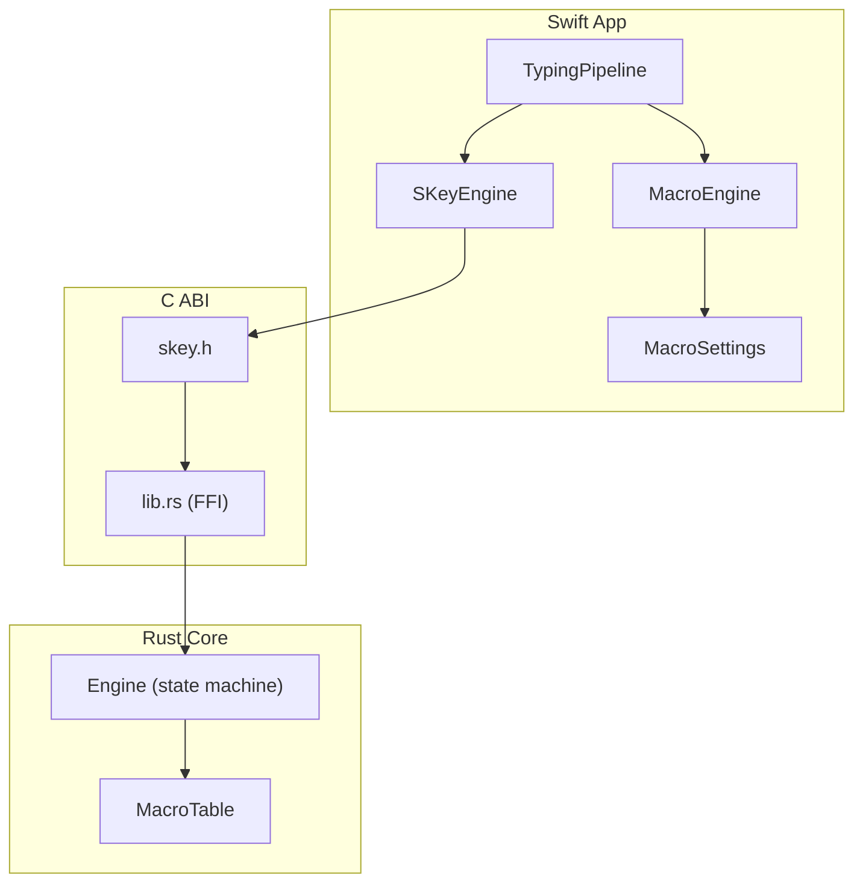
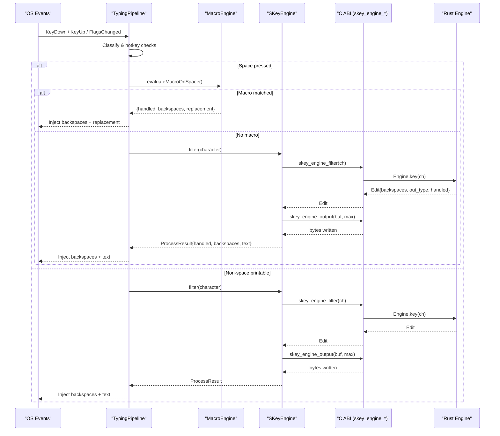
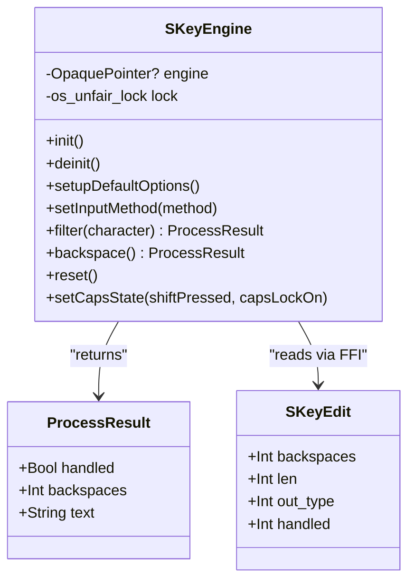
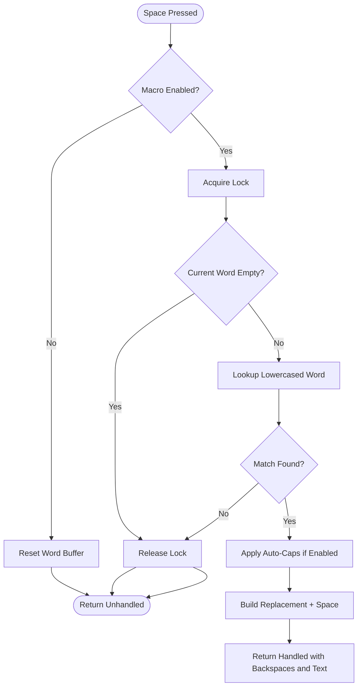
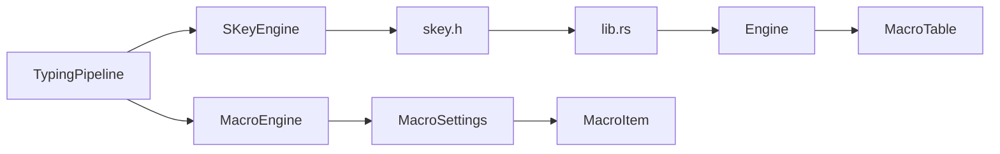

# Engine Bridge

<cite>
**Referenced Files in This Document**
- [SKeyEngine.swift](file://macos/skey-app/Sources/Features/Keyboard/Engine/SKeyEngine.swift)
- [InputMethod.swift](file://macos/skey-app/Sources/Features/Keyboard/Engine/InputMethod.swift)
- [MacroEngine.swift](file://macos/skey-app/Sources/Features/Keyboard/Engine/MacroEngine.swift)
- [TypingPipeline.swift](file://macos/skey-app/Sources/Features/Keyboard/EventHandling/Pipeline/TypingPipeline.swift)
- [KeyInterceptor.swift](file://macos/skey-app/Sources/Features/Keyboard/EventHandling/Pipeline/KeyInterceptor.swift)
- [MacroSettings.swift](file://macos/skey-app/Sources/Shared/Settings/Modules/MacroSettings.swift)
- [MacroItem.swift](file://macos/skey-app/Sources/Features/Keyboard/Models/MacroItem.swift)
- [skey.h](file://port/skey-capi/include/skey.h)
- [lib.rs](file://port/skey-capi/src/lib.rs)
- [lib.rs (core)](file://port/skey-core/src/lib.rs)
- [engine/mod.rs](file://port/skey-core/src/engine/mod.rs)
- [macros.rs](file://port/skey-core/src/extensions/macros.rs)
</cite>

## Table of Contents
1. [Introduction](#introduction)
2. [Project Structure](#project-structure)
3. [Core Components](#core-components)
4. [Architecture Overview](#architecture-overview)
5. [Detailed Component Analysis](#detailed-component-analysis)
6. [Dependency Analysis](#dependency-analysis)
7. [Performance Considerations](#performance-considerations)
8. [Troubleshooting Guide](#troubleshooting-guide)
9. [Conclusion](#conclusion)
10. [Appendices](#appendices)

## Introduction
This document explains the Swift-Rust bridge layer that powers Vietnamese input and text expansion in the application. It focuses on:
- The SKeyEngine wrapper that safely calls into a Rust core engine via a stable C ABI.
- The InputMethod abstraction for switching between Telex, VNI, VIQR, and Simple Telex.
- The MacroEngine for fast in-memory macro expansion triggered by typing space.
- The result processing pipeline that turns keystrokes into backspaces and output text with minimal allocations and low latency.
It also covers memory management across the FFI boundary, error handling strategies, performance characteristics, and practical examples for initialization, method switching, macro execution, and debugging.

## Project Structure
The bridge spans three layers:
- Swift application layer: event interception, pipeline orchestration, settings, and UI integration.
- C ABI layer: stable headers and Rust bindings exposing context-based functions to Swift.
- Rust core engine: stateful engine implementing Vietnamese phonetics, keymaps, macros, and output buffering.

**Diagram sources**
- [TypingPipeline.swift:31-170](file://macos/skey-app/Sources/Features/Keyboard/EventHandling/Pipeline/TypingPipeline.swift#L31-L170)
- [SKeyEngine.swift:27-68](file://macos/skey-app/Sources/Features/Keyboard/Engine/SKeyEngine.swift#L27-L68)
- [MacroEngine.swift:28-109](file://macos/skey-app/Sources/Features/Keyboard/Engine/MacroEngine.swift#L28-L109)
- [skey.h:30-74](file://port/skey-capi/include/skey.h#L30-L74)
- [lib.rs:404-571](file://port/skey-capi/src/lib.rs#L404-L571)
- [engine/mod.rs:18-70](file://port/skey-core/src/engine/mod.rs#L18-L70)
- [macros.rs:58-107](file://port/skey-core/src/extensions/macros.rs#L58-L107)

**Section sources**
- [TypingPipeline.swift:31-170](file://macos/skey-app/Sources/Features/Keyboard/EventHandling/Pipeline/TypingPipeline.swift#L31-L170)
- [SKeyEngine.swift:27-68](file://macos/skey-app/Sources/Features/Keyboard/Engine/SKeyEngine.swift#L27-L68)
- [skey.h:30-74](file://port/skey-capi/include/skey.h#L30-L74)
- [lib.rs:404-571](file://port/skey-capi/src/lib.rs#L404-L571)
- [engine/mod.rs:18-70](file://port/skey-core/src/engine/mod.rs#L18-L70)
- [macros.rs:58-107](file://port/skey-core/src/extensions/macros.rs#L58-L107)

## Core Components
- SKeyEngine: Swift wrapper around the Rust engine. Provides lifecycle, configuration, filtering, backspace, and zero-allocation UTF-8 extraction.
- InputMethodType: Enum mapping Swift to C ABI input methods (Telex, VNI, VIQR, Simple Telex).
- MacroEngine: Thread-safe in-memory macro expander keyed by last typed word; triggers on space with optional auto-caps behavior.
- TypingPipeline: Orchestrates events, hotkeys, language mode, engine composing, and macro expansion with fast paths and caret-aware logic.
- C ABI (skey.h + lib.rs): Stable C interface exposing context-based engine functions and legacy globals; maps to Rust Engine and MacroTable.
- Rust Engine: State machine handling Vietnamese composition, shortcuts, quick options, and output buffer management.
- MacroTable: Efficient binary-searchable storage of macro key-to-text mappings loaded from files or settings.

**Section sources**
- [SKeyEngine.swift:6-188](file://macos/skey-app/Sources/Features/Keyboard/Engine/SKeyEngine.swift#L6-L188)
- [InputMethod.swift:3-19](file://macos/skey-app/Sources/Features/Keyboard/Engine/InputMethod.swift#L3-L19)
- [MacroEngine.swift:4-109](file://macos/skey-app/Sources/Features/Keyboard/Engine/MacroEngine.swift#L4-L109)
- [TypingPipeline.swift:31-170](file://macos/skey-app/Sources/Features/Keyboard/EventHandling/Pipeline/TypingPipeline.swift#L31-L170)
- [skey.h:16-74](file://port/skey-capi/include/skey.h#L16-L74)
- [lib.rs:404-571](file://port/skey-capi/src/lib.rs#L404-L571)
- [engine/mod.rs:18-70](file://port/skey-core/src/engine/mod.rs#L18-L70)
- [macros.rs:58-107](file://port/skey-core/src/extensions/macros.rs#L58-L107)

## Architecture Overview
The system processes each keystroke through a multi-stage pipeline:
- Event interception and classification.
- Hotkey and modifier handling.
- Language mode gating (Vietnamese vs English).
- Optional macro expansion on space.
- Engine filtering for Vietnamese composition.
- Output injection (backspaces + text) via event sender.

**Diagram sources**
- [TypingPipeline.swift:218-279](file://macos/skey-app/Sources/Features/Keyboard/EventHandling/Pipeline/TypingPipeline.swift#L218-L279)
- [MacroEngine.swift:71-109](file://macos/skey-app/Sources/Features/Keyboard/Engine/MacroEngine.swift#L71-L109)
- [SKeyEngine.swift:133-187](file://macos/skey-app/Sources/Features/Keyboard/Engine/SKeyEngine.swift#L133-L187)
- [lib.rs:530-571](file://port/skey-capi/src/lib.rs#L530-L571)
- [engine/mod.rs:248-319](file://port/skey-core/src/engine/mod.rs#L248-L319)

## Detailed Component Analysis

### SKeyEngine Wrapper
Responsibilities:
- Lifecycle: create/free engine instance.
- Configuration: set options, charset, input method, caps state, quick options.
- Processing: filter character, backspace, reset.
- Result extraction: zero-heap UTF-8 reading using stack allocation.

Key behaviors:
- Uses an unfair lock to serialize access to the opaque engine pointer.
- Default options include free marking, modern style toggles, macro flags, IME usage, spell check, and restoration behavior.
- Reads output via a separate call to retrieve UTF-8 bytes into a temporary stack buffer, avoiding heap allocations on the hot path.

Memory and safety:
- Opaque engine pointer is managed by Swift; deinit frees it.
- Temporary allocation ensures no heap allocation for typical Vietnamese words.

Error handling:
- If engine pointer is nil or edit not handled, returns unhandled result.
- Output read failures return handled result with empty text.

**Section sources**
- [SKeyEngine.swift:21-68](file://macos/skey-app/Sources/Features/Keyboard/Engine/SKeyEngine.swift#L21-L68)
- [SKeyEngine.swift:121-187](file://macos/skey-app/Sources/Features/Keyboard/Engine/SKeyEngine.swift#L121-L187)

#### Class Diagram: SKeyEngine and FFI Types

**Diagram sources**
- [SKeyEngine.swift:11-18](file://macos/skey-app/Sources/Features/Keyboard/Engine/SKeyEngine.swift#L11-L18)
- [skey.h:35-42](file://port/skey-capi/include/skey.h#L35-L42)

### InputMethod Abstraction
- Maps Swift enum values to C ABI integers used by the engine.
- Supports Telex, VNI, VIQR, and Simple Telex.
- Switching method resets engine state to avoid inconsistent buffers.

Usage:
- Called during initialization and when user changes input method.

**Section sources**
- [InputMethod.swift:3-19](file://macos/skey-app/Sources/Features/Keyboard/Engine/InputMethod.swift#L3-L19)
- [SKeyEngine.swift:63-68](file://macos/skey-app/Sources/Features/Keyboard/Engine/SKeyEngine.swift#L63-L68)
- [lib.rs:478-485](file://port/skey-capi/src/lib.rs#L478-L485)

### MacroEngine Integration
Responsibilities:
- Maintain current word buffer and macro lookup table.
- Evaluate macros on space with optional auto-caps transformation.
- Reset buffer on word breaks, navigation, and engine resets.

Data model:
- In-memory map from lowercase shortcut to replacement string.
- Settings-driven reload of macro items.

Behavior:
- On space, if enabled, look up current word; if found, emit backspaces and replacement plus trailing space.
- Auto-caps supports all-uppercase or initial-cap based on typed prefix.

**Section sources**
- [MacroEngine.swift:16-109](file://macos/skey-app/Sources/Features/Keyboard/Engine/MacroEngine.swift#L16-L109)
- [MacroSettings.swift:18-27](file://macos/skey-app/Sources/Shared/Settings/Modules/MacroSettings.swift#L18-L27)
- [MacroItem.swift:5-22](file://macos/skey-app/Sources/Features/Keyboard/Models/MacroItem.swift#L5-L22)

#### Flowchart: Macro Expansion on Space

**Diagram sources**
- [MacroEngine.swift:71-109](file://macos/skey-app/Sources/Features/Keyboard/Engine/MacroEngine.swift#L71-L109)

### Typing Pipeline and Result Processing
Responsibilities:
- Intercept CGEvents and route them through stages.
- Handle hotkeys, modifiers, excluded apps, and language mode.
- For Vietnamese mode, feed characters to SKeyEngine and inject edits.
- For English mode, optionally run macro expansion without engine filtering.

Key decisions:
- Fast paths for function/media keys, navigation, backspace, and structural word-break keys.
- Caps state synchronization before filtering.
- Caret movement tracking to enable recomposition only when needed.

Result injection:
- Resolves backspace count considering active selection in web browsers.
- Injects backspaces and text via event sender.

**Section sources**
- [TypingPipeline.swift:31-170](file://macos/skey-app/Sources/Features/Keyboard/EventHandling/Pipeline/TypingPipeline.swift#L31-L170)
- [TypingPipeline.swift:174-279](file://macos/skey-app/Sources/Features/Keyboard/EventHandling/Pipeline/TypingPipeline.swift#L174-L279)
- [TypingPipeline.swift:284-329](file://macos/skey-app/Sources/Features/Keyboard/EventHandling/Pipeline/TypingPipeline.swift#L284-L329)
- [TypingPipeline.swift:334-343](file://macos/skey-app/Sources/Features/Keyboard/EventHandling/Pipeline/TypingPipeline.swift#L334-L343)

### C ABI Interface and Rust Core
ABI surface:
- Context-based API: create, free, reset, set options, set input method, filter, backspace, restore, output.
- Legacy globals: UnikeyBuf, UnikeyBackspaces, UnikeyOutput for older front ends.
- Additional helpers: swallowed key restore, quick options, user key map loading.

Rust core:
- Engine struct holds buffers, options, charset, input processor, macro store, and per-stroke state.
- key() dispatches to phonetic processors and appends output; backspace() handles tone and vowel sequence adjustments.
- MacroTable provides efficient lookup and persistence.

Memory management:
- Engine instances are boxed and returned as raw pointers; Swift must free them.
- Output buffer copying uses unsafe but bounded operations; Swift reads via temporary stack allocation.

Error handling:
- Null pointer guards in FFI wrappers return safe defaults.
- File I/O errors for macro tables and key maps return failure codes.

**Section sources**
- [skey.h:16-74](file://port/skey-capi/include/skey.h#L16-L74)
- [lib.rs:404-571](file://port/skey-capi/src/lib.rs#L404-L571)
- [engine/mod.rs:18-70](file://port/skey-core/src/engine/mod.rs#L18-L70)
- [engine/mod.rs:248-423](file://port/skey-core/src/engine/mod.rs#L248-L423)
- [macros.rs:58-107](file://port/skey-core/src/extensions/macros.rs#L58-L107)

## Dependency Analysis
High-level dependencies:
- TypingPipeline depends on SKeyEngine and MacroEngine.
- SKeyEngine depends on C ABI functions declared in skey.h and implemented in lib.rs.
- lib.rs depends on skey_core::Engine and extensions like macros and keymap.
- MacroEngine depends on MacroSettings and MacroItem models.

**Diagram sources**
- [TypingPipeline.swift:31-170](file://macos/skey-app/Sources/Features/Keyboard/EventHandling/Pipeline/TypingPipeline.swift#L31-L170)
- [SKeyEngine.swift:27-68](file://macos/skey-app/Sources/Features/Keyboard/Engine/SKeyEngine.swift#L27-L68)
- [skey.h:30-74](file://port/skey-capi/include/skey.h#L30-L74)
- [lib.rs:404-571](file://port/skey-capi/src/lib.rs#L404-L571)
- [engine/mod.rs:18-70](file://port/skey-core/src/engine/mod.rs#L18-L70)
- [macros.rs:58-107](file://port/skey-core/src/extensions/macros.rs#L58-L107)
- [MacroSettings.swift:18-27](file://macos/skey-app/Sources/Shared/Settings/Modules/MacroSettings.swift#L18-L27)
- [MacroItem.swift:5-22](file://macos/skey-app/Sources/Features/Keyboard/Models/MacroItem.swift#L5-L22)

**Section sources**
- [TypingPipeline.swift:31-170](file://macos/skey-app/Sources/Features/Keyboard/EventHandling/Pipeline/TypingPipeline.swift#L31-L170)
- [SKeyEngine.swift:27-68](file://macos/skey-app/Sources/Features/Keyboard/Engine/SKeyEngine.swift#L27-L68)
- [skey.h:30-74](file://port/skey-capi/include/skey.h#L30-L74)
- [lib.rs:404-571](file://port/skey-capi/src/lib.rs#L404-L571)
- [engine/mod.rs:18-70](file://port/skey-core/src/engine/mod.rs#L18-L70)
- [macros.rs:58-107](file://port/skey-core/src/extensions/macros.rs#L58-L107)
- [MacroSettings.swift:18-27](file://macos/skey-app/Sources/Shared/Settings/Modules/MacroSettings.swift#L18-L27)
- [MacroItem.swift:5-22](file://macos/skey-app/Sources/Features/Keyboard/Models/MacroItem.swift#L5-L22)

## Performance Considerations
- Zero-heap output extraction: SKeyEngine uses temporary stack allocation to read UTF-8 output, minimizing allocations on the hot path.
- Fast paths: TypingPipeline short-circuits non-printable, function/media, navigation, and structural keys to reduce overhead.
- Lock granularity: SKeyEngine uses an unfair lock around engine access; MacroEngine uses fine-grained locks around small critical sections.
- Engine design: Rust Engine avoids dynamic allocations in the keystroke path; macro table and keymap parsing use alloc features only when needed.
- Output buffer sizing: Engine reports stream length that may exceed actual bytes; callers clamp to buffer capacity.

Recommendations:
- Keep engine instances long-lived and reuse them per session.
- Avoid frequent option changes inside tight loops; batch configuration at startup or user-triggered settings changes.
- Use reset() on focus changes or navigation to prevent stale state.
- Monitor macro table size; large tables increase lookup time slightly due to binary search over entries.

[No sources needed since this section provides general guidance]

## Troubleshooting Guide
Common issues and diagnostics:
- Engine pointer nil: Ensure init() was called and deinit has not been invoked prematurely.
- No output after filter(): Check handled flag; if false, pass through to OS. Verify charset and input method settings.
- Incorrect backspace count: Inspect resolveBackspaces logic for browser selection edge cases.
- Macros not triggering: Confirm MacroEngine.enabled and that current word matches a stored shortcut; verify reloadMacros() after settings changes.
- FFI crashes: Validate buffer sizes and null pointer checks; ensure skey_engine_output is called after filter/backspace/restore and within bounds.

Debugging techniques:
- Enable debug logging in TypingPipeline to trace transform results and injected edits.
- Log MacroEngine evaluation outcomes and replacements.
- Use engine reset() around navigation and focus changes to isolate state issues.
- Validate macro file format and version detection in MacroTable load_from_bytes.

**Section sources**
- [TypingPipeline.swift:246-279](file://macos/skey-app/Sources/Features/Keyboard/EventHandling/Pipeline/TypingPipeline.swift#L246-L279)
- [MacroEngine.swift:71-109](file://macos/skey-app/Sources/Features/Keyboard/Engine/MacroEngine.swift#L71-L109)
- [lib.rs:530-571](file://port/skey-capi/src/lib.rs#L530-L571)
- [macros.rs:190-224](file://port/skey-core/src/extensions/macros.rs#L190-L224)

## Conclusion
The bridge layer cleanly separates Swift application concerns from Rust core engine capabilities via a stable C ABI. SKeyEngine provides a high-performance, low-allocation wrapper for Vietnamese input composition, while MacroEngine delivers fast text expansion. The TypingPipeline orchestrates events with careful attention to latency, correctness, and user experience. Together, these components enable robust Vietnamese input and powerful macro workflows with predictable memory behavior and clear error handling.

[No sources needed since this section summarizes without analyzing specific files]

## Appendices

### Examples

- Engine initialization:
  - Create engine instance and apply default options, charset, input method, and quick settings.
  - Reference: [SKeyEngine.swift:27-68](file://macos/skey-app/Sources/Features/Keyboard/Engine/SKeyEngine.swift#L27-L68)

- Method switching:
  - Call setInputMethod with desired InputMethodType; engine resets to consistent state.
  - Reference: [SKeyEngine.swift:63-68](file://macos/skey-app/Sources/Features/Keyboard/Engine/SKeyEngine.swift#L63-L68), [lib.rs:478-485](file://port/skey-capi/src/lib.rs#L478-L485)

- Macro execution:
  - On space, MacroEngine evaluates current word against stored shortcuts; if matched, emits backspaces and replacement.
  - Reference: [MacroEngine.swift:71-109](file://macos/skey-app/Sources/Features/Keyboard/Engine/MacroEngine.swift#L71-L109), [TypingPipeline.swift:234-244](file://macos/skey-app/Sources/Features/Keyboard/EventHandling/Pipeline/TypingPipeline.swift#L234-L244)

- Debugging FFI calls:
  - Log transform results and injected edits in TypingPipeline; validate output buffer sizes and handled flags.
  - Reference: [TypingPipeline.swift:246-258](file://macos/skey-app/Sources/Features/Keyboard/EventHandling/Pipeline/TypingPipeline.swift#L246-L258), [lib.rs:555-571](file://port/skey-capi/src/lib.rs#L555-L571)