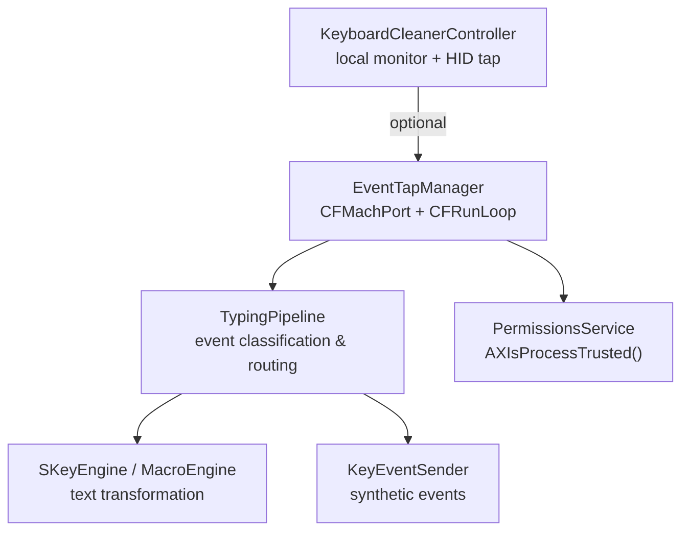
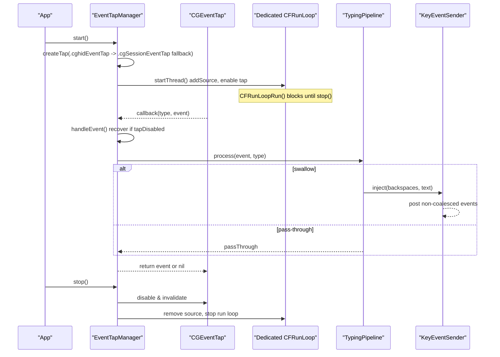
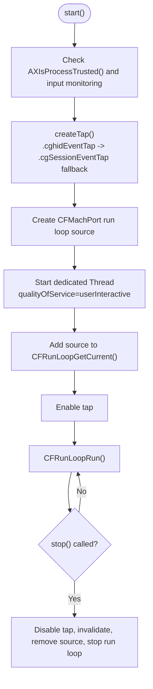
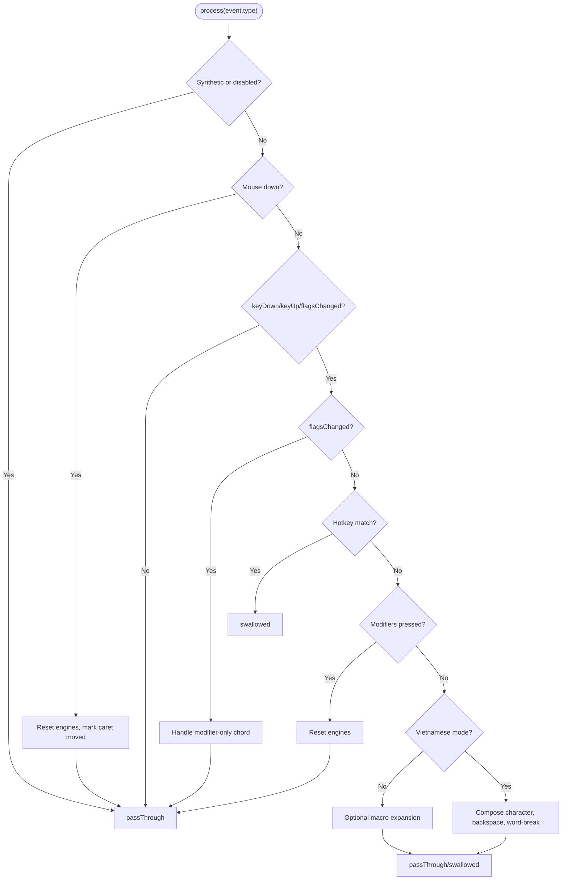
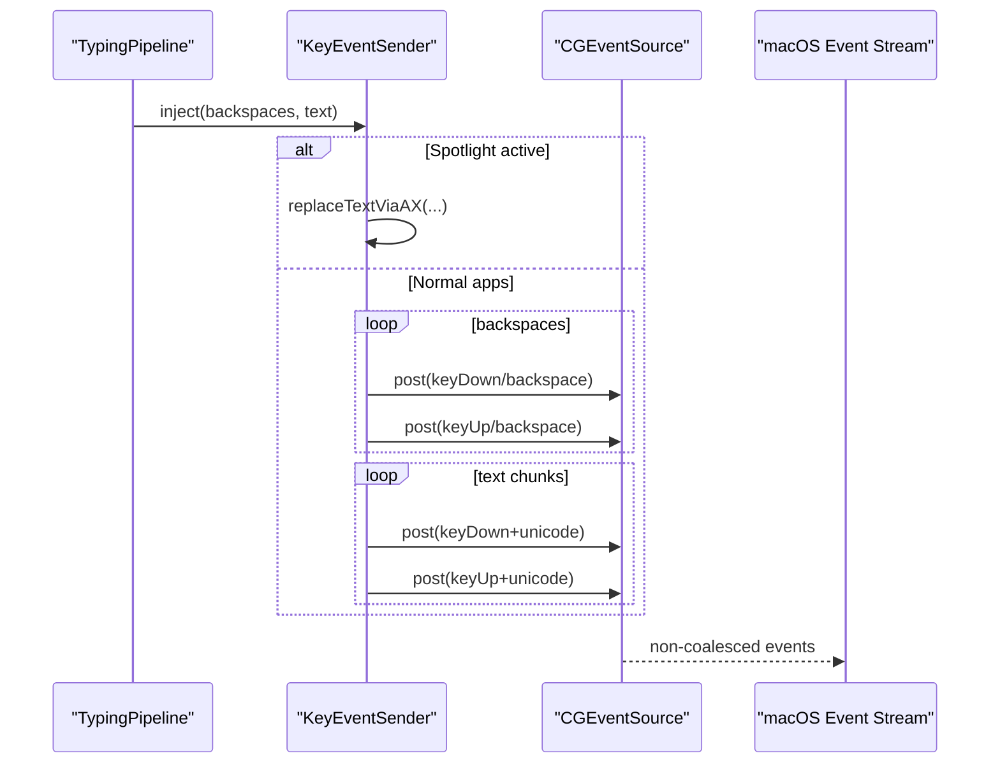
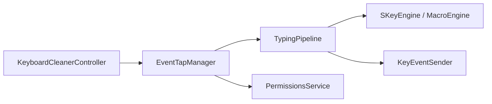

# Event Capture System

<cite>
**Referenced Files in This Document**
- [EventTapManager.swift](file://macos/skey-app/Sources/Features/Keyboard/EventHandling/EventTapManager.swift)
- [TypingPipeline.swift](file://macos/skey-app/Sources/Features/Keyboard/EventHandling/Pipeline/TypingPipeline.swift)
- [KeyEventSender.swift](file://macos/skey-app/Sources/Features/Keyboard/EventHandling/KeyEventSender.swift)
- [KeyConstants.swift](file://macos/skey-app/Sources/Features/Keyboard/EventHandling/KeyConstants.swift)
- [PermissionsService.swift](file://macos/skey-app/Sources/Shared/Services/PermissionsService.swift)
- [KeyboardCleanerController.swift](file://macos/skey-app/Sources/Features/Cleaner/KeyboardCleanerController.swift)
</cite>

## Table of Contents
1. [Introduction](#introduction)
2. [Project Structure](#project-structure)
3. [Core Components](#core-components)
4. [Architecture Overview](#architecture-overview)
5. [Detailed Component Analysis](#detailed-component-analysis)
6. [Dependency Analysis](#dependency-analysis)
7. [Performance Considerations](#performance-considerations)
8. [Troubleshooting Guide](#troubleshooting-guide)
9. [Conclusion](#conclusion)

## Introduction
This document explains the CoreGraphics EventTap implementation used to capture low-level keyboard and mouse events system-wide on macOS. It focuses on how CGEventTap is configured, the fallback strategy between .cghidEventTap and .cgSessionEventTap, event mask configuration for keyDown/keyUp/flagsChanged/mouse events, the dedicated CFRunLoop thread architecture for high-priority processing, accessibility permission handling, tap enable/disable patterns, and error recovery mechanisms for tap timeouts.

## Project Structure
The event capture system is implemented in the macOS application under the Keyboard feature:
- EventTapManager orchestrates CGEventTap lifecycle and hosts a dedicated run loop thread.
- TypingPipeline processes events with minimal latency and routes them to engine or UI actions.
- KeyEventSender synthesizes synthetic events back into the session/HID stream.
- PermissionsService checks and prompts for accessibility/input monitoring permissions.
- KeyboardCleanerController demonstrates an alternative local monitor plus hardware-level tap usage for blocking keys.

**Diagram sources**
- [EventTapManager.swift:15-122](file://macos/skey-app/Sources/Features/Keyboard/EventHandling/EventTapManager.swift#L15-L122)
- [TypingPipeline.swift:31-170](file://macos/skey-app/Sources/Features/Keyboard/EventHandling/Pipeline/TypingPipeline.swift#L31-L170)
- [KeyEventSender.swift:33-51](file://macos/skey-app/Sources/Features/Keyboard/EventHandling/KeyEventSender.swift#L33-L51)
- [PermissionsService.swift:14-25](file://macos/skey-app/Sources/Shared/Services/PermissionsService.swift#L14-L25)
- [KeyboardCleanerController.swift:57-74](file://macos/skey-app/Sources/Features/Cleaner/KeyboardCleanerController.swift#L57-L74)

**Section sources**
- [EventTapManager.swift:15-122](file://macos/skey-app/Sources/Features/Keyboard/EventHandling/EventTapManager.swift#L15-L122)
- [PermissionsService.swift:14-25](file://macos/skey-app/Sources/Shared/Services/PermissionsService.swift#L14-L25)
- [KeyboardCleanerController.swift:57-74](file://macos/skey-app/Sources/Features/Cleaner/KeyboardCleanerController.swift#L57-L74)

## Core Components
- EventTapManager: Creates and manages a CGEventTap, sets up a dedicated CFRunLoop thread, handles tap enable/disable, and recovers from tap timeouts.
- TypingPipeline: Fast-path event classification and routing (hotkeys, navigation, composing, macros), returning pass-through or swallowed decisions.
- KeyEventSender: Injects synthetic backspaces and Unicode text using non-coalesced events; uses AX replacement for Spotlight when needed.
- KeyConstants: Defines virtual keycodes, timing constants, and a fast key classifier lookup table.
- PermissionsService: Checks and prompts for Accessibility and Input Monitoring permissions required by CGEventTap.
- KeyboardCleanerController: Demonstrates a local NSEvent monitor plus a hardware-level CGEventTap to block all keystrokes during “cleaner” mode.

**Section sources**
- [EventTapManager.swift:15-196](file://macos/skey-app/Sources/Features/Keyboard/EventHandling/EventTapManager.swift#L15-L196)
- [TypingPipeline.swift:6-170](file://macos/skey-app/Sources/Features/Keyboard/EventHandling/Pipeline/TypingPipeline.swift#L6-L170)
- [KeyEventSender.swift:9-51](file://macos/skey-app/Sources/Features/Keyboard/EventHandling/KeyEventSender.swift#L9-L51)
- [KeyConstants.swift:7-133](file://macos/skey-app/Sources/Features/Keyboard/EventHandling/KeyConstants.swift#L7-L133)
- [PermissionsService.swift:12-25](file://macos/skey-app/Sources/Shared/Services/PermissionsService.swift#L12-L25)
- [KeyboardCleanerController.swift:57-74](file://macos/skey-app/Sources/Features/Cleaner/KeyboardCleanerController.swift#L57-L74)

## Architecture Overview
At runtime:
- EventTapManager.start() checks accessibility/input monitoring permissions, creates a CGEventTap with a specific event mask, builds a CFRunLoopSource, and starts a dedicated Thread hosting a CFRunLoop at userInteractive quality.
- Events are delivered to EventTapManager.handleEvent(), which first recovers from tap-disabled states, then delegates to TypingPipeline.process().
- TypingPipeline classifies events and either passes them through or swallows them; for transformations, it uses KeyEventSender to inject synthetic events.
- EventTapManager.stop() disables the tap, removes the run loop source, stops the run loop, and cleans up resources.

**Diagram sources**
- [EventTapManager.swift:81-122](file://macos/skey-app/Sources/Features/Keyboard/EventHandling/EventTapManager.swift#L81-L122)
- [EventTapManager.swift:127-168](file://macos/skey-app/Sources/Features/Keyboard/EventHandling/EventTapManager.swift#L127-L168)
- [EventTapManager.swift:172-188](file://macos/skey-app/Sources/Features/Keyboard/EventHandling/EventTapManager.swift#L172-L188)
- [TypingPipeline.swift:31-170](file://macos/skey-app/Sources/Features/Keyboard/EventHandling/Pipeline/TypingPipeline.swift#L31-L170)
- [KeyEventSender.swift:33-51](file://macos/skey-app/Sources/Features/Keyboard/EventHandling/KeyEventSender.swift#L33-L51)

## Detailed Component Analysis

### EventTapManager: CGEventTap lifecycle and dedicated thread
- Event mask: Captures keyDown, keyUp, flagsChanged, leftMouseDown, rightMouseDown, otherMouseDown via a bit-mask helper.
- Tap creation strategy: Attempts .cghidEventTap first; on failure, falls back to .cgSessionEventTap.
- Dedicated thread: Creates a Thread with name and qualityOfService set to userInteractive, adds the CFMachPort run loop source to the current run loop, enables the tap, signals readiness, and runs CFRunLoopRun() until stopped.
- Lifecycle: start() returns success/failure; stop() disables the tap, invalidates the mach port, removes the run loop source, and stops the run loop to exit cleanly.
- Error recovery: In handleEvent(), detects .tapDisabledByTimeout or .tapDisabledByUserInput and re-enables the tap immediately.

**Diagram sources**
- [EventTapManager.swift:81-122](file://macos/skey-app/Sources/Features/Keyboard/EventHandling/EventTapManager.swift#L81-L122)
- [EventTapManager.swift:127-168](file://macos/skey-app/Sources/Features/Keyboard/EventHandling/EventTapManager.swift#L127-L168)

**Section sources**
- [EventTapManager.swift:81-122](file://macos/skey-app/Sources/Features/Keyboard/EventHandling/EventTapManager.swift#L81-L122)
- [EventTapManager.swift:127-168](file://macos/skey-app/Sources/Features/Keyboard/EventHandling/EventTapManager.swift#L127-L168)
- [EventTapManager.swift:172-188](file://macos/skey-app/Sources/Features/Keyboard/EventHandling/EventTapManager.swift#L172-L188)

### TypingPipeline: Low-latency event classification and routing
- Entry point process() filters out synthetic events and disabled tap events early.
- Mouse clicks reset state and mark caret movement possibility.
- FlagsChanged handles modifier-only shortcuts and language toggle chords.
- Hotkeys (language toggle, clipboard, cleaner, AI settings, quick translate) are intercepted and swallowed.
- Non-Vietnamese mode optionally supports macro expansion; otherwise passes through.
- Vietnamese mode composes characters, handles backspace, word-break keys, and smart context recomposition.
- Returns InterceptorResult to either pass through or swallow events.

**Diagram sources**
- [TypingPipeline.swift:31-170](file://macos/skey-app/Sources/Features/Keyboard/EventHandling/Pipeline/TypingPipeline.swift#L31-L170)
- [TypingPipeline.swift:174-280](file://macos/skey-app/Sources/Features/Keyboard/EventHandling/Pipeline/TypingPipeline.swift#L174-L280)

**Section sources**
- [TypingPipeline.swift:31-170](file://macos/skey-app/Sources/Features/Keyboard/EventHandling/Pipeline/TypingPipeline.swift#L31-L170)
- [TypingPipeline.swift:174-280](file://macos/skey-app/Sources/Features/Keyboard/EventHandling/Pipeline/TypingPipeline.swift#L174-L280)

### KeyEventSender: Synthetic event injection
- Uses CGEventSource.hidSystemState to post synthetic events.
- For Spotlight overlay, attempts direct AX replacement; otherwise posts standard CGEvents.
- Backspaces are posted individually with small delays; text is sent in chunks with non-coalesced flags to avoid coalescing.
- Each synthetic event is stamped with SKEY marker and fresh timestamp so EventTapManager can skip them.

**Diagram sources**
- [KeyEventSender.swift:33-51](file://macos/skey-app/Sources/Features/Keyboard/EventHandling/KeyEventSender.swift#L33-L51)
- [KeyEventSender.swift:55-105](file://macos/skey-app/Sources/Features/Keyboard/EventHandling/KeyEventSender.swift#L55-L105)
- [KeyEventSender.swift:107-125](file://macos/skey-app/Sources/Features/Keyboard/EventHandling/KeyEventSender.swift#L107-L125)

**Section sources**
- [KeyEventSender.swift:33-51](file://macos/skey-app/Sources/Features/Keyboard/EventHandling/KeyEventSender.swift#L33-L51)
- [KeyEventSender.swift:55-105](file://macos/skey-app/Sources/Features/Keyboard/EventHandling/KeyEventSender.swift#L55-L105)
- [KeyEventSender.swift:107-125](file://macos/skey-app/Sources/Features/Keyboard/EventHandling/KeyEventSender.swift#L107-L125)

### PermissionsService: Accessibility and input monitoring
- Provides checkPermissions(prompt:) to verify AXIsProcessTrusted() and optionally prompt the user.
- Offers openAccessibilitySettings() and openInputMonitoringSettings() to navigate to system preferences.

**Section sources**
- [PermissionsService.swift:12-25](file://macos/skey-app/Sources/Shared/Services/PermissionsService.swift#L12-L25)
- [PermissionsService.swift:27-40](file://macos/skey-app/Sources/Shared/Services/PermissionsService.swift#L27-L40)

### KeyboardCleanerController: Local monitor + hardware-level tap
- Installs NSEvent.addLocalMonitorForEvents to intercept app-local keys and a CGEventTap (.cghidEventTap) to block system-wide keys including media/brightness/volume.
- Maintains a HUD window and backdrop overlays; unlocks after holding ESC for a duration.
- Demonstrates enabling/disabling a tap and removing its run loop source.

**Section sources**
- [KeyboardCleanerController.swift:57-74](file://macos/skey-app/Sources/Features/Cleaner/KeyboardCleanerController.swift#L57-L74)
- [KeyboardCleanerController.swift:156-202](file://macos/skey-app/Sources/Features/Cleaner/KeyboardCleanerController.swift#L156-L202)
- [KeyboardCleanerController.swift:252-277](file://macos/skey-app/Sources/Features/Cleaner/KeyboardCleanerController.swift#L252-L277)

## Dependency Analysis
- EventTapManager depends on ApplicationServices/CoreGraphics for CGEventTap and CFRunLoop APIs, and on Carbon for some types.
- TypingPipeline depends on SKeyEngine/MacroEngine and reads AppSettings for shortcuts and exclusions.
- KeyEventSender depends on CGEventSource and may use Accessibility APIs for Spotlight replacement.
- KeyboardCleanerController depends on AppKit and CoreGraphics for local monitors and HID taps.

**Diagram sources**
- [EventTapManager.swift:15-122](file://macos/skey-app/Sources/Features/Keyboard/EventHandling/EventTapManager.swift#L15-L122)
- [TypingPipeline.swift:6-170](file://macos/skey-app/Sources/Features/Keyboard/EventHandling/Pipeline/TypingPipeline.swift#L6-L170)
- [KeyEventSender.swift:9-51](file://macos/skey-app/Sources/Features/Keyboard/EventHandling/KeyEventSender.swift#L9-L51)
- [PermissionsService.swift:12-25](file://macos/skey-app/Sources/Shared/Services/PermissionsService.swift#L12-L25)
- [KeyboardCleanerController.swift:57-74](file://macos/skey-app/Sources/Features/Cleaner/KeyboardCleanerController.swift#L57-L74)

**Section sources**
- [EventTapManager.swift:15-122](file://macos/skey-app/Sources/Features/Keyboard/EventHandling/EventTapManager.swift#L15-L122)
- [TypingPipeline.swift:6-170](file://macos/skey-app/Sources/Features/Keyboard/EventHandling/Pipeline/TypingPipeline.swift#L6-L170)
- [KeyEventSender.swift:9-51](file://macos/skey-app/Sources/Features/Keyboard/EventHandling/KeyEventSender.swift#L9-L51)
- [PermissionsService.swift:12-25](file://macos/skey-app/Sources/Shared/Services/PermissionsService.swift#L12-L25)
- [KeyboardCleanerController.swift:57-74](file://macos/skey-app/Sources/Features/Cleaner/KeyboardCleanerController.swift#L57-L74)

## Performance Considerations
- Dedicated CFRunLoop thread with userInteractive quality minimizes latency and ensures timely event processing.
- Fast-path classifications in TypingPipeline reduce overhead for function/media keys, navigation, and modifiers.
- Non-coalesced synthetic events prevent batching that could delay perceived typing.
- Microsecond-scale delays in KeyEventSender balance reliability and responsiveness.
- os_unfair_lock protects shared state with minimal overhead.

[No sources needed since this section provides general guidance]

## Troubleshooting Guide
- Accessibility/Input Monitoring: Use PermissionsService.checkPermissions(prompt:) to detect missing permissions and open system settings.
- Tap creation failures: EventTapManager logs errors and returns false; ensure permissions are granted before starting.
- Tap timeouts: handleEvent() automatically re-enables the tap on .tapDisabledByTimeout or .tapDisabledByUserInput.
- Tap lifecycle: Ensure stop() is called to disable the tap, remove the run loop source, and stop the run loop to avoid leaks.
- Cleaner mode: If keys are not blocked, verify both the local monitor and HID tap are installed and enabled; confirm ESC hold logic resets properly.

**Section sources**
- [PermissionsService.swift:14-25](file://macos/skey-app/Sources/Shared/Services/PermissionsService.swift#L14-L25)
- [EventTapManager.swift:81-103](file://macos/skey-app/Sources/Features/Keyboard/EventHandling/EventTapManager.swift#L81-L103)
- [EventTapManager.swift:172-188](file://macos/skey-app/Sources/Features/Keyboard/EventHandling/EventTapManager.swift#L172-L188)
- [EventTapManager.swift:105-122](file://macos/skey-app/Sources/Features/Keyboard/EventHandling/EventTapManager.swift#L105-L122)
- [KeyboardCleanerController.swift:156-202](file://macos/skey-app/Sources/Features/Cleaner/KeyboardCleanerController.swift#L156-L202)
- [KeyboardCleanerController.swift:252-277](file://macos/skey-app/Sources/Features/Cleaner/KeyboardCleanerController.swift#L252-L277)

## Conclusion
The system implements a robust, low-latency event capture pipeline using CoreGraphics EventTap with a dedicated CFRunLoop thread. It employs a pragmatic fallback strategy for tap creation, precise event masks for keyboard and mouse events, and resilient error recovery for tap timeouts. Permissions are checked and guided to users, while synthetic event injection maintains compatibility across applications. The design balances performance and reliability, making it suitable for real-time text composition and global hotkey interception.

[No sources needed since this section summarizes without analyzing specific files]