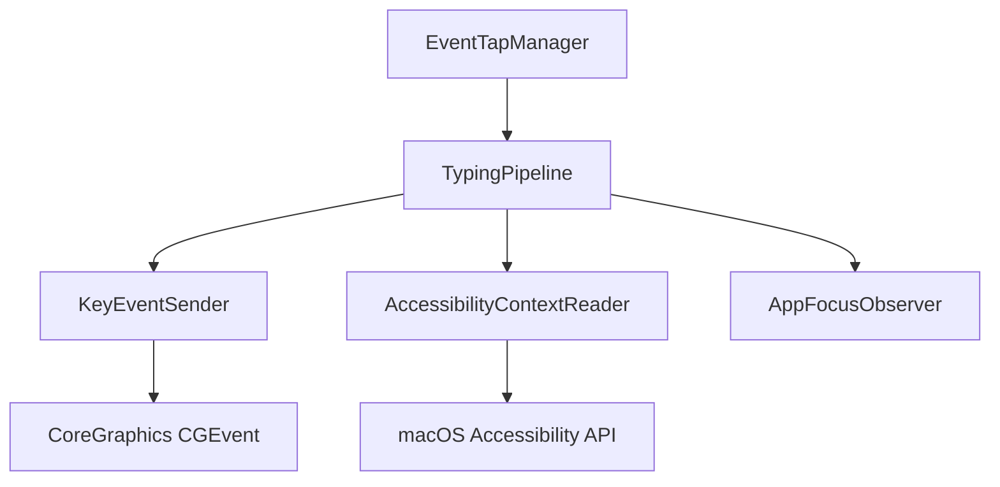
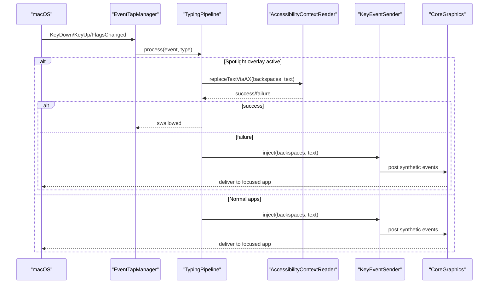
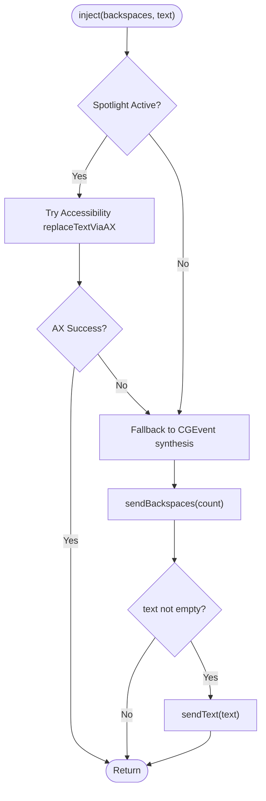
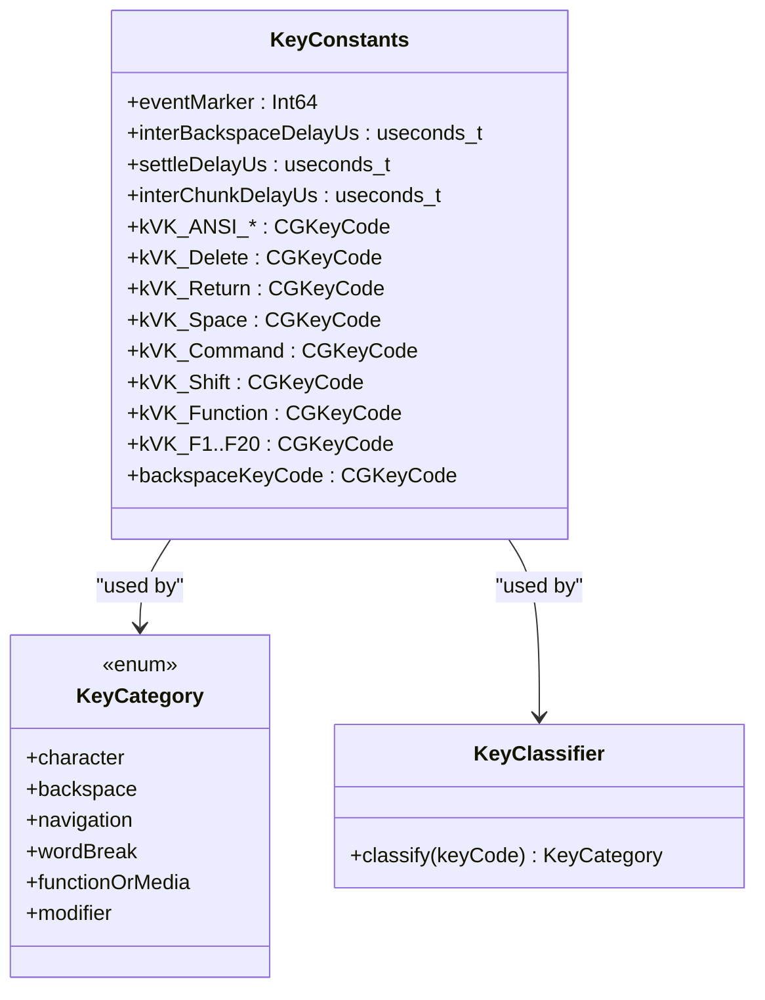
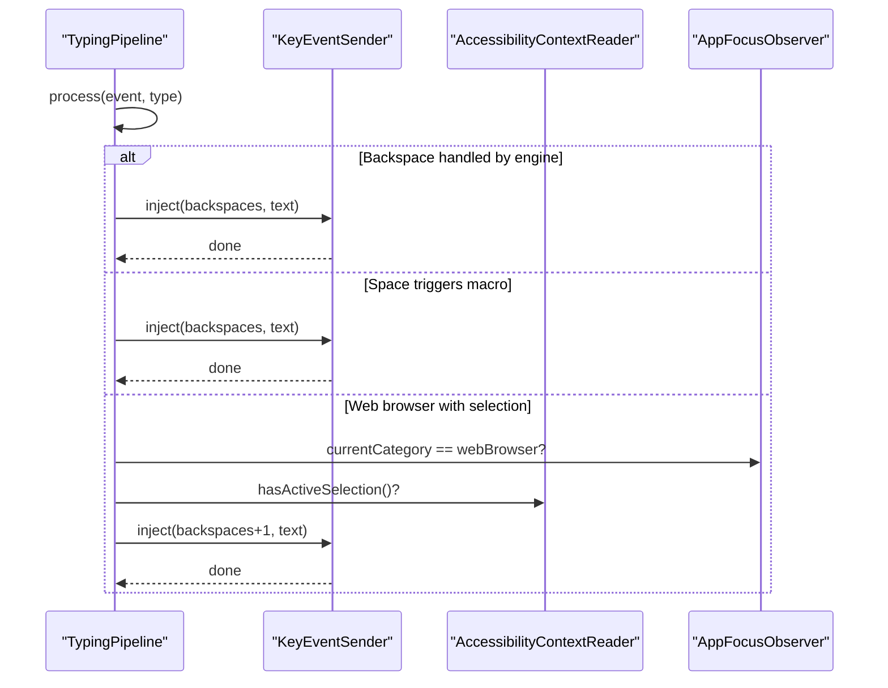
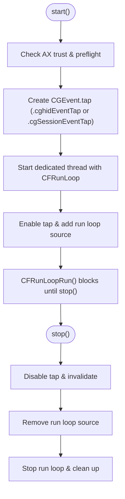
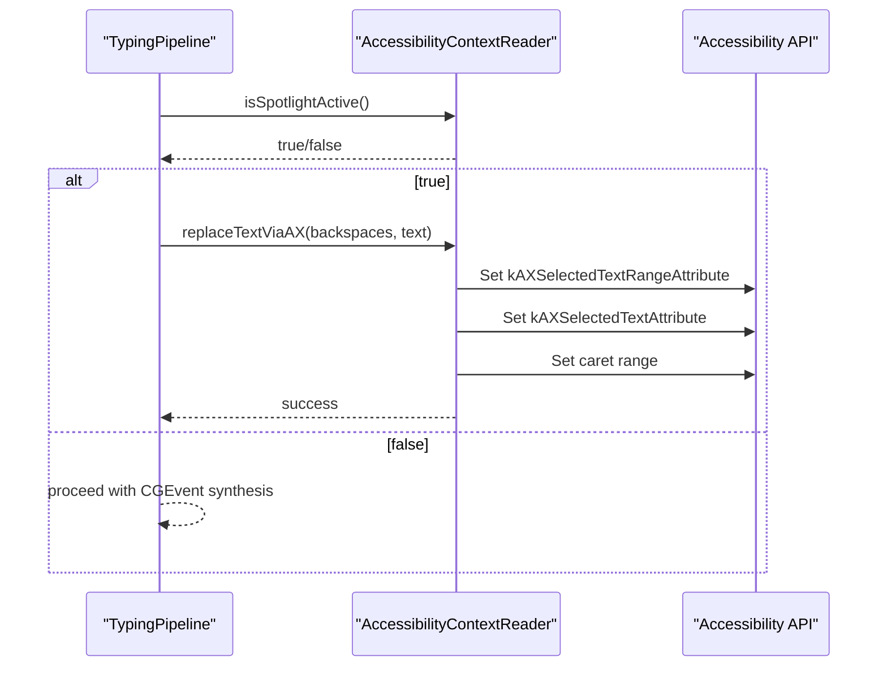
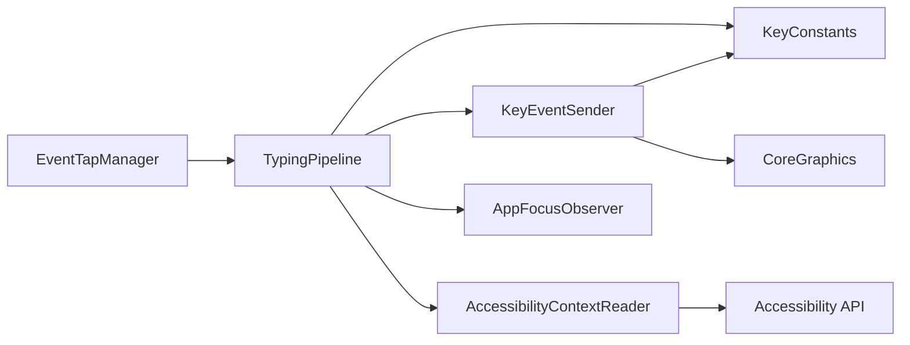

# Key Event Output System

<cite>
**Referenced Files in This Document**
- [KeyEventSender.swift](file://macos/skey-app/Sources/Features/Keyboard/EventHandling/KeyEventSender.swift)
- [KeyConstants.swift](file://macos/skey-app/Sources/Features/Keyboard/EventHandling/KeyConstants.swift)
- [TypingPipeline.swift](file://macos/skey-app/Sources/Features/Keyboard/EventHandling/Pipeline/TypingPipeline.swift)
- [EventTapManager.swift](file://macos/skey-app/Sources/Features/Keyboard/EventHandling/EventTapManager.swift)
- [AccessibilityContextReader.swift](file://macos/skey-app/Sources/Features/Keyboard/Context/AccessibilityContextReader.swift)
- [AppFocusObserver.swift](file://macos/skey-app/Sources/Shared/Services/AppFocusObserver.swift)
</cite>

## Table of Contents
1. [Introduction](#introduction)
2. [Project Structure](#project-structure)
3. [Core Components](#core-components)
4. [Architecture Overview](#architecture-overview)
5. [Detailed Component Analysis](#detailed-component-analysis)
6. [Dependency Analysis](#dependency-analysis)
7. [Performance Considerations](#performance-considerations)
8. [Troubleshooting Guide](#troubleshooting-guide)
9. [Conclusion](#conclusion)

## Introduction
This document explains the key event output system responsible for forwarding processed keystrokes to target applications on macOS. It focuses on how synthetic keyboard events are generated using CoreGraphics APIs, how different key types are handled (regular keys, function/media keys, modifiers), and how timing is managed to produce a natural typing experience. It also covers event creation details, coordinate handling considerations for multi-monitor setups, integration with macOS Accessibility APIs, examples of custom key combinations and special character handling, and troubleshooting guidance.

## Project Structure
The key event output system is part of the macOS application feature set under Keyboard > EventHandling and Pipeline. The core flow:
- EventTapManager captures low-level events via CoreGraphics EventTap.
- TypingPipeline processes events through stages (hotkeys, navigation, composing, macros).
- KeyEventSender injects synthetic backspaces and Unicode text into the session event stream.
- AccessibilityContextReader provides direct text replacement for Spotlight overlay when needed.
- AppFocusObserver tracks the active application and category to tailor behavior.

**Diagram sources**
- [EventTapManager.swift:81-103](file://macos/skey-app/Sources/Features/Keyboard/EventHandling/EventTapManager.swift#L81-L103)
- [TypingPipeline.swift:31-170](file://macos/skey-app/Sources/Features/Keyboard/EventHandling/Pipeline/TypingPipeline.swift#L31-L170)
- [KeyEventSender.swift:33-51](file://macos/skey-app/Sources/Features/Keyboard/EventHandling/KeyEventSender.swift#L33-L51)
- [AccessibilityContextReader.swift:42-77](file://macos/skey-app/Sources/Features/Keyboard/Context/AccessibilityContextReader.swift#L42-L77)
- [AppFocusObserver.swift:14-48](file://macos/skey-app/Sources/Shared/Services/AppFocusObserver.swift#L14-L48)

**Section sources**
- [EventTapManager.swift:81-103](file://macos/skey-app/Sources/Features/Keyboard/EventHandling/EventTapManager.swift#L81-L103)
- [TypingPipeline.swift:31-170](file://macos/skey-app/Sources/Features/Keyboard/EventHandling/Pipeline/TypingPipeline.swift#L31-L170)
- [KeyEventSender.swift:33-51](file://macos/skey-app/Sources/Features/Keyboard/EventHandling/KeyEventSender.swift#L33-L51)
- [AccessibilityContextReader.swift:42-77](file://macos/skey-app/Sources/Features/Keyboard/Context/AccessibilityContextReader.swift#L42-L77)
- [AppFocusObserver.swift:14-48](file://macos/skey-app/Sources/Shared/Services/AppFocusObserver.swift#L14-L48)

## Core Components
- KeyEventSender: Generates synthetic backspace and Unicode text events using CoreGraphics and posts them to the session event tap. It uses a semaphore to serialize injections and stamps events with a marker so they can be filtered by the pipeline.
- KeyConstants: Defines virtual key codes, timing delays, and an event marker used to identify SKey-generated events. Also includes a classifier that categorizes keys into character, backspace, navigation, word-break, function/media, and modifier categories.
- TypingPipeline: Orchestrates event processing stages, including hotkey detection, navigation handling, composing engine integration, macro expansion, and invoking KeyEventSender or AccessibilityContextReader as appropriate.
- EventTapManager: Manages the lifecycle of the CoreGraphics EventTap, hosts it on a dedicated thread, and delegates event evaluation to the pipeline.
- AccessibilityContextReader: Detects Spotlight overlay and performs direct text replacement via Accessibility APIs to avoid synthetic backspace loss in overlay contexts.
- AppFocusObserver: Tracks the current application and classifies it (web browser, developer tool, Electron/chat, Spotlight, native app) to influence behavior like caret movement assumptions and accessibility toggles.

**Section sources**
- [KeyEventSender.swift:9-126](file://macos/skey-app/Sources/Features/Keyboard/EventHandling/KeyEventSender.swift#L9-L126)
- [KeyConstants.swift:7-192](file://macos/skey-app/Sources/Features/Keyboard/EventHandling/KeyConstants.swift#L7-L192)
- [TypingPipeline.swift:6-170](file://macos/skey-app/Sources/Features/Keyboard/EventHandling/Pipeline/TypingPipeline.swift#L6-L170)
- [EventTapManager.swift:15-103](file://macos/skey-app/Sources/Features/Keyboard/EventHandling/EventTapManager.swift#L15-L103)
- [AccessibilityContextReader.swift:9-77](file://macos/skey-app/Sources/Features/Keyboard/Context/AccessibilityContextReader.swift#L9-L77)
- [AppFocusObserver.swift:8-48](file://macos/skey-app/Sources/Shared/Services/AppFocusObserver.swift#L8-L48)

## Architecture Overview
The end-to-end flow from physical keystroke to synthetic output:

**Diagram sources**
- [EventTapManager.swift:81-103](file://macos/skey-app/Sources/Features/Keyboard/EventHandling/EventTapManager.swift#L81-L103)
- [TypingPipeline.swift:31-170](file://macos/skey-app/Sources/Features/Keyboard/EventHandling/Pipeline/TypingPipeline.swift#L31-L170)
- [AccessibilityContextReader.swift:42-77](file://macos/skey-app/Sources/Features/Keyboard/Context/AccessibilityContextReader.swift#L42-L77)
- [KeyEventSender.swift:33-51](file://macos/skey-app/Sources/Features/Keyboard/EventHandling/KeyEventSender.swift#L33-L51)

## Detailed Component Analysis

### KeyEventSender: Synthetic Event Generation and Timing
- Initialization creates a CGEventSource using hidSystemState for reliable injection into the HID/system event stream.
- inject(backspaces:text:) serializes calls with a semaphore to prevent race conditions. If Spotlight is active, it attempts direct AX replacement; otherwise, it falls back to standard CGEvent synthesis.
- sendBackspaces emits individual backspace key-down/up pairs with inter-key delay and a settle delay after the last backspace to ensure stable state before subsequent text.
- sendText converts the string to UTF-16 and posts chunked Unicode strings via paired keyDown/keyUp events with non-coalesced flags to preserve each character’s delivery. Each chunk is separated by a small delay to mimic natural typing cadence.
- post(keyCode:) posts single key events with non-coalesced flags and stamps them with a unique user data marker and fresh mach_absolute_time timestamp.
- stamp sets eventSourceUserData to the SKEY marker and updates the event timestamp to ensure accurate ordering and filtering.

**Diagram sources**
- [KeyEventSender.swift:33-51](file://macos/skey-app/Sources/Features/Keyboard/EventHandling/KeyEventSender.swift#L33-L51)
- [KeyEventSender.swift:55-105](file://macos/skey-app/Sources/Features/Keyboard/EventHandling/KeyEventSender.swift#L55-L105)
- [KeyEventSender.swift:107-125](file://macos/skey-app/Sources/Features/Keyboard/EventHandling/KeyEventSender.swift#L107-L125)

**Section sources**
- [KeyEventSender.swift:19-126](file://macos/skey-app/Sources/Features/Keyboard/EventHandling/KeyEventSender.swift#L19-L126)

### KeyConstants: Key Codes, Categories, and Timing
- Defines virtual key codes for ANSI characters, keypad keys, navigation keys, modifiers, and function/media keys.
- Provides timing constants for inter-backspace delay, settle delay, and inter-chunk delay to create natural typing feel.
- Includes KeyClassifier which maps key codes to categories: character, backspace, navigation, word-break, functionOrMedia, modifier. This classification drives fast-path decisions in the pipeline.

**Diagram sources**
- [KeyConstants.swift:7-133](file://macos/skey-app/Sources/Features/Keyboard/EventHandling/KeyConstants.swift#L7-L133)
- [KeyConstants.swift:135-192](file://macos/skey-app/Sources/Features/Keyboard/EventHandling/KeyConstants.swift#L135-L192)

**Section sources**
- [KeyConstants.swift:7-192](file://macos/skey-app/Sources/Features/Keyboard/EventHandling/KeyConstants.swift#L7-L192)

### TypingPipeline: Processing Stages and Integration Points
- Stage 1: Pass-through for synthetic events marked with SKEY marker to avoid loops.
- Stage 2: Pass-through for disabled tap events.
- Stage 3: Mouse clicks reset composing state and mark caret may have moved.
- Stage 4: Modifier-only shortcut handling and language toggle chord support.
- Stage 5: Customizable hotkeys (language toggle, clipboard popup, cleaner, AI settings, quick translate).
- Stage 6: KeyUp pass-through; excluded apps bypass; language mode decision.
- Stage 7: English mode macro expansion path.
- Stage 8: Composing engine path for Vietnamese input, including backspace handling, structural keys, printable ASCII range filtering, macro expansion on space, and smart context recomposition.
- Integration points:
  - KeyEventSender.shared.inject(backspaces:text:) for synthesized output.
  - AccessibilityContextReader.hasActiveSelection() influences backspace count adjustments for web browsers.
  - AppFocusObserver.currentCategory informs selection checks and accessibility toggles.

**Diagram sources**
- [TypingPipeline.swift:174-280](file://macos/skey-app/Sources/Features/Keyboard/EventHandling/Pipeline/TypingPipeline.swift#L174-L280)
- [KeyEventSender.swift:33-51](file://macos/skey-app/Sources/Features/Keyboard/EventHandling/KeyEventSender.swift#L33-L51)
- [AccessibilityContextReader.swift:31-37](file://macos/skey-app/Sources/Features/Keyboard/Context/AccessibilityContextReader.swift#L31-L37)
- [AppFocusObserver.swift:14-48](file://macos/skey-app/Sources/Shared/Services/AppFocusObserver.swift#L14-L48)

**Section sources**
- [TypingPipeline.swift:31-170](file://macos/skey-app/Sources/Features/Keyboard/EventHandling/Pipeline/TypingPipeline.swift#L31-L170)
- [TypingPipeline.swift:174-280](file://macos/skey-app/Sources/Features/Keyboard/EventHandling/Pipeline/TypingPipeline.swift#L174-L280)
- [TypingPipeline.swift:334-343](file://macos/skey-app/Sources/Features/Keyboard/EventHandling/Pipeline/TypingPipeline.swift#L334-L343)

### EventTapManager: Lifecycle and Thread Hosting
- start(): Checks accessibility permissions, creates an EventTap with interest in keyDown, keyUp, flagsChanged, and mouse down events, then starts a dedicated high-priority thread hosting the run loop.
- stop(): Disables and invalidates the tap, removes its run loop source, and stops the run loop to cleanly exit the thread.
- handleEvent(type:event): Recovers from tap-disabled states and delegates processing to the pipeline.

**Diagram sources**
- [EventTapManager.swift:81-122](file://macos/skey-app/Sources/Features/Keyboard/EventHandling/EventTapManager.swift#L81-L122)
- [EventTapManager.swift:127-168](file://macos/skey-app/Sources/Features/Keyboard/EventHandling/EventTapManager.swift#L127-L168)

**Section sources**
- [EventTapManager.swift:81-168](file://macos/skey-app/Sources/Features/Keyboard/EventHandling/EventTapManager.swift#L81-L168)

### AccessibilityContextReader: Spotlight Overlay Handling
- isSpotlightActive(): Scans on-screen windows to detect Spotlight overlay presence.
- replaceTextViaAX(backspaces:text): When Spotlight is active, directly manipulates the selected text range and inserts new text via Accessibility APIs, avoiding synthetic backspace issues.
- getFocusedElement(isSpotlight:): Resolves the focused UI element either from the Spotlight process or the frontmost application, with fallback to system-wide query.
- getSelectedRange(for:): Extracts the current selection range for text elements.

**Diagram sources**
- [AccessibilityContextReader.swift:16-29](file://macos/skey-app/Sources/Features/Keyboard/Context/AccessibilityContextReader.swift#L16-L29)
- [AccessibilityContextReader.swift:42-77](file://macos/skey-app/Sources/Features/Keyboard/Context/AccessibilityContextReader.swift#L42-L77)
- [AccessibilityContextReader.swift:144-185](file://macos/skey-app/Sources/Features/Keyboard/Context/AccessibilityContextReader.swift#L144-L185)

**Section sources**
- [AccessibilityContextReader.swift:16-77](file://macos/skey-app/Sources/Features/Keyboard/Context/AccessibilityContextReader.swift#L16-L77)
- [AccessibilityContextReader.swift:144-199](file://macos/skey-app/Sources/Features/Keyboard/Context/AccessibilityContextReader.swift#L144-L199)

### AppFocusObserver: Application Context and Category
- Tracks current PID, bundle ID, and category (developer tool, web browser, Electron/chat, Spotlight, native app).
- Uses a RAM cache and heuristics (bundle inspection, URL schemes, known identifiers) to classify apps quickly.
- Enables enhanced accessibility attributes for web browsers and Spotlight to improve text interaction.

**Section sources**
- [AppFocusObserver.swift:8-48](file://macos/skey-app/Sources/Shared/Services/AppFocusObserver.swift#L8-L48)
- [AppFocusObserver.swift:133-150](file://macos/skey-app/Sources/Shared/Services/AppFocusObserver.swift#L133-L150)

## Dependency Analysis
- KeyEventSender depends on CoreGraphics (CGEvent, CGEventSource) and KeyConstants for timing and key codes.
- TypingPipeline depends on KeyConstants (classification), KeyEventSender (output), AccessibilityContextReader (Spotlight handling), and AppFocusObserver (context).
- EventTapManager depends on CoreGraphics EventTap and delegates to TypingPipeline.
- AccessibilityContextReader depends on macOS Accessibility APIs and Carbon/CoreGraphics for window enumeration.

**Diagram sources**
- [KeyEventSender.swift:1-126](file://macos/skey-app/Sources/Features/Keyboard/EventHandling/KeyEventSender.swift#L1-L126)
- [KeyConstants.swift:1-192](file://macos/skey-app/Sources/Features/Keyboard/EventHandling/KeyConstants.swift#L1-L192)
- [TypingPipeline.swift:1-345](file://macos/skey-app/Sources/Features/Keyboard/EventHandling/Pipeline/TypingPipeline.swift#L1-L345)
- [EventTapManager.swift:1-196](file://macos/skey-app/Sources/Features/Keyboard/EventHandling/EventTapManager.swift#L1-L196)
- [AccessibilityContextReader.swift:1-238](file://macos/skey-app/Sources/Features/Keyboard/Context/AccessibilityContextReader.swift#L1-L238)
- [AppFocusObserver.swift:1-153](file://macos/skey-app/Sources/Shared/Services/AppFocusObserver.swift#L1-L153)

**Section sources**
- [KeyEventSender.swift:1-126](file://macos/skey-app/Sources/Features/Keyboard/EventHandling/KeyEventSender.swift#L1-L126)
- [KeyConstants.swift:1-192](file://macos/skey-app/Sources/Features/Keyboard/EventHandling/KeyConstants.swift#L1-L192)
- [TypingPipeline.swift:1-345](file://macos/skey-app/Sources/Features/Keyboard/EventHandling/Pipeline/TypingPipeline.swift#L1-L345)
- [EventTapManager.swift:1-196](file://macos/skey-app/Sources/Features/Keyboard/EventHandling/EventTapManager.swift#L1-L196)
- [AccessibilityContextReader.swift:1-238](file://macos/skey-app/Sources/Features/Keyboard/Context/AccessibilityContextReader.swift#L1-L238)
- [AppFocusObserver.swift:1-153](file://macos/skey-app/Sources/Shared/Services/AppFocusObserver.swift#L1-L153)

## Performance Considerations
- Zero-heap allocation for text sending: sendText uses stack-allocated buffers and chunks to minimize allocations during high-frequency typing.
- Non-coalesced event flags ensure each character is delivered individually, preventing OS-level coalescing that could alter timing or drop characters.
- Microsecond delays between backspaces and chunks simulate natural typing cadence without introducing noticeable lag.
- Dedicated thread for EventTap ensures low-latency event processing and avoids main-thread contention.
- Fast-path classifications reduce overhead for function/media keys, navigation keys, and structural keys.

[No sources needed since this section provides general guidance]

## Troubleshooting Guide
Common output issues and resolutions:
- Events not reaching target app:
  - Verify EventTap permissions and accessibility privileges. EventTapManager checks AXIsProcessTrusted and CGPreflightListenEventAccess at startup.
  - Ensure the tap is enabled and not disabled by timeout/user input; EventTapManager re-enables taps automatically on disabled events.
- Missing backspaces in Spotlight overlay:
  - Use AccessibilityContextReader.replaceTextViaAX to directly manipulate text in Spotlight search field, bypassing synthetic backspaces.
- Incorrect backspace count in web browsers:
  - When caret may have moved and active selection exists in web browsers, the pipeline adds an extra backspace to account for inline autocomplete suggestions.
- Synthetic events ignored due to coalescing:
  - Confirm events are posted with non-coalesced flags and stamped with fresh timestamps to maintain ordering and visibility.
- Multi-monitor coordinate handling:
  - The system posts events to the session event tap rather than specific coordinates; focus is determined by the currently active application and its focused UI element. For precise targeting, rely on Accessibility APIs to resolve the focused element within the active app.

**Section sources**
- [EventTapManager.swift:81-103](file://macos/skey-app/Sources/Features/Keyboard/EventHandling/EventTapManager.swift#L81-L103)
- [EventTapManager.swift:172-188](file://macos/skey-app/Sources/Features/Keyboard/EventHandling/EventTapManager.swift#L172-L188)
- [AccessibilityContextReader.swift:42-77](file://macos/skey-app/Sources/Features/Keyboard/Context/AccessibilityContextReader.swift#L42-L77)
- [TypingPipeline.swift:334-343](file://macos/skey-app/Sources/Features/Keyboard/EventHandling/Pipeline/TypingPipeline.swift#L334-L343)
- [KeyEventSender.swift:85-103](file://macos/skey-app/Sources/Features/Keyboard/EventHandling/KeyEventSender.swift#L85-L103)

## Conclusion
The key event output system combines CoreGraphics synthetic event generation, robust timing controls, and macOS Accessibility APIs to deliver a seamless typing experience across diverse applications. By classifying keys efficiently, handling special cases like Spotlight overlays, and adapting to application context, the system ensures reliable and natural keystroke forwarding. Proper configuration of permissions and awareness of application-specific behaviors will help avoid common pitfalls and optimize performance.

[No sources needed since this section summarizes without analyzing specific files]