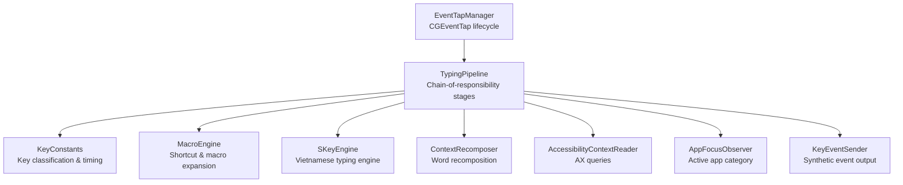
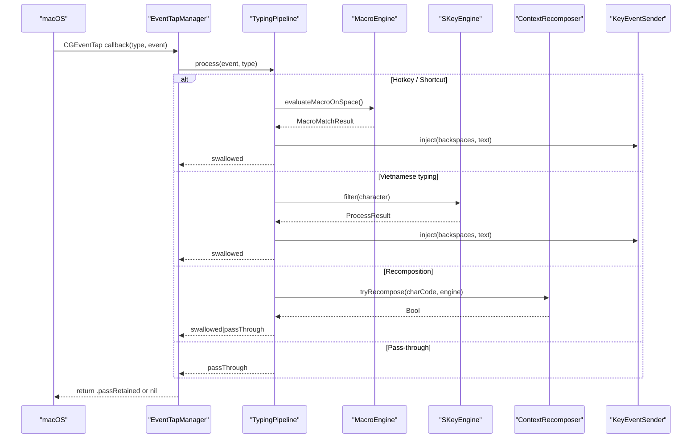
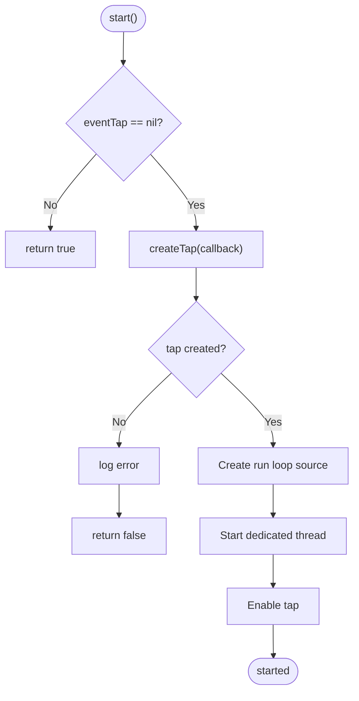
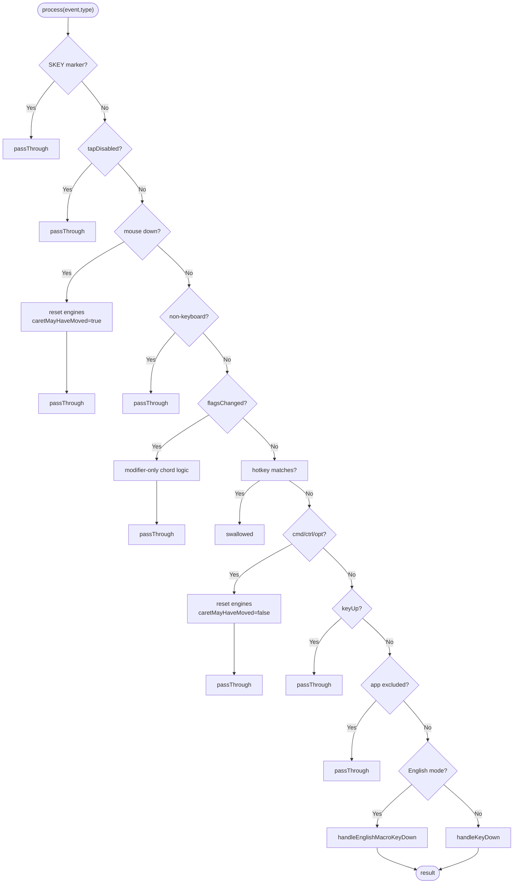
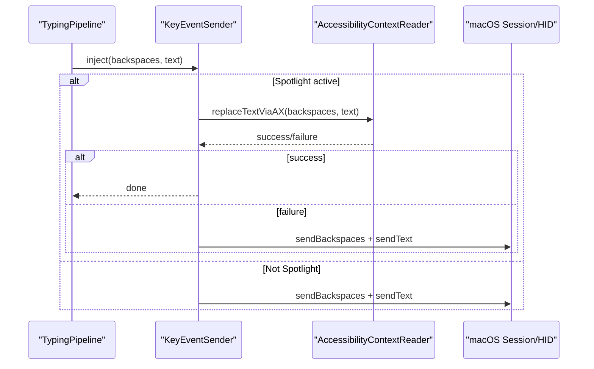
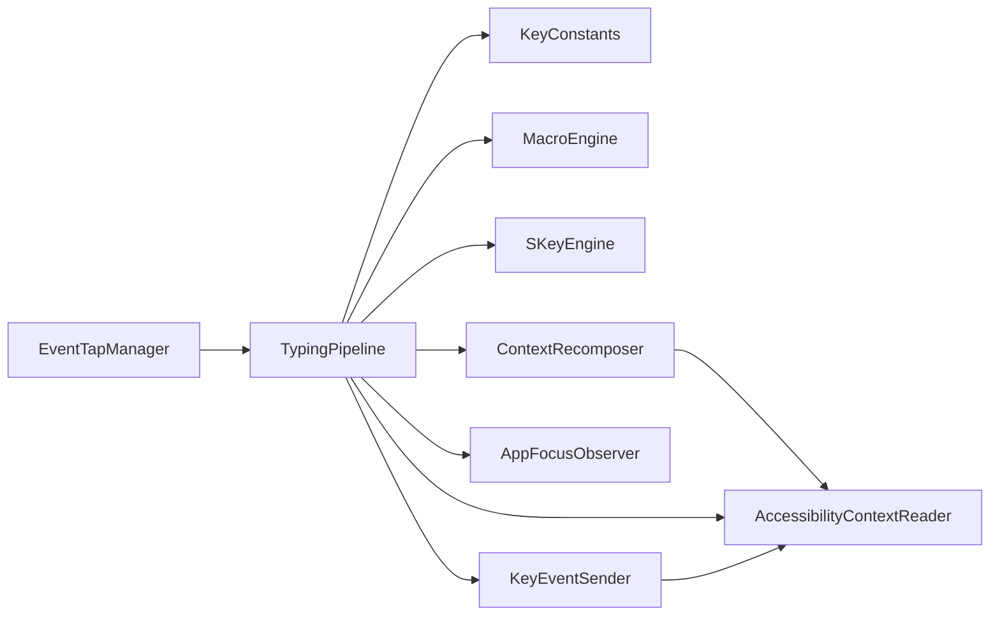

# Keyboard Event Handling

<cite>
**Referenced Files in This Document**
- [EventTapManager.swift](file://macos/skey-app/Sources/Features/Keyboard/EventHandling/EventTapManager.swift)
- [TypingPipeline.swift](file://macos/skey-app/Sources/Features/Keyboard/EventHandling/Pipeline/TypingPipeline.swift)
- [KeyInterceptor.swift](file://macos/skey-app/Sources/Features/Keyboard/EventHandling/Pipeline/KeyInterceptor.swift)
- [KeyEventSender.swift](file://macos/skey-app/Sources/Features/Keyboard/EventHandling/KeyEventSender.swift)
- [KeyConstants.swift](file://macos/skey-app/Sources/Features/Keyboard/EventHandling/KeyConstants.swift)
- [SKeyEngine.swift](file://macos/skey-app/Sources/Features/Keyboard/Engine/SKeyEngine.swift)
- [MacroEngine.swift](file://macos/skey-app/Sources/Features/Keyboard/Engine/MacroEngine.swift)
- [AccessibilityContextReader.swift](file://macos/skey-app/Sources/Features/Keyboard/Context/AccessibilityContextReader.swift)
- [ContextRecomposer.swift](file://macos/skey-app/Sources/Features/Keyboard/Context/ContextRecomposer.swift)
- [AppFocusObserver.swift](file://macos/skey-app/Sources/Shared/Services/AppFocusObserver.swift)
- [InputMethod.swift](file://macos/skey-app/Sources/Features/Keyboard/Engine/InputMethod.swift)
</cite>

## Table of Contents
1. [Introduction](#introduction)
2. [Project Structure](#project-structure)
3. [Core Components](#core-components)
4. [Architecture Overview](#architecture-overview)
5. [Detailed Component Analysis](#detailed-component-analysis)
6. [Dependency Analysis](#dependency-analysis)
7. [Performance Considerations](#performance-considerations)
8. [Troubleshooting Guide](#troubleshooting-guide)
9. [Conclusion](#conclusion)
10. [Appendices](#appendices)

## Introduction
This document explains the keyboard event processing system used by the SKey macOS application. It focuses on:
- Low-level keyboard capture via CoreGraphics EventTap
- The chain-of-responsibility style pipeline that processes events with sub-microsecond latency
- Key interception and modification strategies
- Output generation to target applications
- Accessibility API integration for universal app compatibility (including Spotlight overlay)
- Examples of custom key mappings, hotkeys, and macro expansion

The goal is to make the architecture accessible while providing deep technical insight into how keystrokes are captured, filtered, transformed, and injected back into the system.

## Project Structure
The keyboard feature is organized around a clear separation of concerns:
- Event capture and lifecycle management
- Pipeline-based event processing
- Engine-backed Vietnamese typing transformation
- Macro expansion and shortcuts
- Accessibility-aware context reading and recomposition
- Synthetic event injection

**Diagram sources**
- [EventTapManager.swift:15-188](file://macos/skey-app/Sources/Features/Keyboard/EventHandling/EventTapManager.swift#L15-L188)
- [TypingPipeline.swift:6-170](file://macos/skey-app/Sources/Features/Keyboard/EventHandling/Pipeline/TypingPipeline.swift#L6-L170)
- [KeyConstants.swift:7-192](file://macos/skey-app/Sources/Features/Keyboard/EventHandling/KeyConstants.swift#L7-L192)
- [MacroEngine.swift:14-111](file://macos/skey-app/Sources/Features/Keyboard/Engine/MacroEngine.swift#L14-L111)
- [SKeyEngine.swift:4-189](file://macos/skey-app/Sources/Features/Keyboard/Engine/SKeyEngine.swift#L4-L189)
- [ContextRecomposer.swift:4-99](file://macos/skey-app/Sources/Features/Keyboard/Context/ContextRecomposer.swift#L4-L99)
- [AccessibilityContextReader.swift:7-238](file://macos/skey-app/Sources/Features/Keyboard/Context/AccessibilityContextReader.swift#L7-L238)
- [AppFocusObserver.swift:6-153](file://macos/skey-app/Sources/Shared/Services/AppFocusObserver.swift#L6-L153)

**Section sources**
- [EventTapManager.swift:15-188](file://macos/skey-app/Sources/Features/Keyboard/EventHandling/EventTapManager.swift#L15-L188)
- [TypingPipeline.swift:6-170](file://macos/skey-app/Sources/Features/Keyboard/EventHandling/Pipeline/TypingPipeline.swift#L6-L170)

## Core Components
- EventTapManager: Creates and manages the CGEventTap, runs it on a dedicated high-priority thread, and delegates event evaluation to TypingPipeline.
- TypingPipeline: Implements a multi-stage pipeline that classifies events, handles hotkeys, resets state on navigation/clicks, applies macros, and invokes the typing engine.
- KeyInterceptor: Defines the chain-of-responsibility protocol and result types for interceptors.
- KeyEventSender: Injects synthetic backspaces and Unicode text into the session or HID stream; uses Accessibility API for Spotlight overlay when needed.
- SKeyEngine: High-performance wrapper around the Rust core engine for Vietnamese typing transformations.
- MacroEngine: In-memory macro expander triggered on space, with auto-caps support.
- AccessibilityContextReader: Reads focused UI element state and performs direct text replacement via AX for Spotlight.
- ContextRecomposer: Reconstructs full words atomically when editing previously typed words.
- AppFocusObserver: Tracks the active application and categorizes it (web browser, developer tool, etc.) to tailor behavior.

**Section sources**
- [EventTapManager.swift:15-188](file://macos/skey-app/Sources/Features/Keyboard/EventHandling/EventTapManager.swift#L15-L188)
- [TypingPipeline.swift:6-170](file://macos/skey-app/Sources/Features/Keyboard/EventHandling/Pipeline/TypingPipeline.swift#L6-L170)
- [KeyInterceptor.swift:4-21](file://macos/skey-app/Sources/Features/Keyboard/EventHandling/Pipeline/KeyInterceptor.swift#L4-L21)
- [KeyEventSender.swift:7-127](file://macos/skey-app/Sources/Features/Keyboard/EventHandling/KeyEventSender.swift#L7-L127)
- [SKeyEngine.swift:4-189](file://macos/skey-app/Sources/Features/Keyboard/Engine/SKeyEngine.swift#L4-L189)
- [MacroEngine.swift:14-111](file://macos/skey-app/Sources/Features/Keyboard/Engine/MacroEngine.swift#L14-L111)
- [AccessibilityContextReader.swift:7-238](file://macos/skey-app/Sources/Features/Keyboard/Context/AccessibilityContextReader.swift#L7-L238)
- [ContextRecomposer.swift:4-99](file://macos/skey-app/Sources/Features/Keyboard/Context/ContextRecomposer.swift#L4-L99)
- [AppFocusObserver.swift:6-153](file://macos/skey-app/Sources/Shared/Services/AppFocusObserver.swift#L6-L153)

## Architecture Overview
The system captures low-level keyboard events using CGEventTap, then routes them through a fast pipeline that decides whether to pass them through, swallow them, or transform them. Transformations may include macro expansion, Vietnamese typing, or full-word recomposition. Output is injected back into the system as synthetic events, with special handling for Spotlight via Accessibility APIs.

**Diagram sources**
- [EventTapManager.swift:81-188](file://macos/skey-app/Sources/Features/Keyboard/EventHandling/EventTapManager.swift#L81-L188)
- [TypingPipeline.swift:31-170](file://macos/skey-app/Sources/Features/Keyboard/EventHandling/Pipeline/TypingPipeline.swift#L31-L170)
- [MacroEngine.swift:71-111](file://macos/skey-app/Sources/Features/Keyboard/Engine/MacroEngine.swift#L71-L111)
- [SKeyEngine.swift:133-145](file://macos/skey-app/Sources/Features/Keyboard/Engine/SKeyEngine.swift#L133-L145)
- [ContextRecomposer.swift:40-99](file://macos/skey-app/Sources/Features/Keyboard/Context/ContextRecomposer.swift#L40-L99)
- [KeyEventSender.swift:33-51](file://macos/skey-app/Sources/Features/Keyboard/EventHandling/KeyEventSender.swift#L33-L51)

## Detailed Component Analysis

### EventTapManager: CGEventTap Lifecycle and Thread Hosting
- Creates an EventTap with interest masks for keyDown, keyUp, flagsChanged, and mouse down events.
- Attempts cghidEventTap first, falls back to cgSessionEventTap if needed.
- Runs the tap on a dedicated high-priority thread with its own CFRunLoop.
- Delegates event handling to TypingPipeline and returns either passRetained or nil based on pipeline results.
- Uses os_unfair_lock for language state to ensure sub-microsecond synchronization between main and tap threads.

**Diagram sources**
- [EventTapManager.swift:81-168](file://macos/skey-app/Sources/Features/Keyboard/EventHandling/EventTapManager.swift#L81-L168)

**Section sources**
- [EventTapManager.swift:15-188](file://macos/skey-app/Sources/Features/Keyboard/EventHandling/EventTapManager.swift#L15-L188)

### TypingPipeline: Chain-of-Responsibility Stages
The pipeline implements a staged decision flow optimized for minimal allocations and fast paths:
- Stage 1: Skip synthetic events marked by SKEY marker.
- Stage 2: Pass through disabled tap events.
- Stage 3: Handle mouse clicks to reset buffers and mark caret movement.
- Stage 4: Handle modifier-only shortcut toggles (e.g., Control+Shift).
- Stage 5: Match configurable hotkeys (language toggle, clipboard popup, cleaner, AI settings, quick translate).
- Stage 6: Ignore non-keyboard events; handle keyUp pass-through.
- Stage 6.5: Bypass excluded apps.
- Stage 7: English mode with optional macro expansion.
- Stage 8: Composing engine path for Vietnamese typing.

Fast paths:
- Function/media keys pass through untouched.
- Navigation keys reset buffers and mark caret movement.
- Backspace handled via engine with targeted backspace injection.
- Word-break keys reset buffers except space which triggers macro evaluation.

**Diagram sources**
- [TypingPipeline.swift:31-170](file://macos/skey-app/Sources/Features/Keyboard/EventHandling/Pipeline/TypingPipeline.swift#L31-L170)

**Section sources**
- [TypingPipeline.swift:31-170](file://macos/skey-app/Sources/Features/Keyboard/EventHandling/Pipeline/TypingPipeline.swift#L31-L170)

### KeyInterceptor: Protocol and Result Types
Defines the chain-of-responsibility contract:
- InterceptorResult: passThrough or swallowed.
- KeyInterceptor: process(event, type) -> InterceptorResult.

While the current implementation centralizes logic in TypingPipeline, this protocol enables modular extension points for future interceptors.

**Section sources**
- [KeyInterceptor.swift:4-21](file://macos/skey-app/Sources/Features/Keyboard/EventHandling/Pipeline/KeyInterceptor.swift#L4-L21)

### KeyEventSender: Synthetic Event Injection
- Injects backspaces followed by Unicode text.
- For Spotlight overlay, uses Accessibility API to directly replace text without synthetic backspaces.
- For other apps, posts non-coalesced key events with SKEY marker and fresh timestamps.
- Uses chunked Unicode string delivery to avoid large single payloads and maintain responsiveness.

**Diagram sources**
- [KeyEventSender.swift:33-51](file://macos/skey-app/Sources/Features/Keyboard/EventHandling/KeyEventSender.swift#L33-L51)
- [AccessibilityContextReader.swift:42-77](file://macos/skey-app/Sources/Features/Keyboard/Context/AccessibilityContextReader.swift#L42-L77)

**Section sources**
- [KeyEventSender.swift:33-127](file://macos/skey-app/Sources/Features/Keyboard/EventHandling/KeyEventSender.swift#L33-L127)
- [AccessibilityContextReader.swift:42-77](file://macos/skey-app/Sources/Features/Keyboard/Context/AccessibilityContextReader.swift#L42-L77)

### SKeyEngine: Vietnamese Typing Transformation
- Wraps the Rust core engine with zero-heap hot-path operations.
- Configures input method (Telex, VNI, VIQR, Simple Telex), charset, and options.
- Provides filter(character) and backspace() returning ProcessResult with backspaces and transformed text.
- Uses stack allocation for UTF-8 extraction to avoid heap churn.

**Section sources**
- [SKeyEngine.swift:27-189](file://macos/skey-app/Sources/Features/Keyboard/Engine/SKeyEngine.swift#L27-L189)
- [InputMethod.swift:5-19](file://macos/skey-app/Sources/Features/Keyboard/Engine/InputMethod.swift#L5-L19)

### MacroEngine: Shortcut and Macro Expansion
- Maintains an in-memory map of shortcuts to replacements.
- Tracks current word buffer across characters and backspaces.
- On space, evaluates macros with optional auto-caps transformation.
- Resets buffer on whitespace or backspace appropriately.

**Section sources**
- [MacroEngine.swift:14-111](file://macos/skey-app/Sources/Features/Keyboard/Engine/MacroEngine.swift#L14-L111)

### AccessibilityContextReader and ContextRecomposer: Universal Compatibility
- Detects Spotlight overlay and reads the focused UI element safely.
- Supports direct text replacement via AX for Spotlight to guarantee zero backspace loss.
- ContextRecomposer reconstructs full words atomically when editing previously typed words, ensuring accurate Vietnamese tones across apps.
- Skips recomposition in certain categories (developer tools, chat/electron) to avoid interference.

**Section sources**
- [AccessibilityContextReader.swift:17-77](file://macos/skey-app/Sources/Features/Keyboard/Context/AccessibilityContextReader.swift#L17-L77)
- [ContextRecomposer.swift:19-99](file://macos/skey-app/Sources/Features/Keyboard/Context/ContextRecomposer.swift#L19-L99)

### AppFocusObserver: Active Application Categorization
- Tracks frontmost PID, bundle ID, and category (web browser, developer tool, electron/chat, spotlight, native app).
- Dynamically inspects bundle URL and Info.plist to classify apps.
- Enables accessibility enhancements for web browsers and Spotlight.

**Section sources**
- [AppFocusObserver.swift:6-153](file://macos/skey-app/Sources/Shared/Services/AppFocusObserver.swift#L6-L153)

## Dependency Analysis
The following diagram shows key dependencies among components involved in keyboard event processing:

**Diagram sources**
- [EventTapManager.swift:27-31](file://macos/skey-app/Sources/Features/Keyboard/EventHandling/EventTapManager.swift#L27-L31)
- [TypingPipeline.swift:9-24](file://macos/skey-app/Sources/Features/Keyboard/EventHandling/Pipeline/TypingPipeline.swift#L9-L24)
- [KeyConstants.swift:7-192](file://macos/skey-app/Sources/Features/Keyboard/EventHandling/KeyConstants.swift#L7-L192)
- [MacroEngine.swift:14-111](file://macos/skey-app/Sources/Features/Keyboard/Engine/MacroEngine.swift#L14-L111)
- [SKeyEngine.swift:4-189](file://macos/skey-app/Sources/Features/Keyboard/Engine/SKeyEngine.swift#L4-L189)
- [ContextRecomposer.swift:4-99](file://macos/skey-app/Sources/Features/Keyboard/Context/ContextRecomposer.swift#L4-L99)
- [AccessibilityContextReader.swift:7-238](file://macos/skey-app/Sources/Features/Keyboard/Context/AccessibilityContextReader.swift#L7-L238)
- [AppFocusObserver.swift:6-153](file://macos/skey-app/Sources/Shared/Services/AppFocusObserver.swift#L6-L153)
- [KeyEventSender.swift:7-127](file://macos/skey-app/Sources/Features/Keyboard/EventHandling/KeyEventSender.swift#L7-L127)

**Section sources**
- [EventTapManager.swift:27-31](file://macos/skey-app/Sources/Features/Keyboard/EventHandling/EventTapManager.swift#L27-L31)
- [TypingPipeline.swift:9-24](file://macos/skey-app/Sources/Features/Keyboard/EventHandling/Pipeline/TypingPipeline.swift#L9-L24)

## Performance Considerations
- Sub-microsecond latency targets:
  - Use of os_unfair_lock for language state and engine access avoids heap allocations and reduces lock overhead.
  - Inline functions and fast-path classifications (KeyClassifier lookup table) minimize branching costs.
  - Stack-allocated buffers via withUnsafeTemporaryAllocation prevent heap churn during character extraction and Unicode sending.
- Event coalescing avoidance:
  - Synthetic events use maskNonCoalesced to ensure each keystroke is delivered individually, improving responsiveness.
- Chunked text delivery:
  - Unicode strings are sent in small chunks to reduce per-event payload size and improve throughput.
- Targeted delays:
  - Microsecond-scale delays between backspaces and chunks balance reliability and speed.
- Early exits and bypasses:
  - Excluded apps bypass processing entirely.
  - Function/media keys pass through without engine interaction.
  - Modifier combinations reset state quickly to avoid unnecessary work.

[No sources needed since this section provides general guidance]

## Troubleshooting Guide
Common issues and remedies:
- EventTap disabled:
  - The system may disable taps due to timeouts or user input; the manager re-enables taps and logs recovery.
- Spotlight overlay text not updating:
  - Ensure AccessibilityContextReader.isSpotlightActive() detects Spotlight and replaceTextViaAX succeeds; otherwise fallback to synthetic events.
- Incorrect app categorization:
  - Verify AppFocusObserver.category(for:) classifies correctly; adjust heuristics or Info.plist inspection if needed.
- Macro not expanding:
  - Confirm MacroEngine.reloadMacros() has been called after changes and that the current word buffer contains the expected shortcut.
- Vietnamese typing not applying:
  - Check SKeyEngine configuration (input method, charset) and ensure filter(character) returns handled=true with expected backspaces/text.

**Section sources**
- [EventTapManager.swift:172-188](file://macos/skey-app/Sources/Features/Keyboard/EventHandling/EventTapManager.swift#L172-L188)
- [AccessibilityContextReader.swift:42-77](file://macos/skey-app/Sources/Features/Keyboard/Context/AccessibilityContextReader.swift#L42-L77)
- [AppFocusObserver.swift:29-91](file://macos/skey-app/Sources/Shared/Services/AppFocusObserver.swift#L29-L91)
- [MacroEngine.swift:28-38](file://macos/skey-app/Sources/Features/Keyboard/Engine/MacroEngine.swift#L28-L38)
- [SKeyEngine.swift:38-61](file://macos/skey-app/Sources/Features/Keyboard/Engine/SKeyEngine.swift#L38-L61)

## Conclusion
The SKey keyboard event system combines low-level CoreGraphics EventTap capture with a highly optimized pipeline that applies hotkeys, macros, and Vietnamese typing transformations. It leverages chain-of-responsibility principles, atomic recomposition, and Accessibility APIs to deliver reliable, low-latency behavior across diverse applications, including Spotlight overlays. Careful attention to performance—through stack allocation, fast-path classification, and non-coalesced event delivery—ensures responsive typing experiences.

[No sources needed since this section summarizes without analyzing specific files]

## Appendices

### Examples: Custom Key Mappings and Hotkeys
- Language toggle shortcut:
  - Configurable via AppSettings.shared.shortcuts.languageToggleShortcut; supports modifier-only chords and standard key combinations.
- Clipboard popup shortcut:
  - Triggers ClipboardFeature.shared.togglePopup() on keyDown.
- Cleaner shortcut:
  - Starts KeyboardCleanerController.shared.startCleaning() when enabled.
- AI settings shortcut:
  - Opens SettingsWindowController.shared.showSettings(tab: .ai).
- Quick Translate shortcut:
  - Option+T toggles TranslationHUDController.shared.toggleHUD().

**Section sources**
- [TypingPipeline.swift:87-135](file://macos/skey-app/Sources/Features/Keyboard/EventHandling/Pipeline/TypingPipeline.swift#L87-L135)

### Examples: Macro Expansion
- Define macros in AppSettings.shared.macro.items; reload via MacroEngine.reloadMacros().
- Macros expand on space with optional auto-caps transformation.
- Current word buffer tracks characters and backspaces to match shortcuts accurately.

**Section sources**
- [MacroEngine.swift:28-38](file://macos/skey-app/Sources/Features/Keyboard/Engine/MacroEngine.swift#L28-L38)
- [MacroEngine.swift:71-111](file://macos/skey-app/Sources/Features/Keyboard/Engine/MacroEngine.swift#L71-L111)

### Examples: Accessibility Integration
- Spotlight overlay:
  - Replace text directly via AccessibilityContextReader.replaceTextViaAX to avoid synthetic backspace loss.
- Focused element detection:
  - Use getFocusedElement(isSpotlight:) to query the active UI element safely.
- Selection awareness:
  - hasActiveSelection() prevents recomposition when there is an active selection (e.g., omnibox autocomplete).

**Section sources**
- [AccessibilityContextReader.swift:17-77](file://macos/skey-app/Sources/Features/Keyboard/Context/AccessibilityContextReader.swift#L17-L77)
- [AccessibilityContextReader.swift:31-37](file://macos/skey-app/Sources/Features/Keyboard/Context/AccessibilityContextReader.swift#L31-L37)