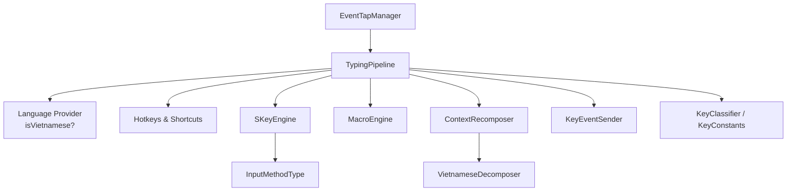
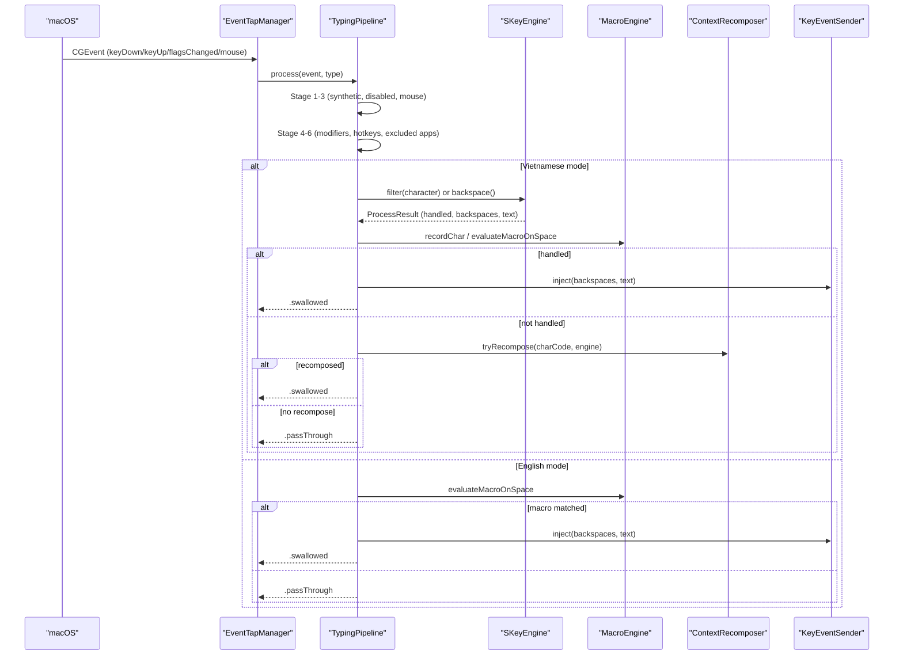
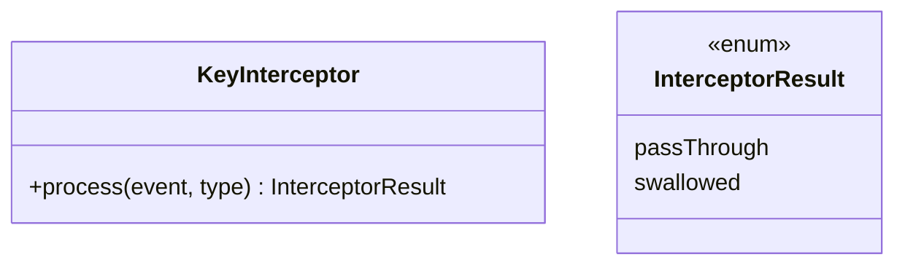
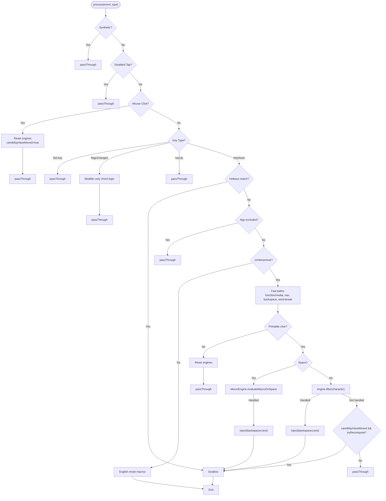
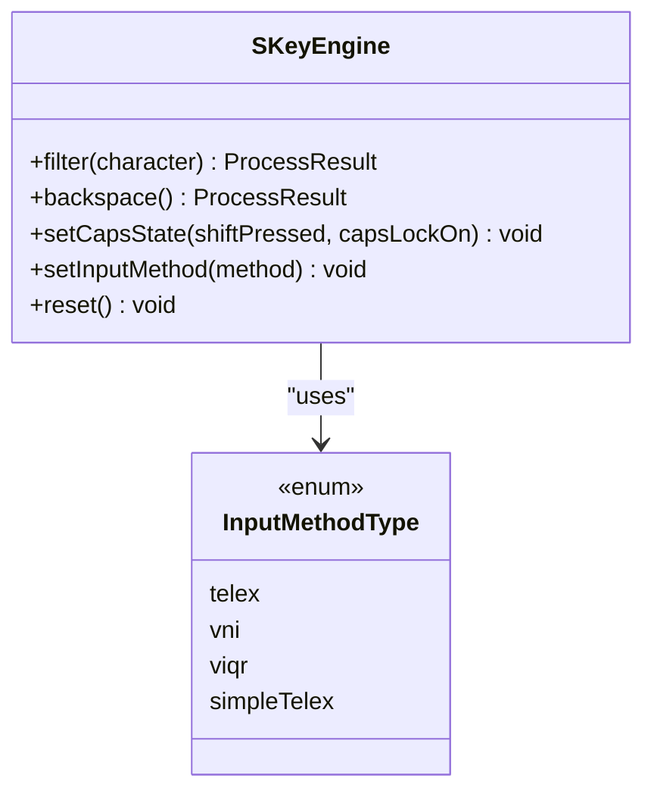
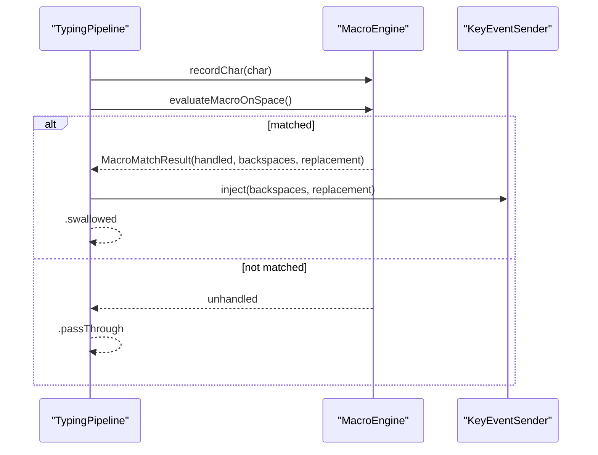
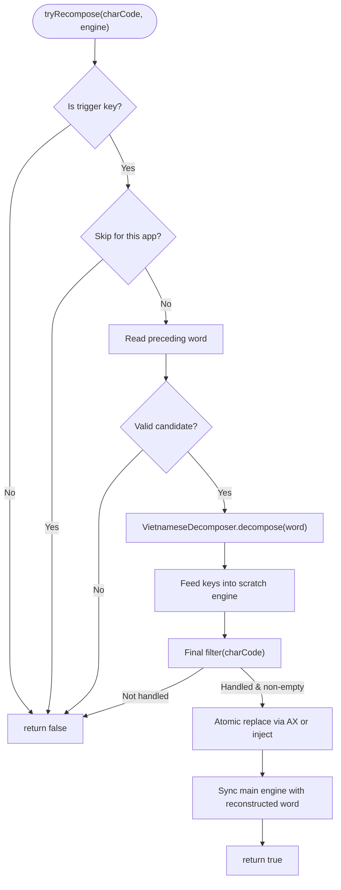
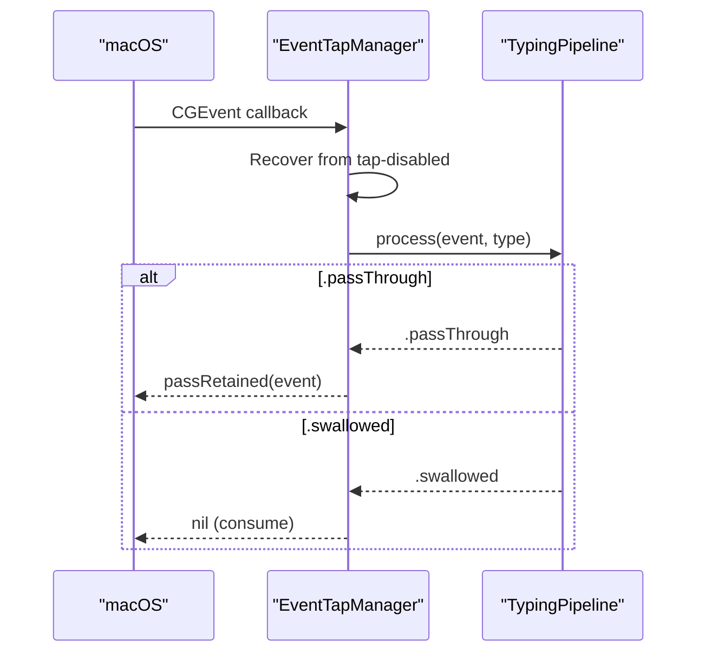
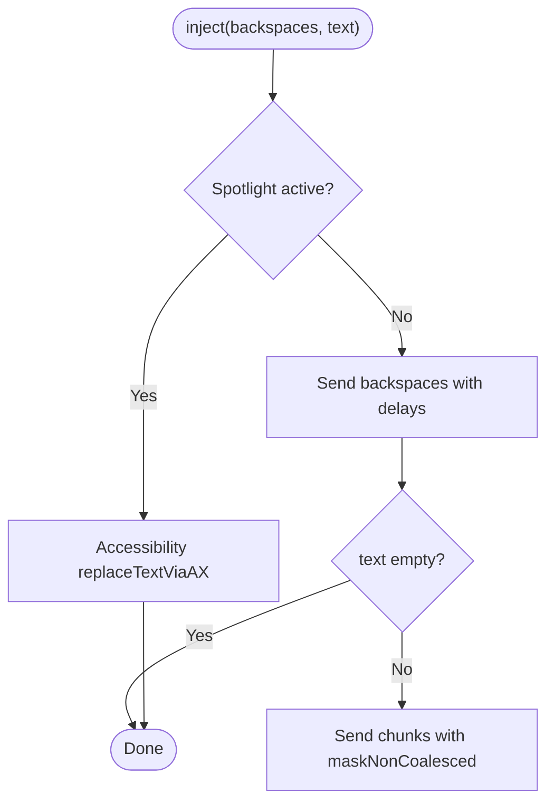
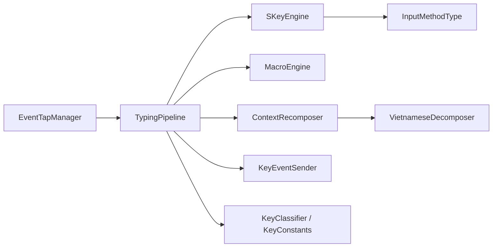

# Typing Pipeline Architecture

<cite>
**Referenced Files in This Document**
- [TypingPipeline.swift](file://macos/skey-app/Sources/Features/Keyboard/EventHandling/Pipeline/TypingPipeline.swift)
- [KeyInterceptor.swift](file://macos/skey-app/Sources/Features/Keyboard/EventHandling/Pipeline/KeyInterceptor.swift)
- [EventTapManager.swift](file://macos/skey-app/Sources/Features/Keyboard/EventHandling/EventTapManager.swift)
- [KeyConstants.swift](file://macos/skey-app/Sources/Features/Keyboard/EventHandling/KeyConstants.swift)
- [SKeyEngine.swift](file://macos/skey-app/Sources/Features/Keyboard/Engine/SKeyEngine.swift)
- [MacroEngine.swift](file://macos/skey-app/Sources/Features/Keyboard/Engine/MacroEngine.swift)
- [InputMethod.swift](file://macos/skey-app/Sources/Features/Keyboard/Engine/InputMethod.swift)
- [ContextRecomposer.swift](file://macos/skey-app/Sources/Features/Keyboard/Context/ContextRecomposer.swift)
- [VietnameseDecomposer.swift](file://macos/skey-app/Sources/Features/Keyboard/Context/VietnameseDecomposer.swift)
- [KeyEventSender.swift](file://macos/skey-app/Sources/Features/Keyboard/EventHandling/KeyEventSender.swift)
</cite>

## Table of Contents
1. [Introduction](#introduction)
2. [Project Structure](#project-structure)
3. [Core Components](#core-components)
4. [Architecture Overview](#architecture-overview)
5. [Detailed Component Analysis](#detailed-component-analysis)
6. [Dependency Analysis](#dependency-analysis)
7. [Performance Considerations](#performance-considerations)
8. [Troubleshooting Guide](#troubleshooting-guide)
9. [Conclusion](#conclusion)

## Introduction
This document explains the chain-of-responsibility pattern implementation in the typing pipeline that processes keystrokes with sub-microsecond latency on macOS. It covers how events flow through multiple stages: language detection, input method selection, character composition, macro expansion, and hotkey handling. It also documents the TypingPipeline class architecture, event processing workflow, result handling (.passThrough vs .swallowed), and the KeyInterceptor protocol’s role in filtering and modifying keystrokes before they reach target applications. Examples include custom pipeline stages, hotkey handling, and performance considerations for high-throughput, low-latency processing.

## Project Structure
The typing pipeline is implemented as a small set of focused components:
- Event capture and lifecycle management (EventTapManager)
- Chain-of-responsibility protocol and pipeline (KeyInterceptor, TypingPipeline)
- Language and input method engine (SKeyEngine, InputMethodType)
- Macro expansion (MacroEngine)
- Context-aware recomposition (ContextRecomposer, VietnameseDecomposer)
- Synthetic event injection (KeyEventSender)
- Key classification and constants (KeyConstants)

**Diagram sources**
- [EventTapManager.swift:15-31](file://macos/skey-app/Sources/Features/Keyboard/EventHandling/EventTapManager.swift#L15-L31)
- [TypingPipeline.swift:6-24](file://macos/skey-app/Sources/Features/Keyboard/EventHandling/Pipeline/TypingPipeline.swift#L6-L24)
- [SKeyEngine.swift:6-30](file://macos/skey-app/Sources/Features/Keyboard/Engine/SKeyEngine.swift#L6-L30)
- [InputMethod.swift:5-19](file://macos/skey-app/Sources/Features/Keyboard/Engine/InputMethod.swift#L5-L19)
- [MacroEngine.swift:14-26](file://macos/skey-app/Sources/Features/Keyboard/Engine/MacroEngine.swift#L14-L26)
- [ContextRecomposer.swift:9-17](file://macos/skey-app/Sources/Features/Keyboard/Context/ContextRecomposer.swift#L9-L17)
- [VietnameseDecomposer.swift:3-12](file://macos/skey-app/Sources/Features/Keyboard/Context/VietnameseDecomposer.swift#L3-L12)
- [KeyEventSender.swift:7-12](file://macos/skey-app/Sources/Features/Keyboard/EventHandling/KeyEventSender.swift#L7-L12)
- [KeyConstants.swift:135-191](file://macos/skey-app/Sources/Features/Keyboard/EventHandling/KeyConstants.swift#L135-L191)

**Section sources**
- [EventTapManager.swift:15-31](file://macos/skey-app/Sources/Features/Keyboard/EventHandling/EventTapManager.swift#L15-L31)
- [TypingPipeline.swift:6-24](file://macos/skey-app/Sources/Features/Keyboard/EventHandling/Pipeline/TypingPipeline.swift#L6-L24)

## Core Components
- KeyInterceptor: Defines the chain-of-responsibility interface for interceptors to process CGEvent and return InterceptorResult.
- TypingPipeline: The main pipeline orchestrating stages such as synthetic event passthrough, mouse clicks, modifier-only toggles, hotkeys, app exclusion, language detection, composing, macros, and context recomposition.
- SKeyEngine: High-performance wrapper around the Rust core engine for Vietnamese typing, providing filter/backspace operations and configuration.
- MacroEngine: In-memory macro expander tracking current word and expanding shortcuts on space.
- ContextRecomposer: Coordinates full-word recomposition when editing previously typed words using Accessibility APIs and a scratch engine.
- KeyEventSender: Injects synthetic backspaces and Unicode text into the OS event stream or uses AX replacement for Spotlight.
- KeyConstants and KeyClassifier: Provide key codes and fast classification into categories like navigation, function/media, word break, backspace, and modifiers.

**Section sources**
- [KeyInterceptor.swift:4-20](file://macos/skey-app/Sources/Features/Keyboard/EventHandling/Pipeline/KeyInterceptor.swift#L4-L20)
- [TypingPipeline.swift:6-170](file://macos/skey-app/Sources/Features/Keyboard/EventHandling/Pipeline/TypingPipeline.swift#L6-L170)
- [SKeyEngine.swift:6-189](file://macos/skey-app/Sources/Features/Keyboard/Engine/SKeyEngine.swift#L6-L189)
- [MacroEngine.swift:14-111](file://macos/skey-app/Sources/Features/Keyboard/Engine/MacroEngine.swift#L14-L111)
- [ContextRecomposer.swift:9-99](file://macos/skey-app/Sources/Features/Keyboard/Context/ContextRecomposer.swift#L9-L99)
- [KeyEventSender.swift:7-127](file://macos/skey-app/Sources/Features/Keyboard/EventHandling/KeyEventSender.swift#L7-L127)
- [KeyConstants.swift:7-191](file://macos/skey-app/Sources/Features/Keyboard/EventHandling/KeyConstants.swift#L7-L191)

## Architecture Overview
The system captures global keyboard and mouse events via an EventTap, then delegates processing to the TypingPipeline. The pipeline applies a sequence of filters and transformations, returning either passThrough (event continues to OS/target app) or swallowed (event consumed by the pipeline). Hot paths are optimized with fast classifications, minimal allocations, and direct engine calls.

**Diagram sources**
- [EventTapManager.swift:81-188](file://macos/skey-app/Sources/Features/Keyboard/EventHandling/EventTapManager.swift#L81-L188)
- [TypingPipeline.swift:31-170](file://macos/skey-app/Sources/Features/Keyboard/EventHandling/Pipeline/TypingPipeline.swift#L31-L170)
- [SKeyEngine.swift:121-145](file://macos/skey-app/Sources/Features/Keyboard/Engine/SKeyEngine.swift#L121-L145)
- [MacroEngine.swift:71-111](file://macos/skey-app/Sources/Features/Keyboard/Engine/MacroEngine.swift#L71-L111)
- [ContextRecomposer.swift:40-99](file://macos/skey-app/Sources/Features/Keyboard/Context/ContextRecomposer.swift#L40-L99)
- [KeyEventSender.swift:30-51](file://macos/skey-app/Sources/Features/Keyboard/EventHandling/KeyEventSender.swift#L30-L51)

## Detailed Component Analysis

### Chain-of-Responsibility Protocol and Result Handling
- KeyInterceptor defines a single responsibility per interceptor and returns InterceptorResult to control propagation.
- InterceptorResult has two states:
  - .passThrough: allow the event to continue to the next interceptor or OS.
  - .swallowed: consume the event; do not deliver to OS/target app.

**Diagram sources**
- [KeyInterceptor.swift:4-20](file://macos/skey-app/Sources/Features/Keyboard/EventHandling/Pipeline/KeyInterceptor.swift#L4-L20)

**Section sources**
- [KeyInterceptor.swift:4-20](file://macos/skey-app/Sources/Features/Keyboard/EventHandling/Pipeline/KeyInterceptor.swift#L4-L20)

### TypingPipeline Stages and Workflow
- Stage 1: Pass through synthetic events generated by SKey (marked with event marker).
- Stage 2: Pass through disabled tap events.
- Stage 3: Handle mouse clicks to reset state and mark caret movement.
- Stage 4: Handle flagsChanged for modifier-only toggle chords.
- Stage 5: Handle customizable hotkeys (language toggle, clipboard, cleaner, AI settings, quick translate).
- Stage 6: Ignore keyUp; pass through.
- Stage 6.5: Bypass excluded applications.
- Stage 7: If not Vietnamese, optionally handle English-mode macros.
- Stage 8: Composing engine path for Vietnamese mode with fast-path categorization and macro expansion on space.

**Diagram sources**
- [TypingPipeline.swift:31-170](file://macos/skey-app/Sources/Features/Keyboard/EventHandling/Pipeline/TypingPipeline.swift#L31-L170)
- [KeyConstants.swift:135-191](file://macos/skey-app/Sources/Features/Keyboard/EventHandling/KeyConstants.swift#L135-L191)

**Section sources**
- [TypingPipeline.swift:31-170](file://macos/skey-app/Sources/Features/Keyboard/EventHandling/Pipeline/TypingPipeline.swift#L31-L170)

### SKeyEngine and Input Method Selection
- SKeyEngine wraps the Rust core engine, provides filter and backspace operations, and configures input methods (Telex, VNI, VIQR, Simple Telex).
- Default options include charset, input method, spell check, and behavior flags.
- Caps state synchronization ensures correct case handling during composition.

**Diagram sources**
- [SKeyEngine.swift:6-189](file://macos/skey-app/Sources/Features/Keyboard/Engine/SKeyEngine.swift#L6-L189)
- [InputMethod.swift:5-19](file://macos/skey-app/Sources/Features/Keyboard/Engine/InputMethod.swift#L5-L19)

**Section sources**
- [SKeyEngine.swift:36-145](file://macos/skey-app/Sources/Features/Keyboard/Engine/SKeyEngine.swift#L36-L145)
- [InputMethod.swift:5-19](file://macos/skey-app/Sources/Features/Keyboard/Engine/InputMethod.swift#L5-L19)

### Macro Engine and English Mode Expansion
- MacroEngine tracks the current word buffer and expands macros on space with optional auto-caps transformation.
- In English mode, TypingPipeline routes printable characters to MacroEngine for potential expansion; otherwise passes through.

**Diagram sources**
- [TypingPipeline.swift:158-169](file://macos/skey-app/Sources/Features/Keyboard/EventHandling/Pipeline/TypingPipeline.swift#L158-L169)
- [MacroEngine.swift:40-111](file://macos/skey-app/Sources/Features/Keyboard/Engine/MacroEngine.swift#L40-L111)
- [KeyEventSender.swift:30-51](file://macos/skey-app/Sources/Features/Keyboard/EventHandling/KeyEventSender.swift#L30-L51)

**Section sources**
- [MacroEngine.swift:40-111](file://macos/skey-app/Sources/Features/Keyboard/Engine/MacroEngine.swift#L40-L111)
- [TypingPipeline.swift:158-169](file://macos/skey-app/Sources/Features/Keyboard/EventHandling/Pipeline/TypingPipeline.swift#L158-L169)

### Context-Aware Recomposition
- ContextRecomposer coordinates full-word recomposition when editing previously typed words across apps.
- Uses VietnameseDecomposer to convert pre-composed characters into raw keystroke sequences, feeds them through a scratch engine, and performs atomic replacement via Accessibility APIs or KeyEventSender.

**Diagram sources**
- [ContextRecomposer.swift:19-99](file://macos/skey-app/Sources/Features/Keyboard/Context/ContextRecomposer.swift#L19-L99)
- [VietnameseDecomposer.swift:10-32](file://macos/skey-app/Sources/Features/Keyboard/Context/VietnameseDecomposer.swift#L10-L32)

**Section sources**
- [ContextRecomposer.swift:40-99](file://macos/skey-app/Sources/Features/Keyboard/Context/ContextRecomposer.swift#L40-L99)
- [VietnameseDecomposer.swift:10-32](file://macos/skey-app/Sources/Features/Keyboard/Context/VietnameseDecomposer.swift#L10-L32)

### Event Capture and Lifecycle
- EventTapManager creates and manages the CGEventTap, runs it on a dedicated thread with a high-priority run loop, and delegates event evaluation to TypingPipeline.
- It handles tap-disabled recovery and translates InterceptorResult into CGEvent pass/retention decisions.

**Diagram sources**
- [EventTapManager.swift:81-188](file://macos/skey-app/Sources/Features/Keyboard/EventHandling/EventTapManager.swift#L81-L188)
- [TypingPipeline.swift:31-170](file://macos/skey-app/Sources/Features/Keyboard/EventHandling/Pipeline/TypingPipeline.swift#L31-L170)

**Section sources**
- [EventTapManager.swift:81-188](file://macos/skey-app/Sources/Features/Keyboard/EventHandling/EventTapManager.swift#L81-L188)

### Synthetic Event Injection
- KeyEventSender injects backspaces and Unicode text using CGEvent synthesis with non-coalesced flags and timestamps, or uses Accessibility replacement for Spotlight overlay.
- Events are stamped with the SKEY marker so they can be recognized and bypassed by the pipeline.

**Diagram sources**
- [KeyEventSender.swift:30-127](file://macos/skey-app/Sources/Features/Keyboard/EventHandling/KeyEventSender.swift#L30-L127)
- [KeyConstants.swift:7-15](file://macos/skey-app/Sources/Features/Keyboard/EventHandling/KeyConstants.swift#L7-L15)

**Section sources**
- [KeyEventSender.swift:30-127](file://macos/skey-app/Sources/Features/Keyboard/EventHandling/KeyEventSender.swift#L30-L127)

## Dependency Analysis
- EventTapManager depends on TypingPipeline for event processing and holds an SKeyEngine instance for language state changes.
- TypingPipeline depends on:
  - Language provider (isVietnamese)
  - Hotkey settings and feature toggles
  - KeyClassifier and KeyConstants for fast categorization
  - SKeyEngine for character composition
  - MacroEngine for macro expansion
  - ContextRecomposer for recomposition
  - KeyEventSender for synthetic event injection
- SKeyEngine depends on InputMethodType for input method configuration.
- ContextRecomposer depends on VietnameseDecomposer and Accessibility APIs.

**Diagram sources**
- [EventTapManager.swift:15-31](file://macos/skey-app/Sources/Features/Keyboard/EventHandling/EventTapManager.swift#L15-L31)
- [TypingPipeline.swift:6-24](file://macos/skey-app/Sources/Features/Keyboard/EventHandling/Pipeline/TypingPipeline.swift#L6-L24)
- [SKeyEngine.swift:6-30](file://macos/skey-app/Sources/Features/Keyboard/Engine/SKeyEngine.swift#L6-L30)
- [InputMethod.swift:5-19](file://macos/skey-app/Sources/Features/Keyboard/Engine/InputMethod.swift#L5-L19)
- [MacroEngine.swift:14-26](file://macos/skey-app/Sources/Features/Keyboard/Engine/MacroEngine.swift#L14-L26)
- [ContextRecomposer.swift:9-17](file://macos/skey-app/Sources/Features/Keyboard/Context/ContextRecomposer.swift#L9-L17)
- [VietnameseDecomposer.swift:3-12](file://macos/skey-app/Sources/Features/Keyboard/Context/VietnameseDecomposer.swift#L3-L12)
- [KeyEventSender.swift:7-12](file://macos/skey-app/Sources/Features/Keyboard/EventHandling/KeyEventSender.swift#L7-L12)
- [KeyConstants.swift:135-191](file://macos/skey-app/Sources/Features/Keyboard/EventHandling/KeyConstants.swift#L135-L191)

**Section sources**
- [EventTapManager.swift:15-31](file://macos/skey-app/Sources/Features/Keyboard/EventHandling/EventTapManager.swift#L15-L31)
- [TypingPipeline.swift:6-24](file://macos/skey-app/Sources/Features/Keyboard/EventHandling/Pipeline/TypingPipeline.swift#L6-L24)

## Performance Considerations
- Sub-microsecond latency hot paths:
  - Fast-path categorization via KeyClassifier lookup table avoids branching overhead.
  - Inline functions and stack-allocated buffers minimize heap allocations.
  - os_unfair_lock used for critical sections to reduce lock contention.
- Event delivery optimizations:
  - Non-coalesced event flags ensure reliable delivery for synthetic events.
  - Microsecond delays between backspaces and chunks prevent coalescing and maintain timing fidelity.
- Memory efficiency:
  - Zero-heap UTF-8 extraction in SKeyEngine readResult.
  - VietnameseDecomposer uses precomputed mappings and O(1) scalar switch.
- App-specific optimizations:
  - Web browser selection checks only when needed to avoid IPC overhead in native apps and Spotlight.

[No sources needed since this section provides general guidance]

## Troubleshooting Guide
- Event tap disabled:
  - EventTapManager recovers by re-enabling the tap upon receiving disabled events.
- Synthetic events ignored:
  - Ensure events carry the SKEY marker; TypingPipeline passes them through to avoid loops.
- Macros not expanding:
  - Verify MacroEngine is enabled and current word buffer is populated; check auto-caps settings.
- Recomposition not applied:
  - Confirm trigger key matches input method; ensure no active selection and app not skipped; verify Accessibility permissions.
- Hotkeys not triggering:
  - Validate shortcut settings and modifier combinations; ensure flagsChanged handling for modifier-only chords.

**Section sources**
- [EventTapManager.swift:172-188](file://macos/skey-app/Sources/Features/Keyboard/EventHandling/EventTapManager.swift#L172-L188)
- [TypingPipeline.swift:31-79](file://macos/skey-app/Sources/Features/Keyboard/EventHandling/Pipeline/TypingPipeline.swift#L31-L79)
- [MacroEngine.swift:71-111](file://macos/skey-app/Sources/Features/Keyboard/Engine/MacroEngine.swift#L71-L111)
- [ContextRecomposer.swift:19-49](file://macos/skey-app/Sources/Features/Keyboard/Context/ContextRecomposer.swift#L19-L49)

## Conclusion
The typing pipeline implements a robust chain-of-responsibility pattern with clear separation of concerns: event capture, filtering, language detection, input method composition, macro expansion, and context-aware recomposition. By leveraging fast classifications, zero-allocation strategies, and precise event injection, it achieves sub-microsecond latency suitable for real-time typing experiences. The design supports extensibility through additional interceptors and configurable hotkeys while maintaining high performance and reliability across diverse applications.

[No sources needed since this section summarizes without analyzing specific files]