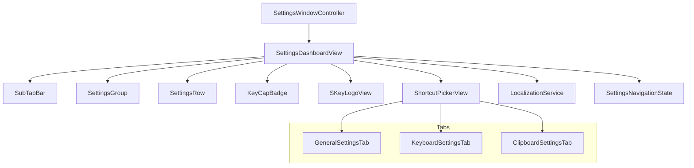
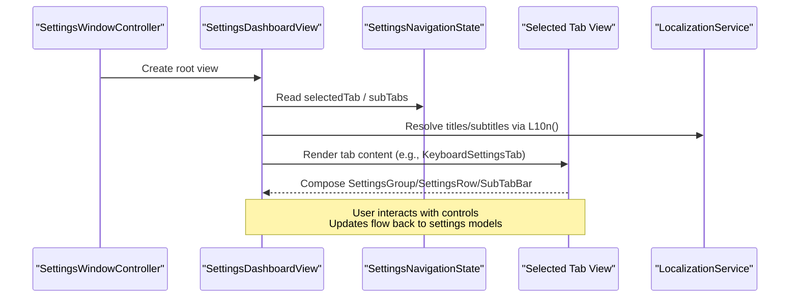
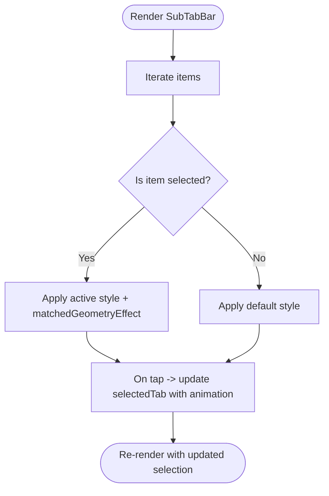
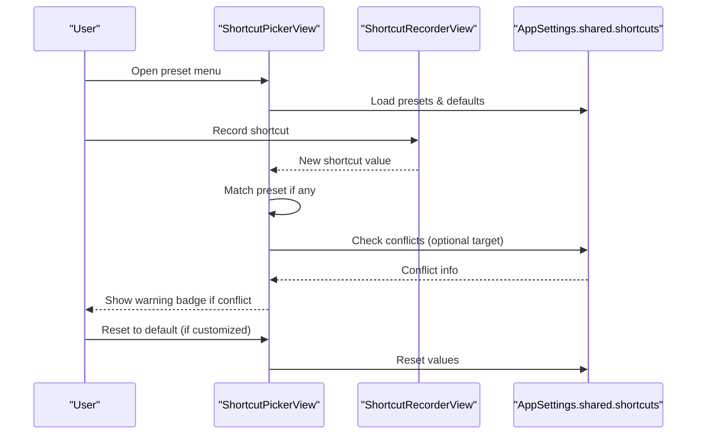
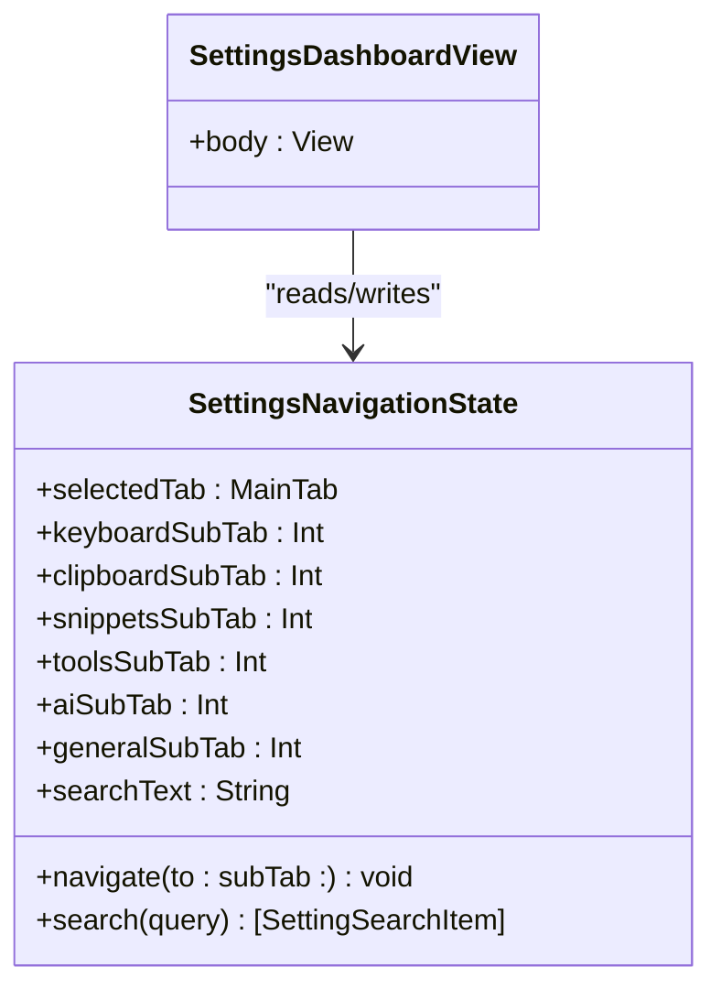
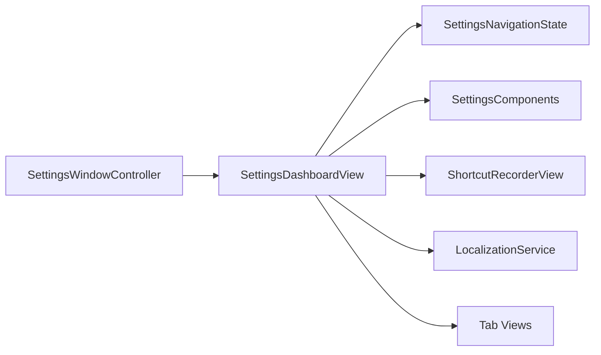

# Settings Components

<cite>
**Referenced Files in This Document**
- [SettingsComponents.swift](file://macos/skey-app/Sources/Features/Settings/UI/Components/SettingsComponents.swift)
- [SettingsDashboardView.swift](file://macos/skey-app/Sources/Features/Settings/UI/SettingsDashboardView.swift)
- [SettingsNavigationState.swift](file://macos/skey-app/Sources/Features/Settings/SettingsNavigationState.swift)
- [SettingsWindowController.swift](file://macos/skey-app/Sources/Features/Settings/SettingsWindowController.swift)
- [GeneralSettingsTab.swift](file://macos/skey-app/Sources/Features/Settings/UI/Tabs/GeneralSettingsTab.swift)
- [KeyboardSettingsTab.swift](file://macos/skey-app/Sources/Features/Settings/UI/Tabs/KeyboardSettingsTab.swift)
- [ClipboardSettingsTab.swift](file://macos/skey-app/Sources/Features/Settings/UI/Tabs/ClipboardSettingsTab.swift)
- [ShortcutRecorderView.swift](file://macos/skey-app/Sources/Shared/Shortcuts/ShortcutRecorderView.swift)
- [LocalizationService.swift](file://macos/skey-app/Sources/Shared/Localization/LocalizationService.swift)
- [Localizable.strings (en)](file://macos/skey-app/Resources/en.lproj/Localizable.strings)
</cite>

## Table of Contents
1. [Introduction](#introduction)
2. [Project Structure](#project-structure)
3. [Core Components](#core-components)
4. [Architecture Overview](#architecture-overview)
5. [Detailed Component Analysis](#detailed-component-analysis)
6. [Dependency Analysis](#dependency-analysis)
7. [Performance Considerations](#performance-considerations)
8. [Troubleshooting Guide](#troubleshooting-guide)
9. [Conclusion](#conclusion)
10. [Appendices](#appendices)

## Introduction
This document explains the reusable settings components and interaction patterns used across all settings tabs in the application. It covers the component library (custom toggles, pickers, text fields, buttons, layout helpers), styling system, accessibility considerations, validation patterns, localization support, composition patterns, state management, and integration with the overall settings architecture. The goal is to help you use existing components consistently and create new custom components that fit the settings interface design language.

## Project Structure
The settings UI is organized around a dashboard that hosts multiple feature tabs. Each tab composes shared layout and control components to present options consistently.

**Diagram sources**
- [SettingsWindowController.swift:6-59](file://macos/skey-app/Sources/Features/Settings/SettingsWindowController.swift#L6-L59)
- [SettingsDashboardView.swift:68-261](file://macos/skey-app/Sources/Features/Settings/UI/SettingsDashboardView.swift#L68-L261)
- [SettingsComponents.swift:20-168](file://macos/skey-app/Sources/Features/Settings/UI/Components/SettingsComponents.swift#L20-L168)
- [ShortcutRecorderView.swift:196-328](file://macos/skey-app/Sources/Shared/Shortcuts/ShortcutRecorderView.swift#L196-L328)
- [LocalizationService.swift:6-164](file://macos/skey-app/Sources/Shared/Localization/LocalizationService.swift#L6-L164)
- [SettingsNavigationState.swift:56-90](file://macos/skey-app/Sources/Features/Settings/SettingsNavigationState.swift#L56-L90)

**Section sources**
- [SettingsWindowController.swift:6-59](file://macos/skey-app/Sources/Features/Settings/SettingsWindowController.swift#L6-L59)
- [SettingsDashboardView.swift:68-261](file://macos/skey-app/Sources/Features/Settings/UI/SettingsDashboardView.swift#L68-L261)

## Core Components
The settings library provides a small set of focused, reusable building blocks designed for settings interfaces.

- SubTabBar: A full-width pill-style selector for sub-tabs within a tab. Uses spring animations and matched geometry for active state transitions.
- SettingsGroup: A card-like container with optional uppercase title and subtle shadow/border for grouping related rows.
- SettingsRow: A two-column row with title/subtitle on the left and a control on the right, with optional divider.
- KeyCapBadge: A stylized key-cap visual used to display keyboard shortcuts or hints.
- SKeyLogoView: A branded logo view for the sidebar header.

These components are composed by each settings tab to maintain consistent spacing, typography, and visual hierarchy.

**Section sources**
- [SettingsComponents.swift:20-168](file://macos/skey-app/Sources/Features/Settings/UI/Components/SettingsComponents.swift#L20-L168)
- [SettingsComponents.swift:172-221](file://macos/skey-app/Sources/Features/Settings/UI/Components/SettingsComponents.swift#L172-L221)
- [SettingsComponents.swift:225-303](file://macos/skey-app/Sources/Features/Settings/UI/Components/SettingsComponents.swift#L225-L303)

## Architecture Overview
The settings window hosts a SwiftUI dashboard that manages navigation state and renders the selected tab’s content. Tabs compose the shared components to build their UI. Localization strings drive labels and subtitles. Shortcuts are configured via a dedicated picker component.

**Diagram sources**
- [SettingsWindowController.swift:6-59](file://macos/skey-app/Sources/Features/Settings/SettingsWindowController.swift#L6-L59)
- [SettingsDashboardView.swift:68-261](file://macos/skey-app/Sources/Features/Settings/UI/SettingsDashboardView.swift#L68-L261)
- [SettingsNavigationState.swift:56-90](file://macos/skey-app/Sources/Features/Settings/SettingsNavigationState.swift#L56-L90)
- [LocalizationService.swift:6-164](file://macos/skey-app/Sources/Shared/Localization/LocalizationService.swift#L6-L164)

## Detailed Component Analysis

### SubTabBar
- Purpose: Switch between sub-sections within a tab with smooth animation and clear active state.
- Inputs: items array and selectedTab binding.
- Behavior: Updates selection with spring animation; highlights active item using matched geometry effect.
- Styling: Pill background with subtle stroke/shadow; icon and label adapt weight/color based on selection.
- Accessibility: Built on Button; uses SF Symbols for icons; relies on system focus and voiceover semantics.

**Diagram sources**
- [SettingsComponents.swift:20-80](file://macos/skey-app/Sources/Features/Settings/UI/Components/SettingsComponents.swift#L20-L80)

**Section sources**
- [SettingsComponents.swift:20-80](file://macos/skey-app/Sources/Features/Settings/UI/Components/SettingsComponents.swift#L20-L80)

### SettingsGroup
- Purpose: Group related settings into a visually distinct card with optional section title.
- Inputs: Optional title and a content closure.
- Behavior: Wraps content in a rounded rectangle with border and subtle shadow; displays uppercase title when provided.
- Styling: Uses system colors for borders and backgrounds; consistent corner radius and padding.
- Accessibility: Semantic VStack; title uses bold uppercase for clear hierarchy.

**Section sources**
- [SettingsComponents.swift:84-118](file://macos/skey-app/Sources/Features/Settings/UI/Components/SettingsComponents.swift#L84-L118)

### SettingsRow
- Purpose: Present a setting with a label/description and a control aligned to the right.
- Inputs: title, optional subtitle, showDivider flag, and a control closure.
- Behavior: Aligns label area and control; optionally draws a divider below the row.
- Styling: Consistent font sizes, spacing, and paddings; divider opacity matches theme.
- Accessibility: Label and control remain accessible; supports standard controls like Toggle/Picker/Button.

**Section sources**
- [SettingsComponents.swift:122-168](file://macos/skey-app/Sources/Features/Settings/UI/Components/SettingsComponents.swift#L122-L168)

### KeyCapBadge
- Purpose: Display key combinations or short hints with a modern badge look.
- Inputs: text string and optional highlight state.
- Behavior: Adjusts sizing based on character count; applies gradient overlay and stroke.
- Styling: Material background, gradient fill, and subtle shadow; accent color when highlighted.
- Accessibility: Purely decorative; pair with surrounding context for meaning.

**Section sources**
- [SettingsComponents.swift:172-221](file://macos/skey-app/Sources/Features/Settings/UI/Components/SettingsComponents.swift#L172-L221)

### SKeyLogoView
- Purpose: Branding element for the sidebar header.
- Inputs: size parameter.
- Behavior: Draws a squircle with a geometric “S” shape using Path; scales proportionally.
- Styling: Dark background with white and accent-colored shapes; rounded corners and shadow.

**Section sources**
- [SettingsComponents.swift:225-303](file://macos/skey-app/Sources/Features/Settings/UI/Components/SettingsComponents.swift#L225-L303)

### ShortcutPickerView
- Purpose: Configure global shortcuts with presets, conflict detection, and reset-to-default.
- Inputs: preset binding, shortcut binding, list of presets, optional target.
- Behavior: Records keystrokes; auto-matches preset if applicable; shows conflict warning; allows resetting to defaults.
- Styling: Compact inline recorder with menu button and optional reset button; warning badge for conflicts.
- Accessibility: Uses standard SwiftUI controls; helps via localized help text.

**Diagram sources**
- [ShortcutRecorderView.swift:196-328](file://macos/skey-app/Sources/Shared/Shortcuts/ShortcutRecorderView.swift#L196-L328)

**Section sources**
- [ShortcutRecorderView.swift:196-328](file://macos/skey-app/Sources/Shared/Shortcuts/ShortcutRecorderView.swift#L196-L328)

### Settings Dashboard and Navigation
- Purpose: Hosts the sidebar, search, header, and detail pane for each tab.
- State: Maintains selected main tab and per-tab sub-tab indices; supports search across all settings entries.
- Integration: Renders each tab view based on selection; applies global styles (toggle/picker/control sizes).

**Diagram sources**
- [SettingsNavigationState.swift:56-90](file://macos/skey-app/Sources/Features/Settings/SettingsNavigationState.swift#L56-L90)
- [SettingsDashboardView.swift:68-261](file://macos/skey-app/Sources/Features/Settings/UI/SettingsDashboardView.swift#L68-L261)

**Section sources**
- [SettingsNavigationState.swift:56-90](file://macos/skey-app/Sources/Features/Settings/SettingsNavigationState.swift#L56-L90)
- [SettingsDashboardView.swift:68-261](file://macos/skey-app/Sources/Features/Settings/UI/SettingsDashboardView.swift#L68-L261)

### Tab Examples Using Shared Components

#### GeneralSettingsTab
- Uses SubTabBar for Basic/Permissions/Logs sections.
- Composes SettingsGroup and SettingsRow to present toggles, pickers, and action buttons.
- Integrates with permissions service and backup manager; shows alerts for import/export outcomes.

**Section sources**
- [GeneralSettingsTab.swift:1-226](file://macos/skey-app/Sources/Features/Settings/UI/Tabs/GeneralSettingsTab.swift#L1-L226)

#### KeyboardSettingsTab
- Uses SubTabBar for Input Method/Typing Rules/App Management.
- Demonstrates Picker usage for input method and charset; Toggle for behavior flags; ShortcutPickerView for shortcuts.
- Manages excluded apps list with add/remove actions and sheet presentation.

**Section sources**
- [KeyboardSettingsTab.swift:1-444](file://macos/skey-app/Sources/Features/Settings/UI/Tabs/KeyboardSettingsTab.swift#L1-L444)

#### ClipboardSettingsTab
- Uses SubTabBar for General/Storage/Appearance/Pins/Privacy.
- Shows Picker for search mode and sort order; Slider for history limit; Toggle for behaviors; destructive actions for clearing data.

**Section sources**
- [ClipboardSettingsTab.swift:1-200](file://macos/skey-app/Sources/Features/Settings/UI/Tabs/ClipboardSettingsTab.swift#L1-L200)

## Dependency Analysis
- SettingsWindowController creates and presents the SettingsDashboardView with a visual effect backdrop.
- SettingsDashboardView depends on SettingsNavigationState for current tab/sub-tab and search results.
- All tabs depend on shared components from SettingsComponents and may integrate ShortcutPickerView for shortcuts.
- LocalizationService centralizes string resolution; tabs and dashboard resolve titles/subtitles via L10n().

**Diagram sources**
- [SettingsWindowController.swift:6-59](file://macos/skey-app/Sources/Features/Settings/SettingsWindowController.swift#L6-L59)
- [SettingsDashboardView.swift:68-261](file://macos/skey-app/Sources/Features/Settings/UI/SettingsDashboardView.swift#L68-L261)
- [SettingsComponents.swift:20-168](file://macos/skey-app/Sources/Features/Settings/UI/Components/SettingsComponents.swift#L20-L168)
- [ShortcutRecorderView.swift:196-328](file://macos/skey-app/Sources/Shared/Shortcuts/ShortcutRecorderView.swift#L196-L328)
- [LocalizationService.swift:6-164](file://macos/skey-app/Sources/Shared/Localization/LocalizationService.swift#L6-L164)

**Section sources**
- [SettingsWindowController.swift:6-59](file://macos/skey-app/Sources/Features/Settings/SettingsWindowController.swift#L6-L59)
- [SettingsDashboardView.swift:68-261](file://macos/skey-app/Sources/Features/Settings/UI/SettingsDashboardView.swift#L68-L261)

## Performance Considerations
- Prefer lightweight views: Use SettingsRow/SettingsGroup to avoid deep nesting and repeated styling logic.
- Minimize recomputation: Bind directly to model properties where possible; avoid heavy computations inside body.
- Efficient lists: When rendering large lists (e.g., excluded apps), use LazyVStack/LazyForEach to defer off-screen work.
- Animations: Keep animations short and use spring curves sparingly to avoid jank on lower-end hardware.
- Search: Filter only visible items; keep keyword sets concise to reduce string operations.

[No sources needed since this section provides general guidance]

## Troubleshooting Guide
- Missing localization strings: If a label falls back to its key, verify the key exists in Localizable.strings and that LocalizationService resolves the correct bundle.
- Shortcut conflicts: ShortcutPickerView shows a warning when a conflict is detected; use the reset-to-default option or choose an alternative combination.
- Sub-tab not switching: Ensure the tab binds to the correct sub-tab index in SettingsNavigationState and that the SubTabBar receives a Binding<Int>.
- Visual inconsistencies: Confirm that SettingsGroup/SettingsRow are used consistently; avoid overriding built-in styles unless necessary.

**Section sources**
- [LocalizationService.swift:43-77](file://macos/skey-app/Sources/Shared/Localization/LocalizationService.swift#L43-L77)
- [ShortcutRecorderView.swift:218-328](file://macos/skey-app/Sources/Shared/Shortcuts/ShortcutRecorderView.swift#L218-L328)
- [SettingsNavigationState.swift:56-90](file://macos/skey-app/Sources/Features/Settings/SettingsNavigationState.swift#L56-L90)

## Conclusion
The settings components provide a cohesive, accessible, and localized foundation for building consistent settings experiences. By composing SubTabBar, SettingsGroup, SettingsRow, KeyCapBadge, and SKeyLogoView, and integrating ShortcutPickerView and LocalizationService, each tab maintains a uniform look and feel while supporting robust user interactions. Follow the patterns shown here to extend the library with new components and ensure consistency across the settings interface.

[No sources needed since this section summarizes without analyzing specific files]

## Appendices

### How to Use Existing Components
- Add a sub-tab bar at the top of your tab using SubTabBar with an array of SubTabItem and a Binding<Int> to the corresponding sub-tab index in SettingsNavigationState.
- Group related options with SettingsGroup and place each option in a SettingsRow with a descriptive title and a suitable control (Toggle, Picker, Button, or ShortcutPickerView).
- Use KeyCapBadge to visualize shortcuts or hints next to controls.
- Place SKeyLogoView in the sidebar header for branding.

**Section sources**
- [SettingsComponents.swift:20-168](file://macos/skey-app/Sources/Features/Settings/UI/Components/SettingsComponents.swift#L20-L168)
- [GeneralSettingsTab.swift:14-88](file://macos/skey-app/Sources/Features/Settings/UI/Tabs/GeneralSettingsTab.swift#L14-L88)
- [KeyboardSettingsTab.swift:63-128](file://macos/skey-app/Sources/Features/Settings/UI/Tabs/KeyboardSettingsTab.swift#L63-L128)
- [ClipboardSettingsTab.swift:50-108](file://macos/skey-app/Sources/Features/Settings/UI/Tabs/ClipboardSettingsTab.swift#L50-L108)

### Creating a New Custom Component
- Keep it small and purpose-built (like SettingsRow).
- Accept inputs via parameters and bindings for stateful controls.
- Use consistent spacing, fonts, and colors derived from system NSColor.
- Provide optional features (e.g., showDivider) to maximize reuse.
- Test with different locales to ensure text fits and truncation behaves well.

[No sources needed since this section provides general guidance]

### Styling System Notes
- Colors: Use NSColor-based Color wrappers for system-aware theming.
- Typography: Prefer system fonts with explicit sizes and weights for clarity.
- Shapes: RoundedRectangle with continuous style for consistent corners.
- Shadows: Subtle shadows for depth; avoid heavy effects in tight spaces.

**Section sources**
- [SettingsComponents.swift:52-79](file://macos/skey-app/Sources/Features/Settings/UI/Components/SettingsComponents.swift#L52-L79)
- [SettingsComponents.swift:106-116](file://macos/skey-app/Sources/Features/Settings/UI/Components/SettingsComponents.swift#L106-L116)

### Accessibility Guidelines
- Use semantic controls (Button, Toggle, Picker) so VoiceOver can announce purpose and state.
- Provide meaningful labels; avoid empty labels without context.
- Ensure sufficient contrast and readable font sizes.
- Add help text for complex controls (e.g., ShortcutPickerView uses help strings).

**Section sources**
- [ShortcutRecorderView.swift:223-328](file://macos/skey-app/Sources/Shared/Shortcuts/ShortcutRecorderView.swift#L223-L328)

### Validation Patterns
- Validate user inputs before committing changes (e.g., non-empty bundle ID in custom app entry).
- Provide immediate feedback (e.g., disabled states, warnings for conflicts).
- Use destructive actions carefully and confirm irreversible operations.

**Section sources**
- [KeyboardSettingsTab.swift:625-661](file://macos/skey-app/Sources/Features/Settings/UI/Tabs/KeyboardSettingsTab.swift#L625-L661)
- [ShortcutRecorderView.swift:308-328](file://macos/skey-app/Sources/Shared/Shortcuts/ShortcutRecorderView.swift#L308-L328)

### Localization Support
- Centralize strings via LocalizationService and L10n helper.
- Maintain keys in Localizable.strings for each supported language.
- Use consistent key naming conventions for tabs, sub-tabs, and options.

**Section sources**
- [LocalizationService.swift:6-164](file://macos/skey-app/Sources/Shared/Localization/LocalizationService.swift#L6-L164)
- [Localizable.strings (en):109-149](file://macos/skey-app/Resources/en.lproj/Localizable.strings#L109-L149)