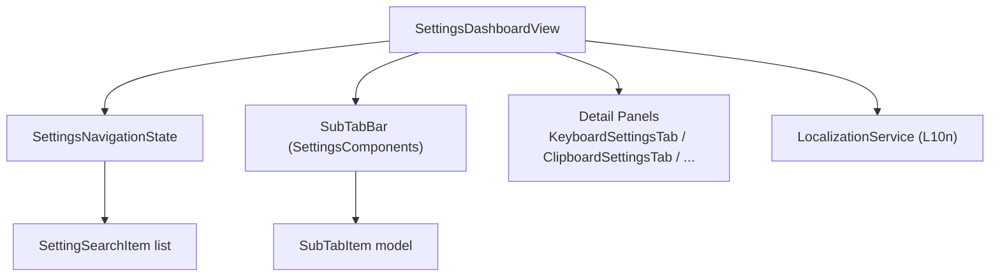
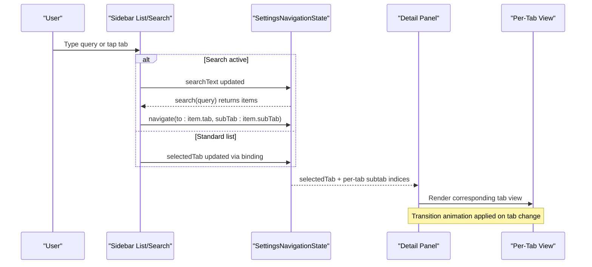
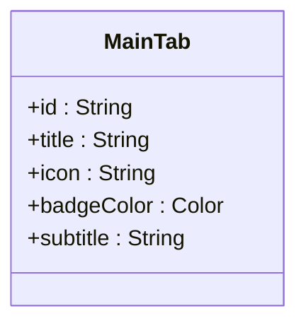
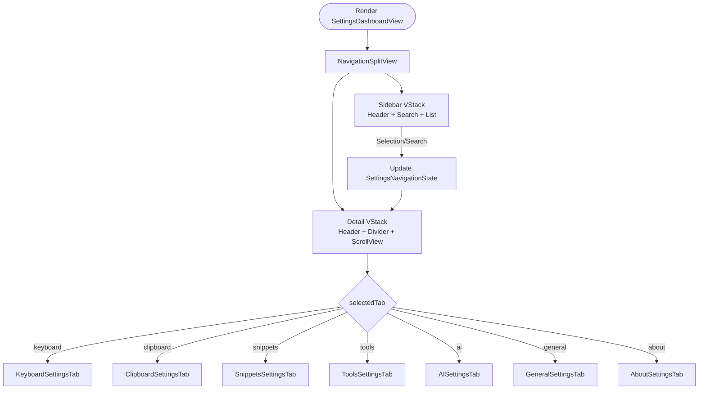
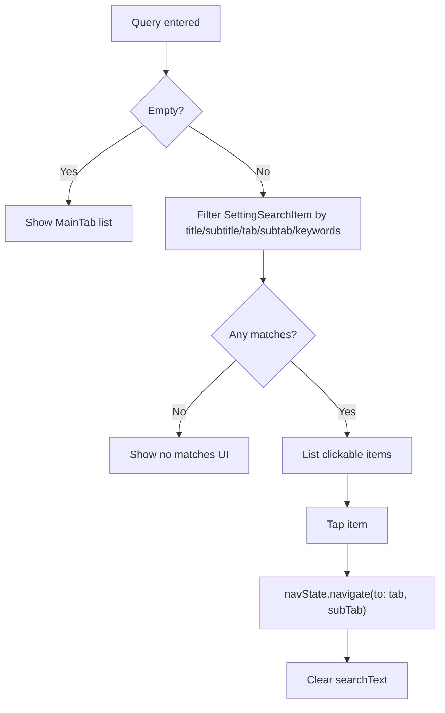
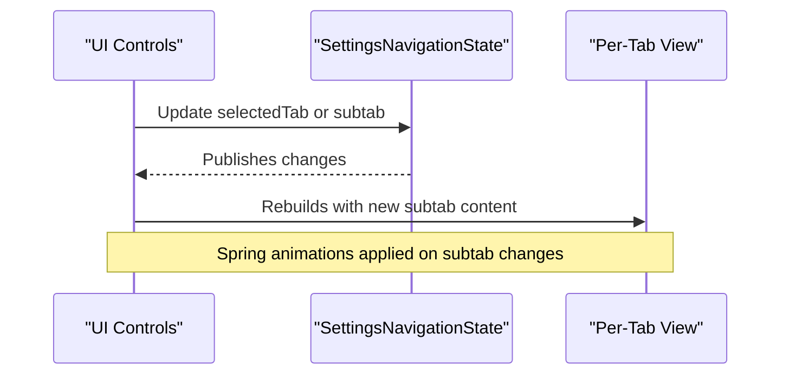
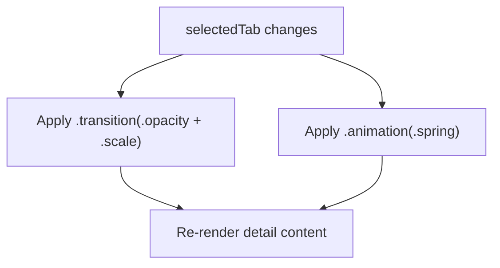
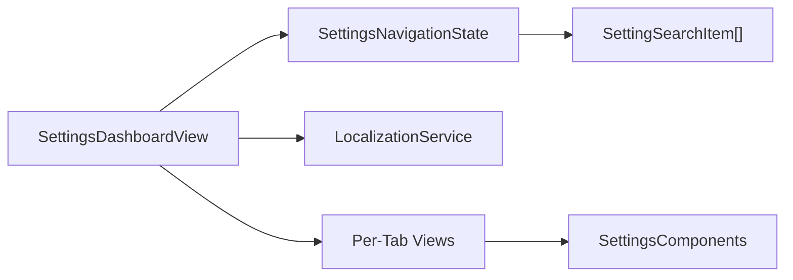

# Settings Dashboard View

<cite>
**Referenced Files in This Document**
- [SettingsDashboardView.swift](file://macos/skey-app/Sources/Features/Settings/UI/SettingsDashboardView.swift)
- [SettingsNavigationState.swift](file://macos/skey-app/Sources/Features/Settings/SettingsNavigationState.swift)
- [SettingsComponents.swift](file://macos/skey-app/Sources/Features/Settings/UI/Components/SettingsComponents.swift)
- [KeyboardSettingsTab.swift](file://macos/skey-app/Sources/Features/Settings/UI/Tabs/KeyboardSettingsTab.swift)
- [ClipboardSettingsTab.swift](file://macos/skey-app/Sources/Features/Settings/UI/Tabs/ClipboardSettingsTab.swift)
- [LocalizationService.swift](file://macos/skey-app/Sources/Shared/Localization/LocalizationService.swift)
</cite>

## Table of Contents
1. [Introduction](#introduction)
2. [Project Structure](#project-structure)
3. [Core Components](#core-components)
4. [Architecture Overview](#architecture-overview)
5. [Detailed Component Analysis](#detailed-component-analysis)
6. [Dependency Analysis](#dependency-analysis)
7. [Performance Considerations](#performance-considerations)
8. [Troubleshooting Guide](#troubleshooting-guide)
9. [Conclusion](#conclusion)
10. [Appendices](#appendices)

## Introduction
This document explains the SwiftUI-based Settings dashboard, focusing on:
- Main tab architecture with colored badges and localization
- NavigationSplitView layout with sidebar and detail panels
- Real-time search filtering across tabs and subtabs
- Reactive data binding between UI and navigation state
- Animation transitions between tabs
- Accessibility considerations
- How to extend the dashboard by adding new tabs, customizing search, and expanding layouts

## Project Structure
The settings feature is organized around a central dashboard view that coordinates navigation state and renders per-tab content. Shared components provide reusable UI building blocks for subtab bars, groups, rows, and badges. Localization is centralized to support multiple languages.

**Diagram sources**
- [SettingsDashboardView.swift:68-261](file://macos/skey-app/Sources/Features/Settings/UI/SettingsDashboardView.swift#L68-L261)
- [SettingsNavigationState.swift:56-680](file://macos/skey-app/Sources/Features/Settings/SettingsNavigationState.swift#L56-L680)
- [SettingsComponents.swift:20-80](file://macos/skey-app/Sources/Features/Settings/UI/Components/SettingsComponents.swift#L20-L80)
- [KeyboardSettingsTab.swift:6-43](file://macos/skey-app/Sources/Features/Settings/UI/Tabs/KeyboardSettingsTab.swift#L6-L43)
- [ClipboardSettingsTab.swift:6-46](file://macos/skey-app/Sources/Features/Settings/UI/Tabs/ClipboardSettingsTab.swift#L6-L46)
- [LocalizationService.swift:6-158](file://macos/skey-app/Sources/Shared/Localization/LocalizationService.swift#L6-L158)

**Section sources**
- [SettingsDashboardView.swift:68-261](file://macos/skey-app/Sources/Features/Settings/UI/SettingsDashboardView.swift#L68-L261)
- [SettingsNavigationState.swift:56-680](file://macos/skey-app/Sources/Features/Settings/SettingsNavigationState.swift#L56-L680)
- [SettingsComponents.swift:20-80](file://macos/skey-app/Sources/Features/Settings/UI/Components/SettingsComponents.swift#L20-L80)
- [LocalizationService.swift:6-158](file://macos/skey-app/Sources/Shared/Localization/LocalizationService.swift#L6-L158)

## Core Components
- MainTab enum defines each top-level settings section with localized titles, icons, badge colors, and subtitles. It drives both the sidebar list and the detail header.
- SettingsNavigationState is a shared ObservableObject that holds:
  - The currently selected main tab and per-tab subtab indices
  - Search text and a comprehensive search index mapping all searchable items to their tab/subtab destinations
  - Navigation method to switch tabs and subtabs and clear search
- SettingsComponents provides:
  - SubTabBar for pill-style subtab selection with spring animations
  - SettingsGroup and SettingsRow for consistent card-like grouping and row layout
  - KeyCapBadge for shortcut/key display styling
  - SKeyLogoView for branding in the sidebar header

**Section sources**
- [SettingsDashboardView.swift:6-64](file://macos/skey-app/Sources/Features/Settings/UI/SettingsDashboardView.swift#L6-L64)
- [SettingsNavigationState.swift:7-90](file://macos/skey-app/Sources/Features/Settings/SettingsNavigationState.swift#L7-L90)
- [SettingsComponents.swift:6-168](file://macos/skey-app/Sources/Features/Settings/UI/Components/SettingsComponents.swift#L6-L168)

## Architecture Overview
The dashboard uses a NavigationSplitView:
- Sidebar:
  - Header with logo and app name
  - Search field bound to navigation state
  - Either a standard list of MainTab entries or a filtered search results list when typing
- Detail:
  - Unified header showing current tab title and subtitle
  - Scrollable content area that switches among per-tab views based on selected tab
  - Animated transitions between tabs using opacity and scale

**Diagram sources**
- [SettingsDashboardView.swift:78-259](file://macos/skey-app/Sources/Features/Settings/UI/SettingsDashboardView.swift#L78-L259)
- [SettingsNavigationState.swift:71-90](file://macos/skey-app/Sources/Features/Settings/SettingsNavigationState.swift#L71-L90)
- [SettingsNavigationState.swift:668-679](file://macos/skey-app/Sources/Features/Settings/SettingsNavigationState.swift#L668-L679)

## Detailed Component Analysis

### MainTab Enum with Colored Badges and Localization
- Provides id, title, icon, badgeColor, and subtitle for each tab
- Titles and subtitles are localized via L10n keys
- Badge colors drive the gradient background squares in the sidebar list

**Diagram sources**
- [SettingsDashboardView.swift:6-64](file://macos/skey-app/Sources/Features/Settings/UI/SettingsDashboardView.swift#L6-L64)

**Section sources**
- [SettingsDashboardView.swift:6-64](file://macos/skey-app/Sources/Features/Settings/UI/SettingsDashboardView.swift#L6-L64)

### NavigationSplitView Layout and Responsive Design
- Sidebar width constrained with min/ideal/max values
- Detail panel has minimum width and expands to fill available space
- Content is wrapped in ScrollView with automatic scroll indicators
- Consistent padding and alignment ensure readability at different sizes

**Diagram sources**
- [SettingsDashboardView.swift:78-261](file://macos/skey-app/Sources/Features/Settings/UI/SettingsDashboardView.swift#L78-L261)

**Section sources**
- [SettingsDashboardView.swift:78-261](file://macos/skey-app/Sources/Features/Settings/UI/SettingsDashboardView.swift#L78-L261)

### Search Functionality and Real-Time Filtering
- Search input binds directly to navigation state’s searchText
- When non-empty, the sidebar shows a filtered list of SettingSearchItem entries
- Each item includes localized title, subtitle, keywords, and target tab/subtab
- Filtering matches against title, subtitle, tab title, subtab title, and keywords
- Selecting an item navigates to the appropriate tab and subtab and clears search

**Diagram sources**
- [SettingsDashboardView.swift:87-172](file://macos/skey-app/Sources/Features/Settings/UI/SettingsDashboardView.swift#L87-L172)
- [SettingsNavigationState.swift:92-666](file://macos/skey-app/Sources/Features/Settings/SettingsNavigationState.swift#L92-L666)
- [SettingsNavigationState.swift:668-679](file://macos/skey-app/Sources/Features/Settings/SettingsNavigationState.swift#L668-L679)

**Section sources**
- [SettingsDashboardView.swift:87-172](file://macos/skey-app/Sources/Features/Settings/UI/SettingsDashboardView.swift#L87-L172)
- [SettingsNavigationState.swift:92-666](file://macos/skey-app/Sources/Features/Settings/SettingsNavigationState.swift#L92-L666)
- [SettingsNavigationState.swift:668-679](file://macos/skey-app/Sources/Features/Settings/SettingsNavigationState.swift#L668-L679)

### Reactive Data Binding Between UI and State
- Selected tab is bound to navState.selectedTab; changes propagate to the detail view
- Per-tab subtabs are stored in dedicated properties (e.g., keyboardSubTab, clipboardSubTab)
- SubTabBar binds to these indices, enabling smooth switching within a tab
- All state is @Published, so SwiftUI automatically re-renders affected views

**Diagram sources**
- [SettingsDashboardView.swift:175-196](file://macos/skey-app/Sources/Features/Settings/UI/SettingsDashboardView.swift#L175-L196)
- [SettingsComponents.swift:20-80](file://macos/skey-app/Sources/Features/Settings/UI/Components/SettingsComponents.swift#L20-L80)
- [KeyboardSettingsTab.swift:15-43](file://macos/skey-app/Sources/Features/Settings/UI/Tabs/KeyboardSettingsTab.swift#L15-L43)
- [ClipboardSettingsTab.swift:12-46](file://macos/skey-app/Sources/Features/Settings/UI/Tabs/ClipboardSettingsTab.swift#L12-L46)

**Section sources**
- [SettingsDashboardView.swift:175-196](file://macos/skey-app/Sources/Features/Settings/UI/SettingsDashboardView.swift#L175-L196)
- [SettingsComponents.swift:20-80](file://macos/skey-app/Sources/Features/Settings/UI/Components/SettingsComponents.swift#L20-L80)
- [KeyboardSettingsTab.swift:15-43](file://macos/skey-app/Sources/Features/Settings/UI/Tabs/KeyboardSettingsTab.swift#L15-L43)
- [ClipboardSettingsTab.swift:12-46](file://macos/skey-app/Sources/Features/Settings/UI/Tabs/ClipboardSettingsTab.swift#L12-L46)

### Animation Transitions Between Tabs
- Detail content applies a combined transition of opacity and subtle scale when the selected tab changes
- An explicit spring animation is attached to the value of selectedTab for smoothness
- Subtab switching within a tab also uses spring animations via SubTabBar

**Diagram sources**
- [SettingsDashboardView.swift:248-255](file://macos/skey-app/Sources/Features/Settings/UI/SettingsDashboardView.swift#L248-L255)
- [SettingsComponents.swift:30-38](file://macos/skey-app/Sources/Features/Settings/UI/Components/SettingsComponents.swift#L30-L38)

**Section sources**
- [SettingsDashboardView.swift:248-255](file://macos/skey-app/Sources/Features/Settings/UI/SettingsDashboardView.swift#L248-L255)
- [SettingsComponents.swift:30-38](file://macos/skey-app/Sources/Features/Settings/UI/Components/SettingsComponents.swift#L30-L38)

### Accessibility Considerations
- Use semantic controls: Buttons for actions, Lists for selectable items, Pickers for options, Toggles for on/off states
- Ensure all interactive elements have accessible labels through localized strings
- Maintain sufficient color contrast for badges and text
- Provide clear focus order in the sidebar and detail areas
- Avoid relying solely on color to convey meaning; combine with icons and text

[No sources needed since this section provides general guidance]

## Dependency Analysis
- SettingsDashboardView depends on:
  - SettingsNavigationState for navigation and search
  - LocalizationService for all user-facing text
  - Per-tab views for detail content
- SettingsNavigationState owns the canonical search index and navigation logic
- SettingsComponents provides reusable UI primitives used by tabs and dashboard

**Diagram sources**
- [SettingsDashboardView.swift:68-261](file://macos/skey-app/Sources/Features/Settings/UI/SettingsDashboardView.swift#L68-L261)
- [SettingsNavigationState.swift:56-680](file://macos/skey-app/Sources/Features/Settings/SettingsNavigationState.swift#L56-L680)
- [SettingsComponents.swift:6-168](file://macos/skey-app/Sources/Features/Settings/UI/Components/SettingsComponents.swift#L6-L168)
- [LocalizationService.swift:6-158](file://macos/skey-app/Sources/Shared/Localization/LocalizationService.swift#L6-L158)

**Section sources**
- [SettingsDashboardView.swift:68-261](file://macos/skey-app/Sources/Features/Settings/UI/SettingsDashboardView.swift#L68-L261)
- [SettingsNavigationState.swift:56-680](file://macos/skey-app/Sources/Features/Settings/SettingsNavigationState.swift#L56-L680)
- [SettingsComponents.swift:6-168](file://macos/skey-app/Sources/Features/Settings/UI/Components/SettingsComponents.swift#L6-L168)
- [LocalizationService.swift:6-158](file://macos/skey-app/Sources/Shared/Localization/LocalizationService.swift#L6-L158)

## Performance Considerations
- Search filtering runs on every keystroke; keep keyword lists concise and avoid heavy computations in the filter predicate
- Prefer immutable data structures for search items to minimize allocations
- Use lazy rendering where possible (Lists already do this)
- Avoid excessive nested recompositions by keeping state minimal and colocated
- Keep animations short and use spring parameters tuned for responsiveness

[No sources needed since this section provides general guidance]

## Troubleshooting Guide
- Search not returning results:
  - Verify SettingSearchItem keywords include common synonyms and variations
  - Ensure titles/subtitles are localized consistently and match expected keys
- Navigation does not update subtab:
  - Confirm navigate(to:) sets the correct per-tab subtab property
  - Ensure the tab’s SubTabBar binds to the same subtab index
- Animations feel choppy:
  - Reduce complexity of detail content during transitions
  - Ensure animations are attached to the correct state value
- Localization missing:
  - Check that L10n keys exist in the active language bundle
  - Confirm LocalizationService updates activeBundle when language changes

**Section sources**
- [SettingsNavigationState.swift:71-90](file://macos/skey-app/Sources/Features/Settings/SettingsNavigationState.swift#L71-L90)
- [SettingsNavigationState.swift:668-679](file://macos/skey-app/Sources/Features/Settings/SettingsNavigationState.swift#L668-L679)
- [LocalizationService.swift:19-31](file://macos/skey-app/Sources/Shared/Localization/LocalizationService.swift#L19-L31)

## Conclusion
The Settings dashboard combines a clean NavigationSplitView layout with a robust, reactive navigation state and a powerful search system. MainTab provides a consistent, localized, and visually distinct set of sections, while reusable components streamline the implementation of per-tab settings. The design supports responsive layouts, smooth animations, and extensibility for future features.

[No sources needed since this section summarizes without analyzing specific files]

## Appendices

### How to Add a New Tab
- Define a new case in MainTab with localized title, icon, badge color, and subtitle
- Add a new per-tab view struct implementing the desired settings UI
- In the detail panel’s switch statement, render the new tab view for the new case
- Optionally add search entries in SettingsNavigationState.allSearchItems pointing to the new tab and subtab

**Section sources**
- [SettingsDashboardView.swift:6-64](file://macos/skey-app/Sources/Features/Settings/UI/SettingsDashboardView.swift#L6-L64)
- [SettingsDashboardView.swift:227-243](file://macos/skey-app/Sources/Features/Settings/UI/SettingsDashboardView.swift#L227-L243)
- [SettingsNavigationState.swift:92-666](file://macos/skey-app/Sources/Features/Settings/SettingsNavigationState.swift#L92-L666)

### Implementing Custom Search Logic
- Extend SettingSearchItem with additional fields if needed (e.g., categories)
- Modify the search function to incorporate new matching criteria
- Update keywords to improve discoverability

**Section sources**
- [SettingsNavigationState.swift:7-52](file://macos/skey-app/Sources/Features/Settings/SettingsNavigationState.swift#L7-L52)
- [SettingsNavigationState.swift:668-679](file://macos/skey-app/Sources/Features/Settings/SettingsNavigationState.swift#L668-L679)

### Extending the Dashboard Layout
- Adjust sidebar column widths via navigationSplitViewColumnWidth modifiers
- Customize the detail header or add persistent controls above the scrollable content
- Introduce new reusable components in SettingsComponents for consistency

**Section sources**
- [SettingsDashboardView.swift:198-259](file://macos/skey-app/Sources/Features/Settings/UI/SettingsDashboardView.swift#L198-L259)
- [SettingsComponents.swift:82-168](file://macos/skey-app/Sources/Features/Settings/UI/Components/SettingsComponents.swift#L82-L168)