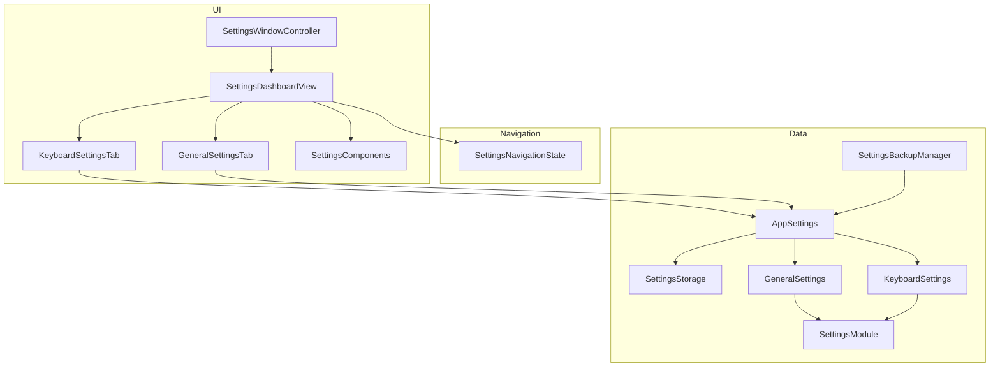
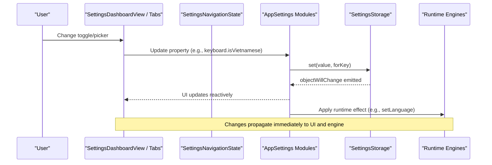
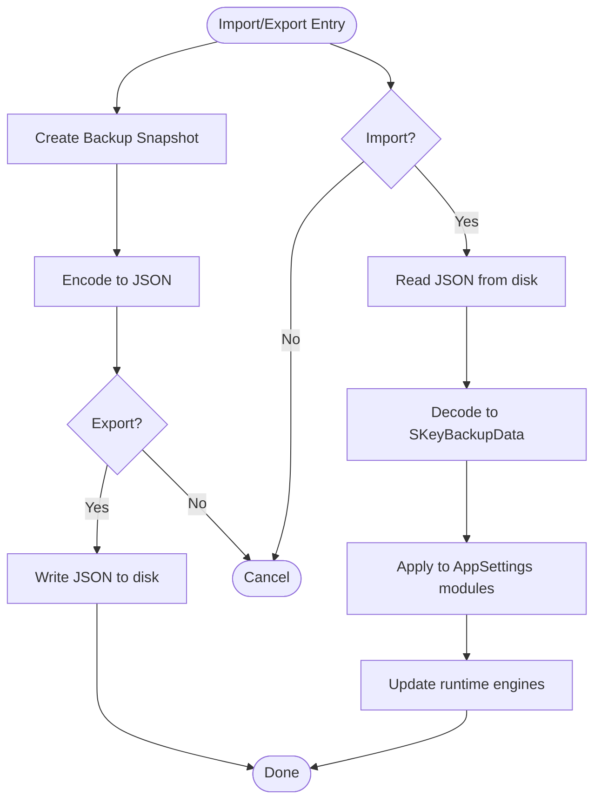
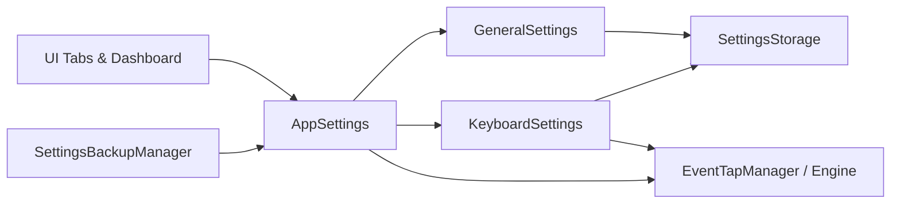

# Settings Interface

<cite>
**Referenced Files in This Document**
- [SettingsWindowController.swift](file://macos/skey-app/Sources/Features/Settings/SettingsWindowController.swift)
- [SettingsDashboardView.swift](file://macos/skey-app/Sources/Features/Settings/UI/SettingsDashboardView.swift)
- [SettingsNavigationState.swift](file://macos/skey-app/Sources/Features/Settings/SettingsNavigationState.swift)
- [SettingsComponents.swift](file://macos/skey-app/Sources/Features/Settings/UI/Components/SettingsComponents.swift)
- [KeyboardSettingsTab.swift](file://macos/skey-app/Sources/Features/Settings/UI/Tabs/KeyboardSettingsTab.swift)
- [GeneralSettingsTab.swift](file://macos/skey-app/Sources/Features/Settings/UI/Tabs/GeneralSettingsTab.swift)
- [AppSettings.swift](file://macos/skey-app/Sources/Shared/Settings/AppSettings.swift)
- [SettingsModule.swift](file://macos/skey-app/Sources/Shared/Settings/SettingsModule.swift)
- [SettingsStorage.swift](file://macos/skey-app/Sources/Shared/Settings/SettingsStorage.swift)
- [GeneralSettings.swift](file://macos/skey-app/Sources/Shared/Settings/Modules/GeneralSettings.swift)
- [KeyboardSettings.swift](file://macos/skey-app/Sources/Shared/Settings/Modules/KeyboardSettings.swift)
- [SettingsBackupManager.swift](file://macos/skey-app/Sources/Shared/Settings/Backup/SettingsBackupManager.swift)
</cite>

## Table of Contents
1. [Introduction](#introduction)
2. [Project Structure](#project-structure)
3. [Core Components](#core-components)
4. [Architecture Overview](#architecture-overview)
5. [Detailed Component Analysis](#detailed-component-analysis)
6. [Dependency Analysis](#dependency-analysis)
7. [Performance Considerations](#performance-considerations)
8. [Troubleshooting Guide](#troubleshooting-guide)
9. [Conclusion](#conclusion)
10. [Appendices](#appendices)

## Introduction
This document explains the SwiftUI-based settings interface for the application, focusing on:
- The window controller that hosts and manages the settings UI
- The main dashboard view with tabbed navigation and search
- Individual setting tabs for feature configuration (keyboard, general, etc.)
- Reactive data binding between UI components and persistent settings storage
- Validation and default value handling via modules
- Import/export functionality for settings backup and restore
- How to create new settings tabs and custom controls
- Integration points for runtime configuration changes across the app

## Project Structure
The settings subsystem is organized into three layers:
- UI layer: Window controller, dashboard, tabs, and reusable components
- State/navigation layer: Centralized navigation state and search indexing
- Data layer: App-wide settings hub, module definitions, and high-performance storage

**Diagram sources**
- [SettingsWindowController.swift:6-59](file://macos/skey-app/Sources/Features/Settings/SettingsWindowController.swift#L6-L59)
- [SettingsDashboardView.swift:68-261](file://macos/skey-app/Sources/Features/Settings/UI/SettingsDashboardView.swift#L68-L261)
- [SettingsNavigationState.swift:56-90](file://macos/skey-app/Sources/Features/Settings/SettingsNavigationState.swift#L56-L90)
- [AppSettings.swift:10-44](file://macos/skey-app/Sources/Shared/Settings/AppSettings.swift#L10-L44)
- [SettingsModule.swift:6-16](file://macos/skey-app/Sources/Shared/Settings/SettingsModule.swift#L6-L16)
- [SettingsStorage.swift:11-119](file://macos/skey-app/Sources/Shared/Settings/SettingsStorage.swift#L11-L119)
- [GeneralSettings.swift:7-90](file://macos/skey-app/Sources/Shared/Settings/Modules/GeneralSettings.swift#L7-L90)
- [KeyboardSettings.swift:6-263](file://macos/skey-app/Sources/Shared/Settings/Modules/KeyboardSettings.swift#L6-L263)
- [SettingsBackupManager.swift:85-321](file://macos/skey-app/Sources/Shared/Settings/Backup/SettingsBackupManager.swift#L85-L321)

**Section sources**
- [SettingsWindowController.swift:6-59](file://macos/skey-app/Sources/Features/Settings/SettingsWindowController.swift#L6-L59)
- [SettingsDashboardView.swift:68-261](file://macos/skey-app/Sources/Features/Settings/UI/SettingsDashboardView.swift#L68-L261)
- [SettingsNavigationState.swift:56-90](file://macos/skey-app/Sources/Features/Settings/SettingsNavigationState.swift#L56-L90)
- [AppSettings.swift:10-44](file://macos/skey-app/Sources/Shared/Settings/AppSettings.swift#L10-L44)
- [SettingsStorage.swift:11-119](file://macos/skey-app/Sources/Shared/Settings/SettingsStorage.swift#L11-L119)

## Core Components
- SettingsWindowController: Creates and shows the settings window, embeds the SwiftUI dashboard, and supports opening a specific tab programmatically.
- SettingsDashboardView: Main SwiftUI view with sidebar navigation, search, header, and detail area that renders the active tab.
- SettingsNavigationState: Observable state for selected tab, sub-tabs, and search; provides search indexing across all settings items.
- AppSettings: Central hub exposing typed settings modules (keyboard, clipboard, macro, general, shortcuts, translator).
- SettingsModule: Protocol defining prefix, defaults registration, and reset behavior for each module.
- SettingsStorage: Thread-safe, in-memory cached storage with async persistence to UserDefaults.
- Module implementations (e.g., GeneralSettings, KeyboardSettings): Provide reactive properties, defaults, and side effects when values change.
- SettingsBackupManager: Captures, exports, and imports settings snapshots across modules.

**Section sources**
- [SettingsWindowController.swift:6-59](file://macos/skey-app/Sources/Features/Settings/SettingsWindowController.swift#L6-L59)
- [SettingsDashboardView.swift:68-261](file://macos/skey-app/Sources/Features/Settings/UI/SettingsDashboardView.swift#L68-L261)
- [SettingsNavigationState.swift:56-90](file://macos/skey-app/Sources/Features/Settings/SettingsNavigationState.swift#L56-L90)
- [AppSettings.swift:10-44](file://macos/skey-app/Sources/Shared/Settings/AppSettings.swift#L10-L44)
- [SettingsModule.swift:6-16](file://macos/skey-app/Sources/Shared/Settings/SettingsModule.swift#L6-L16)
- [SettingsStorage.swift:11-119](file://macos/skey-app/Sources/Shared/Settings/SettingsStorage.swift#L11-L119)
- [GeneralSettings.swift:7-90](file://macos/skey-app/Sources/Shared/Settings/Modules/GeneralSettings.swift#L7-L90)
- [KeyboardSettings.swift:6-263](file://macos/skey-app/Sources/Shared/Settings/Modules/KeyboardSettings.swift#L6-L263)
- [SettingsBackupManager.swift:85-321](file://macos/skey-app/Sources/Shared/Settings/Backup/SettingsBackupManager.swift#L85-L321)

## Architecture Overview
The settings system follows a reactive MVVM-like pattern:
- UI binds to @ObservedObject instances from AppSettings modules
- Modules publish changes via Combine’s objectWillChange
- Storage caches reads in memory and persists writes asynchronously
- Backup manager serializes current state to JSON for import/export

**Diagram sources**
- [SettingsDashboardView.swift:227-243](file://macos/skey-app/Sources/Features/Settings/UI/SettingsDashboardView.swift#L227-L243)
- [KeyboardSettingsTab.swift:63-129](file://macos/skey-app/Sources/Features/Settings/UI/Tabs/KeyboardSettingsTab.swift#L63-L129)
- [KeyboardSettings.swift:70-177](file://macos/skey-app/Sources/Shared/Settings/Modules/KeyboardSettings.swift#L70-L177)
- [SettingsStorage.swift:100-114](file://macos/skey-app/Sources/Shared/Settings/SettingsStorage.swift#L100-L114)

## Detailed Component Analysis

### SettingsWindowController
- Hosts an NSWindow with a visual effect view and embeds the SwiftUI dashboard via NSHostingView
- Configures window appearance, sizing, and autosave name
- Provides showSettings(tab:) to focus a specific tab using SettingsNavigationState

Key responsibilities:
- Window lifecycle and presentation
- Embedding SwiftUI root view
- Programmatic tab navigation

**Section sources**
- [SettingsWindowController.swift:6-59](file://macos/skey-app/Sources/Features/Settings/SettingsWindowController.swift#L6-L59)

### SettingsDashboardView
- Displays a NavigationSplitView with:
  - Sidebar containing profile header, search bar, and tab list or search results
  - Detail area showing the selected tab’s content with header and scrollable content
- Uses SettingsNavigationState for selection and search
- Renders individual tabs based on selected tab

Key behaviors:
- Search filters settings items and navigates to target tab/sub-tab
- Animations and transitions for tab switching
- Consistent styling via control sizes and picker styles

**Section sources**
- [SettingsDashboardView.swift:6-64](file://macos/skey-app/Sources/Features/Settings/UI/SettingsDashboardView.swift#L6-L64)
- [SettingsDashboardView.swift:68-261](file://macos/skey-app/Sources/Features/Settings/UI/SettingsDashboardView.swift#L68-L261)

### SettingsNavigationState
- Holds selected tab and per-tab sub-tab indices
- Maintains searchText and exposes allSearchItems for search
- Provides navigate(to:subTab:) to update selection and clear search

Key capabilities:
- Centralized navigation state shared across UI
- Comprehensive search index mapping titles, subtitles, keywords, and sub-tab context

**Section sources**
- [SettingsNavigationState.swift:56-90](file://macos/skey-app/Sources/Features/Settings/SettingsNavigationState.swift#L56-L90)
- [SettingsNavigationState.swift:92-681](file://macos/skey-app/Sources/Features/Settings/SettingsNavigationState.swift#L92-L681)

### Reusable UI Components
- SubTabBar: Modern pill-style sub-tab selector with animations
- SettingsGroup: Card container with optional title
- SettingsRow: Spacious row layout with title, subtitle, and control
- KeyCapBadge and SKeyLogoView: Visual helpers

Usage:
- Each tab composes these components to build consistent layouts

**Section sources**
- [SettingsComponents.swift:6-80](file://macos/skey-app/Sources/Features/Settings/UI/Components/SettingsComponents.swift#L6-L80)
- [SettingsComponents.swift:84-168](file://macos/skey-app/Sources/Features/Settings/UI/Components/SettingsComponents.swift#L84-L168)
- [SettingsComponents.swift:172-304](file://macos/skey-app/Sources/Features/Settings/UI/Components/SettingsComponents.swift#L172-L304)

### KeyboardSettingsTab
- Organizes keyboard-related settings into sub-tabs: input method, typing rules, app management
- Binds directly to AppSettings.shared.keyboard and related modules
- Applies runtime changes by calling engine methods when toggles/pickers change

Examples of integration:
- Input method selection triggers engine setInputMethod
- Language toggle triggers setLanguage
- Typing rule toggles trigger corresponding engine setters

**Section sources**
- [KeyboardSettingsTab.swift:6-44](file://macos/skey-app/Sources/Features/Settings/UI/Tabs/KeyboardSettingsTab.swift#L6-L44)
- [KeyboardSettingsTab.swift:63-129](file://macos/skey-app/Sources/Features/Settings/UI/Tabs/KeyboardSettingsTab.swift#L63-L129)
- [KeyboardSettingsTab.swift:133-257](file://macos/skey-app/Sources/Features/Settings/UI/Tabs/KeyboardSettingsTab.swift#L133-L257)

### GeneralSettingsTab
- Presents basic, permissions, and logs sections
- Integrates with LaunchAtLoginService and PermissionsService
- Exposes export/import buttons backed by SettingsBackupManager
- Provides factory reset via AppSettings.shared.resetAll()

**Section sources**
- [GeneralSettingsTab.swift:6-49](file://macos/skey-app/Sources/Features/Settings/UI/Tabs/GeneralSettingsTab.swift#L6-L49)
- [GeneralSettingsTab.swift:51-116](file://macos/skey-app/Sources/Features/Settings/UI/Tabs/GeneralSettingsTab.swift#L51-L116)
- [GeneralSettingsTab.swift:118-226](file://macos/skey-app/Sources/Features/Settings/UI/Tabs/GeneralSettingsTab.swift#L118-L226)

### AppSettings and SettingsModule
- AppSettings aggregates all feature modules and offers resetAll()
- SettingsModule defines contract:
  - Static prefix for namespacing keys
  - registerDefaults(in:) to seed defaults
  - resetToDefaults() to revert to factory defaults

**Section sources**
- [AppSettings.swift:10-44](file://macos/skey-app/Sources/Shared/Settings/AppSettings.swift#L10-L44)
- [SettingsModule.swift:6-16](file://macos/skey-app/Sources/Shared/Settings/SettingsModule.swift#L6-L16)

### SettingsStorage
- High-performance, thread-safe cache with:
  - Immediate in-memory reads
  - Async background writes to UserDefaults
  - Default registration and removal support
- Used by all modules for persistence

**Section sources**
- [SettingsStorage.swift:11-119](file://macos/skey-app/Sources/Shared/Settings/SettingsStorage.swift#L11-L119)

### Module Implementations: GeneralSettings and KeyboardSettings
- GeneralSettings:
  - Keys for launch-at-login, language, update checks, debug mode
  - Side effects on write (e.g., enabling/disabling launch at login)
  - Debug mode restricted to DEBUG builds
- KeyboardSettings:
  - Extensive keys for input method, charset, typing rules, quick typing, app exclusion
  - Excluded apps stored as JSON with caching for O(1) lookups
  - Methods to add/remove/toggle/clear excluded apps

**Section sources**
- [GeneralSettings.swift:7-90](file://macos/skey-app/Sources/Shared/Settings/Modules/GeneralSettings.swift#L7-L90)
- [KeyboardSettings.swift:6-263](file://macos/skey-app/Sources/Shared/Settings/Modules/KeyboardSettings.swift#L6-L263)

### Import/Export: SettingsBackupManager
- Captures a snapshot of all modules into a Codable structure
- Exports to a user-selected JSON file with pretty printing and ISO dates
- Imports JSON and applies values back to AppSettings modules
- Triggers runtime engine updates during import to reflect changes immediately

**Diagram sources**
- [SettingsBackupManager.swift:90-166](file://macos/skey-app/Sources/Shared/Settings/Backup/SettingsBackupManager.swift#L90-L166)
- [SettingsBackupManager.swift:168-197](file://macos/skey-app/Sources/Shared/Settings/Backup/SettingsBackupManager.swift#L168-L197)
- [SettingsBackupManager.swift:199-224](file://macos/skey-app/Sources/Shared/Settings/Backup/SettingsBackupManager.swift#L199-L224)
- [SettingsBackupManager.swift:226-313](file://macos/skey-app/Sources/Shared/Settings/Backup/SettingsBackupManager.swift#L226-L313)

**Section sources**
- [SettingsBackupManager.swift:85-321](file://macos/skey-app/Sources/Shared/Settings/Backup/SettingsBackupManager.swift#L85-L321)

## Dependency Analysis
- UI depends on AppSettings modules for reactive bindings
- Modules depend on SettingsStorage for persistence
- Some modules apply side effects to runtime engines (e.g., EventTapManager)
- Backup manager depends on AppSettings to serialize/deserialize state

**Diagram sources**
- [KeyboardSettingsTab.swift:63-129](file://macos/skey-app/Sources/Features/Settings/UI/Tabs/KeyboardSettingsTab.swift#L63-L129)
- [KeyboardSettings.swift:70-177](file://macos/skey-app/Sources/Shared/Settings/Modules/KeyboardSettings.swift#L70-L177)
- [SettingsBackupManager.swift:226-313](file://macos/skey-app/Sources/Shared/Settings/Backup/SettingsBackupManager.swift#L226-L313)

**Section sources**
- [KeyboardSettingsTab.swift:63-129](file://macos/skey-app/Sources/Features/Settings/UI/Tabs/KeyboardSettingsTab.swift#L63-L129)
- [KeyboardSettings.swift:70-177](file://macos/skey-app/Sources/Shared/Settings/Modules/KeyboardSettings.swift#L70-L177)
- [SettingsBackupManager.swift:226-313](file://macos/skey-app/Sources/Shared/Settings/Backup/SettingsBackupManager.swift#L226-L313)

## Performance Considerations
- SettingsStorage uses an in-memory cache with lock protection for fast reads and asynchronous writes to avoid blocking UI or hot paths
- KeyboardSettings maintains a cached set of excluded app bundle IDs for O(1) checks in performance-sensitive code paths
- UI leverages SwiftUI’s reactive updates to minimize unnecessary recompositions
- Avoid heavy operations in setters; delegate I/O to background queues (as implemented in storage)

[No sources needed since this section provides general guidance]

## Troubleshooting Guide
Common issues and resolutions:
- Settings not persisting:
  - Ensure modules call storage.set(newValue, forKey:) in setters
  - Verify registerDefaults has been called during initialization
- UI not updating after changes:
  - Confirm modules emit objectWillChange before or after storage updates
  - Check that UI binds to @ObservedObject properties from AppSettings modules
- Runtime changes not applied:
  - For keyboard features, ensure engine setters are invoked in the UI handlers or module setters
- Import/Export failures:
  - Validate JSON format and version compatibility
  - Check file permissions and disk space when writing backups

**Section sources**
- [SettingsStorage.swift:100-114](file://macos/skey-app/Sources/Shared/Settings/SettingsStorage.swift#L100-L114)
- [GeneralSettings.swift:24-40](file://macos/skey-app/Sources/Shared/Settings/Modules/GeneralSettings.swift#L24-L40)
- [KeyboardSettings.swift:57-68](file://macos/skey-app/Sources/Shared/Settings/Modules/KeyboardSettings.swift#L57-L68)
- [SettingsBackupManager.swift:168-197](file://macos/skey-app/Sources/Shared/Settings/Backup/SettingsBackupManager.swift#L168-L197)
- [SettingsBackupManager.swift:199-224](file://macos/skey-app/Sources/Shared/Settings/Backup/SettingsBackupManager.swift#L199-L224)

## Conclusion
The settings interface combines a polished SwiftUI dashboard with a robust, reactive data layer. It provides:
- Clear separation of concerns across UI, navigation, and data
- High-performance storage with immediate UI feedback
- Modular settings with defaults, validation, and reset capabilities
- Full import/export support for portable configurations
- Easy extension points for adding new tabs and controls

[No sources needed since this section summarizes without analyzing specific files]

## Appendices

### Creating a New Settings Tab
Steps:
1. Add a new case to MainTab and define its title, icon, badge color, and subtitle
2. Create a new SwiftUI View implementing the tab’s content
3. Register search entries in SettingsNavigationState.allSearchItems so users can find it
4. Wire the tab into SettingsDashboardView’s switch statement to render the view
5. Bind UI controls to AppSettings modules for reactive updates

**Section sources**
- [SettingsDashboardView.swift:6-64](file://macos/skey-app/Sources/Features/Settings/UI/SettingsDashboardView.swift#L6-L64)
- [SettingsDashboardView.swift:227-243](file://macos/skey-app/Sources/Features/Settings/UI/SettingsDashboardView.swift#L227-L243)
- [SettingsNavigationState.swift:92-681](file://macos/skey-app/Sources/Features/Settings/SettingsNavigationState.swift#L92-L681)

### Implementing Custom Setting Controls
Guidelines:
- Use SettingsRow and SettingsGroup for consistent layout
- Bind controls to @ObservedObject properties from AppSettings modules
- Trigger any necessary runtime effects in the setter or UI handler
- Keep I/O off the main thread; rely on SettingsStorage for persistence

**Section sources**
- [SettingsComponents.swift:84-168](file://macos/skey-app/Sources/Features/Settings/UI/Components/SettingsComponents.swift#L84-L168)
- [KeyboardSettingsTab.swift:63-129](file://macos/skey-app/Sources/Features/Settings/UI/Tabs/KeyboardSettingsTab.swift#L63-L129)

### Integrating with the Application’s Settings Module
- Access settings via AppSettings.shared.<module>.property
- For runtime-critical features, invoke engine methods alongside property changes
- Use SettingsBackupManager to include your module’s state in import/export

**Section sources**
- [AppSettings.swift:10-44](file://macos/skey-app/Sources/Shared/Settings/AppSettings.swift#L10-L44)
- [SettingsBackupManager.swift:90-166](file://macos/skey-app/Sources/Shared/Settings/Backup/SettingsBackupManager.swift#L90-L166)
- [SettingsBackupManager.swift:226-313](file://macos/skey-app/Sources/Shared/Settings/Backup/SettingsBackupManager.swift#L226-L313)