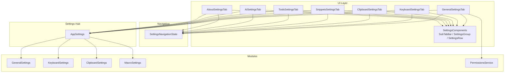
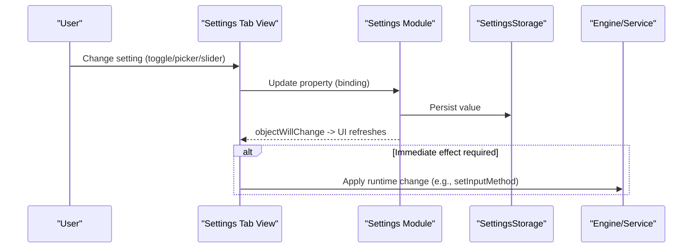
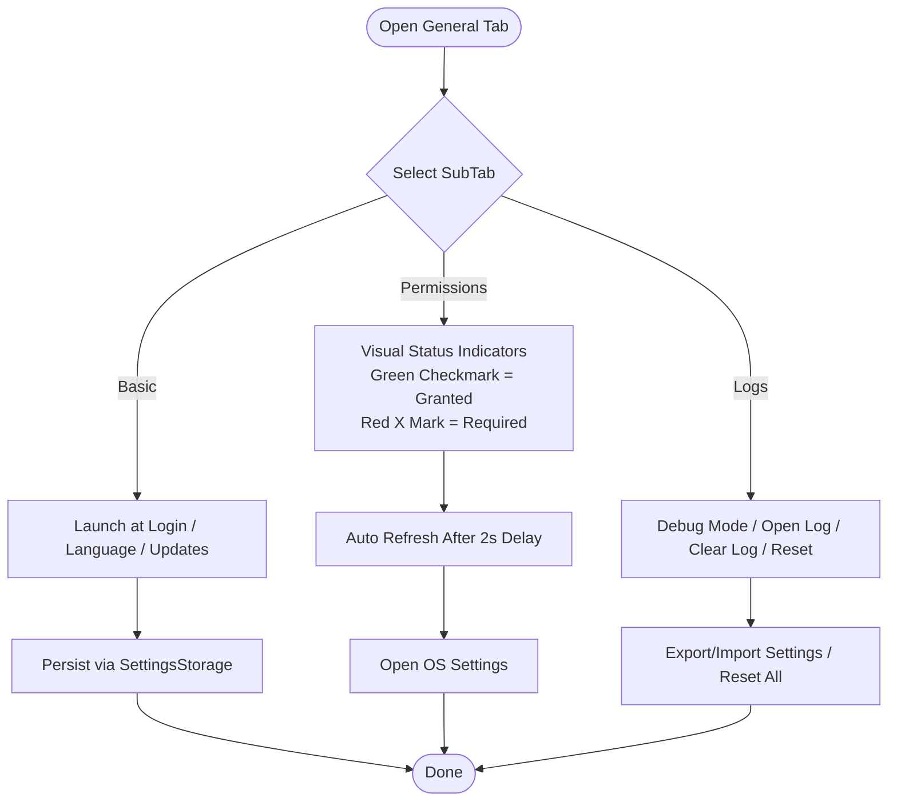
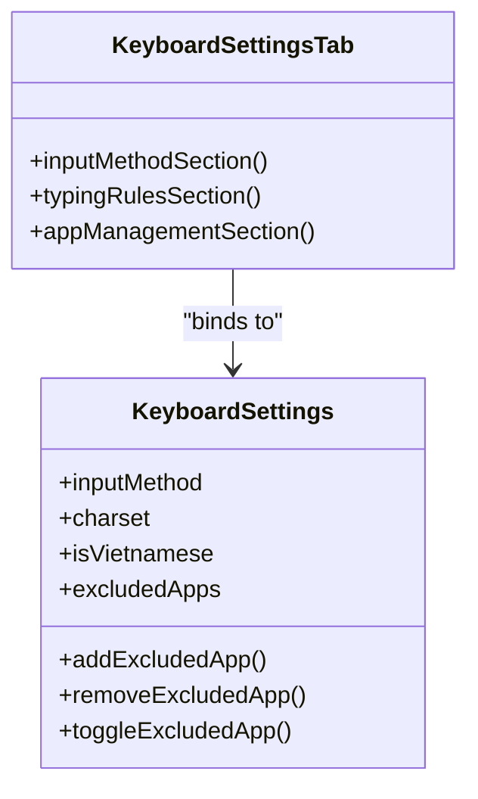
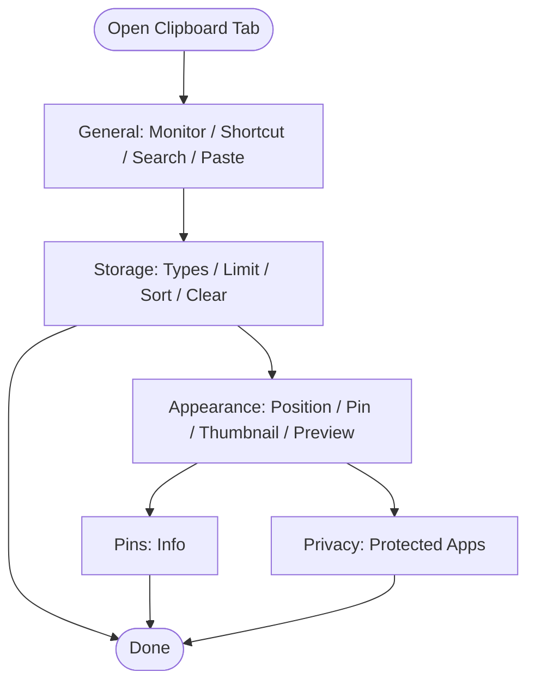
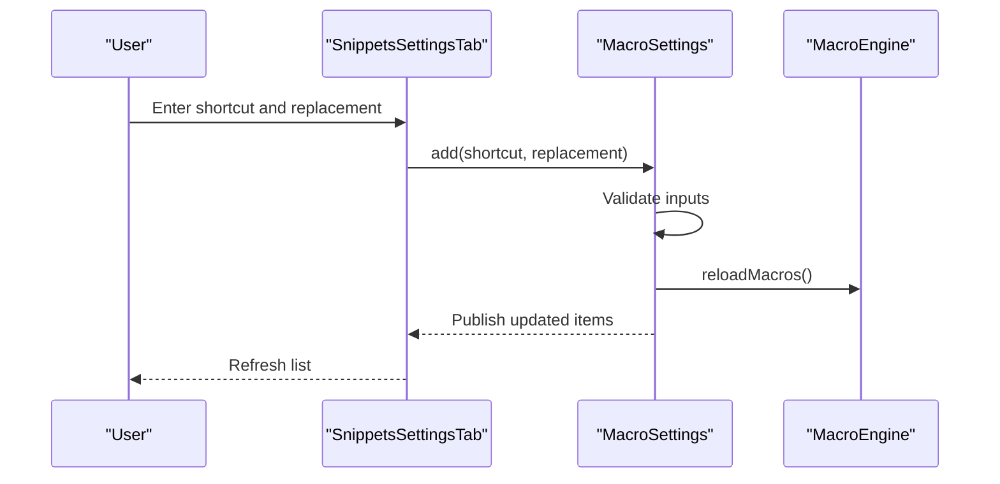
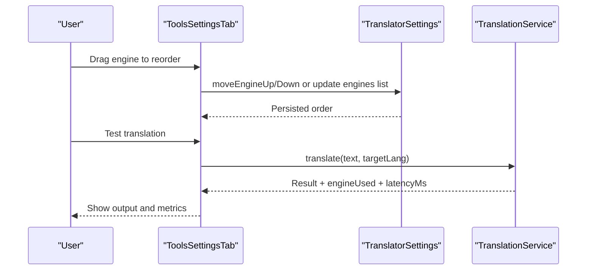
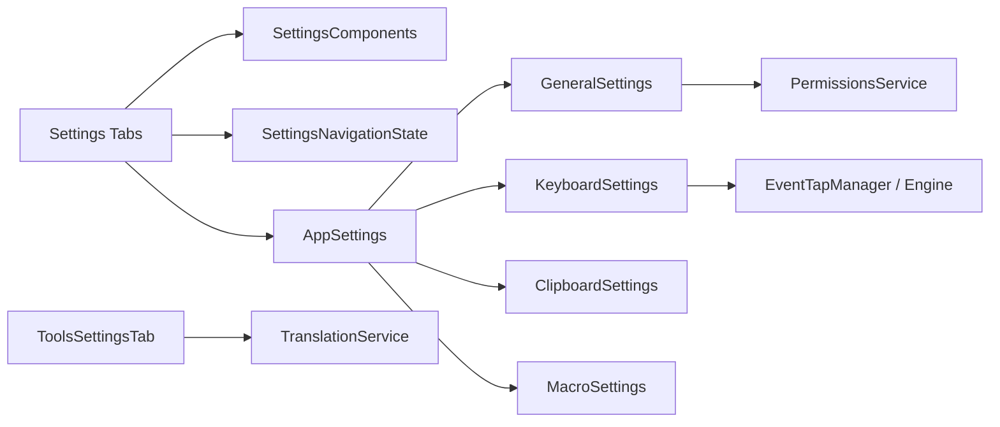

# Settings Tabs

<cite>
**Referenced Files in This Document**
- [GeneralSettingsTab.swift](file://macos/skey-app/Sources/Features/Settings/UI/Tabs/GeneralSettingsTab.swift)
- [KeyboardSettingsTab.swift](file://macos/skey-app/Sources/Features/Settings/UI/Tabs/KeyboardSettingsTab.swift)
- [ClipboardSettingsTab.swift](file://macos/skey-app/Sources/Features/Settings/UI/Tabs/ClipboardSettingsTab.swift)
- [SnippetsSettingsTab.swift](file://macos/skey-app/Sources/Features/Settings/UI/Tabs/SnippetsSettingsTab.swift)
- [ToolsSettingsTab.swift](file://macos/skey-app/Sources/Features/Settings/UI/Tabs/ToolsSettingsTab.swift)
- [AISettingsTab.swift](file://macos/skey-app/Sources/Features/Settings/UI/Tabs/AISettingsTab.swift)
- [AboutSettingsTab.swift](file://macos/skey-app/Sources/Features/Settings/UI/Tabs/AboutSettingsTab.swift)
- [SettingsComponents.swift](file://macos/skey-app/Sources/Features/Settings/UI/Components/SettingsComponents.swift)
- [AppSettings.swift](file://macos/skey-app/Sources/Shared/Settings/AppSettings.swift)
- [SettingsModule.swift](file://macos/skey-app/Sources/Shared/Settings/SettingsModule.swift)
- [SettingsNavigationState.swift](file://macos/skey-app/Sources/Features/Settings/SettingsNavigationState.swift)
- [GeneralSettings.swift](file://macos/skey-app/Sources/Shared/Settings/Modules/GeneralSettings.swift)
- [KeyboardSettings.swift](file://macos/skey-app/Sources/Shared/Settings/Modules/KeyboardSettings.swift)
- [ClipboardSettings.swift](file://macos/skey-app/Sources/Shared/Settings/Modules/ClipboardSettings.swift)
- [MacroSettings.swift](file://macos/skey-app/Sources/Shared/Settings/Modules/MacroSettings.swift)
- [PermissionsService.swift](file://macos/skey-app/Sources/Shared/Services/PermissionsService.swift)
</cite>

## Update Summary
**Changes Made**
- Enhanced General Settings Tab with visual permission status indicators showing green checkmark badges for granted permissions and red X marks for required permissions
- Added contextual text display ('Đã cấp quyền' for granted, 'Yêu cầu cấp quyền' for required) based on permission status
- Implemented automatic permission status refresh with 2-second delay after System Settings changes
- Updated permissions section to use PermissionsService for reactive permission monitoring

## Table of Contents
1. Introduction
2. Project Structure
3. Core Components
4. Architecture Overview
5. Detailed Component Analysis
6. Dependency Analysis
7. Performance Considerations
8. Troubleshooting Guide
9. Conclusion

## Introduction
This document explains the settings tabs architecture and implementation patterns used across the application's feature-specific configuration interfaces. It covers:
- Common tab architecture using SwiftUI views, sub-tab navigation, and reusable components
- Reactive data binding to settings modules via ObservableObject
- Validation and default value handling through centralized settings storage
- Consistent UX patterns for toggles, pickers, sliders, shortcuts, lists, and complex forms
- Each tab's specific functionality: General, Keyboard, Clipboard, Snippets, Tools, AI, and About

## Project Structure
The settings UI is organized by feature tabs under a shared component layer and backed by modular settings classes that persist values and expose reactive properties.

**Diagram sources**
- [GeneralSettingsTab.swift:1-265](file://macos/skey-app/Sources/Features/Settings/UI/Tabs/GeneralSettingsTab.swift#L1-L265)
- [KeyboardSettingsTab.swift:1-700](file://macos/skey-app/Sources/Features/Settings/UI/Tabs/KeyboardSettingsTab.swift#L1-L700)
- [ClipboardSettingsTab.swift:1-310](file://macos/skey-app/Sources/Features/Settings/UI/Tabs/ClipboardSettingsTab.swift#L1-L310)
- [SnippetsSettingsTab.swift:1-363](file://macos/skey-app/Sources/Features/Settings/UI/Tabs/SnippetsSettingsTab.swift#L1-L363)
- [ToolsSettingsTab.swift:1-679](file://macos/skey-app/Sources/Features/Settings/UI/Tabs/ToolsSettingsTab.swift#L1-L679)
- [AISettingsTab.swift:1-103](file://macos/skey-app/Sources/Features/Settings/UI/Tabs/AISettingsTab.swift#L1-L103)
- [AboutSettingsTab.swift:1-203](file://macos/skey-app/Sources/Features/Settings/UI/Tabs/AboutSettingsTab.swift#L1-L203)
- [SettingsComponents.swift:1-304](file://macos/skey-app/Sources/Features/Settings/UI/Components/SettingsComponents.swift#L1-L304)
- [AppSettings.swift:1-45](file://macos/skey-app/Sources/Shared/Settings/AppSettings.swift#L1-L45)
- [SettingsNavigationState.swift:1-681](file://macos/skey-app/Sources/Features/Settings/SettingsNavigationState.swift#L1-L681)
- [GeneralSettings.swift:1-92](file://macos/skey-app/Sources/Shared/Settings/Modules/GeneralSettings.swift#L1-L92)
- [KeyboardSettings.swift:1-263](file://macos/skey-app/Sources/Shared/Settings/Modules/KeyboardSettings.swift#L1-L263)
- [ClipboardSettings.swift:1-268](file://macos/skey-app/Sources/Shared/Settings/Modules/ClipboardSettings.swift#L1-L268)
- [MacroSettings.swift:1-125](file://macos/skey-app/Sources/Shared/Settings/Modules/MacroSettings.swift#L1-L125)
- [PermissionsService.swift:1-115](file://macos/skey-app/Sources/Shared/Services/PermissionsService.swift#L1-L115)

**Section sources**
- [SettingsComponents.swift:1-304](file://macos/skey-app/Sources/Features/Settings/UI/Components/SettingsComponents.swift#L1-L304)
- [AppSettings.swift:1-45](file://macos/skey-app/Sources/Shared/Settings/AppSettings.swift#L1-L45)
- [SettingsNavigationState.swift:1-681](file://macos/skey-app/Sources/Features/Settings/SettingsNavigationState.swift#L1-L681)

## Core Components
- SubTabBar: Provides consistent sub-tab navigation with animated selection and icons.
- SettingsGroup: Card-like container with optional title and rounded styling.
- SettingsRow: Standardized row layout with title, optional subtitle, and control area.
- KeyCapBadge: Visual badge for keyboard shortcuts or key combinations.
- AppSettings: Central hub exposing per-feature settings modules (keyboard, clipboard, macro, general, shortcuts, translator).
- SettingsModule protocol: Defines prefix, defaults registration, and reset behavior for each module.
- SettingsNavigationState: Tracks active main tab and sub-tabs; provides search mapping to help users navigate quickly.
- PermissionsService: Manages system permissions with caching and reactive updates for accessibility and input monitoring.

These components ensure a uniform look-and-feel and predictable interaction patterns across all settings tabs.

**Section sources**
- [SettingsComponents.swift:1-304](file://macos/skey-app/Sources/Features/Settings/UI/Components/SettingsComponents.swift#L1-L304)
- [AppSettings.swift:1-45](file://macos/skey-app/Sources/Shared/Settings/AppSettings.swift#L1-L45)
- [SettingsModule.swift:1-17](file://macos/skey-app/Sources/Shared/Settings/SettingsModule.swift#L1-L17)
- [SettingsNavigationState.swift:1-681](file://macos/skey-app/Sources/Features/Settings/SettingsNavigationState.swift#L1-L681)
- [PermissionsService.swift:1-115](file://macos/skey-app/Sources/Shared/Services/PermissionsService.swift#L1-L115)

## Architecture Overview
Each settings tab follows a common pattern:
- Observe feature-specific settings via @ObservedObject bound to AppSettings.shared.<feature>
- Use SubTabBar to switch between grouped sections within the tab
- Bind UI controls directly to settings properties for reactive updates
- Trigger side effects (e.g., engine updates, services) when critical settings change
- Persist changes automatically via the underlying SettingsStorage

**Diagram sources**
- [KeyboardSettingsTab.swift:63-129](file://macos/skey-app/Sources/Features/Settings/UI/Tabs/KeyboardSettingsTab.swift#L63-L129)
- [KeyboardSettings.swift:78-97](file://macos/skey-app/Sources/Shared/Settings/Modules/KeyboardSettings.swift#L78-L97)
- [AppSettings.swift:1-45](file://macos/skey-app/Sources/Shared/Settings/AppSettings.swift#L1-L45)

## Detailed Component Analysis

### General Settings Tab
Purpose: Configure app behavior, system permissions, logs, and backup/restore.

Key behaviors:
- Launch at login toggle integrates with system service and persists state
- App language picker binds to localization service
- Check updates toggle stored in settings
- **Enhanced**: Permissions section now displays visual status indicators with green checkmarks for granted permissions and red X marks for required permissions
- **Enhanced**: Contextual text shows permission status ('Đã cấp quyền' for granted, 'Yêu cầu cấp quyền' for required)
- **Enhanced**: Automatic permission status refresh with 2-second delay after System Settings changes
- Logs section includes debug mode (build-conditional), open/clear log actions
- Backup & Restore exports/imports full app settings
- Factory reset clears all modules

Validation and defaults:
- Defaults registered per key; reset removes keys and resets services
- Debug mode is compile-time guarded to be disabled in release builds

UX patterns:
- SubTabBar groups Basic, Permissions, Logs
- SettingsGroup/SettingsRow provide consistent card layout
- Alerts for import/export feedback
- **New**: Visual permission status indicators provide immediate feedback on permission state

**Updated** Enhanced with visual permission status indicators and automatic refresh functionality

**Diagram sources**
- [GeneralSettingsTab.swift:24-265](file://macos/skey-app/Sources/Features/Settings/UI/Tabs/GeneralSettingsTab.swift#L24-L265)
- [GeneralSettings.swift:24-90](file://macos/skey-app/Sources/Shared/Settings/Modules/GeneralSettings.swift#L24-L90)
- [PermissionsService.swift:88-92](file://macos/skey-app/Sources/Shared/Services/PermissionsService.swift#L88-L92)

**Section sources**
- [GeneralSettingsTab.swift:1-265](file://macos/skey-app/Sources/Features/Settings/UI/Tabs/GeneralSettingsTab.swift#L1-L265)
- [GeneralSettings.swift:1-92](file://macos/skey-app/Sources/Shared/Settings/Modules/GeneralSettings.swift#L1-L92)
- [PermissionsService.swift:1-115](file://macos/skey-app/Sources/Shared/Services/PermissionsService.swift#L1-L115)

### Keyboard Settings Tab
Purpose: Configure input methods, typing rules, quick typing options, and app management (smart switch and excluded apps).

Key behaviors:
- Primary method and charset selection update engine immediately
- Vietnamese toggle and shortcut picker integrate with event tap manager
- Typing rules (spell check, free marking, modern style, swallowed key restore) apply to engine
- Quick Telex and related toggles adjust typing behavior
- Smart switch toggle and excluded apps list manage per-app behavior
- Add Excluded App sheet supports running apps, file browse, and custom bundle ID entry

Validation and defaults:
- Defaults registered for all keyboard options
- Excluded apps persisted as JSON; cache rebuilt on changes
- O(1) exclusion checks via in-memory set for hot path

UX patterns:
- SubTabBar organizes Input Method, Typing Rules, App Management
- Complex list UI with header bar, empty state, add/clear actions
- Inline toggles and small switches for compact control

**Diagram sources**
- [KeyboardSettingsTab.swift:63-444](file://macos/skey-app/Sources/Features/Settings/UI/Tabs/KeyboardSettingsTab.swift#L63-L444)
- [KeyboardSettings.swift:70-263](file://macos/skey-app/Sources/Shared/Settings/Modules/KeyboardSettings.swift#L70-L263)

**Section sources**
- [KeyboardSettingsTab.swift:1-700](file://macos/skey-app/Sources/Features/Settings/UI/Tabs/KeyboardSettingsTab.swift#L1-L700)
- [KeyboardSettings.swift:1-263](file://macos/skey-app/Sources/Shared/Settings/Modules/KeyboardSettings.swift#L1-L263)

### Clipboard Settings Tab
Purpose: Manage clipboard monitoring, history limits, appearance, pins, and privacy protections.

Key behaviors:
- Enable monitor, shortcut picker, search mode, auto paste, plain text paste
- Data types toggles for saving text/images
- History limit slider with step increments
- Sort order picker and clear-all destructive action
- Popup position, pin location, thumbnail height slider
- Hover preview, app icons, color swatch toggles
- Privacy section shows protected apps with status badges

Validation and defaults:
- Defaults cover all clipboard options including preview delay and image thumbnail height
- Enum-backed settings (sort order, popup position, pin to) validated via rawValue

UX patterns:
- SubTabBar organizes General, Storage, Appearance, Pins, Privacy
- Slider+label pairing for numeric settings
- Destructive actions clearly separated

**Diagram sources**
- [ClipboardSettingsTab.swift:24-310](file://macos/skey-app/Sources/Features/Settings/UI/Tabs/ClipboardSettingsTab.swift#L24-L310)
- [ClipboardSettings.swift:63-268](file://macos/skey-app/Sources/Shared/Settings/Modules/ClipboardSettings.swift#L63-L268)

**Section sources**
- [ClipboardSettingsTab.swift:1-310](file://macos/skey-app/Sources/Features/Settings/UI/Tabs/ClipboardSettingsTab.swift#L1-L310)
- [ClipboardSettings.swift:1-268](file://macos/skey-app/Sources/Shared/Settings/Modules/ClipboardSettings.swift#L1-L268)

### Snippets Settings Tab
Purpose: Manage text expansion macros with add/edit/list operations and backup/import/export.

Key behaviors:
- Toggle macro enablement and modes (auto caps, English mode)
- Spacious multiline text area for replacement content
- List view with search, inline edit, delete, and reorder support
- Export macros to plain text; import from file with parsing

Validation and defaults:
- Default items provided if none exist
- Add/update validates non-empty shortcut and replacement
- Items persisted to storage and engine reloaded

UX patterns:
- Single-page "all-in-one" layout with top config, add form, and bottom list
- Custom MacroTextArea for better UX than standard TextEditor
- Empty state messaging and clear actions

**Diagram sources**
- [SnippetsSettingsTab.swift:100-363](file://macos/skey-app/Sources/Features/Settings/UI/Tabs/SnippetsSettingsTab.swift#L100-L363)
- [MacroSettings.swift:82-125](file://macos/skey-app/Sources/Shared/Settings/Modules/MacroSettings.swift#L82-L125)

**Section sources**
- [SnippetsSettingsTab.swift:1-363](file://macos/skey-app/Sources/Features/Settings/UI/Tabs/SnippetsSettingsTab.swift#L1-L363)
- [MacroSettings.swift:1-125](file://macos/skey-app/Sources/Shared/Settings/Modules/MacroSettings.swift#L1-L125)

### Tools Settings Tab
Purpose: Configure translation engines, utilities, and text converter.

Key behaviors:
- Translator: target language picker, priority ordering via drag-and-drop or up/down buttons, API key secure field, test translation with latency and engine info
- Utilities: keyboard cleaner start action, quick text transforms (encoding, case, tone removal)
- Text Converter: source/target format pickers, conversion, copy result

Validation and defaults:
- Engine priority list persisted; move operations animate and update storage
- SecureField used for API keys; validation guards empty inputs
- Conversion routes map to transform functions

UX patterns:
- SubTabBar organizes Translator, Utilities, Text Converter
- Drag-and-drop reordering with visual feedback
- Grid layouts for quick actions

**Diagram sources**
- [ToolsSettingsTab.swift:155-434](file://macos/skey-app/Sources/Features/Settings/UI/Tabs/ToolsSettingsTab.swift#L155-L434)

**Section sources**
- [ToolsSettingsTab.swift:1-679](file://macos/skey-app/Sources/Features/Settings/UI/Tabs/ToolsSettingsTab.swift#L1-L679)

### AI Settings Tab
Purpose: Configure AI provider, prompts, and shortcuts.

Key behaviors:
- Provider picker (placeholder implementations)
- SecureField for API key
- Prompts informational section
- Shortcut picker for AI actions

Validation and defaults:
- Placeholder UI demonstrates integration points for future providers
- Shortcuts integrated via ShortcutPickerView

UX patterns:
- SubTabBar organizes Model, Prompts, Shortcuts
- Minimalist cards with guidance text

**Section sources**
- [AISettingsTab.swift:1-103](file://macos/skey-app/Sources/Features/Settings/UI/Tabs/AISettingsTab.swift#L1-L103)

### About Tab
Purpose: Display application information and handle in-app updates.

Key behaviors:
- Logo, version, description
- Author and open-source link
- Update checker with states: idle, checking, up-to-date, available, downloading, extracting, ready-to-restart, error
- Progress indicators and actions based on state

Validation and defaults:
- Uses UpdateCheckerService state machine to drive UI
- Dates formatted for last check display

UX patterns:
- Scrollable page with centered content
- Contextual progress and error presentation

**Section sources**
- [AboutSettingsTab.swift:1-203](file://macos/skey-app/Sources/Features/Settings/UI/Tabs/AboutSettingsTab.swift#L1-L203)

## Dependency Analysis
- UI tabs depend on shared components for consistent rendering
- Tabs bind to AppSettings.shared modules for reactive updates
- Navigation state centralizes sub-tab indices and search mappings
- Modules encapsulate persistence and defaults, isolating storage concerns
- Some tabs trigger immediate runtime effects (e.g., engine updates) upon setting changes
- **Enhanced**: GeneralSettingsTab now depends on PermissionsService for reactive permission monitoring

**Diagram sources**
- [AppSettings.swift:1-45](file://macos/skey-app/Sources/Shared/Settings/AppSettings.swift#L1-L45)
- [KeyboardSettingsTab.swift:63-129](file://macos/skey-app/Sources/Features/Settings/UI/Tabs/KeyboardSettingsTab.swift#L63-L129)
- [ToolsSettingsTab.swift:408-434](file://macos/skey-app/Sources/Features/Settings/UI/Tabs/ToolsSettingsTab.swift#L408-L434)
- [GeneralSettingsTab.swift:97-136](file://macos/skey-app/Sources/Features/Settings/UI/Tabs/GeneralSettingsTab.swift#L97-L136)

**Section sources**
- [AppSettings.swift:1-45](file://macos/skey-app/Sources/Shared/Settings/AppSettings.swift#L1-L45)
- [SettingsNavigationState.swift:1-681](file://macos/skey-app/Sources/Features/Settings/SettingsNavigationState.swift#L1-L681)

## Performance Considerations
- In-memory caching for hot paths: KeyboardSettings maintains an in-memory set of excluded apps for O(1) checks during typing pipeline operations
- Debounced persistence: SettingsStorage abstracts asynchronous debounced writes to UserDefaults to avoid blocking UI
- Efficient list rendering: Lazy structures and filtered lists reduce unnecessary recomputation
- Animations: Spring animations for reorder and sub-tab transitions improve perceived performance without heavy cost
- **Enhanced**: Permission status caching with 5-second validity interval to minimize expensive system calls while maintaining responsive UI updates

[No sources needed since this section provides general guidance]

## Troubleshooting Guide
Common issues and resolutions:
- Debug mode not available in release builds: The debug toggle is compile-time guarded; it will always be false in production builds
- Import/Export failures: Ensure file formats match expected structure; verify permissions for save/open panels
- Translation test errors: Check API key validity and network connectivity; review error messages displayed in the UI
- Excluded apps not applied: Confirm exclusion is enabled and the app list contains the correct bundle IDs; rebuild cache after changes
- **Enhanced**: Permission status not updating: Verify that the 2-second delay refresh is working correctly after opening System Settings; check that PermissionsService.refreshPermissions() is being called

**Section sources**
- [GeneralSettingsTab.swift:154-210](file://macos/skey-app/Sources/Features/Settings/UI/Tabs/GeneralSettingsTab.swift#L154-L210)
- [GeneralSettings.swift:73-90](file://macos/skey-app/Sources/Shared/Settings/Modules/GeneralSettings.swift#L73-L90)
- [ToolsSettingsTab.swift:408-434](file://macos/skey-app/Sources/Features/Settings/UI/Tabs/ToolsSettingsTab.swift#L408-L434)
- [PermissionsService.swift:88-92](file://macos/skey-app/Sources/Shared/Services/PermissionsService.swift#L88-L92)

## Conclusion
The settings tabs implement a cohesive, scalable architecture:
- Reusable components standardize UI and interactions
- Reactive bindings to modular settings ensure consistency and maintainability
- Robust defaults and validation protect user experience
- Feature-specific tabs deliver focused configuration while sharing common patterns
- **Enhanced**: Visual permission status indicators provide immediate, intuitive feedback on system permission state

This design makes it straightforward to add new settings controls, build complex forms, and integrate with the storage system while maintaining a consistent user experience across all tabs.