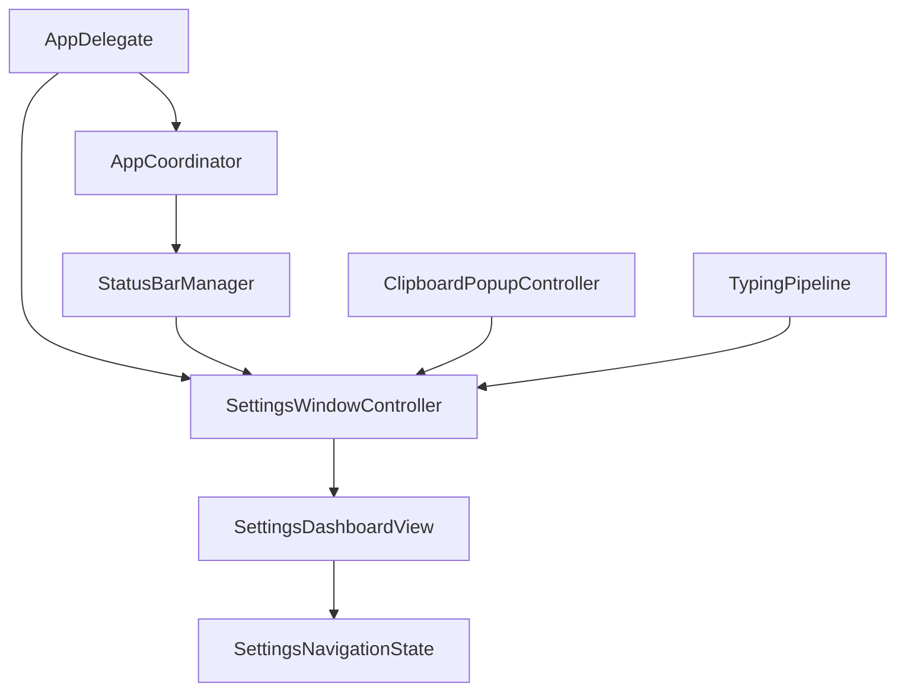
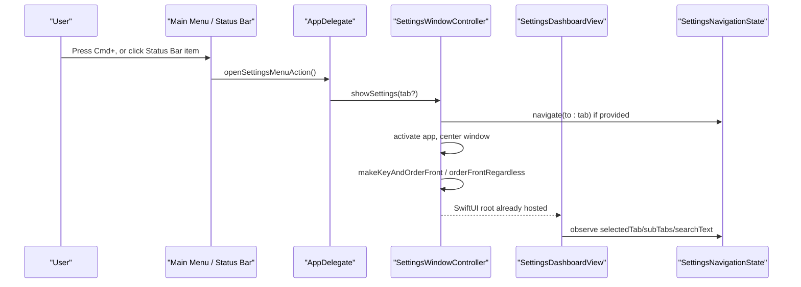
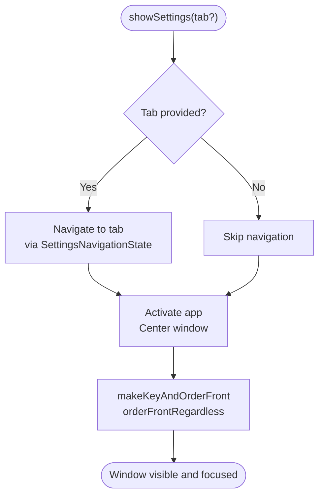
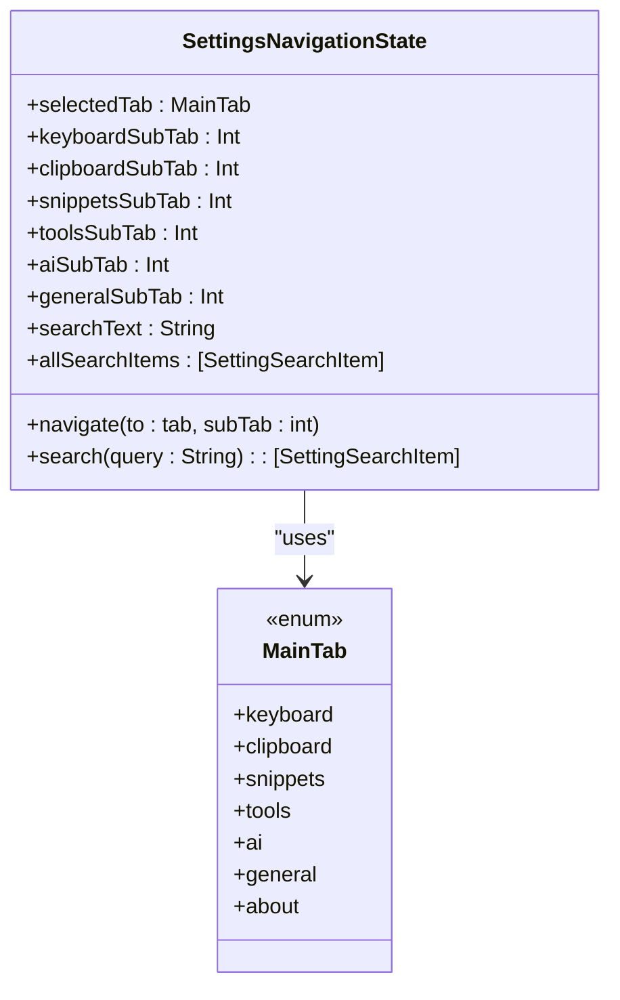
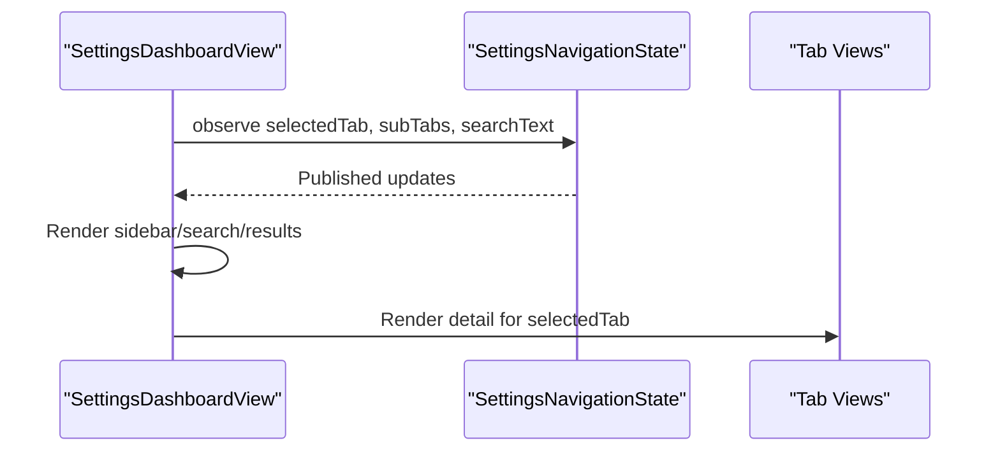
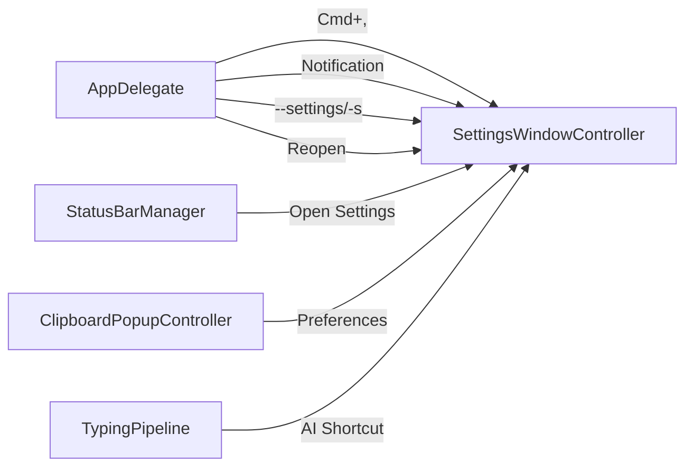
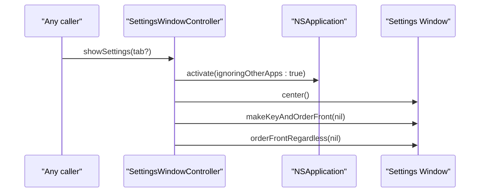
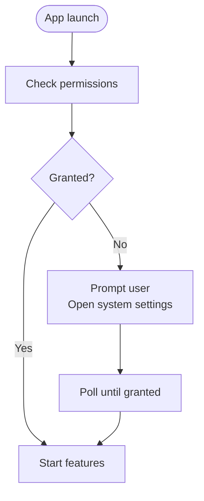
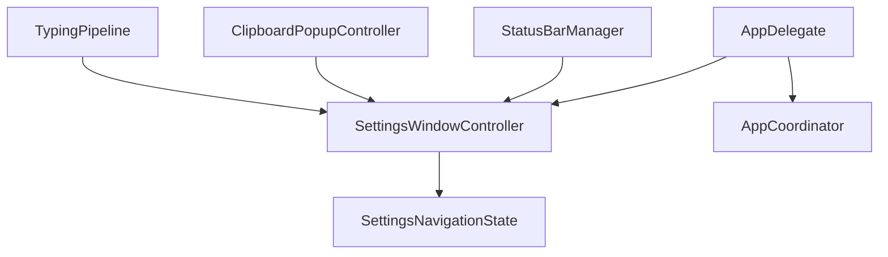

# Settings Window Controller

<cite>
**Referenced Files in This Document**
- [SettingsWindowController.swift](file://macos/skey-app/Sources/Features/Settings/SettingsWindowController.swift)
- [SettingsNavigationState.swift](file://macos/skey-app/Sources/Features/Settings/SettingsNavigationState.swift)
- [SettingsDashboardView.swift](file://macos/skey-app/Sources/Features/Settings/UI/SettingsDashboardView.swift)
- [AppDelegate.swift](file://macos/skey-app/Sources/App/AppDelegate.swift)
- [AppCoordinator.swift](file://macos/skey-app/Sources/App/AppCoordinator.swift)
- [StatusBarManager.swift](file://macos/skey-app/Sources/Shared/UI/StatusBarManager.swift)
- [ClipboardPopupController.swift](file://macos/skey-app/Sources/Features/Clipboard/UI/Controllers/ClipboardPopupController.swift)
- [TypingPipeline.swift](file://macos/skey-app/Sources/Features/Keyboard/EventHandling/Pipeline/TypingPipeline.swift)
</cite>

## Table of Contents
1. [Introduction](#introduction)
2. [Project Structure](#project-structure)
3. [Core Components](#core-components)
4. [Architecture Overview](#architecture-overview)
5. [Detailed Component Analysis](#detailed-component-analysis)
6. [Dependency Analysis](#dependency-analysis)
7. [Performance Considerations](#performance-considerations)
8. [Troubleshooting Guide](#troubleshooting-guide)
9. [Conclusion](#conclusion)

## Introduction
This document explains the SettingsWindowController and its role in managing the settings window lifecycle, presentation modes, keyboard shortcuts, focus behavior, and integration with the macOS application framework. It also covers how the controller coordinates with the main app, maintains navigation state consistency, and integrates with system features such as accessibility permissions and status bar interactions.

## Project Structure
The settings UI is implemented as a single NSWindow backed by SwiftUI. The controller owns the window instance and exposes a shared singleton for opening the settings from anywhere in the app. Navigation state is centralized to keep tabs and sub-tabs consistent across the app.

**Diagram sources**
- [AppDelegate.swift:7-30](file://macos/skey-app/Sources/App/AppDelegate.swift#L7-L30)
- [AppCoordinator.swift:22-50](file://macos/skey-app/Sources/App/AppCoordinator.swift#L22-L50)
- [StatusBarManager.swift:170-176](file://macos/skey-app/Sources/Shared/UI/StatusBarManager.swift#L170-L176)
- [ClipboardPopupController.swift:46-48](file://macos/skey-app/Sources/Features/Clipboard/UI/Controllers/ClipboardPopupController.swift#L46-L48)
- [TypingPipeline.swift:117-124](file://macos/skey-app/Sources/Features/Keyboard/EventHandling/Pipeline/TypingPipeline.swift#L117-L124)
- [SettingsWindowController.swift:9-43](file://macos/skey-app/Sources/Features/Settings/SettingsWindowController.swift#L9-L43)
- [SettingsDashboardView.swift:68-76](file://macos/skey-app/Sources/Features/Settings/UI/SettingsDashboardView.swift#L68-L76)
- [SettingsNavigationState.swift:56-90](file://macos/skey-app/Sources/Features/Settings/SettingsNavigationState.swift#L56-L90)

**Section sources**
- [SettingsWindowController.swift:9-43](file://macos/skey-app/Sources/Features/Settings/SettingsWindowController.swift#L9-L43)
- [SettingsDashboardView.swift:68-76](file://macos/skey-app/Sources/Features/Settings/UI/SettingsDashboardView.swift#L68-L76)
- [SettingsNavigationState.swift:56-90](file://macos/skey-app/Sources/Features/Settings/SettingsNavigationState.swift#L56-L90)

## Core Components
- SettingsWindowController: Singleton NSWindowController that creates and manages the settings window, hosts the SwiftUI dashboard, and provides show methods to open or bring forward the window.
- SettingsNavigationState: Centralized ObservableObject tracking selected tab, sub-tabs, and search query; used by the dashboard to render content and navigate.
- SettingsDashboardView: SwiftUI view that renders the sidebar, search, and detail panes, driven by the navigation state.
- AppDelegate: Sets up the main menu (including the settings shortcut), listens for distributed notifications, handles command-line flags, and responds to app reopen events.
- AppCoordinator: Orchestrates feature startup and permission checks; indirectly relevant because it starts services that may prompt users to open system settings.
- StatusBarManager: Provides status bar menu actions that open settings directly to specific tabs.
- ClipboardPopupController: Offers a “Preferences” action that opens the settings window.
- TypingPipeline: Intercepts key events and can open the AI settings tab via a configured shortcut.

**Section sources**
- [SettingsWindowController.swift:6-58](file://macos/skey-app/Sources/Features/Settings/SettingsWindowController.swift#L6-L58)
- [SettingsNavigationState.swift:56-90](file://macos/skey-app/Sources/Features/Settings/SettingsNavigationState.swift#L56-L90)
- [SettingsDashboardView.swift:68-261](file://macos/skey-app/Sources/Features/Settings/UI/SettingsDashboardView.swift#L68-L261)
- [AppDelegate.swift:7-30](file://macos/skey-app/Sources/App/AppDelegate.swift#L7-L30)
- [AppCoordinator.swift:22-50](file://macos/skey-app/Sources/App/AppCoordinator.swift#L22-L50)
- [StatusBarManager.swift:170-176](file://macos/skey-app/Sources/Shared/UI/StatusBarManager.swift#L170-L176)
- [ClipboardPopupController.swift:46-48](file://macos/skey-app/Sources/Features/Clipboard/UI/Controllers/ClipboardPopupController.swift#L46-L48)
- [TypingPipeline.swift:117-124](file://macos/skey-app/Sources/Features/Keyboard/EventHandling/Pipeline/TypingPipeline.swift#L117-L124)

## Architecture Overview
The settings window is a non-modal, persistent NSWindow managed by a singleton controller. Multiple entry points call into this controller to ensure a single instance is always shown or brought to the front. Navigation state is decoupled from the window so that different parts of the app can request opening to a specific tab without duplicating logic.

**Diagram sources**
- [AppDelegate.swift:32-63](file://macos/skey-app/Sources/App/AppDelegate.swift#L32-L63)
- [SettingsWindowController.swift:49-58](file://macos/skey-app/Sources/Features/Settings/SettingsWindowController.swift#L49-L58)
- [SettingsNavigationState.swift:71-90](file://macos/skey-app/Sources/Features/Settings/SettingsNavigationState.swift#L71-L90)
- [SettingsDashboardView.swift:68-76](file://macos/skey-app/Sources/Features/Settings/UI/SettingsDashboardView.swift#L68-L76)

## Detailed Component Analysis

### SettingsWindowController: Lifecycle and Presentation
- Window creation: Initializes an NSWindow with resizable style, hidden title bar, autosaved frame, minimum size, and a visual effect background. Hosts a SwiftUI view via NSHostingView.
- Singleton pattern: Exposes a shared instance to avoid multiple windows.
- Show flow: When showing, optionally navigates to a specified tab via SettingsNavigationState, activates the app, centers the window, and brings it to the front using both makeKeyAndOrderFront and orderFrontRegardless to ensure visibility and focus.
- Modal vs non-modal: The window is presented as a standard floating window (non-modal). There is no modal presentation mode implemented in the controller.
- Keyboard shortcuts: The controller itself does not handle global shortcuts; shortcuts are wired in AppDelegate (Cmd+,) and other components (e.g., TypingPipeline for AI tab).
- Cleanup: No explicit cleanup is performed on close; the window remains available for reuse.

**Diagram sources**
- [SettingsWindowController.swift:49-58](file://macos/skey-app/Sources/Features/Settings/SettingsWindowController.swift#L49-L58)

**Section sources**
- [SettingsWindowController.swift:9-43](file://macos/skey-app/Sources/Features/Settings/SettingsWindowController.swift#L9-L43)
- [SettingsWindowController.swift:49-58](file://macos/skey-app/Sources/Features/Settings/SettingsWindowController.swift#L49-L58)

### SettingsNavigationState: Tab and Sub-tab Coordination
- Centralizes selected tab and per-tab sub-tab indices.
- Provides a navigate method that sets the active tab and resets search text.
- Supplies a comprehensive search index mapping settings items to tabs and sub-tabs, enabling quick navigation from the sidebar search.

**Diagram sources**
- [SettingsNavigationState.swift:56-90](file://macos/skey-app/Sources/Features/Settings/SettingsNavigationState.swift#L56-L90)
- [SettingsDashboardView.swift:6-14](file://macos/skey-app/Sources/Features/Settings/UI/SettingsDashboardView.swift#L6-L14)

**Section sources**
- [SettingsNavigationState.swift:56-90](file://macos/skey-app/Sources/Features/Settings/SettingsNavigationState.swift#L56-L90)
- [SettingsNavigationState.swift:92-680](file://macos/skey-app/Sources/Features/Settings/SettingsNavigationState.swift#L92-L680)

### SettingsDashboardView: UI Driven by State
- Renders a split view with a searchable sidebar and a detail pane.
- Uses @ObservedObject for localization and navigation state to reactively update UI.
- Switches detail content based on selected tab, rendering corresponding tab views.

**Diagram sources**
- [SettingsDashboardView.swift:68-261](file://macos/skey-app/Sources/Features/Settings/UI/SettingsDashboardView.swift#L68-L261)
- [SettingsNavigationState.swift:56-90](file://macos/skey-app/Sources/Features/Settings/SettingsNavigationState.swift#L56-L90)

**Section sources**
- [SettingsDashboardView.swift:68-261](file://macos/skey-app/Sources/Features/Settings/UI/SettingsDashboardView.swift#L68-L261)

### Integration Points and Entry Points
- Main menu shortcut: Cmd+, triggers opening settings via AppDelegate.
- Distributed notification: Listening for a custom notification to open settings.
- Command-line flag: Launching with a flag opens settings immediately.
- App reopen: Reopening the app shows settings.
- Status bar: Opens settings to specific tabs (keyboard, snippets).
- Clipboard popup: Preferences action opens settings.
- Keyboard pipeline: A configured shortcut opens AI settings tab.

**Diagram sources**
- [AppDelegate.swift:12-22](file://macos/skey-app/Sources/App/AppDelegate.swift#L12-L22)
- [AppDelegate.swift:32-67](file://macos/skey-app/Sources/App/AppDelegate.swift#L32-L67)
- [StatusBarManager.swift:170-176](file://macos/skey-app/Sources/Shared/UI/StatusBarManager.swift#L170-L176)
- [ClipboardPopupController.swift:46-48](file://macos/skey-app/Sources/Features/Clipboard/UI/Controllers/ClipboardPopupController.swift#L46-L48)
- [TypingPipeline.swift:117-124](file://macos/skey-app/Sources/Features/Keyboard/EventHandling/Pipeline/TypingPipeline.swift#L117-L124)

**Section sources**
- [AppDelegate.swift:12-22](file://macos/skey-app/Sources/App/AppDelegate.swift#L12-L22)
- [AppDelegate.swift:32-67](file://macos/skey-app/Sources/App/AppDelegate.swift#L32-L67)
- [StatusBarManager.swift:170-176](file://macos/skey-app/Sources/Shared/UI/StatusBarManager.swift#L170-L176)
- [ClipboardPopupController.swift:46-48](file://macos/skey-app/Sources/Features/Clipboard/UI/Controllers/ClipboardPopupController.swift#L46-L48)
- [TypingPipeline.swift:117-124](file://macos/skey-app/Sources/Features/Keyboard/EventHandling/Pipeline/TypingPipeline.swift#L117-L124)

### Focus Management and Window Events
- Bringing to front: The controller uses makeKeyAndOrderFront and orderFrontRegardless to ensure the window becomes key and visible.
- App activation: Activates the app to ensure focus transitions correctly when opening from background.
- Reopen handling: On app reopen, settings are shown automatically.

**Diagram sources**
- [SettingsWindowController.swift:49-58](file://macos/skey-app/Sources/Features/Settings/SettingsWindowController.swift#L49-L58)
- [AppDelegate.swift:65-67](file://macos/skey-app/Sources/App/AppDelegate.swift#L65-L67)

**Section sources**
- [SettingsWindowController.swift:49-58](file://macos/skey-app/Sources/Features/Settings/SettingsWindowController.swift#L49-L58)
- [AppDelegate.swift:65-67](file://macos/skey-app/Sources/App/AppDelegate.swift#L65-L67)

### Accessibility and System Integration
- Permissions prompting: During app start, the coordinator checks permissions and can open system Accessibility and Input Monitoring settings if needed. While not part of the settings window directly, these flows often guide users to enable required capabilities before the keyboard engine runs.
- Status bar actions: Provide direct links to open system settings for input monitoring and accessibility.

**Diagram sources**
- [AppCoordinator.swift:58-75](file://macos/skey-app/Sources/App/AppCoordinator.swift#L58-L75)
- [StatusBarManager.swift:259-265](file://macos/skey-app/Sources/Shared/UI/StatusBarManager.swift#L259-L265)

**Section sources**
- [AppCoordinator.swift:58-75](file://macos/skey-app/Sources/App/AppCoordinator.swift#L58-L75)
- [StatusBarManager.swift:259-265](file://macos/skey-app/Sources/Shared/UI/StatusBarManager.swift#L259-L265)

## Dependency Analysis
- SettingsWindowController depends on:
  - AppKit for window management.
  - SwiftUI for hosting the dashboard.
  - SettingsNavigationState for tab/sub-tab coordination.
- AppDelegate depends on:
  - SettingsWindowController to open settings via menu, notification, CLI flag, and reopen.
  - AppCoordinator to start features and manage permissions.
- StatusBarManager depends on:
  - SettingsWindowController to open settings to specific tabs.
- ClipboardPopupController depends on:
  - SettingsWindowController to open preferences.
- TypingPipeline depends on:
  - SettingsWindowController to open AI settings via shortcut.

**Diagram sources**
- [SettingsWindowController.swift:49-58](file://macos/skey-app/Sources/Features/Settings/SettingsWindowController.swift#L49-L58)
- [AppDelegate.swift:12-22](file://macos/skey-app/Sources/App/AppDelegate.swift#L12-L22)
- [AppCoordinator.swift:22-50](file://macos/skey-app/Sources/App/AppCoordinator.swift#L22-L50)
- [StatusBarManager.swift:170-176](file://macos/skey-app/Sources/Shared/UI/StatusBarManager.swift#L170-L176)
- [ClipboardPopupController.swift:46-48](file://macos/skey-app/Sources/Features/Clipboard/UI/Controllers/ClipboardPopupController.swift#L46-L48)
- [TypingPipeline.swift:117-124](file://macos/skey-app/Sources/Features/Keyboard/EventHandling/Pipeline/TypingPipeline.swift#L117-L124)

**Section sources**
- [SettingsWindowController.swift:49-58](file://macos/skey-app/Sources/Features/Settings/SettingsWindowController.swift#L49-L58)
- [AppDelegate.swift:12-22](file://macos/skey-app/Sources/App/AppDelegate.swift#L12-L22)
- [AppCoordinator.swift:22-50](file://macos/skey-app/Sources/App/AppCoordinator.swift#L22-L50)
- [StatusBarManager.swift:170-176](file://macos/skey-app/Sources/Shared/UI/StatusBarManager.swift#L170-L176)
- [ClipboardPopupController.swift:46-48](file://macos/skey-app/Sources/Features/Clipboard/UI/Controllers/ClipboardPopupController.swift#L46-L48)
- [TypingPipeline.swift:117-124](file://macos/skey-app/Sources/Features/Keyboard/EventHandling/Pipeline/TypingPipeline.swift#L117-L124)

## Performance Considerations
- Window reuse: Using a singleton ensures only one settings window exists, minimizing memory overhead.
- Non-modal presentation: Avoids blocking the main thread or other UI; suitable for frequent access.
- SwiftUI reactivity: Changes in SettingsNavigationState trigger minimal UI updates due to fine-grained publishing.
- Event-driven openings: Shortcuts and menu actions quickly surface the window without heavy initialization costs since the window is created once at first use.

[No sources needed since this section provides general guidance]

## Troubleshooting Guide
- Settings not appearing:
  - Ensure the app is activated before bringing the window to front; the controller calls NSApp.activate.
  - Verify no other window is covering the settings window; the controller uses orderFrontRegardless to prioritize visibility.
- Shortcut not working:
  - Confirm the main menu includes the settings item with the expected key equivalent.
  - For AI tab shortcut, verify the shortcut is configured and handled in the typing pipeline.
- Opening from background:
  - Use the distributed notification or command-line flag to open settings reliably from external triggers.
- Permissions prompts:
  - If keyboard features do not work, check that Accessibility and Input Monitoring permissions are granted; the app can open system settings to resolve this.

**Section sources**
- [SettingsWindowController.swift:49-58](file://macos/skey-app/Sources/Features/Settings/SettingsWindowController.swift#L49-L58)
- [AppDelegate.swift:32-67](file://macos/skey-app/Sources/App/AppDelegate.swift#L32-L67)
- [TypingPipeline.swift:117-124](file://macos/skey-app/Sources/Features/Keyboard/EventHandling/Pipeline/TypingPipeline.swift#L117-L124)
- [AppCoordinator.swift:58-75](file://macos/skey-app/Sources/App/AppCoordinator.swift#L58-L75)

## Conclusion
The SettingsWindowController provides a robust, singleton-managed settings window integrated deeply with the macOS app lifecycle. It offers flexible entry points (menu, status bar, clipboard popup, keyboard shortcuts), maintains consistent navigation state through a central observable, and ensures reliable focus and visibility. While it does not implement modal presentation or explicit cleanup, its design supports efficient reuse and seamless integration with the rest of the application.

[No sources needed since this section summarizes without analyzing specific files]