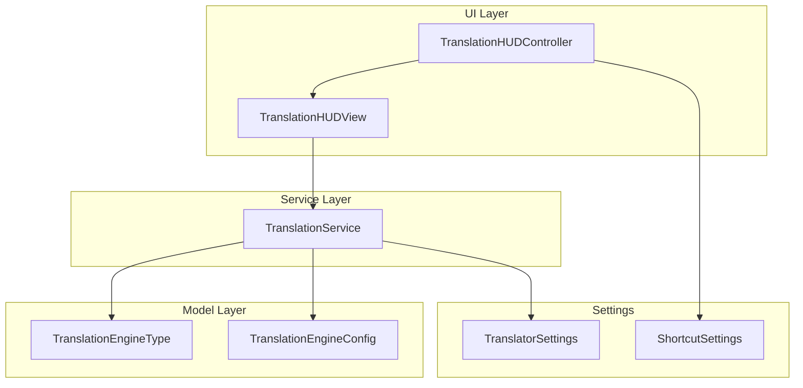
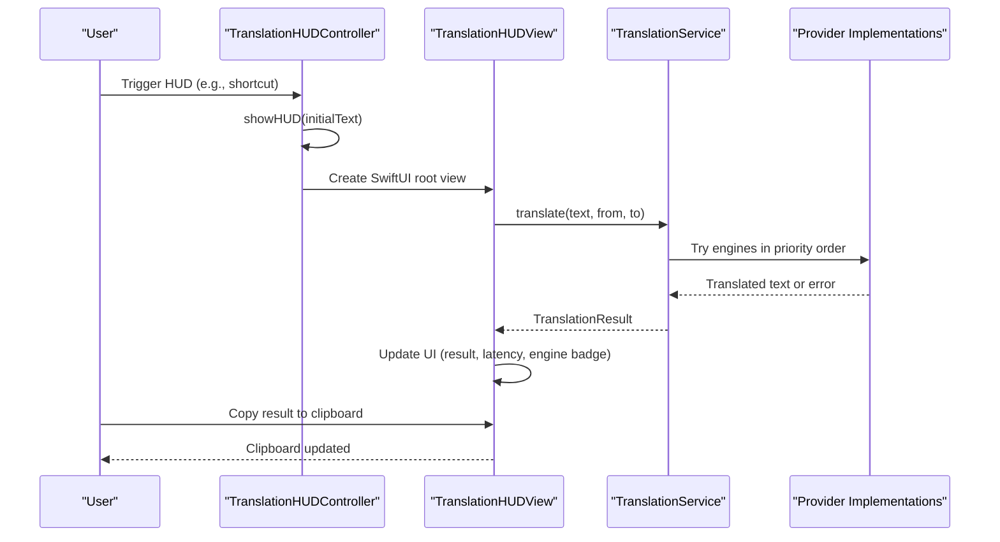
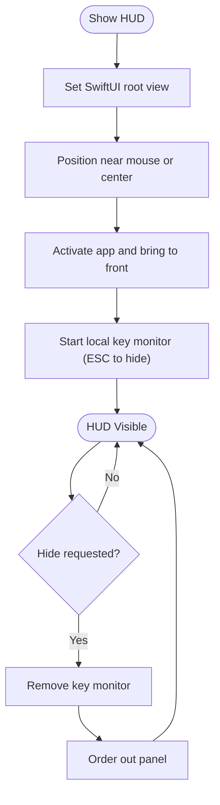
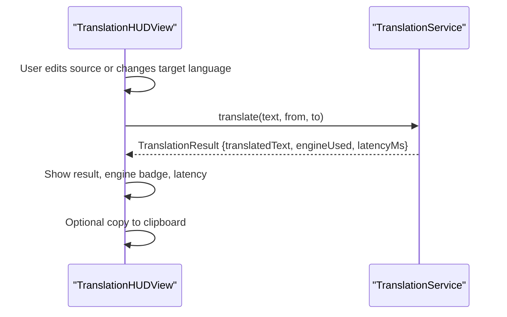
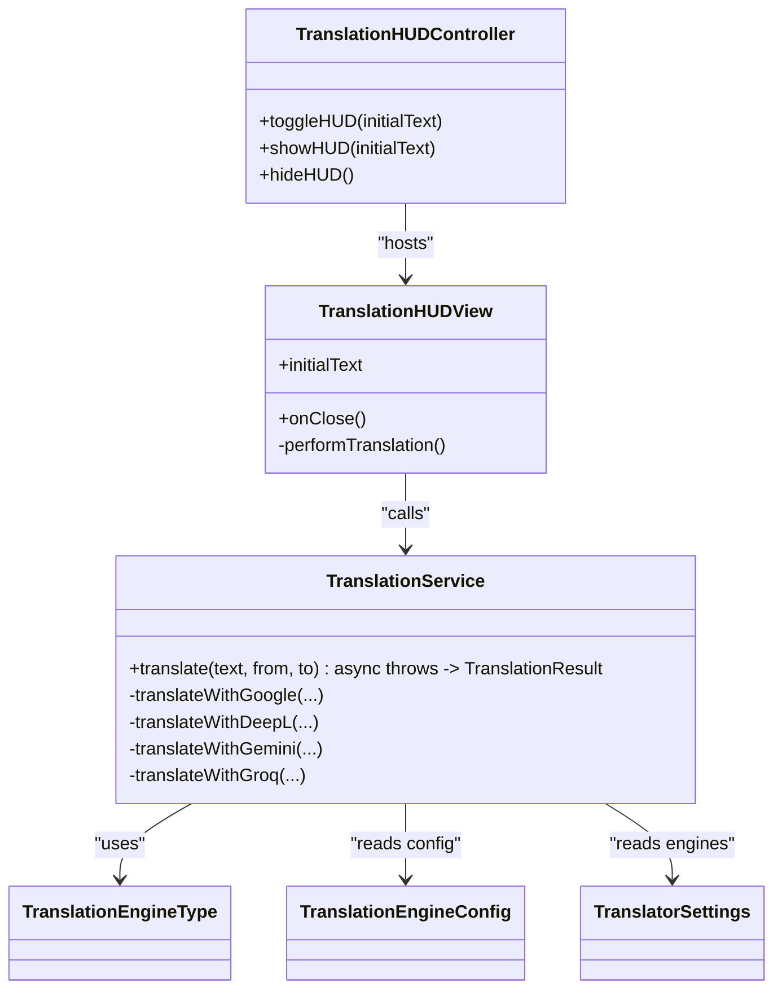

# Translation HUD

<cite>
**Referenced Files in This Document**
- [TranslationHUDController.swift](file://macos/skey-app/Sources/Features/Translator/UI/TranslationHUDController.swift)
- [TranslationHUDView.swift](file://macos/skey-app/Sources/Features/Translator/UI/TranslationHUDView.swift)
- [TranslationService.swift](file://macos/skey-app/Sources/Features/Translator/Services/TranslationService.swift)
- [TranslationEngine.swift](file://macos/skey-app/Sources/Features/Translator/Models/TranslationEngine.swift)
- [TranslatorSettings.swift](file://macos/skey-app/Sources/Shared/Settings/Modules/TranslatorSettings.swift)
- [ShortcutSettings.swift](file://macos/skey-app/Sources/Shared/Settings/Modules/ShortcutSettings.swift)
</cite>

## Table of Contents
1. [Introduction](#introduction)
2. [Project Structure](#project-structure)
3. [Core Components](#core-components)
4. [Architecture Overview](#architecture-overview)
5. [Detailed Component Analysis](#detailed-component-analysis)
6. [Dependency Analysis](#dependency-analysis)
7. [Performance Considerations](#performance-considerations)
8. [Troubleshooting Guide](#troubleshooting-guide)
9. [Conclusion](#conclusion)
10. [Appendices](#appendices)

## Introduction
This document explains the Translation Heads-Up Display (HUD) that appears when translating selected text. It covers:
- Window management and floating panel behavior via TranslationHUDController
- SwiftUI interface and user interactions via TranslationHUDView
- Integration with TranslationService for API calls to multiple translation providers (Google, DeepL, Gemini, Groq)
- Animation and visibility lifecycle
- Error handling for network failures
- Keyboard shortcuts and quick access
- Configuration of translation engines, customization of HUD appearance, and how to implement new translation providers

## Project Structure
The Translation HUD feature is organized under the Translator feature module with clear separation between UI, service, and model layers:
- UI layer: TranslationHUDController (AppKit window controller), TranslationHUDView (SwiftUI view)
- Service layer: TranslationService (networking, provider orchestration)
- Model layer: TranslationEngineType and TranslationEngineConfig (provider definitions and configuration)
- Settings: TranslatorSettings (engine list, target language, auto-detect source)
- Shortcuts: ShortcutSettings (global shortcut presets; translation HUD can be triggered by app-wide shortcuts)



**Diagram sources**
- [TranslationHUDController.swift:58-129](file://macos/skey-app/Sources/Features/Translator/UI/TranslationHUDController.swift#L58-L129)
- [TranslationHUDView.swift:6-383](file://macos/skey-app/Sources/Features/Translator/UI/TranslationHUDView.swift#L6-L383)
- [TranslationService.swift:33-146](file://macos/skey-app/Sources/Features/Translator/Services/TranslationService.swift#L33-L146)
- [TranslationEngine.swift:6-86](file://macos/skey-app/Sources/Features/Translator/Models/TranslationEngine.swift#L6-L86)
- [TranslatorSettings.swift:6-112](file://macos/skey-app/Sources/Shared/Settings/Modules/TranslatorSettings.swift#L6-L112)
- [ShortcutSettings.swift:20-330](file://macos/skey-app/Sources/Shared/Settings/Modules/ShortcutSettings.swift#L20-L330)

**Section sources**
- [TranslationHUDController.swift:58-129](file://macos/skey-app/Sources/Features/Translator/UI/TranslationHUDController.swift#L58-L129)
- [TranslationHUDView.swift:6-383](file://macos/skey-app/Sources/Features/Translator/UI/TranslationHUDView.swift#L6-L383)
- [TranslationService.swift:33-146](file://macos/skey-app/Sources/Features/Translator/Services/TranslationService.swift#L33-L146)
- [TranslationEngine.swift:6-86](file://macos/skey-app/Sources/Features/Translator/Models/TranslationEngine.swift#L6-L86)
- [TranslatorSettings.swift:6-112](file://macos/skey-app/Sources/Shared/Settings/Modules/TranslatorSettings.swift#L6-L112)
- [ShortcutSettings.swift:20-330](file://macos/skey-app/Sources/Shared/Settings/Modules/ShortcutSettings.swift#L20-L330)

## Core Components
- TranslationHUDPanel: A borderless, floating NSPanel configured to appear above other windows, movable, and usable across spaces.
- TranslationHUDController: Manages showing/hiding the HUD, positioning near the mouse cursor, activating the app, and monitoring ESC to close.
- TranslationHUDView: SwiftUI view providing input fields, language selection, copy-to-clipboard, error display, and translation triggers.
- TranslationService: Orchestrates translation requests using a priority-ordered list of enabled engines, with fallback to Google NMT if all fail.
- TranslationEngineType / TranslationEngineConfig: Enumerates supported providers and their runtime configuration (enabled state, API keys).
- TranslatorSettings: Persists engine order, enabled flags, API keys, default target language, and auto-detect preference.
- ShortcutSettings: Provides global shortcut presets used elsewhere in the app to trigger features like AI or clipboard; translation HUD can be invoked via app-level shortcuts.

**Section sources**
- [TranslationHUDController.swift:6-129](file://macos/skey-app/Sources/Features/Translator/UI/TranslationHUDController.swift#L6-L129)
- [TranslationHUDView.swift:6-383](file://macos/skey-app/Sources/Features/Translator/UI/TranslationHUDView.swift#L6-L383)
- [TranslationService.swift:6-146](file://macos/skey-app/Sources/Features/Translator/Services/TranslationService.swift#L6-L146)
- [TranslationEngine.swift:6-86](file://macos/skey-app/Sources/Features/Translator/Models/TranslationEngine.swift#L6-L86)
- [TranslatorSettings.swift:6-112](file://macos/skey-app/Sources/Shared/Settings/Modules/TranslatorSettings.swift#L6-L112)
- [ShortcutSettings.swift:20-330](file://macos/skey-app/Sources/Shared/Settings/Modules/ShortcutSettings.swift#L20-L330)

## Architecture Overview
The Translation HUD follows a layered architecture:
- UI Layer: The controller creates and manages a floating panel hosting a SwiftUI view.
- Service Layer: The view calls TranslationService to perform translations asynchronously.
- Provider Abstraction: The service iterates through configured engines in priority order, invoking specific implementations per provider.
- Settings: Engine configuration and defaults are read from TranslatorSettings.



**Diagram sources**
- [TranslationHUDController.swift:74-105](file://macos/skey-app/Sources/Features/Translator/UI/TranslationHUDController.swift#L74-L105)
- [TranslationHUDView.swift:355-382](file://macos/skey-app/Sources/Features/Translator/UI/TranslationHUDView.swift#L355-L382)
- [TranslationService.swift:49-146](file://macos/skey-app/Sources/Features/Translator/Services/TranslationService.swift#L49-L146)

## Detailed Component Analysis

### TranslationHUDController: Window Management and Visibility
Responsibilities:
- Creates a floating, borderless panel with utility window behavior and shadow.
- Centers or positions the panel near the mouse location on the active screen.
- Activates the application and brings the panel to front.
- Monitors local key events to hide the HUD on ESC.
- Toggles visibility via toggleHUD(show/hide).

Key behaviors:
- Panel style: borderless, non-activating panel, floating level, movable, supports full-screen auxiliary and joining all spaces.
- Keyboard support: Enables standard editing shortcuts (Cmd+A/C/V/X/Z) within the panel.
- Lifecycle: showHUD sets content view, positions, activates app, orders front, and starts keyboard monitor; hideHUD removes monitor and hides panel.



**Diagram sources**
- [TranslationHUDController.swift:82-129](file://macos/skey-app/Sources/Features/Translator/UI/TranslationHUDController.swift#L82-L129)

**Section sources**
- [TranslationHUDController.swift:6-129](file://macos/skey-app/Sources/Features/Translator/UI/TranslationHUDController.swift#L6-L129)

### TranslationHUDView: SwiftUI Interface and Interactions
Responsibilities:
- Displays source text input, language selectors (auto/source/target), swap button, and translated output.
- Shows loading indicator while translating, and error messages on failure.
- Copies translated text to clipboard with visual feedback.
- Triggers translation on paste, change of target language, or explicit “Translate Now” action.
- Integrates with settings to read supported languages and localization strings.

Key behaviors:
- Auto-focuses input on appear and auto-translates if initial text is provided.
- Uses TranslationService.shared.translate(...) asynchronously and updates UI on main thread.
- Displays engine badge and latency for the successful provider.



**Diagram sources**
- [TranslationHUDView.swift:355-382](file://macos/skey-app/Sources/Features/Translator/UI/TranslationHUDView.swift#L355-L382)
- [TranslationService.swift:49-146](file://macos/skey-app/Sources/Features/Translator/Services/TranslationService.swift#L49-L146)

**Section sources**
- [TranslationHUDView.swift:6-383](file://macos/skey-app/Sources/Features/Translator/UI/TranslationHUDView.swift#L6-L383)

### TranslationService: Multi-Provider Orchestration and Fallback
Responsibilities:
- Reads enabled engines from TranslatorSettings.engines in priority order.
- Attempts each provider sequentially until one succeeds.
- Falls back to Google NMT if all configured engines fail.
- Measures latency and returns TranslationResult with metadata.

Provider implementations:
- Google Mobile NMT: Scrapes mobile translation page without requiring an API key.
- DeepL API: POST to official or free endpoint based on API key suffix.
- Gemini: Calls generative language API with a prompt instructing pure translation output.
- Groq: Uses OpenAI-compatible chat completions endpoint with Llama model.

Error handling:
- Each provider throws URLError variants on network or parsing failures.
- Service catches errors and proceeds to next engine; final error propagated if all fail.

```mermaid
flowchart TD
Start([translate(text, from, to)]) --> Trim["Trim whitespace"]
Trim --> Empty{"Empty?"}
Empty --> |Yes| ReturnEmpty["Return empty result"]
Empty --> |No| LoadEngines["Load enabled engines from settings"]
LoadEngines --> Loop{"For each engine"}
Loop --> TryProvider["Call provider implementation"]
TryProvider --> Success{"Success?"}
Success --> |Yes| Measure["Measure latency"]
Measure --> ReturnResult["Return TranslationResult"]
Success --> |No| Next["Try next engine"]
Next --> Loop
Loop --> |All failed| Fallback["Fallback to Google NMT"]
Fallback --> FallbackOk{"Success?"}
FallbackOk --> |Yes| ReturnResult
FallbackOk --> |No| ThrowError["Throw last error"]
```

**Diagram sources**
- [TranslationService.swift:49-146](file://macos/skey-app/Sources/Features/Translator/Services/TranslationService.swift#L49-L146)
- [TranslationService.swift:150-313](file://macos/skey-app/Sources/Features/Translator/Services/TranslationService.swift#L150-L313)

**Section sources**
- [TranslationService.swift:6-313](file://macos/skey-app/Sources/Features/Translator/Services/TranslationService.swift#L6-L313)

### Models and Settings: Engines and Configuration
- TranslationEngineType defines available providers with display names, icons, and whether they require API keys.
- TranslationEngineConfig holds per-engine enablement and API keys; includes a default list.
- TranslatorSettings persists engine list, target language, and auto-detect preferences; supports reordering and toggling.

Configuration examples:
- Enable/disable engines and set API keys via TranslatorSettings.updateApiKey(for:type:key:) and toggleEngine(for:type:isEnabled:).
- Reorder engine priority via moveEngine methods to influence which provider is tried first.

**Section sources**
- [TranslationEngine.swift:6-86](file://macos/skey-app/Sources/Features/Translator/Models/TranslationEngine.swift#L6-L86)
- [TranslatorSettings.swift:6-112](file://macos/skey-app/Sources/Shared/Settings/Modules/TranslatorSettings.swift#L6-L112)

## Dependency Analysis
High-level dependencies:
- TranslationHUDController depends on AppKit NSPanel/NSWindowController and SwiftUI NSHostingView.
- TranslationHUDView depends on TranslationService and localized strings.
- TranslationService depends on URLSession and provider-specific endpoints.
- All components read/write TranslatorSettings for configuration persistence.



**Diagram sources**
- [TranslationHUDController.swift:58-129](file://macos/skey-app/Sources/Features/Translator/UI/TranslationHUDController.swift#L58-L129)
- [TranslationHUDView.swift:6-383](file://macos/skey-app/Sources/Features/Translator/UI/TranslationHUDView.swift#L6-L383)
- [TranslationService.swift:33-146](file://macos/skey-app/Sources/Features/Translator/Services/TranslationService.swift#L33-L146)
- [TranslationEngine.swift:6-86](file://macos/skey-app/Sources/Features/Translator/Models/TranslationEngine.swift#L6-L86)
- [TranslatorSettings.swift:6-112](file://macos/skey-app/Sources/Shared/Settings/Modules/TranslatorSettings.swift#L6-L112)

**Section sources**
- [TranslationHUDController.swift:58-129](file://macos/skey-app/Sources/Features/Translator/UI/TranslationHUDController.swift#L58-L129)
- [TranslationHUDView.swift:6-383](file://macos/skey-app/Sources/Features/Translator/UI/TranslationHUDView.swift#L6-L383)
- [TranslationService.swift:33-146](file://macos/skey-app/Sources/Features/Translator/Services/TranslationService.swift#L33-L146)
- [TranslationEngine.swift:6-86](file://macos/skey-app/Sources/Features/Translator/Models/TranslationEngine.swift#L6-L86)
- [TranslatorSettings.swift:6-112](file://macos/skey-app/Sources/Shared/Settings/Modules/TranslatorSettings.swift#L6-L112)

## Performance Considerations
- Network timeouts: TranslationService uses short request/resource timeouts to keep HUD responsive.
- Sequential provider attempts: Only one provider is called at a time; consider parallel attempts if low-latency is critical.
- Fallback strategy: Final fallback to Google ensures reliability but may add latency if earlier providers fail.
- UI updates: Results are marshaled to the main actor to avoid UI race conditions.

[No sources needed since this section provides general guidance]

## Troubleshooting Guide
Common issues and resolutions:
- No translation result: Check that at least one engine is enabled in TranslatorSettings and that required API keys are set for providers that need them.
- Network errors: Verify internet connectivity; deep links and APIs may block automated requests; ensure correct endpoints and headers.
- Parsing errors: Some providers return unexpected formats; check response parsing logic and update decoding accordingly.
- HUD not closing: Ensure ESC key handler is active; verify no conflicting global hotkeys intercept ESC.

**Section sources**
- [TranslationService.swift:150-313](file://macos/skey-app/Sources/Features/Translator/Services/TranslationService.swift#L150-L313)
- [TranslationHUDController.swift:116-129](file://macos/skey-app/Sources/Features/Translator/UI/TranslationHUDController.swift#L116-L129)

## Conclusion
The Translation HUD provides a fast, floating interface for translating selected text with robust multi-provider support and graceful fallbacks. Its modular design allows easy addition of new providers, customization of appearance, and integration with app-wide shortcuts. Users benefit from immediate feedback, copy-to-clipboard convenience, and resilient translation even under network failures.

[No sources needed since this section summarizes without analyzing specific files]

## Appendices

### How the Floating HUD Appears When Translating Selected Text
- Invocation: Typically triggered by an app-wide shortcut that calls TranslationHUDController.toggleHUD(initialText:) with the selected text.
- Positioning: The controller places the panel near the mouse cursor on the current screen for ergonomic access.
- Content: The SwiftUI view immediately focuses the input field and optionally starts translation if initial text is provided.

**Section sources**
- [TranslationHUDController.swift:74-105](file://macos/skey-app/Sources/Features/Translator/UI/TranslationHUDController.swift#L74-L105)
- [TranslationHUDView.swift:96-102](file://macos/skey-app/Sources/Features/Translator/UI/TranslationHUDView.swift#L96-L102)

### Handling Multiple Translation Providers
- Priority order: Read from TranslatorSettings.engines; higher-priority engines are attempted first.
- Required keys: Providers like DeepL, Gemini, and Groq skip if no API key is configured.
- Fallback: If all configured engines fail, Google NMT is attempted as a universal safety net.

**Section sources**
- [TranslationService.swift:66-146](file://macos/skey-app/Sources/Features/Translator/Services/TranslationService.swift#L66-L146)
- [TranslatorSettings.swift:36-51](file://macos/skey-app/Sources/Shared/Settings/Modules/TranslatorSettings.swift#L36-L51)

### Seamless Text Replacement
- Copy to clipboard: The view copies translated text to the system clipboard with visual feedback.
- Replace workflow: Integrate with your app’s selection replacement flow by reading the clipboard after translation and programmatically replacing the original selection in the target app.

**Section sources**
- [TranslationHUDView.swift:270-285](file://macos/skey-app/Sources/Features/Translator/UI/TranslationHUDView.swift#L270-L285)

### Animation System for HUD Appearance/Disappearance
- Visibility: The controller uses makeKeyAndOrderFront/orderOut to show/hide the panel.
- Behavior: The panel is configured as a floating utility window with shadows and transparency for a native HUD feel.
- Note: No custom animation durations are applied; macOS handles panel transitions natively.

**Section sources**
- [TranslationHUDController.swift:14-25](file://macos/skey-app/Sources/Features/Translator/UI/TranslationHUDController.swift#L14-L25)
- [TranslationHUDController.swift:100-113](file://macos/skey-app/Sources/Features/Translator/UI/TranslationHUDController.swift#L100-L113)

### Keyboard Shortcuts for Quick Access
- Global shortcuts: Configure via ShortcutSettings presets for other features; translation HUD can be invoked by app-level shortcuts that call the controller.
- In-HUD shortcuts: ESC closes the HUD; standard editing shortcuts (Cmd+A/C/V/X/Z) work inside the panel.

**Section sources**
- [ShortcutSettings.swift:41-67](file://macos/skey-app/Sources/Shared/Settings/Modules/ShortcutSettings.swift#L41-L67)
- [TranslationHUDController.swift:31-53](file://macos/skey-app/Sources/Features/Translator/UI/TranslationHUDController.swift#L31-L53)
- [TranslationHUDController.swift:116-129](file://macos/skey-app/Sources/Features/Translator/UI/TranslationHUDController.swift#L116-L129)

### Configuring Translation Engines
- Enable/disable engines and reorder priority via TranslatorSettings methods.
- Set API keys for providers that require them using updateApiKey.
- Default target language and auto-detect source are configurable.

**Section sources**
- [TranslatorSettings.swift:36-112](file://macos/skey-app/Sources/Shared/Settings/Modules/TranslatorSettings.swift#L36-L112)

### Customizing HUD Appearance
- Panel styling: Borderless, floating, shadowed, movable, and transparent background.
- SwiftUI styling: Rounded corners, separators, badges, and color accents are defined in TranslationHUDView.

**Section sources**
- [TranslationHUDController.swift:6-25](file://macos/skey-app/Sources/Features/Translator/UI/TranslationHUDController.swift#L6-L25)
- [TranslationHUDView.swift:42-103](file://macos/skey-app/Sources/Features/Translator/UI/TranslationHUDView.swift#L42-L103)

### Implementing a New Translation Provider
Steps:
1. Add a new case to TranslationEngineType with display name, icon, and badge color.
2. Implement a private method in TranslationService to call the new provider’s API.
3. Wire the new case into the cascade switch so it is attempted in priority order.
4. Optionally require an API key; handle missing keys by skipping the provider.
5. Test with various inputs and network conditions; ensure parsing matches expected JSON/HTML structure.

**Section sources**
- [TranslationEngine.swift:6-61](file://macos/skey-app/Sources/Features/Translator/Models/TranslationEngine.swift#L6-L61)
- [TranslationService.swift:73-113](file://macos/skey-app/Sources/Features/Translator/Services/TranslationService.swift#L73-L113)