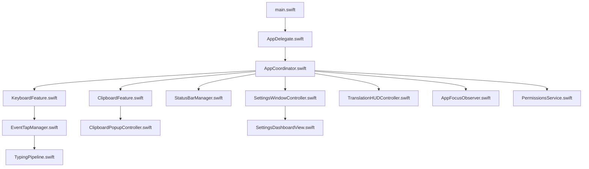
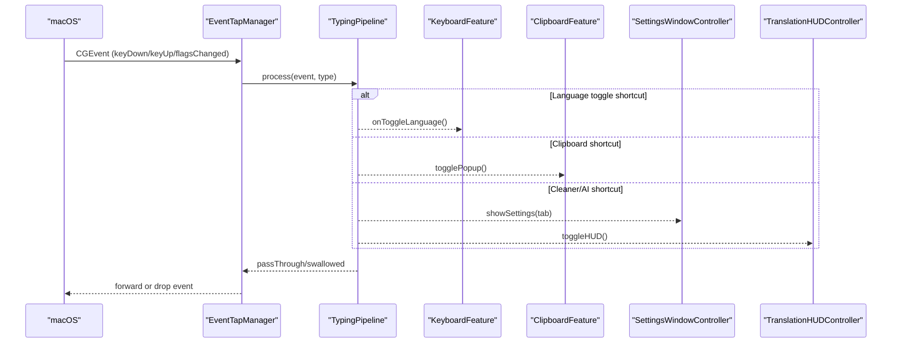
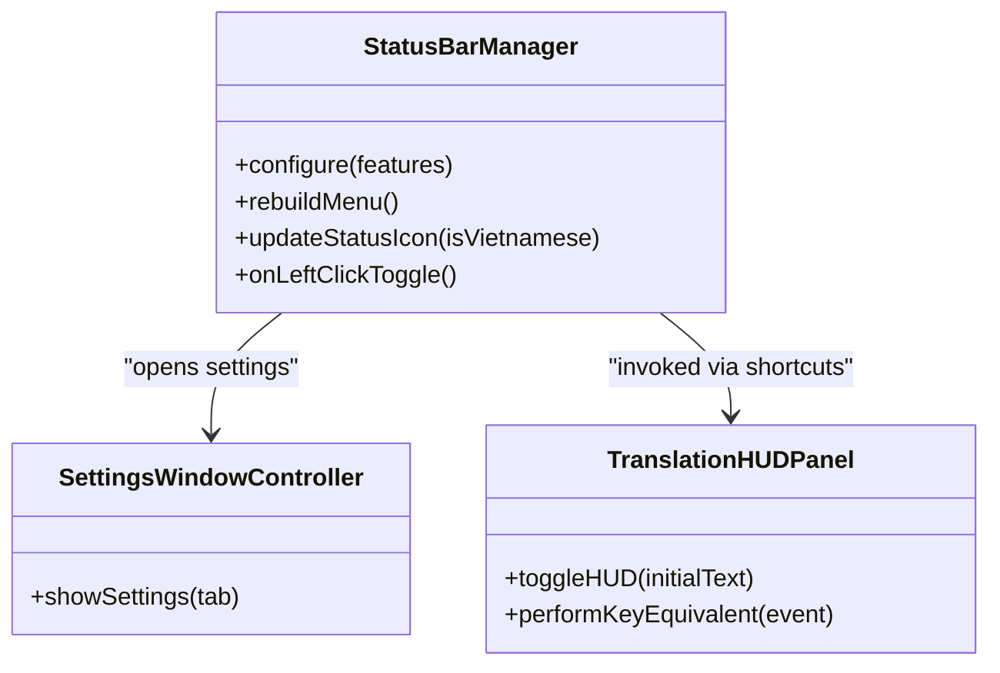
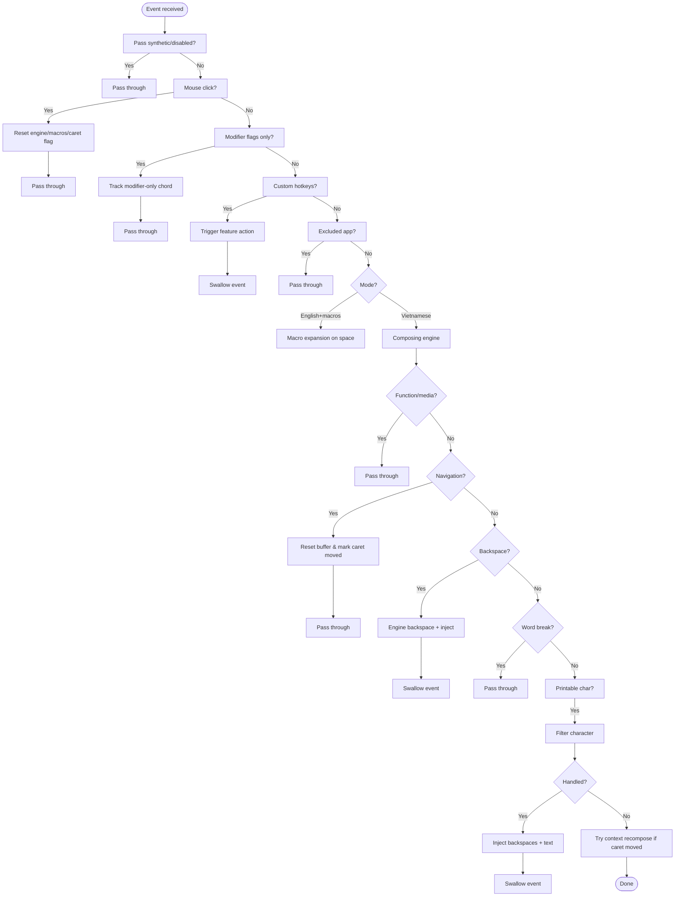
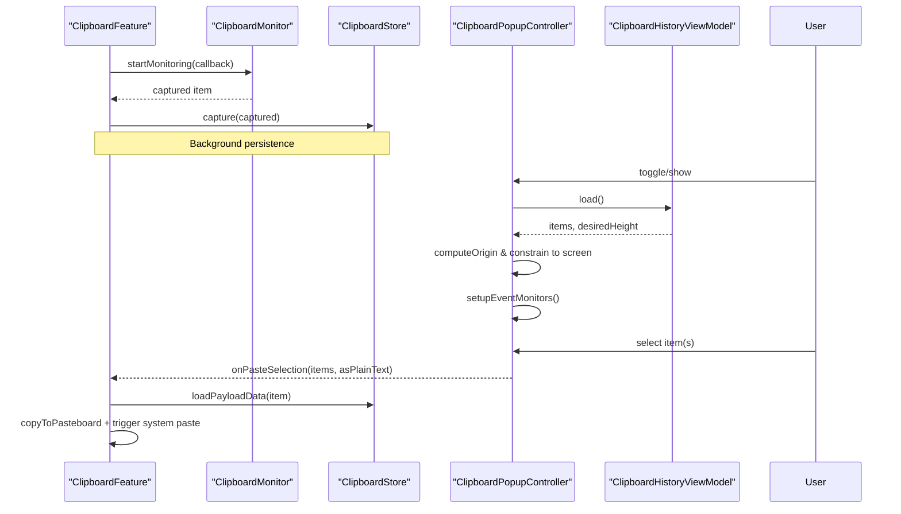
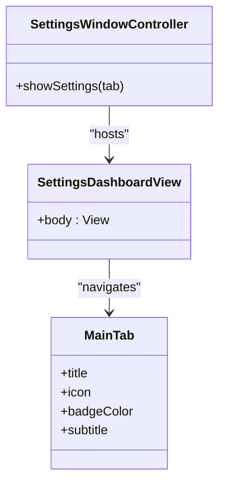
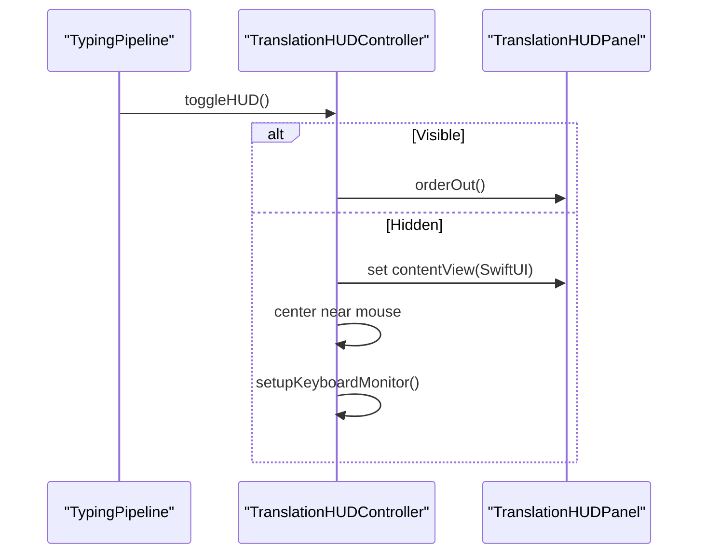
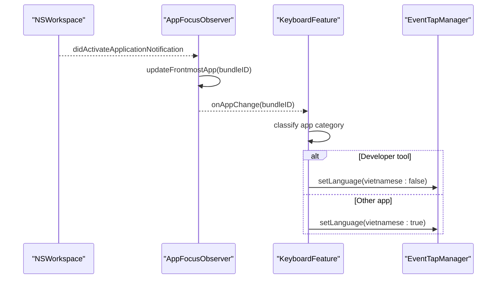
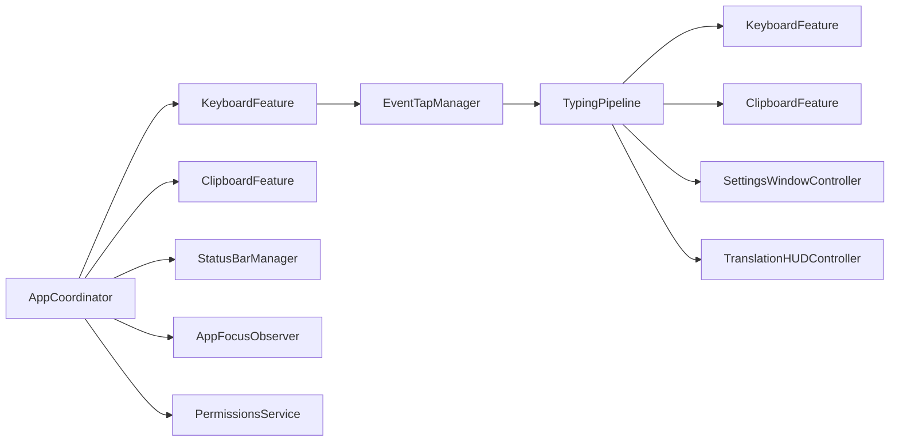

# macOS Application

<cite>
**Referenced Files in This Document**
- [main.swift](file://macos/skey-app/Sources/App/main.swift)
- [AppDelegate.swift](file://macos/skey-app/Sources/App/AppDelegate.swift)
- [AppCoordinator.swift](file://macos/skey-app/Sources/App/AppCoordinator.swift)
- [Info.plist](file://macos/skey-app/Resources/Info.plist)
- [EventTapManager.swift](file://macos/skey-app/Sources/Features/Keyboard/EventHandling/EventTapManager.swift)
- [TypingPipeline.swift](file://macos/skey-app/Sources/Features/Keyboard/EventHandling/Pipeline/TypingPipeline.swift)
- [KeyboardFeature.swift](file://macos/skey-app/Sources/Features/Keyboard/KeyboardFeature.swift)
- [ClipboardFeature.swift](file://macos/skey-app/Sources/Features/Clipboard/ClipboardFeature.swift)
- [ClipboardPopupController.swift](file://macos/skey-app/Sources/Features/Clipboard/UI/Controllers/ClipboardPopupController.swift)
- [SettingsWindowController.swift](file://macos/skey-app/Sources/Features/Settings/SettingsWindowController.swift)
- [SettingsDashboardView.swift](file://macos/skey-app/Sources/Features/Settings/UI/SettingsDashboardView.swift)
- [StatusBarManager.swift](file://macos/skey-app/Sources/Shared/UI/StatusBarManager.swift)
- [TranslationHUDController.swift](file://macos/skey-app/Sources/Features/Translator/UI/TranslationHUDController.swift)
- [AppFocusObserver.swift](file://macos/skey-app/Sources/Shared/Services/AppFocusObserver.swift)
- [PermissionsService.swift](file://macos/skey-app/Sources/Shared/Services/PermissionsService.swift)
</cite>

## Table of Contents
1. Introduction
2. Project Structure
3. Core Components
4. Architecture Overview
5. Detailed Component Analysis
6. Dependency Analysis
7. Performance Considerations
8. Troubleshooting Guide
9. Conclusion

## Introduction
This document explains the native macOS application layer built with Swift and SwiftUI. It covers the menu bar application architecture, window management patterns, and how the app integrates deeply with macOS accessibility and input monitoring to provide universal typing assistance. It also documents the low-level CoreGraphics EventTap implementation for intercepting and forwarding keyboard events, and details custom UI components such as the clipboard history popup, settings dashboard, and translation HUD. Finally, it addresses macOS-specific considerations including sandboxing, entitlements, code signing, and App Store distribution requirements.

## Project Structure
The macOS app is organized into feature modules under Sources/Features, shared services and UI under Shared, and an App entry point that initializes the lifecycle and coordinates features. The Resources folder contains localization and the app’s Info.plist configuration.

**Diagram sources**
- [main.swift:1-7](file://macos/skey-app/Sources/App/main.swift#L1-L7)
- [AppDelegate.swift:1-75](file://macos/skey-app/Sources/App/AppDelegate.swift#L1-L75)
- [AppCoordinator.swift:1-77](file://macos/skey-app/Sources/App/AppCoordinator.swift#L1-L77)
- [KeyboardFeature.swift:1-328](file://macos/skey-app/Sources/Features/Keyboard/KeyboardFeature.swift#L1-L328)
- [EventTapManager.swift:1-196](file://macos/skey-app/Sources/Features/Keyboard/EventHandling/EventTapManager.swift#L1-L196)
- [TypingPipeline.swift:1-345](file://macos/skey-app/Sources/Features/Keyboard/EventHandling/Pipeline/TypingPipeline.swift#L1-L345)
- [ClipboardFeature.swift:1-146](file://macos/skey-app/Sources/Features/Clipboard/ClipboardFeature.swift#L1-L146)
- [ClipboardPopupController.swift:1-367](file://macos/skey-app/Sources/Features/Clipboard/UI/Controllers/ClipboardPopupController.swift#L1-L367)
- [SettingsWindowController.swift:1-60](file://macos/skey-app/Sources/Features/Settings/SettingsWindowController.swift#L1-L60)
- [SettingsDashboardView.swift:1-277](file://macos/skey-app/Sources/Features/Settings/UI/SettingsDashboardView.swift#L1-L277)
- [StatusBarManager.swift:1-271](file://macos/skey-app/Sources/Shared/UI/StatusBarManager.swift#L1-L271)
- [TranslationHUDController.swift:1-130](file://macos/skey-app/Sources/Features/Translator/UI/TranslationHUDController.swift#L1-L130)
- [AppFocusObserver.swift:1-153](file://macos/skey-app/Sources/Shared/Services/AppFocusObserver.swift#L1-L153)
- [PermissionsService.swift:1-42](file://macos/skey-app/Sources/Shared/Services/PermissionsService.swift#L1-L42)

**Section sources**
- [main.swift:1-7](file://macos/skey-app/Sources/App/main.swift#L1-L7)
- [Info.plist:1-42](file://macos/skey-app/Resources/Info.plist#L1-L42)

## Core Components
- Application lifecycle and menu bar:
  - Entry point creates NSApplication and sets AppDelegate.
  - AppDelegate builds standard menus, starts AppCoordinator, handles settings open via notifications or arguments, and triggers background update checks.
- Feature coordination:
  - AppCoordinator registers KeyboardFeature and ClipboardFeature, configures StatusBarManager, wires status icon updates, starts focus observation, syncs launch-at-login, and manages permissions.
- Keyboard subsystem:
  - KeyboardFeature builds menu items, applies preferences, toggles language, and implements smart app switch behavior based on active app category.
  - EventTapManager owns a dedicated thread hosting a CoreGraphics EventTap, processes events through TypingPipeline, and exposes language state safely across threads.
  - TypingPipeline implements a multi-stage pipeline for hotkeys, navigation, composing, macros, and English-mode macro expansion.
- Clipboard subsystem:
  - ClipboardFeature monitors pasteboard changes, stores items, and provides a floating popup controller for selection and pasting.
  - ClipboardPopupController hosts a SwiftUI-based panel with search, preview, keyboard shortcuts, and paste actions.
- Settings UI:
  - SettingsWindowController hosts a SwiftUI dashboard with tabs and search.
  - SettingsDashboardView renders sidebar, search results, and tab content.
- Translation HUD:
  - TranslationHUDController manages a floating, borderless panel with editing shortcuts and local keyboard monitoring.
- System integration:
  - AppFocusObserver tracks frontmost app, classifies apps (developer tools, browsers, chat/electron, Spotlight), and enables enhanced accessibility for certain apps.
  - PermissionsService checks and prompts for Accessibility and Input Monitoring permissions.

**Section sources**
- [AppDelegate.swift:1-75](file://macos/skey-app/Sources/App/AppDelegate.swift#L1-L75)
- [AppCoordinator.swift:1-77](file://macos/skey-app/Sources/App/AppCoordinator.swift#L1-L77)
- [KeyboardFeature.swift:1-328](file://macos/skey-app/Sources/Features/Keyboard/KeyboardFeature.swift#L1-L328)
- [EventTapManager.swift:1-196](file://macos/skey-app/Sources/Features/Keyboard/EventHandling/EventTapManager.swift#L1-L196)
- [TypingPipeline.swift:1-345](file://macos/skey-app/Sources/Features/Keyboard/EventHandling/Pipeline/TypingPipeline.swift#L1-L345)
- [ClipboardFeature.swift:1-146](file://macos/skey-app/Sources/Features/Clipboard/ClipboardFeature.swift#L1-L146)
- [ClipboardPopupController.swift:1-367](file://macos/skey-app/Sources/Features/Clipboard/UI/Controllers/ClipboardPopupController.swift#L1-L367)
- [SettingsWindowController.swift:1-60](file://macos/skey-app/Sources/Features/Settings/SettingsWindowController.swift#L1-L60)
- [SettingsDashboardView.swift:1-277](file://macos/skey-app/Sources/Features/Settings/UI/SettingsDashboardView.swift#L1-L277)
- [TranslationHUDController.swift:1-130](file://macos/skey-app/Sources/Features/Translator/UI/TranslationHUDController.swift#L1-L130)
- [AppFocusObserver.swift:1-153](file://macos/skey-app/Sources/Shared/Services/AppFocusObserver.swift#L1-L153)
- [PermissionsService.swift:1-42](file://macos/skey-app/Sources/Shared/Services/PermissionsService.swift#L1-L42)

## Architecture Overview
The app follows a feature-driven architecture coordinated by AppCoordinator. The menu bar UI is managed by StatusBarManager, which aggregates feature menus and status icons. Low-level keyboard interception uses a dedicated thread with a CoreGraphics EventTap, delegating processing to a high-performance TypingPipeline. UI windows are SwiftUI-backed and hosted in NSWindowController instances. System integration relies on Accessibility and Input Monitoring permissions and dynamic app focus detection.

**Diagram sources**
- [EventTapManager.swift:81-103](file://macos/skey-app/Sources/Features/Keyboard/EventHandling/EventTapManager.swift#L81-L103)
- [TypingPipeline.swift:31-170](file://macos/skey-app/Sources/Features/Keyboard/EventHandling/Pipeline/TypingPipeline.swift#L31-L170)
- [KeyboardFeature.swift:242-246](file://macos/skey-app/Sources/Features/Keyboard/KeyboardFeature.swift#L242-L246)
- [ClipboardFeature.swift:60-72](file://macos/skey-app/Sources/Features/Clipboard/ClipboardFeature.swift#L60-L72)
- [SettingsWindowController.swift:49-58](file://macos/skey-app/Sources/Features/Settings/SettingsWindowController.swift#L49-L58)
- [TranslationHUDController.swift:74-105](file://macos/skey-app/Sources/Features/Translator/UI/TranslationHUDController.swift#L74-L105)

## Detailed Component Analysis

### Menu Bar and Window Management
- Status bar button displays a keycap-style “V” or “E” icon and opens a grouped menu from all features. Left-click toggles language; right-click shows the full menu.
- Settings window is a non-titled, resizable NSWindow hosting a SwiftUI dashboard with sidebar navigation and search.
- Translation HUD is a floating, borderless panel with editing shortcuts and ESC-to-close behavior.

**Diagram sources**
- [StatusBarManager.swift:31-257](file://macos/skey-app/Sources/Shared/UI/StatusBarManager.swift#L31-L257)
- [SettingsWindowController.swift:9-58](file://macos/skey-app/Sources/Features/Settings/SettingsWindowController.swift#L9-L58)
- [TranslationHUDController.swift:6-54](file://macos/skey-app/Sources/Features/Translator/UI/TranslationHUDController.swift#L6-L54)

**Section sources**
- [StatusBarManager.swift:31-257](file://macos/skey-app/Sources/Shared/UI/StatusBarManager.swift#L31-L257)
- [SettingsWindowController.swift:9-58](file://macos/skey-app/Sources/Features/Settings/SettingsWindowController.swift#L9-L58)
- [TranslationHUDController.swift:6-54](file://macos/skey-app/Sources/Features/Translator/UI/TranslationHUDController.swift#L6-L54)

### CoreGraphics EventTap and Typing Pipeline
- EventTapManager creates a CGEventTap on a dedicated thread with a run loop, handling tap re-enable on timeout/user-input disable.
- TypingPipeline stages:
  - Pass-through synthetic events and disabled taps
  - Mouse clicks reset buffers and caret tracking
  - Modifier-only chord support for language toggle
  - Customizable hotkeys for clipboard, cleaner, AI settings, and translation HUD
  - Excluded apps bypass
  - English mode macro expansion
  - Vietnamese composing engine path with fast paths for function/media keys, navigation, backspace, word-break, and printable characters
  - Smart context recomposition when caret moves
  - KeyEventSender injects backspaces and transformed text

**Diagram sources**
- [EventTapManager.swift:81-188](file://macos/skey-app/Sources/Features/Keyboard/EventHandling/EventTapManager.swift#L81-L188)
- [TypingPipeline.swift:31-345](file://macos/skey-app/Sources/Features/Keyboard/EventHandling/Pipeline/TypingPipeline.swift#L31-L345)

**Section sources**
- [EventTapManager.swift:81-188](file://macos/skey-app/Sources/Features/Keyboard/EventHandling/EventTapManager.swift#L81-L188)
- [TypingPipeline.swift:31-345](file://macos/skey-app/Sources/Features/Keyboard/EventHandling/Pipeline/TypingPipeline.swift#L31-L345)

### Clipboard History Popup
- ClipboardFeature monitors pasteboard changes, captures items asynchronously, and exposes a floating popup controller.
- ClipboardPopupController hosts a SwiftUI view model with search, pinning, preview, keyboard navigation, and paste actions. It computes placement relative to the status bar or mouse, constrains to screen bounds, and listens for local/global clicks to close.

**Diagram sources**
- [ClipboardFeature.swift:26-122](file://macos/skey-app/Sources/Features/Clipboard/ClipboardFeature.swift#L26-L122)
- [ClipboardPopupController.swift:77-136](file://macos/skey-app/Sources/Features/Clipboard/UI/Controllers/ClipboardPopupController.swift#L77-L136)
- [ClipboardPopupController.swift:178-213](file://macos/skey-app/Sources/Features/Clipboard/UI/Controllers/ClipboardPopupController.swift#L178-L213)
- [ClipboardPopupController.swift:215-367](file://macos/skey-app/Sources/Features/Clipboard/UI/Controllers/ClipboardPopupController.swift#L215-L367)

**Section sources**
- [ClipboardFeature.swift:26-122](file://macos/skey-app/Sources/Features/Clipboard/ClipboardFeature.swift#L26-L122)
- [ClipboardPopupController.swift:77-367](file://macos/skey-app/Sources/Features/Clipboard/UI/Controllers/ClipboardPopupController.swift#L77-L367)

### Settings Dashboard
- SettingsWindowController creates a styled NSWindow with a visual effect view and hosts SwiftUI content.
- SettingsDashboardView provides a sidebar with tabs, search, and detail panes for each feature’s settings.

**Diagram sources**
- [SettingsWindowController.swift:9-58](file://macos/skey-app/Sources/Features/Settings/SettingsWindowController.swift#L9-L58)
- [SettingsDashboardView.swift:6-277](file://macos/skey-app/Sources/Features/Settings/UI/SettingsDashboardView.swift#L6-L277)

**Section sources**
- [SettingsWindowController.swift:9-58](file://macos/skey-app/Sources/Features/Settings/SettingsWindowController.swift#L9-L58)
- [SettingsDashboardView.swift:6-277](file://macos/skey-app/Sources/Features/Settings/UI/SettingsDashboardView.swift#L6-L277)

### Translation HUD
- TranslationHUDPanel is a floating, borderless NSPanel with editing shortcuts and utility window behavior.
- TranslationHUDController toggles visibility, centers near the mouse, and installs a local monitor to handle ESC.

**Diagram sources**
- [TypingPipeline.swift:127-135](file://macos/skey-app/Sources/Features/Keyboard/EventHandling/Pipeline/TypingPipeline.swift#L127-L135)
- [TranslationHUDController.swift:74-129](file://macos/skey-app/Sources/Features/Translator/UI/TranslationHUDController.swift#L74-L129)

**Section sources**
- [TranslationHUDController.swift:6-129](file://macos/skey-app/Sources/Features/Translator/UI/TranslationHUDController.swift#L6-L129)

### Accessibility and Smart App Switch
- AppFocusObserver detects the frontmost app, classifies it (developer tool, web browser, electron/chat, Spotlight, native), and caches results. For browsers and Spotlight, it enables enhanced accessibility attributes.
- KeyboardFeature uses this classification to auto-switch to English when focusing developer tools and restore Vietnamese when switching away.

**Diagram sources**
- [AppFocusObserver.swift:114-151](file://macos/skey-app/Sources/Shared/Services/AppFocusObserver.swift#L114-L151)
- [KeyboardFeature.swift:59-75](file://macos/skey-app/Sources/Features/Keyboard/KeyboardFeature.swift#L59-L75)

**Section sources**
- [AppFocusObserver.swift:14-151](file://macos/skey-app/Sources/Shared/Services/AppFocusObserver.swift#L14-L151)
- [KeyboardFeature.swift:59-75](file://macos/skey-app/Sources/Features/Keyboard/KeyboardFeature.swift#L59-L75)

## Dependency Analysis
High-level dependencies between core components:

**Diagram sources**
- [AppCoordinator.swift:22-50](file://macos/skey-app/Sources/App/AppCoordinator.swift#L22-L50)
- [KeyboardFeature.swift:35-55](file://macos/skey-app/Sources/Features/Keyboard/KeyboardFeature.swift#L35-L55)
- [EventTapManager.swift:27-31](file://macos/skey-app/Sources/Features/Keyboard/EventHandling/EventTapManager.swift#L27-L31)
- [TypingPipeline.swift:31-170](file://macos/skey-app/Sources/Features/Keyboard/EventHandling/Pipeline/TypingPipeline.swift#L31-L170)

**Section sources**
- [AppCoordinator.swift:22-50](file://macos/skey-app/Sources/App/AppCoordinator.swift#L22-L50)
- [TypingPipeline.swift:31-170](file://macos/skey-app/Sources/Features/Keyboard/EventHandling/Pipeline/TypingPipeline.swift#L31-L170)

## Performance Considerations
- Dedicated thread and run loop for EventTap minimize main-thread contention and ensure consistent latency.
- Ultra-fast os_unfair_lock protects language state and avoids heap allocations in hot paths.
- TypingPipeline uses fast-path classifications for function/media keys, navigation, backspace, and word-break to reduce overhead.
- Unsafe temporary allocation extracts Unicode characters efficiently without extra allocations.
- Context recomposition runs only when caret movement is detected, avoiding unnecessary work.
- Clipboard operations use background tasks and minimal UI updates on the main thread.

[No sources needed since this section provides general guidance]

## Troubleshooting Guide
- EventTap disabled by timeout or user input:
  - The manager re-enables the tap automatically and logs recovery.
- Missing permissions:
  - PermissionsService checks AXIsProcessTrusted and can prompt or open system settings for Accessibility and Input Monitoring.
- Smart switch not working:
  - Ensure AppFocusObserver has access to frontmost app notifications and that the app is classified correctly.
- Clipboard paste not triggering:
  - Verify that the system paste simulation posts events to the correct tap and that target app regains focus before paste.

**Section sources**
- [EventTapManager.swift:172-188](file://macos/skey-app/Sources/Features/Keyboard/EventHandling/EventTapManager.swift#L172-L188)
- [PermissionsService.swift:12-40](file://macos/skey-app/Sources/Shared/Services/PermissionsService.swift#L12-L40)
- [AppFocusObserver.swift:114-151](file://macos/skey-app/Sources/Shared/Services/AppFocusObserver.swift#L114-L151)
- [ClipboardFeature.swift:104-122](file://macos/skey-app/Sources/Features/Clipboard/ClipboardFeature.swift#L104-L122)

## Conclusion
The macOS application layer combines a robust, feature-driven architecture with low-level system integration. CoreGraphics EventTap and a carefully optimized TypingPipeline deliver responsive typing assistance, while SwiftUI-based UIs provide a modern, accessible experience. Smart app switching and permission management ensure reliable operation across diverse applications. Proper configuration of Info.plist entries for usage descriptions and system capabilities is essential for distribution, especially on the Mac App Store where sandboxing and entitlements must be aligned with required APIs.

[No sources needed since this section summarizes without analyzing specific files]