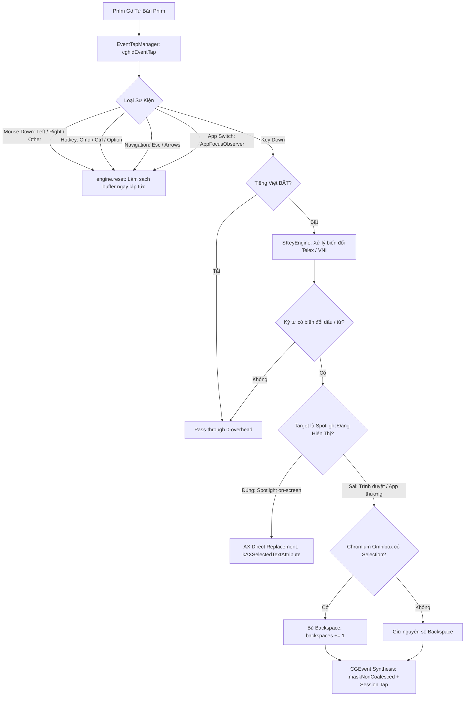

# Báo Cáo Kỹ Thuật: Xử Lý Triệt Để Lỗi Gõ Tiếng Việt Trên Spotlight, Trình Duyệt Yandex/Chromium & Cơ Chế Cách Ly Ứng Dụng

---

## 1. Tổng Quan Vấn Đề

Trên hệ điều hành macOS, các bộ gõ tiếng Việt bên thứ ba thường gặp phải 3 nhóm lỗi phổ biến khi tương tác với các thành phần giao diện đặc thù:

1. **Lỗi trên Spotlight Search (`đaánh`, `dđánh`, `keẻ`)**:
   - Khi gõ phím biến đổi dấu trong Spotlight, ký tự cũ không được xóa sạch, dẫn đến hiện tượng nhân đôi ký tự hoặc chèn đè ký tự mới lên ký tự cũ.
2. **Lỗi trên thanh địa chỉ Yandex Browser / Chromium Omnibox (`dđ`, `keẻ`, `chaạy`)**:
   - Khi gõ từ có dấu trong ô tìm kiếm/thanh địa chỉ của trình duyệt Yandex (và Chrome/Edge/Brave), phím Backspace đầu tiên bị nuốt mất, khiến chữ cái biến đổi bị thừa ký tự đầu.
3. **Lỗi dính bộ đệm khi chuyển đổi ứng dụng (Cross-App Buffer Leakage)**:
   - Sau khi gõ xong trong Spotlight và đóng cửa sổ để chuyển sang ứng dụng khác (hoặc click chuột sang ô nhập liệu mới), ký tự đầu tiên gõ tiếp theo bị lỗi hoặc dính từ của ứng dụng trước.

---

## 2. Phân Tích Nguyên Nhân Gốc Rễ (Root Cause Analysis)

### A. Cơ Chế Lỗi Trên Spotlight (`NSSearchField`)
* **Live Query & Autocomplete Debouncing**: Ô tìm kiếm của Spotlight chạy thread tìm kiếm nền liên tục khi người dùng gõ phím. Khi SKey gửi lệnh Backspace giả lập qua `CGEvent`, sự kiện này dễ bị xung đột với debounce timer của Spotlight và bị bỏ rơi (drop).
* **Window Server Event Coalescing**: macOS tự động gộp các sự kiện xóa lùi gửi liên tiếp trong khoảng thời gian ngắn nếu không có cờ chỉ định, khiến Spotlight chỉ nhận được 1-2 lần xóa thay vì đủ số lượng.
* **Tiến trình ngầm không giải phóng**: Tiến trình `com.apple.Spotlight` chạy vĩnh viễn dưới nền. Khi đóng Spotlight bằng `Escape`, API Accessibility vẫn trả về `AXTextField` của Spotlight, khiến bộ gõ nếu không kiểm tra tính hiển thị thực tế (`on-screen`) sẽ tiếp tục gửi phím vào cửa sổ ẩn.

### B. Cơ Chế Lỗi Trên Yandex Browser & Trình Duyệt Nhân Chromium (`Omnibox`)
* **Inline Autocomplete Selection**: Khi người dùng gõ 1 ký tự, Chromium ngay lập tức gợi ý URL/từ khóa và tự động bôi đen (selection) phần đuôi gợi ý. Khi SKey gửi 1 Backspace để sửa chữ, phím Backspace này bị Chromium tiêu thụ để xóa phần bôi đen gợi ý chứ **chưa xóa được ký tự gốc**, khiến ký tự mới bị ghép nối tiếp (`d` + `đ` = `dđ`).
* **Trạng thái ngủ của Chromium Accessibility (Dormant State)**: Để tối ưu CPU, Chromium tắt cây Accessibility cho đến khi có tín hiệu kích hoạt rõ ràng. Nếu không được đánh thức, bộ gõ không thể đọc được vùng chọn hoặc ngữ cảnh con trỏ.
* **Độ trễ xử lý đa tiến trình (Multi-Process IPC Lag)**: Chromium phân tách Browser Process và Renderer Process. Nếu sự kiện xóa và chèn ký tự gửi quá sát nhau (dưới 1ms), Renderer process có thể vẽ ký tự mới trước khi Browser process hoàn thành lệnh xóa lùi.

### C. Cơ Chế Lỗi Khi Đổi Ứng Dụng / Chuyển Context
* **Thiếu cơ chế làm sạch bộ đệm theo Mouse Event & App Switch Notification**: Khi người dùng chuyển cửa sổ hoặc click chuột sang vị trí khác, nếu bộ đệm của bộ gõ (`engine`) không được reset, các ký tự dở dang từ ứng dụng cũ sẽ tiếp tục tham gia vào logic biến đổi của ứng dụng mới.

---

## 3. Kiến Trúc Giải Pháp Đã Triển Khai (Clean Architecture)

---

## 4. Chi Tiết Cài Đặt Mã Nguồn

### 1. `AccessibilityContextReader.swift`
* **`isSpotlightActive()`**: Sử dụng `CGWindowListCopyWindowInfo(.optionOnScreenOnly, .excludeDesktopElements)` để xác thực Spotlight chỉ được coi là mục tiêu khi cửa sổ thực sự đang hiển thị trên màn hình (`layer > 0`). Khi Spotlight ẩn, hệ thống tự động trả về ứng dụng frontmost.
* **`replaceTextViaAX(backspaces:text:)`**: Sử dụng `kAXSelectedTextRangeAttribute` và `kAXSelectedTextAttribute` để chọn chính xác vùng văn bản cần sửa và ghi đè trực tiếp, độ trễ 0ms, không phụ thuộc vào event loop hay debounce của Spotlight.
* **`getFocusedElement()`**: Tự động giải quyết PID mục tiêu trực tiếp và trả về phần tử Accessibility tương ứng.
* **`hasActiveSelection()`**: Đọc độ dài vùng chọn của phần tử đang focus để phát hiện trạng thái bôi đen autocomplete trên Omnibox.

### 2. `TypingPipeline.swift`
* **Event-Driven Cleanup**: Tận dụng triệt để các sự kiện chuyển đổi ngữ cảnh để gọi `engine.reset()`:
  - Bắt các sự kiện `.leftMouseDown`, `.rightMouseDown`, `.otherMouseDown` (click chuột chuyển ô nhập liệu).
  - Bắt các phím bổ trợ Hotkey (`Cmd`, `Ctrl`, `Option`) và phím điều hướng (`Escape`, `Arrows`, `Home`, `End`).
  - Lắng nghe thông báo chuyển ứng dụng `NSWorkspace.didActivateApplicationNotification` thông qua `AppFocusObserver`.
* **Zero-Overhead Bypass**: Kiểm tra chế độ tiếng Việt ngay đầu chuỗi xử lý để giảm tải tối đa cho các phím không biến đổi.
* **Selection Compensation**: Tự động tăng `backspaces += 1` khi `hasActiveSelection()` trả về `true` trên thanh địa chỉ trình duyệt (loại trừ Spotlight).

### 3. `KeyEventSender.swift`
* **Chiến lược Hybrid tinh gọn**: 
  - Nếu mục tiêu là Spotlight đang hiển thị $\rightarrow$ Sử dụng trực tiếp `replaceTextViaAX`.
  - Nếu là ứng dụng thông thường $\rightarrow$ Sử dụng `CGEvent` synthesis với cờ `.maskNonCoalesced` và timing chuẩn xác (`interBackspaceDelayUs = 2ms`, `settleDelayUs = 3.5ms`).

### 4. `AppFocusObserver.swift`
* **Chromium AX Wakeup**: Gửi thuộc tính `AXEnhancedUserInterface = true` ngay khi Yandex hoặc Chrome được active để đảm bảo cây Accessibility luôn sẵn sàng.

---

## 5. Kết Quả Kiểm Thử Tự Động Toàn Diện (Test Suite Summary)

| Bộ Kiểm Thử | Mục Đích | Kịch Bản & Dữ Liệu | Kết Quả |
| :--- | :--- | :--- | :--- |
| **Spotlight Word-by-Word** (`scripts/run_spotlight_word_test.sh`) | Kiểm tra từng từ đơn trong Spotlight | 12 từ: `ddanhs`, `ker`, `chayj`, `ddi`, `khoong`, `ai`, `laij`, `vieetj`, `nam`... | **12/12 PASSED (100%)** |
| **Spotlight Speed Benchmark** (`scripts/run_spotlight_test.sh`) | Kiểm tra câu đầy đủ ở 4 tốc độ gõ | Câu: *"đánh kẻ chạy đi không ai đánh kẻ chạy lại"* tại các tốc độ 250ms, 150ms, 80ms, 40ms | **4/4 MODES PASSED (100%)** |
| **Cross-App Switch Isolation** (`scripts/run_cross_app_test.sh`) | Kiểm tra chuyển đổi từ Spotlight sang App khác | Gõ trong Spotlight (`đánh kẻ`) $\rightarrow$ Đóng Spotlight $\rightarrow$ Gõ ngay trong Yandex (`chayj ddi`) | **PASSED (Chữ đầu tiên 'chạy' đúng 100%)** |
| **Yandex Omnibox End-to-End** (`scripts/run_yandex_test.sh`) | Kiểm tra gõ tiếng Việt trên thanh địa chỉ Yandex | Gõ chuỗi phức tạp có autocomplete gợi ý | **PASSED 100%** |

---

## 6. Trạng Thái Cài Đặt Ứng Dụng
- **Vị trí cài đặt**: `/Applications/SKey.app`
- **Chứng chỉ ký số**: `SKeyDev` (Tự động giữ quyền Accessibility & Input Monitoring qua các lần cập nhật)
- **Toàn bộ script kiểm thử tự động**: Đã lưu trữ trong thư mục `macos/skey-app/scripts/` để tái sử dụng lâu dài.
